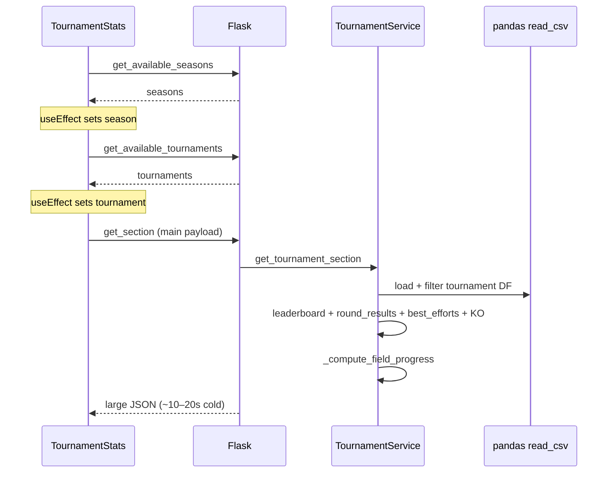

<!-- Generated by SpecStory, Markdown v2.1.0 -->

# 2026-05-18 12:35:26Z

<!-- Cursor IDE Session d8c25027-186a-4fb3-beda-eb11e513e769 (2026-05-18 12:35:26Z) -->

_**User**_

i try to get my local w11 machine setup to build to docker container for this repo.

i installed docker, nodejs, npmp and run into troubles:
PS C:\Users\cfell\repositories\bowlyzer_deploy\frontend> pnpm install
Lockfile is up to date, resolution step is skipped
Packages: +3
+++
Progress: resolved 3, reused 0, downloaded 3, added 3, done
Downloading @voidzero-dev/vite-plus-win32-x64-msvc@0.1.20: 11.72 MB/11.72 MB, done
Done in 6.3s using pnpm v10.33.2
PS C:\Users\cfell\repositories\bowlyzer_deploy\frontend> pnpm build

> frontend@0.0.0 build C:\Users\cfell\repositories\bowlyzer_deploy\frontend
> tsc -b && vp build

vite v8.0.10 building client environment for production...
transforming (529) node_modules\.pnpm\echarts@6.0.0\node_modules\echarts\lib\coord\scaleRawExtentInfo.jsFound 12 warnings while optimizing generated CSS:

Issue #1:
│   }
│   .\@\[max-width\:22rem\]\:pointer-events-none {
│     @container (width >= max-width:22rem) {
┆                                   ^-- Invalid media query
┆
│       pointer-events: none;
│     }

Issue #2:
│   }
│   .\@\[max-width\:22rem\]\:pointer-events-none {
│     @container (width >= max-width:22rem) {
┆                                   ^-- Unexpected token Colon
┆
│       pointer-events: none;
│     }

Issue #3:
│   }
│   .\@\[max-width\:22rem\]\:max-w-0 {
│     @container (width >= max-width:22rem) {
┆                                   ^-- Invalid media query
┆
│       max-width: calc(var(--spacing) * 0);
│     }

Issue #4:
│   }
│   .\@\[max-width\:22rem\]\:max-w-0 {
│     @container (width >= max-width:22rem) {
┆                                   ^-- Unexpected token Colon
┆
│       max-width: calc(var(--spacing) * 0);
│     }

Issue #5:
│   }
│   .\@\[max-width\:22rem\]\:opacity-0 {
│     @container (width >= max-width:22rem) {
┆                                   ^-- Invalid media query
┆
│       opacity: 0%;
│     }

Issue #6:
│   }
│   .\@\[max-width\:22rem\]\:opacity-0 {
│     @container (width >= max-width:22rem) {
┆                                   ^-- Unexpected token Colon
┆
│       opacity: 0%;
│     }

Issue #7:
│   }
│   .\@\[max-width\:30rem\]\:hidden {
│     @container (width >= max-width:30rem) {
┆                                   ^-- Invalid media query
┆
│       display: none;
│     }

Issue #8:
│   }
│   .\@\[max-width\:30rem\]\:hidden {
│     @container (width >= max-width:30rem) {
┆                                   ^-- Unexpected token Colon
┆
│       display: none;
│     }

Issue #9:
│   }
│   .\@\[max-width\:30rem\]\:max-w-0 {
│     @container (width >= max-width:30rem) {
┆                                   ^-- Invalid media query
┆
│       max-width: calc(var(--spacing) * 0);
│     }

Issue #10:
│   }
│   .\@\[max-width\:30rem\]\:max-w-0 {
│     @container (width >= max-width:30rem) {
┆                                   ^-- Unexpected token Colon
┆
│       max-width: calc(var(--spacing) * 0);
│     }

Issue #11:
│   }
│   .\@\[max-width\:30rem\]\:opacity-0 {
│     @container (width >= max-width:30rem) {
┆                                   ^-- Invalid media query
┆
│       opacity: 0%;
│     }

Issue #12:
│   }
│   .\@\[max-width\:30rem\]\:opacity-0 {
│     @container (width >= max-width:30rem) {
┆                                   ^-- Unexpected token Colon
┆
│       opacity: 0%;
│     }

✓ 2443 modules transformed.
✗ Build failed in 446ms
error during build:
Build failed with 1 error:

[plugin vite:css-post]
SyntaxError: [lightningcss minify] Invalid media query
1  |  /*! tailwindcss v4.2.4 | MIT License | https://tailwindcss.com */
2  |  ...op:calc(var(--spacing) * 12)}}@container (width >= max-width:22rem){.\@\[max-width\:22rem\]\:pointer-events-none{p...
   |                                                                 ^
3  |  /*# sourceMappingURL=tabulator.min.css.map *//* DS-aligned Tabulator theme. Replaces the legacy .custom-tabulator look
4  |   * (rounded card with shadow, gradient header, Bootstrap chrome) with hairline
    at Module.<anonymous> (C:\Users\cfell\repositories\bowlyzer_deploy\frontend\node_modules\.pnpm\lightningcss@1.32.0\node_modules\lightningcss\node\index.js:56:14)
    at minifyCSS (file:///C:/Users/cfell/repositories/bowlyzer_deploy/frontend/node_modules/.pnpm/@voidzero-dev+vite-plus-cor_e42d4d27c1f8eb5a2737d053f2dcb949/node_modules/@voidzero-dev/vite-plus-core/dist/vite/node/chunks/node.js:26877:59)
    at async finalizeCss (file:///C:/Users/cfell/repositories/bowlyzer_deploy/frontend/node_modules/.pnpm/@voidzero-dev+vite-plus-cor_e42d4d27c1f8eb5a2737d053f2dcb949/node_modules/@voidzero-dev/vite-plus-core/dist/vite/node/chunks/node.js:26722:36)
    at async Promise.all (index 1)
    at async Object.run (file:///C:/Users/cfell/repositories/bowlyzer_deploy/frontend/node_modules/.pnpm/@voidzero-dev+vite-plus-cor_e42d4d27c1f8eb5a2737d053f2dcb949/node_modules/@voidzero-dev/vite-plus-core/dist/vite/node/chunks/node.js:4290:22)
    at async PluginContextImpl.renderChunk (file:///C:/Users/cfell/repositories/bowlyzer_deploy/frontend/node_modules/.pnpm/@voidzero-dev+vite-plus-cor_e42d4d27c1f8eb5a2737d053f2dcb949/node_modules/@voidzero-dev/vite-plus-core/dist/vite/node/chunks/node.js:26258:19)
    at async plugin (file:///C:/Users/cfell/repositories/bowlyzer_deploy/frontend/node_modules/.pnpm/@voidzero-dev+vite-plus-cor_e42d4d27c1f8eb5a2737d053f2dcb949/node_modules/@voidzero-dev/vite-plus-core/dist/rolldown/shared/bindingify-input-options-CwT4BXgL.mjs:1277:16)
    at async plugin.<computed> (file:///C:/Users/cfell/repositories/bowlyzer_deploy/frontend/node_modules/.pnpm/@voidzero-dev+vite-plus-cor_e42d4d27c1f8eb5a2737d053f2dcb949/node_modules/@voidzero-dev/vite-plus-core/dist/rolldown/shared/bindingify-input-options-CwT4BXgL.mjs:1612:12)
    at aggregateBindingErrorsIntoJsError (file:///C:/Users/cfell/repositories/bowlyzer_deploy/frontend/node_modules/.pnpm/@voidzero-dev+vite-plus-cor_e42d4d27c1f8eb5a2737d053f2dcb949/node_modules/@voidzero-dev/vite-plus-core/dist/rolldown/shared/error-DL-e8-oE.mjs:48:18)
    at unwrapBindingResult (file:///C:/Users/cfell/repositories/bowlyzer_deploy/frontend/node_modules/.pnpm/@voidzero-dev+vite-plus-cor_e42d4d27c1f8eb5a2737d053f2dcb949/node_modules/@voidzero-dev/vite-plus-core/dist/rolldown/shared/error-DL-e8-oE.mjs:18:128)
    at #build (file:///C:/Users/cfell/repositories/bowlyzer_deploy/frontend/node_modules/.pnpm/@voidzero-dev+vite-plus-cor_e42d4d27c1f8eb5a2737d053f2dcb949/node_modules/@voidzero-dev/vite-plus-core/dist/rolldown/shared/rolldown-build-DrXmg2RO.mjs:3317:34)
    at async buildEnvironment (file:///C:/Users/cfell/repositories/bowlyzer_deploy/frontend/node_modules/.pnpm/@voidzero-dev+vite-plus-cor_e42d4d27c1f8eb5a2737d053f2dcb949/node_modules/@voidzero-dev/vite-plus-core/dist/vite/node/chunks/node.js:38591:64)
    at async Object.build (file:///C:/Users/cfell/repositories/bowlyzer_deploy/frontend/node_modules/.pnpm/@voidzero-dev+vite-plus-cor_e42d4d27c1f8eb5a2737d053f2dcb949/node_modules/@voidzero-dev/vite-plus-core/dist/vite/node/chunks/node.js:39013:19)
    at async Object.buildApp (file:///C:/Users/cfell/repositories/bowlyzer_deploy/frontend/node_modules/.pnpm/@voidzero-dev+vite-plus-cor_e42d4d27c1f8eb5a2737d053f2dcb949/node_modules/@voidzero-dev/vite-plus-core/dist/vite/node/chunks/node.js:39010:153)
    at async CAC.<anonymous> (file:///C:/Users/cfell/repositories/bowlyzer_deploy/frontend/node_modules/.pnpm/@voidzero-dev+vite-plus-cor_e42d4d27c1f8eb5a2737d053f2dcb949/node_modules/@voidzero-dev/vite-plus-core/dist/vite/node/cli.js:778:3) {
  errors: [Getter/Setter]
}
 ELIFECYCLE  Command failed with exit code 1.

---

_**Agent (default)**_

<think><details><summary>Thought Process</summary>
The user is configuring their Windows 11 system to build a Docker container for this repository.</details></think>

_**Agent (default)**_

Investigating the frontend build failure and Docker setup so we can get your Windows machine building successfully.


_**Agent (default)**_

<tool-use data-tool-type="search" data-tool-name="glob_file_search">
<details>
<summary>Tool use: **glob_file_search** • Searched codebase "" • **1** result in **1** directory</summary>

Directory: **** (1 file)

| File |
|------|
| `.\Dockerfile` |

</details>
</tool-use>

<tool-use data-tool-type="search" data-tool-name="glob_file_search"><details>
<summary>Tool use: **glob_file_search**</summary>

</details></tool-use>

_**Agent (default)**_

<tool-use data-tool-type="unknown" data-tool-name="ripgrep_raw_search">
<details>
<summary>Tool use: **ripgrep_raw_search**</summary>


Parameters:

```json
{
  "caseInsensitive": false,
  "path": "c:\\Users\\cfell\\repositories\\bowlyzer_deploy",
  "pattern": "max-width:22rem|max-width:30rem"
}
```
Additional data:

```json
{
  "isPruned": true,
  "outputMode": "content",
  "path": "c:\\Users\\cfell\\repositories\\bowlyzer_deploy",
  "pattern": "max-width:22rem|max-width:30rem",
  "topFiles": [
    {
      "matchCount": 13,
      "uri": ".\\.specstory\\history\\2026-05-18_10-33-30Z-i-try-to-get.md"
    },
    {
      "matchCount": 3,
      "uri": ".\\frontend\\src\\pages\\league\\LeagueFilterBar.tsx"
    },
    {
      "matchCount": 2,
      "uri": ".\\.specstory\\history\\2026-05-16_11-30-21Z-league-view-latest-season-selection.md"
    }
  ],
  "totalFiles": 3,
  "totalMatches": 18
}
```
Status: **completed**


</details>
</tool-use>

<tool-use data-tool-type="unknown" data-tool-name="ripgrep_raw_search"><details>
<summary>Tool use: **ripgrep_raw_search**</summary>

</details></tool-use>

_**Agent (default)**_

<tool-use data-tool-type="search" data-tool-name="glob_file_search">
<details>
<summary>Tool use: **glob_file_search** • Searched codebase "" • **4** results in **1** directory</summary>

Directory: **** (4 files)

| File |
|------|
| `.\docs\planning\DOCKER_MIGRATION_PLAN.md` |
| `.\docker-compose.yml` |
| `.\Dockerfile` |
| `.\.dockerignore` |

</details>
</tool-use>

<tool-use data-tool-type="search" data-tool-name="glob_file_search"><details>
<summary>Tool use: **glob_file_search**</summary>

</details></tool-use>

_**Agent (default)**_

<tool-use data-tool-type="read" data-tool-name="read_file_v2">
<details><summary>Tool use: **read_file_v2** • Read file: c:\Users\cfell\repositories\bowlyzer_deploy\frontend\AGENTS.md</summary>

</details>
</tool-use>

<tool-use data-tool-type="read" data-tool-name="read_file_v2"><details>
<summary>Tool use: **read_file_v2**</summary>

</details></tool-use>

_**Agent (default)**_

<think><details><summary>Thought Process</summary>
Let me read the Dockerfile for LeagueFilterBar.</details></think>

_**Agent (default)**_

<tool-use data-tool-type="read" data-tool-name="read_file_v2">
<details><summary>Tool use: **read_file_v2** • Read file: c:\Users\cfell\repositories\bowlyzer_deploy\Dockerfile</summary>

</details>
</tool-use>

<tool-use data-tool-type="read" data-tool-name="read_file_v2"><details>
<summary>Tool use: **read_file_v2**</summary>

</details></tool-use>

_**Agent (default)**_

<tool-use data-tool-type="read" data-tool-name="read_file_v2">
<details><summary>Tool use: **read_file_v2** • Read file: c:\Users\cfell\repositories\bowlyzer_deploy\frontend\src\pages\league\LeagueFilterBar.tsx</summary>

</details>
</tool-use>

<tool-use data-tool-type="read" data-tool-name="read_file_v2"><details>
<summary>Tool use: **read_file_v2**</summary>

</details></tool-use>

_**Agent (default)**_

<tool-use data-tool-type="unknown" data-tool-name="ripgrep_raw_search">
<details>
<summary>Tool use: **ripgrep_raw_search**</summary>


Parameters:

```json
{
  "caseInsensitive": false,
  "path": "c:\\Users\\cfell\\repositories\\bowlyzer_deploy\\frontend",
  "pattern": "lightningcss|css\\.|minify"
}
```
Additional data:

```json
{
  "isPruned": true,
  "outputMode": "content",
  "path": "c:\\Users\\cfell\\repositories\\bowlyzer_deploy\\frontend",
  "pattern": "lightningcss|css\\.|minify",
  "topFiles": [
    {
      "matchCount": 37,
      "uri": "frontend\\pnpm-lock.yaml"
    },
    {
      "matchCount": 38,
      "uri": "frontend\\package-lock.json"
    }
  ],
  "totalFiles": 2,
  "totalMatches": 75
}
```
Status: **completed**


</details>
</tool-use>

<tool-use data-tool-type="unknown" data-tool-name="ripgrep_raw_search"><details>
<summary>Tool use: **ripgrep_raw_search**</summary>

</details></tool-use>

_**Agent (default)**_

<tool-use data-tool-type="search" data-tool-name="glob_file_search">
<details>
<summary>Tool use: **glob_file_search** • Searched codebase "" • **0** results in **1** directory</summary>

Directory: **** (0 files)

</details>
</tool-use>

<tool-use data-tool-type="search" data-tool-name="glob_file_search"><details>
<summary>Tool use: **glob_file_search**</summary>

</details></tool-use>

_**Agent (default)**_

<think><details><summary>Thought Process</summary>
The issue is clear: Tailwind v4 generates `@container (width >= max-width:22rem)`, which is invalid CSS for the lightningcss minifier.</details></think>

_**Agent (default)**_

<tool-use data-tool-type="search" data-tool-name="glob_file_search">
<details>
<summary>Tool use: **glob_file_search** • Searched codebase "" • **1** result in **1** directory</summary>

Directory: **c:\Users\cfell\repositories\bowlyzer_deploy\frontend** (1 file)

| File |
|------|
| `../frontend\vite.config.ts` |

</details>
</tool-use>

<tool-use data-tool-type="search" data-tool-name="glob_file_search"><details>
<summary>Tool use: **glob_file_search**</summary>

</details></tool-use>

_**Agent (default)**_

<tool-use data-tool-type="unknown" data-tool-name="ripgrep_raw_search">
<details>
<summary>Tool use: **ripgrep_raw_search**</summary>


Parameters:

```json
{
  "caseInsensitive": false,
  "path": "c:\\Users\\cfell\\repositories\\bowlyzer_deploy\\frontend",
  "pattern": "@\\[max-width"
}
```
Additional data:

```json
{
  "isPruned": true,
  "outputMode": "content",
  "path": "c:\\Users\\cfell\\repositories\\bowlyzer_deploy\\frontend",
  "pattern": "@\\[max-width",
  "topFiles": [
    {
      "matchCount": 3,
      "uri": "frontend\\src\\pages\\league\\LeagueFilterBar.tsx"
    }
  ],
  "totalFiles": 1,
  "totalMatches": 3
}
```
Status: **completed**


</details>
</tool-use>

<tool-use data-tool-type="unknown" data-tool-name="ripgrep_raw_search"><details>
<summary>Tool use: **ripgrep_raw_search**</summary>

</details></tool-use>

_**Agent (default)**_

<tool-use data-tool-type="read" data-tool-name="read_file_v2">
<details><summary>Tool use: **read_file_v2** • Read file: c:\Users\cfell\repositories\bowlyzer_deploy\docs\planning\DOCKER_MIGRATION_PLAN.md</summary>

</details>
</tool-use>

<tool-use data-tool-type="read" data-tool-name="read_file_v2"><details>
<summary>Tool use: **read_file_v2**</summary>

</details></tool-use>

_**Agent (default)**_

<think><details><summary>Thought Process</summary>
I need to review vite.config.ts and DEPLOY.md to understand the build process.</details></think>

_**Agent (default)**_

<tool-use data-tool-type="read" data-tool-name="read_file_v2">
<details><summary>Tool use: **read_file_v2** • Read file: c:\Users\cfell\repositories\bowlyzer_deploy\frontend\vite.config.ts</summary>

</details>
</tool-use>

<tool-use data-tool-type="read" data-tool-name="read_file_v2"><details>
<summary>Tool use: **read_file_v2**</summary>

</details></tool-use>

_**Agent (default)**_

<tool-use data-tool-type="read" data-tool-name="read_file_v2">
<details><summary>Tool use: **read_file_v2** • Read file: c:\Users\cfell\repositories\bowlyzer_deploy\DEPLOY.md</summary>

</details>
</tool-use>

<tool-use data-tool-type="read" data-tool-name="read_file_v2"><details>
<summary>Tool use: **read_file_v2**</summary>

</details></tool-use>

_**Agent (default)**_

<tool-use data-tool-type="unknown" data-tool-name="web_search">
<details>
<summary>Tool use: **web_search**</summary>


Parameters:

```json
{
  "searchTerm": "Tailwind CSS v4 container query max-width @[ syntax"
}
```
Result:

```json
{
  "isFinal": true,
  "references": [
    {
      "chunk": "Links:\n1. [@container CSS at-rule - CSS | MDN](https://developer.mozilla.org/en-US/docs/Web/CSS/%40container)\n2. [Tailwind Container Queries: Use @container | Tailkits](https://tailkits.com/blog/tailwind-container-queries/)\n3. [Replace Complex Media Query With Tailwind Container Query](https://strapi.io/blog/replace-complex-media-queries-with-tailwind-container-queries)\n4. [How to overwrite container width in TailwindCSS v4?](https://stackoverflow.com/questions/79638320/how-to-overwrite-container-width-in-tailwindcss-v4)\n5. [Support of max-width container queries · Pull Request #20 · tailwindlabs/tailwindcss-container-queries](https://github.com/tailwindlabs/tailwindcss-container-queries/pull/20)\n\n# Tailwind CSS v4 Container Query Max-Width Syntax\n\nIn Tailwind CSS v4, container queries with max-width support use the &#96;@max-*&#96; syntax.[2]\n\n## Basic Syntax\n\nFor max-width container queries, use &#96;@max-&#96; followed by a size modifier:[2]\n\n&#96;&#96;&#96;html\n\u003cdiv class=\"@container\"\u003e\n  \u003carticle class=\"@max-md:prose-sm @max-lg:prose-base\"\u003e\n    \u003c!-- content --\u003e\n  \u003c/article\u003e\n\u003c/div\u003e\n&#96;&#96;&#96;\n\n## Arbitrary Values\n\nYou can also use arbitrary values with the &#96;@[size]:&#96; syntax:[2]\n\n&#96;&#96;&#96;html\n\u003cdiv class=\"@container\"\u003e\n  \u003carticle class=\"@[480px]:prose-base\"\u003e\n    \u003c!-- content --\u003e\n  \u003c/article\u003e\n\u003c/div\u003e\n&#96;&#96;&#96;\n\n## Key Features\n\n- Container queries are **built into Tailwind v4 core** — no plugin needed[2]\n- &#96;@max-*&#96; variants query against container max-width rather than min-width[2]\n- Arbitrary container sizes like &#96;@[500px]:&#96; are supported for custom breakpoints[2]\n- Named containers can be combined with max-width queries using the &#96;/name&#96; syntax (e.g., &#96;@max-md/card:&#96;)[2]\n\nThe &#96;@[size]:&#96; syntax provides flexibility for real component breakpoints rather than predefined sizes.[2]",
      "title": "Web search results"
    },
    {
      "chunk": "Full page text written to file: C:\\Users\\cfell\\.cursor\\projects\\c-Users-cfell-repositories-bowlyzer-deploy\\agent-tools\\492a66a7-d0a4-45cf-8873-5ac51dc75283.txt\nSize: 24.6 KB, 747 lines\nUse shell / grep / read_file on this path to inspect the page; no follow-up fetch is needed.",
      "title": "@container CSS at-rule - CSS | MDN",
      "url": "https://developer.mozilla.org/en-US/docs/Web/CSS/%40container"
    },
    {
      "chunk": "Full page text written to file: C:\\Users\\cfell\\.cursor\\projects\\c-Users-cfell-repositories-bowlyzer-deploy\\agent-tools\\d3838cc9-02b5-443e-a786-dbcd1766f93c.txt\nSize: 27.2 KB, 521 lines\nUse shell / grep / read_file on this path to inspect the page; no follow-up fetch is needed.",
      "title": "Replace Complex Media Query With Tailwind Container Query",
      "url": "https://strapi.io/blog/replace-complex-media-queries-with-tailwind-container-queries"
    }
  ],
  "rejected": false
}
```
User decision: **accepted**

Status: **completed**


</details>
</tool-use>

<tool-use data-tool-type="unknown" data-tool-name="web_search"><details>
<summary>Tool use: **web_search**</summary>

</details></tool-use>

_**Agent (default)**_

<think><details><summary>Thought Process</summary>
The correct syntax for max-width container queries in Tailwind v4 is `@max-*` instead of `@[max-width:22rem]`.</details></think>

_**Agent (default)**_

<tool-use data-tool-type="unknown" data-tool-name="ripgrep_raw_search">
<details>
<summary>Tool use: **ripgrep_raw_search**</summary>


Parameters:

```json
{
  "caseInsensitive": false,
  "path": "c:\\Users\\cfell\\repositories\\bowlyzer_deploy\\frontend",
  "pattern": "@max-"
}
```
Additional data:

```json
{
  "isPruned": true,
  "outputMode": "content",
  "path": "c:\\Users\\cfell\\repositories\\bowlyzer_deploy\\frontend",
  "pattern": "@max-",
  "topFiles": [],
  "totalFiles": 0,
  "totalMatches": 0
}
```
Status: **completed**


</details>
</tool-use>

<tool-use data-tool-type="unknown" data-tool-name="ripgrep_raw_search"><details>
<summary>Tool use: **ripgrep_raw_search**</summary>

</details></tool-use>

_**Agent (default)**_

<tool-use data-tool-type="unknown" data-tool-name="web_fetch">
<details>
<summary>Tool use: **web_fetch**</summary>


Parameters:

```json
{
  "url": "https://tailwindcss.com/docs/hover-focus-and-other-states#container-queries"
}
```
Additional data:

```json
{
  "reviewData": {
    "isShowingInput": false,
    "selectedOption": "run",
    "status": "Done"
  }
}
```
Result:

```json
{
  "markdown": "Hover, focus, and other states - Core concepts - Tailwind CSS\n\nv4.3\n\n1. Core concepts\n2. Hover, focus, and other states\n\nCore concepts\n\n# Hover, focus, and other states\n\nUsing utilities to style elements on hover, focus, and more.\n\nEvery utility class in Tailwind can be applied conditionally by adding a variant to the beginning of the class name that describes the condition you want to target.\n\nFor example, to apply the&#96;bg-sky-700&#96; class on hover, use the&#96;hover:bg-sky-700&#96; class:\n\nHover over this button to see the background color change\n\nSave changes\n\n&#96;&#96;&#96;\n\u003cbutton class=\"bg-sky-500 hover:bg-sky-700 ...\"\u003eSave changes\u003c/button\u003e\n&#96;&#96;&#96;\n\nHow does this compare to traditional CSS?\n\nWhen writing CSS the traditional way, a single class name would do different things based on the current state:\n\nTraditionally the same class name applies different styles on hover\n\n&#96;&#96;&#96;\n.btn-primary {  background-color: #0ea5e9;}.btn-primary:hover {  background-color: #0369a1;}\n&#96;&#96;&#96;\n\nIn Tailwind, rather than adding the styles for a hover state to an existing class, you add another class to the element that only does something on hover:\n\nIn Tailwind, separate classes are used for the default state and the hover state\n\n&#96;&#96;&#96;\n.bg-sky-500 {  background-color: #0ea5e9;}.hover\\:bg-sky-700:hover {  background-color: #0369a1;}\n&#96;&#96;&#96;\n\nNotice how&#96;hover:bg-sky-700&#96; only defines styles for the&#96;:hover&#96; state? It does nothing by default, but as soon as you hover over an element with that class, the background color will change to&#96;sky-700&#96;.\n\nThis is what we mean when we say a utility class can be applied conditionally — by using variants you can control exactly how your design behaves in different states, without ever leaving your HTML.\n\nTailwind includes variants for just about everything you'll ever need, including:\n\n- Pseudo-classes, like&#96;:hover&#96;,&#96;:focus&#96;,&#96;:first-child&#96;, and&#96;:required&#96;\n- Pseudo-elements, like&#96;::before&#96;,&#96;::after&#96;,&#96;::placeholder&#96;, and&#96;::selection&#96;\n- Media and feature queries, like responsive breakpoints, dark mode, and&#96;prefers-reduced-motion&#96;\n- Attribute selectors, like&#96;[dir=\"rtl\"]&#96; and&#96;[open]&#96;\n- Child selectors, like&#96;\u0026 \u003e *&#96; and&#96;\u0026 *&#96;\n\nThese variants can even be stacked to target more specific situations, for example changing the background color in dark mode, at the medium breakpoint, on hover:\n\n&#96;&#96;&#96;\n\u003cbutton class=\"dark:md:hover:bg-fuchsia-600 ...\"\u003eSave changes\u003c/button\u003e\n&#96;&#96;&#96;\n\nIn this guide you'll learn about every variant available in the framework, how to use them with your own custom classes, and even how to create your own.\n\n## Pseudo-classes\n\n### :hover, :focus, and :active\n\nStyle elements on hover, focus, and active using the&#96;hover&#96;,&#96;focus&#96;, and&#96;active&#96; variants:\n\nTry interacting with this button to see the hover, focus, and active states\n\nSave changes\n\n&#96;&#96;&#96;\n\u003cbutton class=\"bg-violet-500 hover:bg-violet-600 focus:outline-2 focus:outline-offset-2 focus:outline-violet-500 active:bg-violet-700 ...\"\u003e  Save changes\u003c/button\u003e\n&#96;&#96;&#96;\n\nTailwind also includes variants for other interactive states like&#96;:visited&#96;,&#96;:focus-within&#96;,&#96;:focus-visible&#96;, and more.\n\nSee the pseudo-class reference for a complete list of available pseudo-class variants.\n\n### :first, :last, :odd, and :even\n\nStyle an element when it is the first-child or last-child using the&#96;first&#96; and&#96;last&#96; variants:\n\nKristen Ramos\n\nkristen.ramos@example.com\n\nFloyd Miles\n\nfloyd.miles@example.com\n\nCourtney Henry\n\ncourtney.henry@example.com\n\nTed Fox\n\nted.fox@example.com\n\n&#96;&#96;&#96;\n\u003cul role=\"list\"\u003e  {#each people as person}    \u003c!-- Remove top/bottom padding when first/last child --\u003e    \u003cli class=\"flex py-4 first:pt-0 last:pb-0\"\u003e      \u003cimg class=\"h-10 w-10 rounded-full\" src={person.imageUrl} alt=\"\" /\u003e      \u003cdiv class=\"ml-3 overflow-hidden\"\u003e        \u003cp class=\"text-sm font-medium text-gray-900 dark:text-white\"\u003e{person.name}\u003c/p\u003e        \u003cp class=\"truncate text-sm text-gray-500 dark:text-gray-400\"\u003e{person.email}\u003c/p\u003e      \u003c/div\u003e    \u003c/li\u003e  {/each}\u003c/ul\u003e\n&#96;&#96;&#96;\n\nYou can also style an element when it's an odd or even child using the&#96;odd&#96; and&#96;even&#96; variants:\n\n| Name | Title | Email |\n| --- | --- | --- |\n| Jane Cooper | Regional Paradigm Technician | jane.cooper@example.com |\n| Cody Fisher | Product Directives Officer | cody.fisher@example.com |\n| Leonard Krasner | Senior Designer | leonard.krasner@example.com |\n| Emily Selman | VP, Hardware Engineering | emily.selman@example.com |\n| Anna Roberts | Chief Strategy Officer | anna.roberts@example.com |\n\n&#96;&#96;&#96;\n\u003ctable\u003e  \u003c!-- ... --\u003e  \u003ctbody\u003e    {#each people as person}      \u003c!-- Use different background colors for odd and even rows --\u003e      \u003ctr class=\"odd:bg-white even:bg-gray-50 dark:odd:bg-gray-900/50 dark:even:bg-gray-950\"\u003e        \u003ctd\u003e{person.name}\u003c/td\u003e        \u003ctd\u003e{person.title}\u003c/td\u003e        \u003ctd\u003e{person.email}\u003c/td\u003e      \u003c/tr\u003e    {/each}  \u003c/tbody\u003e\u003c/table\u003e\n&#96;&#96;&#96;\n\nUse the&#96;nth-*&#96; and&#96;nth-last-*&#96; variants to style children based on their position in the list:\n\n&#96;&#96;&#96;\n\u003cdiv class=\"nth-3:underline\"\u003e  \u003c!-- ... --\u003e\u003c/div\u003e\u003cdiv class=\"nth-last-5:underline\"\u003e  \u003c!-- ... --\u003e\u003c/div\u003e\u003cdiv class=\"nth-of-type-4:underline\"\u003e  \u003c!-- ... --\u003e\u003c/div\u003e\u003cdiv class=\"nth-last-of-type-6:underline\"\u003e  \u003c!-- ... --\u003e\u003c/div\u003e\n&#96;&#96;&#96;\n\nYou can pass any number you want to these by default, and use arbitrary values for more complex expressions like&#96;nth-[2n+1_of_li]&#96;.\n\nTailwind also includes variants for other structural pseudo-classes like&#96;:only-child&#96;,&#96;:first-of-type&#96;,&#96;:empty&#96;, and more.\n\nSee the pseudo-class reference for a complete list of available pseudo-class variants.\n\n### :required and :disabled\n\nStyle form elements in different states using variants like&#96;required&#96;,&#96;invalid&#96;, and&#96;disabled&#96;:\n\nTry making the email address valid to see the styles change\n\nUsername\n\nEmail\n\nPassword\n\nSave changes\n\n&#96;&#96;&#96;\n\u003cinput  type=\"text\"  value=\"tbone\"  disabled  class=\"invalid:border-pink-500 invalid:text-pink-600 focus:border-sky-500 focus:outline focus:outline-sky-500 focus:invalid:border-pink-500 focus:invalid:outline-pink-500 disabled:border-gray-200 disabled:bg-gray-50 disabled:text-gray-500 disabled:shadow-none dark:disabled:border-gray-700 dark:disabled:bg-gray-800/20 ...\"/\u003e\n&#96;&#96;&#96;\n\nUsing variants for this sort of thing can reduce the amount of conditional logic in your templates, letting you use the same set of classes regardless of what state an input is in and letting the browser apply the right styles for you.\n\nTailwind also includes variants for other form states like&#96;:read-only&#96;,&#96;:indeterminate&#96;,&#96;:checked&#96;, and more.\n\nSee the pseudo-class reference for a complete list of available pseudo-class variants.\n\n### :has()\n\nUse the&#96;has-*&#96; variant to style an element based on the state or content of its descendants:\n\nPayment method\n\nGoogle PayApple PayCredit Card\n\n&#96;&#96;&#96;\n\u003clabel  class=\"has-checked:bg-indigo-50 has-checked:text-indigo-900 has-checked:ring-indigo-200 dark:has-checked:bg-indigo-950 dark:has-checked:text-indigo-200 dark:has-checked:ring-indigo-900 ...\"\u003e  \u003csvg fill=\"currentColor\"\u003e    \u003c!-- ... --\u003e  \u003c/svg\u003e  Google Pay  \u003cinput type=\"radio\" class=\"checked:border-indigo-500 ...\" /\u003e\u003c/label\u003e\n&#96;&#96;&#96;\n\nYou can use&#96;has-*&#96; with a pseudo-class, like&#96;has-[:focus]&#96;, to style an element based on the state of its descendants. You can also use element selectors, like&#96;has-[img]&#96; or&#96;has-[a]&#96;, to style an element based on the content of its descendants.\n\n#### Styling based on the descendants of a group\n\nIf you need to style an element based on the descendants of a parent element, you can mark the parent with the&#96;group&#96; class and use the&#96;group-has-*&#96; variant to style the target element:\n\nSpencer Sharp\n\nProduct Designer at planeteria.tech\n\nCasey Jordan\n\nJust happy to be here.\n\nAlex Reed\n\nA multidisciplinary designer, working at the intersection of art and technology. alex-reed.com\n\nTaylor Bailey\n\nPushing pixels. Slinging divs.\n\n&#96;&#96;&#96;\n\u003cdiv class=\"group ...\"\u003e  \u003cimg src=\"...\" /\u003e  \u003ch4\u003eSpencer Sharp\u003c/h4\u003e  \u003csvg class=\"hidden group-has-[a]:block ...\"\u003e\u003c!-- ... --\u003e\u003c/svg\u003e  \u003cp\u003eProduct Designer at \u003ca href=\"...\"\u003eplaneteria.tech\u003c/a\u003e\u003c/p\u003e\u003c/div\u003e\n&#96;&#96;&#96;\n\n#### Styling based on the descendants of a peer\n\nIf you need to style an element based on the descendants of a sibling element, you can mark the sibling with the&#96;peer&#96; class and use the&#96;peer-has-*&#96; variant to style the target element:\n\nToday\n\nCreate a to do list\n\nCheck off first item\n\nInvestigate race condition\n\n&#96;&#96;&#96;\n\u003cdiv\u003e  \u003clabel class=\"peer ...\"\u003e    \u003cinput type=\"checkbox\" name=\"todo[1]\" checked /\u003e    Create a to do list  \u003c/label\u003e  \u003csvg class=\"peer-has-checked:hidden ...\"\u003e\u003c!-- ... --\u003e\u003c/svg\u003e\u003c/div\u003e\n&#96;&#96;&#96;\n\n### :not()\n\nUse the&#96;not-&#96; variant to style an element when a condition is not true.\n\nIt's particularly powerful when combined with other pseudo-class variants, for example combining&#96;not-focus:&#96; with&#96;hover:&#96; to only apply hover styles when an element is not focused:\n\nTry focusing on the button and then hovering over it\n\nSave changes\n\n&#96;&#96;&#96;\n\u003cbutton class=\"bg-indigo-600 hover:not-focus:bg-indigo-700\"\u003e  \u003c!-- ... --\u003e\u003c/button\u003e\n&#96;&#96;&#96;\n\nYou can also combine the&#96;not-&#96; variant with media query variants like&#96;forced-colors&#96; or&#96;supports&#96; to only style an element when something about the user's environment is not true:\n\n&#96;&#96;&#96;\n\u003cdiv class=\"not-supports-[display:grid]:flex\"\u003e  \u003c!-- ... --\u003e\u003c/div\u003e\n&#96;&#96;&#96;\n\n### Styling based on parent state\n\nWhen you need to style an element based on the state of some parent element, mark the parent with the&#96;group&#96; class, and use&#96;group-*&#96; variants like&#96;group-hover&#96; to style the target element:\n\nHover over the card to see both text elements change color\n\nNew project\n\nCreate a new project from a variety of starting templates.\n\n&#96;&#96;&#96;\n\u003ca href=\"#\" class=\"group ...\"\u003e  \u003cdiv\u003e    \u003csvg class=\"stroke-sky-500 group-hover:stroke-white ...\" fill=\"none\" viewBox=\"0 0 24 24\"\u003e      \u003c!-- ... --\u003e    \u003c/svg\u003e    \u003ch3 class=\"text-gray-900 group-hover:text-white ...\"\u003eNew project\u003c/h3\u003e  \u003c/div\u003e  \u003cp class=\"text-gray-500 group-hover:text-white ...\"\u003eCreate a new project from a variety of starting templates.\u003c/p\u003e\u003c/a\u003e\n&#96;&#96;&#96;\n\nThis pattern works with every pseudo-class variant, for example&#96;group-focus&#96;,&#96;group-active&#96;, or even&#96;group-odd&#96;.\n\n#### Differentiating nested groups\n\nWhen nesting groups, you can style something based on the state of a specific parent group by giving that parent a unique group name using a&#96;group/{name}&#96; class, and including that name in variants using classes like&#96;group-hover/{name}&#96;:\n\nLeslie Abbott\n\nCo-Founder / CEO\n\nHector Adams\n\nVP, Marketing\n\nBlake Alexander\n\nAccount Coordinator\n\n&#96;&#96;&#96;\n\u003cul role=\"list\"\u003e  {#each people as person}    \u003cli class=\"group/item ...\"\u003e      \u003c!-- ... --\u003e      \u003ca class=\"group/edit invisible group-hover/item:visible ...\" href=\"tel:{person.phone}\"\u003e        \u003cspan class=\"group-hover/edit:text-gray-700 ...\"\u003eCall\u003c/span\u003e        \u003csvg class=\"group-hover/edit:translate-x-0.5 group-hover/edit:text-gray-500 ...\"\u003e\u003c!-- ... --\u003e\u003c/svg\u003e      \u003c/a\u003e    \u003c/li\u003e  {/each}\u003c/ul\u003e\n&#96;&#96;&#96;\n\nGroups can be named however you like and don’t need to be configured in any way — just name your groups directly in your markup and Tailwind will automatically generate the necessary CSS.\n\n#### Arbitrary groups\n\nYou can create one-off&#96;group-*&#96; variants on the fly by providing your own selector as an [arbitrary value](https://tailwindcss.com/docs/adding-custom-styles#using-arbitrary-values) between square brackets:\n\nHTML\n\nGenerated CSS\n\n&#96;&#96;&#96;\n\u003cdiv class=\"group is-published\"\u003e  \u003cdiv class=\"hidden group-[.is-published]:block\"\u003e    Published  \u003c/div\u003e\u003c/div\u003e\n&#96;&#96;&#96;\n\nFor more control, you can use the&#96;\u0026&#96; character to mark where&#96;.group&#96; should end up in the final selector relative to the selector you are passing in:\n\nHTML\n\nGenerated CSS\n\n&#96;&#96;&#96;\n\u003cdiv class=\"group\"\u003e  \u003cdiv class=\"group-[:nth-of-type(3)_\u0026]:block\"\u003e    \u003c!-- ... --\u003e  \u003c/div\u003e\u003c/div\u003e\n&#96;&#96;&#96;\n\n#### Implicit groups\n\nThe&#96;in-*&#96; variant works similarly to&#96;group&#96; except you don't need to add&#96;group&#96; to the parent element:\n\n&#96;&#96;&#96;\n\u003cdiv tabindex=\"0\" class=\"group\"\u003e  \u003cdiv class=\"opacity-50 group-focus:opacity-100\"\u003e\u003cdiv tabindex=\"0\"\u003e  \u003cdiv class=\"opacity-50 in-focus:opacity-100\"\u003e    \u003c!-- ... --\u003e  \u003c/div\u003e\u003c/div\u003e\n&#96;&#96;&#96;\n\nThe&#96;in-*&#96; variant responds to state changes in any parent, so if you want more fine-grained control you'll need to use&#96;group&#96; instead.\n\n### Styling based on sibling state\n\nWhen you need to style an element based on the state of a sibling element, mark the sibling with the&#96;peer&#96; class, and use&#96;peer-*&#96; variants like&#96;peer-invalid&#96; to style the target element:\n\nTry making the email address valid to see the warning disappear\n\nEmail\n\n&#96;&#96;&#96;\n\u003cform\u003e  \u003clabel class=\"block\"\u003e    \u003cspan class=\"...\"\u003eEmail\u003c/span\u003e    \u003cinput type=\"email\" class=\"peer ...\" /\u003e    \u003cp class=\"invisible peer-invalid:visible ...\"\u003ePlease provide a valid email address.\u003c/p\u003e  \u003c/label\u003e\u003c/form\u003e\n&#96;&#96;&#96;\n\nThis makes it possible to do all sorts of neat tricks, like [floating labels](https://www.youtube.com/watch?v=nJzKi6oIvBA) for example without any JS.\n\nThis pattern works with every pseudo-class variant, for example&#96;peer-focus&#96;,&#96;peer-required&#96;, and&#96;peer-disabled&#96;.\n\nIt's important to note that the&#96;peer&#96; marker can only be used on previous siblings because of how the [subsequent-sibling combinator](https://developer.mozilla.org/en-US/docs/Web/CSS/Subsequent-sibling_combinator) works in CSS:\n\nWon't work, only previous siblings can be marked as peers\n\n&#96;&#96;&#96;\n\u003clabel\u003e  \u003cspan class=\"peer-invalid:text-red-500 ...\"\u003eEmail\u003c/span\u003e  \u003cinput type=\"email\" class=\"peer ...\" /\u003e\u003c/label\u003e\n&#96;&#96;&#96;\n\n#### Differentiating peers\n\nWhen using multiple peers, you can style something on the state of a specific peer by giving that peer a unique name using a&#96;peer/{name}&#96; class, and including that name in variants using classes like&#96;peer-checked/{name}&#96;:\n\nPublished status\n\nDraftPublished\n\nDrafts are only visible to administrators.\n\nYour post will be publicly visible on your site.\n\n&#96;&#96;&#96;\n\u003cfieldset\u003e  \u003clegend\u003ePublished status\u003c/legend\u003e  \u003cinput id=\"draft\" class=\"peer/draft\" type=\"radio\" name=\"status\" checked /\u003e  \u003clabel for=\"draft\" class=\"peer-checked/draft:text-sky-500\"\u003eDraft\u003c/label\u003e  \u003cinput id=\"published\" class=\"peer/published\" type=\"radio\" name=\"status\" /\u003e  \u003clabel for=\"published\" class=\"peer-checked/published:text-sky-500\"\u003ePublished\u003c/label\u003e  \u003cdiv class=\"hidden peer-checked/draft:block\"\u003eDrafts are only visible to administrators.\u003c/div\u003e  \u003cdiv class=\"hidden peer-checked/published:block\"\u003eYour post will be publicly visible on your site.\u003c/div\u003e\u003c/fieldset\u003e\n&#96;&#96;&#96;\n\nPeers can be named however you like and don’t need to be configured in any way — just name your peers directly in your markup and Tailwind will automatically generate the necessary CSS.\n\n#### Arbitrary peers\n\nYou can create one-off&#96;peer-*&#96; variants on the fly by providing your own selector as an [arbitrary value](https://tailwindcss.com/docs/adding-custom-styles#using-arbitrary-values) between square brackets:\n\nHTML\n\nGenerated CSS\n\n&#96;&#96;&#96;\n\u003cform\u003e  \u003clabel for=\"email\"\u003eEmail:\u003c/label\u003e  \u003cinput id=\"email\" name=\"email\" type=\"email\" class=\"is-dirty peer\" required /\u003e  \u003cdiv class=\"peer-[.is-dirty]:peer-required:block hidden\"\u003eThis field is required.\u003c/div\u003e  \u003c!-- ... --\u003e\u003c/form\u003e\n&#96;&#96;&#96;\n\nFor more control, you can use the&#96;\u0026&#96; character to mark where&#96;.peer&#96; should end up in the final selector relative to the selector you are passing in:\n\nHTML\n\nGenerated CSS\n\n&#96;&#96;&#96;\n\u003cdiv\u003e  \u003cinput type=\"text\" class=\"peer\" /\u003e  \u003cdiv class=\"hidden peer-[:nth-of-type(3)_\u0026]:block\"\u003e    \u003c!-- ... --\u003e  \u003c/div\u003e\u003c/div\u003e\n&#96;&#96;&#96;\n\n## Pseudo-elements\n\n### ::before and ::after\n\nStyle the&#96;::before&#96; and&#96;::after&#96; pseudo-elements using the&#96;before&#96; and&#96;after&#96; variants:\n\nEmail\n\n&#96;&#96;&#96;\n\u003clabel\u003e  \u003cspan class=\"text-gray-700 after:ml-0.5 after:text-red-500 after:content-['*'] ...\"\u003eEmail\u003c/span\u003e  \u003cinput type=\"email\" name=\"email\" class=\"...\" placeholder=\"you@example.com\" /\u003e\u003c/label\u003e\n&#96;&#96;&#96;\n\nWhen using these variants, Tailwind will automatically add&#96;content: ''&#96; by default so you don't have to specify it unless you want a different value:\n\n\u003e When you look annoyed all the time, people think that you're busy.\n\n&#96;&#96;&#96;\n\u003cblockquote class=\"text-center text-2xl font-semibold text-gray-900 italic dark:text-white\"\u003e  When you look  \u003cspan class=\"relative inline-block before:absolute before:-inset-1 before:block before:-skew-y-3 before:bg-pink-500\"\u003e    \u003cspan class=\"relative text-white dark:text-gray-950\"\u003eannoyed\u003c/span\u003e  \u003c/span\u003e  all the time, people think that you're busy.\u003c/blockquote\u003e\n&#96;&#96;&#96;\n\nIt's worth noting that you don't really need&#96;::before&#96; and&#96;::after&#96; pseudo-elements for most things in Tailwind projects — it's usually simpler to just use a real HTML element.\n\nFor example, here's the same design from above but using a&#96; &#96; instead of the&#96;::before&#96; pseudo-element, which is a little easier to read and is actually less code:\n\n&#96;&#96;&#96;\n\u003cblockquote class=\"text-center text-2xl font-semibold text-gray-900 italic\"\u003e  When you look  \u003cspan class=\"relative\"\u003e    \u003cspan class=\"absolute -inset-1 block -skew-y-3 bg-pink-500\" aria-hidden=\"true\"\u003e\u003c/span\u003e    \u003cspan class=\"relative text-white\"\u003eannoyed\u003c/span\u003e  \u003c/span\u003e  all the time, people think that you're busy.\u003c/blockquote\u003e\n&#96;&#96;&#96;\n\nSave&#96;before&#96; and&#96;after&#96; for situations where it's important that the content of the pseudo-element is not actually in the DOM and can't be selected by the user.\n\n### ::placeholder\n\nStyle the placeholder text of any input or textarea using the&#96;placeholder&#96; variant:\n\n&#96;&#96;&#96;\n\u003cinput  class=\"placeholder:text-gray-500 placeholder:italic ...\"  placeholder=\"Search for anything...\"  type=\"text\"  name=\"search\"/\u003e\n&#96;&#96;&#96;\n\n### ::file\n\nStyle the button in file inputs using the&#96;file&#96; variant:\n\n&#96;&#96;&#96;\n\u003cinput  type=\"file\"  class=\"file:mr-4 file:rounded-full file:border-0 file:bg-violet-50 file:px-4 file:py-2 file:text-sm file:font-semibold file:text-violet-700 hover:file:bg-violet-100 dark:file:bg-violet-600 dark:file:text-violet-100 dark:hover:file:bg-violet-500 ...\"/\u003e\n&#96;&#96;&#96;\n\n### ::marker\n\nStyle the counters or bullets in lists using the&#96;marker&#96; variant:\n\n## Ingredients\n\n- 5 cups chopped Porcini mushrooms\n- 1/2 cup of olive oil\n- 3lb of celery\n\n&#96;&#96;&#96;\n\u003cul role=\"list\" class=\"list-disc marker:text-sky-400 ...\"\u003e  \u003cli\u003e5 cups chopped Porcini mushrooms\u003c/li\u003e  \u003cli\u003e1/2 cup of olive oil\u003c/li\u003e  \u003cli\u003e3lb of celery\u003c/li\u003e\u003c/ul\u003e\n&#96;&#96;&#96;\n\nWe've designed the&#96;marker&#96; variant to be inheritable, so although you can use it directly on an&#96; &#96; element, you can also use it on a parent to avoid repeating yourself.\n\n### ::selection\n\nStyle the active text selection using the&#96;selection&#96; variant:\n\nTry selecting some of this text with your mouse\n\nSo I started to walk into the water. I won't lie to you boys, I was terrified. But I pressed on, and as I made my way past the breakers a strange calm came over me. I don't know if it was divine intervention or the kinship of all living things but I tell you Jerry at that moment, I was a marine biologist.\n\n&#96;&#96;&#96;\n\u003cdiv class=\"selection:bg-fuchsia-300 selection:text-fuchsia-900\"\u003e  \u003cp\u003e    So I started to walk into the water. I won't lie to you boys, I was terrified. But I pressed on, and as I made my    way past the breakers a strange calm came over me. I don't know if it was divine intervention or the kinship of all    living things but I tell you Jerry at that moment, I \u003cem\u003ewas\u003c/em\u003e a marine biologist.  \u003c/p\u003e\u003c/div\u003e\n&#96;&#96;&#96;\n\nWe've designed the&#96;selection&#96; variant to be inheritable, so you can add it anywhere in the tree and it will be applied to all descendant elements.\n\nThis makes it easy to set the selection color to match your brand across your entire site:\n\n&#96;&#96;&#96;\n\u003chtml\u003e  \u003chead\u003e    \u003c!-- ... --\u003e  \u003c/head\u003e  \u003cbody class=\"selection:bg-pink-300\"\u003e    \u003c!-- ... --\u003e  \u003c/body\u003e\u003c/html\u003e\n&#96;&#96;&#96;\n\n### ::first-line and ::first-letter\n\nStyle the first line in a block of content using the&#96;first-line&#96; variant, and the first letter using the&#96;first-letter&#96; variant:\n\nWell, let me tell you something, funny boy. Y'know that little stamp, the one that says \"New York Public Library\"? Well that may not mean anything to you, but that means a lot to me. One whole hell of a lot.\n\nSure, go ahead, laugh if you want to. I've seen your type before: Flashy, making the scene, flaunting convention. Yeah, I know what you're thinking. What's this guy making such a big stink about old library books? Well, let me give you a hint, junior.\n\n&#96;&#96;&#96;\n\u003cdiv class=\"text-gray-700\"\u003e  \u003cp    class=\"first-letter:float-left first-letter:mr-3 first-letter:text-7xl first-letter:font-bold first-letter:text-gray-900 first-line:tracking-widest first-line:uppercase\"  \u003e    Well, let me tell you something, funny boy. Y'know that little stamp, the one that says \"New York Public Library\"?  \u003c/p\u003e  \u003cp class=\"mt-6\"\u003eWell that may not mean anything to you, but that means a lot to me. One whole hell of a lot.\u003c/p\u003e\u003c/div\u003e\n&#96;&#96;&#96;\n\n### ::backdrop\n\nStyle the backdrop of a [native element](https://developer.mozilla.org/en-US/docs/Web/HTML/Element/dialog) using the&#96;backdrop&#96; variant:\n\n&#96;&#96;&#96;\n\u003cdialog class=\"backdrop:bg-gray-50\"\u003e  \u003cform method=\"dialog\"\u003e    \u003c!-- ... --\u003e  \u003c/form\u003e\u003c/dialog\u003e\n&#96;&#96;&#96;\n\nIf you're using native&#96; &#96; elements in your project, you may also want to read about [styling open/closed states](https://tailwindcss.com/docs/hover-focus-and-other-states#openclosed-state) using the&#96;open&#96; variant.\n\n## Media and feature queries\n\n### Responsive breakpoints\n\nTo style an element at a specific breakpoint, use responsive variants like&#96;md&#96; and&#96;lg&#96;.\n\nFor example, this will render a 3-column grid on mobile, a 4-column grid on medium-width screens, and a 6-column grid on large-width screens:\n\n&#96;&#96;&#96;\n\u003cdiv class=\"grid grid-cols-3 md:grid-cols-4 lg:grid-cols-6\"\u003e  \u003c!-- ... --\u003e\u003c/div\u003e\n&#96;&#96;&#96;\n\nTo style an element based on the width of a parent element instead of the viewport, use variants like&#96;@md&#96; and&#96;@lg&#96;:\n\n&#96;&#96;&#96;\n\u003cdiv class=\"@container\"\u003e  \u003cdiv class=\"flex flex-col @md:flex-row\"\u003e    \u003c!-- ... --\u003e  \u003c/div\u003e\u003c/div\u003e\n&#96;&#96;&#96;\n\nCheck out the [Responsive design](https://tailwindcss.com/docs/responsive-design) documentation for an in-depth look at how these features work.\n\n### prefers-color-scheme\n\nThe&#96;prefers-color-scheme&#96; media query tells you whether the user prefers a light theme or dark theme, and is usually configured at the operating system level.\n\nUse utilities with no variant to target light mode, and use the&#96;dark&#96; variant to provide overrides for dark mode:\n\nLight mode\n\nWrites upside-down\n\nThe Zero Gravity Pen can be used to write in any orientation, including upside-down. It even works in outer space.\n\nDark mode\n\nWrites upside-down\n\nThe Zero Gravity Pen can be used to write in any orientation, including upside-down. It even works in outer space.\n\n&#96;&#96;&#96;\n\u003cdiv class=\"bg-white dark:bg-gray-900 ...\"\u003e  \u003c!-- ... --\u003e  \u003ch3 class=\"text-gray-900 dark:text-white ...\"\u003eWrites upside-down\u003c/h3\u003e  \u003cp class=\"text-gray-500 dark:text-gray-400 ...\"\u003e    The Zero Gravity Pen can be used to write in any orientation, including upside-down. It even works in outer space.  \u003c/p\u003e\u003c/div\u003e\n&#96;&#96;&#96;\n\nCheck out the [Dark Mode](https://tailwindcss.com/docs/dark-mode) documentation for an in-depth look at how this feature works.\n\n### prefers-reduced-motion\n\nThe&#96;prefers-reduced-motion&#96; media query tells you if the user has requested that you minimize non-essential motion.\n\nUse the&#96;motion-reduce&#96; variant to conditionally add styles when the user has requested reduced motion:\n\nTry emulating &#96;prefers-reduced-motion: reduce&#96; in your developer tools to hide the spinner\n\nProcessing...\n\n&#96;&#96;&#96;\n\u003cbutton type=\"button\" class=\"bg-indigo-500 ...\" disabled\u003e  \u003csvg class=\"animate-spin motion-reduce:hidden ...\" viewBox=\"0 0 24 24\"\u003e\u003c!-- ... --\u003e\u003c/svg\u003e  Processing...\u003c/button\u003e\n&#96;&#96;&#96;\n\nTailwind also includes a&#96;motion-safe&#96; variant that only adds styles when the user has not requested reduced motion. This can be useful when using the&#96;motion-reduce&#96; helper would mean having to \"undo\" a lot of styles:\n\n&#96;&#96;&#96;\n\u003c!-- Using &#96;motion-reduce&#96; can mean lots of \"undoing\" styles --\u003e\u003cbutton class=\"transition hover:-translate-y-0.5 motion-reduce:transition-none motion-reduce:hover:translate-y-0 ...\"\u003e  Save changes\u003c/button\u003e\u003c!-- Using &#96;motion-safe&#96; is less code in these situations --\u003e\u003cbutton class=\"motion-safe:transition motion-safe:hover:-translate-x-0.5 ...\"\u003eSave changes\u003c/button\u003e\n&#96;&#96;&#96;\n\n### prefers-contrast\n\nThe&#96;prefers-contrast&#96; media query tells you if the user has requested more or less contrast.\n\nUse the&#96;contrast-more&#96; variant to conditionally add styles when the user has requested more contrast:\n\nTry emulating &#96;prefers-contrast: more&#96; in your developer tools to see the changes\n\nSocial Security Number\n\nWe need this to steal your identity.\n\n&#96;&#96;&#96;\n\u003clabel class=\"block\"\u003e  \u003cspan class=\"block text-sm font-medium text-gray-700\"\u003eSocial Security Number\u003c/span\u003e  \u003cinput    class=\"border-gray-200 placeholder-gray-400 contrast-more:border-gray-400 contrast-more:placeholder-gray-500 ...\"  /\u003e  \u003cp class=\"text-gray-600 opacity-10 contrast-more:opacity-100 ...\"\u003eWe need this to steal your identity.\u003c/p\u003e\u003c/label\u003e\n&#96;&#96;&#96;\n\nTailwind also includes a&#96;contrast-less&#96; variant you can use to conditionally add styles when the user has requested less contrast.\n\n### forced-colors\n\nThe&#96;forced-colors&#96; media query indicates if the user is using a forced colors mode. These modes override your site's colors with a user defined palette for text, backgrounds, links and buttons.\n\nUse the&#96;forced-colors&#96; variant to conditionally add styles when the user has enabled a forced color mode:\n\nTry emulating &#96;forced-colors: active&#96; in your developer tools to see the changes\n\nChoose a theme:\n\nCyan\n\nBlue\n\nIndigo\n\nPurple\n\n&#96;&#96;&#96;\n\u003clabel\u003e  \u003cinput type=\"radio\" class=\"appearance-none forced-colors:appearance-auto\" /\u003e  \u003cp class=\"hidden forced-colors:block\"\u003eCyan\u003c/p\u003e  \u003cdiv class=\"bg-cyan-200 forced-colors:hidden ...\"\u003e\u003c/div\u003e  \u003cdiv class=\"bg-cyan-500 forced-colors:hidden ...\"\u003e\u003c/div\u003e\u003c/label\u003e\n&#96;&#96;&#96;\n\nUse the&#96;not-forced-colors&#96; variant to apply styles based when the user is not using a forced colors mode:\n\n&#96;&#96;&#96;\n\u003cdiv class=\"not-forced-colors:appearance-none ...\"\u003e  \u003c!-- ... --\u003e\u003c/div\u003e\n&#96;&#96;&#96;\n\nTailwind also includes a [forced color adjust](https://tailwindcss.com/docs/forced-color-adjust) utilities to opt in and out of forced colors.\n\n### inverted-colors\n\nUse the&#96;inverted-colors&#96; variant to conditionally add styles when the user has enabled an inverted color scheme:\n\n&#96;&#96;&#96;\n\u003cdiv class=\"shadow-xl inverted-colors:shadow-none ...\"\u003e  \u003c!-- ... --\u003e\u003c/div\u003e\n&#96;&#96;&#96;\n\n### pointer and any-pointer\n\nThe&#96;pointer&#96; media query tells you whether the user has a primary pointing device, like a mouse, and the accuracy of that pointing device.\n\nUse the&#96;pointer-fine&#96; variant to target an accurate pointing device, like a mouse or trackpad, or the&#96;pointer-coarse&#96; variant to target a less accurate pointing device, like a touchscreen, which can be useful for providing larger click targets on touch devices:\n\nTry emulating a touch device in your developer tools to see the changes\n\nRAM\n\nSee performance specs\n\n4 GB8 GB16 GB32 GB64 GB128 GB\n\n&#96;&#96;&#96;\n\u003cfieldset aria-label=\"Choose a memory option\"\u003e  \u003cdiv class=\"flex items-center justify-between\"\u003e    \u003cdiv\u003eRAM\u003c/div\u003e    \u003ca href=\"#\"\u003e See performance specs \u003c/a\u003e  \u003c/div\u003e  \u003cdiv class=\"mt-4 grid grid-cols-6 gap-2 pointer-coarse:mt-6 pointer-coarse:grid-cols-3 pointer-coarse:gap-4\"\u003e    \u003clabel class=\"p-2 pointer-coarse:p-4 ...\"\u003e      \u003cinput type=\"radio\" name=\"memory-option\" value=\"4 GB\" className=\"sr-only\" /\u003e      \u003cspan\u003e4 GB\u003c/span\u003e    \u003c/label\u003e    \u003c!-- ... --\u003e  \u003c/div\u003e\u003c/fieldset\u003e\n&#96;&#96;&#96;\n\nWhile&#96;pointer&#96; only targets the primary pointing device,&#96;any-pointer&#96; is used to target any of the pointing devices that might be available. Use the&#96;any-pointer-fine&#96; and&#96;any-pointer-coarse&#96; variants to provide different styles if at least one connected pointing device meets the criteria.\n\nYou can use&#96;pointer-none&#96; and&#96;any-pointer-none&#96; to target the absence of a pointing device.\n\n### orientation\n\nUse the&#96;portrait&#96; and&#96;landscape&#96; variants to conditionally add styles when the viewport is in a specific orientation:\n\n&#96;&#96;&#96;\n\u003cdiv\u003e  \u003cdiv class=\"portrait:hidden\"\u003e    \u003c!-- ... --\u003e  \u003c/div\u003e  \u003cdiv class=\"landscape:hidden\"\u003e    \u003cp\u003eThis experience is designed to be viewed in landscape. Please rotate your device to view the site.\u003c/p\u003e  \u003c/div\u003e\u003c/div\u003e\n&#96;&#96;&#96;\n\n### scripting\n\nUse the&#96;noscript&#96; variant to conditionally add styles based on whether the user has scripting, such as JavaScript, enabled:\n\n&#96;&#96;&#96;\n\u003cdiv class=\"hidden noscript:block\"\u003e  \u003cp\u003eThis experience requires JavaScript to function. Please enable JavaScript in your browser settings.\u003c/p\u003e\u003c/div\u003e\n&#96;&#96;&#96;\n\n### print\n\nUse the&#96;print&#96; variant to conditionally add styles that only apply when the document is being printed:\n\n&#96;&#96;&#96;\n\u003cdiv\u003e  \u003carticle class=\"print:hidden\"\u003e    \u003ch1\u003eMy Secret Pizza Recipe\u003c/h1\u003e    \u003cp\u003eThis recipe is a secret, and must not be shared with anyone\u003c/p\u003e    \u003c!-- ... --\u003e  \u003c/article\u003e  \u003cdiv class=\"hidden print:block\"\u003eAre you seriously trying to print this? It's secret!\u003c/div\u003e\u003c/div\u003e\n&#96;&#96;&#96;\n\n### @supports\n\nUse the&#96;supports-[...]&#96; variant to style things based on whether a certain feature is supported in the user's browser:\n\n&#96;&#96;&#96;\n\u003cdiv class=\"flex supports-[display:grid]:grid ...\"\u003e  \u003c!-- ... --\u003e\u003c/div\u003e\n&#96;&#96;&#96;\n\nUnder the hood the&#96;supports-[...]&#96; variant generates [@supports rules](https://developer.mozilla.org/en-US/docs/Web/CSS/@supports) and takes anything you’d use with&#96;@supports (...)&#96; between the square brackets, like a property/value pair, and even expressions using&#96;and&#96; and&#96;or&#96;.\n\nFor terseness, if you only need to check if a property is supported (and not a specific value), you can just specify the property name:\n\n&#96;&#96;&#96;\n\u003cdiv class=\"bg-black/75 supports-backdrop-filter:bg-black/25 supports-backdrop-filter:backdrop-blur ...\"\u003e  \u003c!-- ... --\u003e\u003c/div\u003e\n&#96;&#96;&#96;\n\nUse the&#96;not-supports-[...]&#96; variant to style things based on whether a certain feature is not supported in the user's browser:\n\n&#96;&#96;&#96;\n\u003cdiv class=\"not-supports-[display:grid]:flex\"\u003e  \u003c!-- ... --\u003e\u003c/div\u003e\n&#96;&#96;&#96;\n\nYou can configure shortcuts for common&#96;@supports&#96; rules you're using in your project by creating a new variant in the&#96;supports-*&#96; namespace:\n\n&#96;&#96;&#96;\n@custom-variant supports-grid {  @supports (display: grid) {    @slot;  }}\n&#96;&#96;&#96;\n\nYou can then use these custom&#96;supports-*&#96; variants in your project:\n\n&#96;&#96;&#96;\n\u003cdiv class=\"supports-grid:grid\"\u003e  \u003c!-- ... --\u003e\u003c/div\u003e\n&#96;&#96;&#96;\n\n### @starting-style\n\nUse the&#96;starting&#96; variant to set the appearance of an element when it is first rendered in the DOM, or transitions from&#96;display: none&#96; to visible:\n\n&#96;&#96;&#96;\n\u003cdiv\u003e  \u003cbutton popovertarget=\"my-popover\"\u003eCheck for updates\u003c/button\u003e  \u003cdiv popover id=\"my-popover\" class=\"opacity-0 starting:open:opacity-0 ...\"\u003e    \u003c!-- ... --\u003e  \u003c/div\u003e\u003c/div\u003e\n&#96;&#96;&#96;\n\n## Attribute selectors\n\n### ARIA states\n\nUse the&#96;aria-*&#96; variant to conditionally style things based on [ARIA attributes](https://developer.mozilla.org/en-US/docs/Web/Accessibility/ARIA/Attributes).\n\nFor example, to apply the&#96;bg-sky-700&#96; class when the&#96;aria-checked&#96; attribute is set to&#96;true&#96;, use the&#96;aria-checked:bg-sky-700&#96; class:\n\n&#96;&#96;&#96;\n\u003cdiv aria-checked=\"true\" class=\"bg-gray-600 aria-checked:bg-sky-700\"\u003e  \u003c!-- ... --\u003e\u003c/div\u003e\n&#96;&#96;&#96;\n\nBy default we've included variants for the most common boolean ARIA attributes:\n\n| Variant | CSS |\n| --- | --- |\n| &#96;aria-busy&#96; | &#96;\u0026[aria-busy=\"true\"]&#96; |\n| &#96;aria-checked&#96; | &#96;\u0026[aria-checked=\"true\"]&#96; |\n| &#96;aria-disabled&#96; | &#96;\u0026[aria-disabled=\"true\"]&#96; |\n| &#96;aria-expanded&#96; | &#96;\u0026[aria-expanded=\"true\"]&#96; |\n| &#96;aria-hidden&#96; | &#96;\u0026[aria-hidden=\"true\"]&#96; |\n| &#96;aria-pressed&#96; | &#96;\u0026[aria-pressed=\"true\"]&#96; |\n| &#96;aria-readonly&#96; | &#96;\u0026[aria-readonly=\"true\"]&#96; |\n| &#96;aria-required&#96; | &#96;\u0026[aria-required=\"true\"]&#96; |\n| &#96;aria-selected&#96; | &#96;\u0026[aria-selected=\"true\"]&#96; |\n\nYou can customize which&#96;aria-*&#96; variants are available by creating a new variant:\n\n&#96;&#96;&#96;\n@custom-variant aria-asc (\u0026[aria-sort=\"ascending\"]);@custom-variant aria-desc (\u0026[aria-sort=\"descending\"]);\n&#96;&#96;&#96;\n\nIf you need to use a one-off&#96;aria&#96; variant that doesn’t make sense to include in your project, or for more complex ARIA attributes that take specific values, use square brackets to generate a property on the fly using any arbitrary value:\n\n| Invoice # | Client | Amount |\n| --- | --- | --- |\n| #100 | Pendant Publishing | $2,000.00 |\n| #101 | Kruger Industrial Smoothing | $545.00 |\n| #102 | J. Peterman | $10,000.25 |\n\nHTML\n\nGenerated CSS\n\n&#96;&#96;&#96;\n\u003ctable\u003e  \u003cthead\u003e    \u003ctr\u003e      \u003cth        aria-sort=\"ascending\"        class=\"aria-[sort=ascending]:bg-[url('/img/down-arrow.svg')] aria-[sort=descending]:bg-[url('/img/up-arrow.svg')]\"      \u003e        Invoice #      \u003c/th\u003e      \u003c!-- ... --\u003e    \u003c/tr\u003e  \u003c/thead\u003e  \u003c!-- ... --\u003e\u003c/table\u003e\n&#96;&#96;&#96;\n\nARIA state variants can also target parent and sibling elements using the&#96;group-aria-*&#96; and&#96;peer-aria-*&#96; variants:\n\nHTML\n\nGenerated CSS\n\n&#96;&#96;&#96;\n\u003ctable\u003e  \u003cthead\u003e    \u003ctr\u003e    \u003cth aria-sort=\"ascending\" class=\"group\"\u003e      Invoice #      \u003csvg class=\"group-aria-[sort=ascending]:rotate-0 group-aria-[sort=descending]:rotate-180\"\u003e\u003c!-- ... --\u003e\u003c/svg\u003e    \u003c/th\u003e    \u003c!-- ... --\u003e    \u003c/tr\u003e  \u003c/thead\u003e  \u003c!-- ... --\u003e\u003c/table\u003e\n&#96;&#96;&#96;\n\n### Data attributes\n\nUse the&#96;data-*&#96; variant to conditionally apply styles based on [data attributes](https://developer.mozilla.org/en-US/docs/Learn/HTML/Howto/Use_data_attributes).\n\nTo check if a data attribute exists (and not a specific value), you can just specify the attribute name:\n\n&#96;&#96;&#96;\n\u003c!-- Will apply --\u003e\u003cdiv data-active class=\"border border-gray-300 data-active:border-purple-500\"\u003e  \u003c!-- ... --\u003e\u003c/div\u003e\u003c!-- Will not apply --\u003e\u003cdiv class=\"border border-gray-300 data-active:border-purple-500\"\u003e  \u003c!-- ... --\u003e\u003c/div\u003e\n&#96;&#96;&#96;\n\nIf you need to check for a specific value you may use an arbitrary value:\n\n&#96;&#96;&#96;\n\u003c!-- Will apply --\u003e\u003cdiv data-size=\"large\" class=\"data-[size=large]:p-8\"\u003e  \u003c!-- ... --\u003e\u003c/div\u003e\u003c!-- Will not apply --\u003e\u003cdiv data-size=\"medium\" class=\"data-[size=large]:p-8\"\u003e  \u003c!-- ... --\u003e\u003c/div\u003e\n&#96;&#96;&#96;\n\nAlternatively, you can configure shortcuts for common data attributes you're using in your project by creating a new variant in the&#96;data-*&#96; namespace:\n\napp.css\n\n&#96;&#96;&#96;\n@import \"tailwindcss\";@custom-variant data-checked (\u0026[data-ui~=\"checked\"]);\n&#96;&#96;&#96;\n\nYou can then use these custom&#96;data-*&#96; variants in your project:\n\n&#96;&#96;&#96;\n\u003cdiv data-ui=\"checked active\" class=\"data-checked:underline\"\u003e  \u003c!-- ... --\u003e\u003c/div\u003e\n&#96;&#96;&#96;\n\n### RTL support\n\nUse the&#96;rtl&#96; and&#96;ltr&#96; variants to conditionally add styles in right-to-left and left-to-right modes respectively when building multi-directional layouts:\n\nLeft-to-right\n\nTom Cook\n\nDirector of Operations\n\nRight-to-left\n\nتامر كرم\n\nالرئيس التنفيذي\n\n&#96;&#96;&#96;\n\u003cdiv class=\"group flex items-center\"\u003e  \u003cimg class=\"h-12 w-12 shrink-0 rounded-full\" src=\"...\" alt=\"\" /\u003e  \u003cdiv class=\"ltr:ml-3 rtl:mr-3\"\u003e    \u003cp class=\"text-gray-700 group-hover:text-gray-900 ...\"\u003e...\u003c/p\u003e    \u003cp class=\"text-gray-500 group-hover:text-gray-700 ...\"\u003e...\u003c/p\u003e  \u003c/div\u003e\u003c/div\u003e\n&#96;&#96;&#96;\n\nRemember, these variants are only useful if you are building a site that needs to support both left-to-right and right-to-left layouts. If you're building a site that only needs to support a single direction, you don't need these variants — just apply the styles that make sense for your content.\n\n### Open/closed state\n\nUse the&#96;open&#96; variant to conditionally add styles when a&#96; &#96; or&#96; &#96; element is in an open state:\n\nTry toggling the disclosure to see the styles change\n\nWhy do they call it Ovaltine?\n\nThe mug is round. The jar is round. They should call it Roundtine.\n\n&#96;&#96;&#96;\n\u003cdetails class=\"border border-transparent open:border-black/10 open:bg-gray-100 ...\" open\u003e  \u003csummary class=\"text-sm leading-6 font-semibold text-gray-900 select-none\"\u003eWhy do they call it Ovaltine?\u003c/summary\u003e  \u003cdiv class=\"mt-3 text-sm leading-6 text-gray-600\"\u003e    \u003cp\u003eThe mug is round. The jar is round. They should call it Roundtine.\u003c/p\u003e  \u003c/div\u003e\u003c/details\u003e\n&#96;&#96;&#96;\n\nThis variant also targets the&#96;:popover-open&#96; pseudo-class for popovers:\n\n&#96;&#96;&#96;\n\u003cdiv\u003e  \u003cbutton popovertarget=\"my-popover\"\u003eOpen Popover\u003c/button\u003e  \u003cdiv popover id=\"my-popover\" class=\"opacity-0 open:opacity-100 ...\"\u003e    \u003c!-- ... --\u003e  \u003c/div\u003e\u003c/div\u003e\n&#96;&#96;&#96;\n\n### Styling inert elements\n\nThe&#96;inert&#96; variant lets you style elements marked with the&#96;inert&#96; attribute:\n\nNotification preferences\n\nCustom\n\nComments\n\nGet notified when someones posts a comment on a post.\n\nMentions\n\nGet notified when someones mentions you.\n\nEverything\n\n&#96;&#96;&#96;\n\u003cform\u003e  \u003clegend\u003eNotification preferences\u003c/legend\u003e  \u003cfieldset\u003e    \u003cinput type=\"radio\" /\u003e    \u003clabel\u003e Custom \u003c/label\u003e    \u003cfieldset inert class=\"inert:opacity-50\"\u003e      \u003c!-- ... --\u003e    \u003c/fieldset\u003e    \u003cinput type=\"radio\" /\u003e    \u003clabel\u003e Everything \u003c/label\u003e  \u003c/fieldset\u003e\u003c/form\u003e\n&#96;&#96;&#96;\n\nThis is useful for adding visual cues that make it clear that sections of content aren't interactive.\n\n## Child selectors\n\n### Styling direct children\n\nWhile it's generally preferable to put utility classes directly on child elements, you can use the&#96;*&#96; variant in situations where you need to style direct children that you don’t have control over:\n\n## Categories\n\nSales\n\nMarketing\n\nSEO\n\nAnalytics\n\nDesign\n\nStrategy\n\nSecurity\n\nGrowth\n\nMobile\n\nUX/UI\n\n&#96;&#96;&#96;\n\u003cdiv\u003e  \u003ch2\u003eCategories\u003ch2\u003e  \u003cul class=\"*:rounded-full *:border *:border-sky-100 *:bg-sky-50 *:px-2 *:py-0.5 dark:text-sky-300 dark:*:border-sky-500/15 dark:*:bg-sky-500/10 ...\"\u003e    \u003cli\u003eSales\u003c/li\u003e    \u003cli\u003eMarketing\u003c/li\u003e    \u003cli\u003eSEO\u003c/li\u003e    \u003c!-- ... --\u003e  \u003c/ul\u003e\u003c/div\u003e\n&#96;&#96;&#96;\n\nIt's important to note that overriding a style with a utility directly on the child itself won't work since children rules are generated after the regular ones and they have the same specificity:\n\nWon't work, children can't override styles given to them by the parent.\n\n&#96;&#96;&#96;\n\u003cul class=\"*:bg-sky-50 ...\"\u003e  \u003cli class=\"bg-red-50 ...\"\u003eSales\u003c/li\u003e  \u003cli\u003eMarketing\u003c/li\u003e  \u003cli\u003eSEO\u003c/li\u003e  \u003c!-- ... --\u003e\u003c/ul\u003e\n&#96;&#96;&#96;\n\n### Styling all descendants\n\nLike&#96;*&#96;, the&#96;**&#96; variant can be used to style children of an element. The main difference is that&#96;**&#96; will apply styles to all descendants, not just the direct children. This is especially useful when you combine it with another variant for narrowing the thing you're selecting:\n\nLeslie Abbott\n\nCo-Founder / CEO\n\nHector Adams\n\nVP, Marketing\n\nBlake Alexander\n\nAccount Coordinator\n\n&#96;&#96;&#96;\n\u003cul class=\"**:data-avatar:size-12 **:data-avatar:rounded-full ...\"\u003e  {#each items as item}    \u003cli\u003e      \u003cimg src={item.src} data-avatar /\u003e      \u003cp\u003e{item.name}\u003c/p\u003e    \u003c/li\u003e  {/each}\u003c/ul\u003e\n&#96;&#96;&#96;\n\n## Custom variants\n\n### Using arbitrary variants\n\nJust like [arbitrary values](https://tailwindcss.com/docs/adding-custom-styles#using-arbitrary-values) let you use custom values with your utility classes, arbitrary variants let you write custom selector variants directly in your HTML.\n\nArbitrary variants are just format strings that represent the selector, wrapped in square brackets. For example, this arbitrary variant changes the cursor to&#96;grabbing&#96; when the element has the&#96;is-dragging&#96; class:\n\nHTML\n\nGenerated CSS\n\n&#96;&#96;&#96;\n\u003cul role=\"list\"\u003e  {#each items as item}    \u003cli class=\"[\u0026.is-dragging]:cursor-grabbing\"\u003e{item}\u003c/li\u003e  {/each}\u003c/ul\u003e\n&#96;&#96;&#96;\n\nArbitrary variants can be stacked with built-in variants or with each other, just like the rest of the variants in Tailwind:\n\nHTML\n\nGenerated CSS\n\n&#96;&#96;&#96;\n\u003cul role=\"list\"\u003e  {#each items as item}    \u003cli class=\"[\u0026.is-dragging]:active:cursor-grabbing\"\u003e{item}\u003c/li\u003e  {/each}\u003c/ul\u003e\n&#96;&#96;&#96;\n\nIf you need spaces in your selector, you can use an underscore. For example, this arbitrary variant selects all&#96;p&#96; elements within the element where you've added the class:\n\nHTML\n\nGenerated CSS\n\n&#96;&#96;&#96;\n\u003cdiv class=\"[\u0026_p]:mt-4\"\u003e  \u003cp\u003eLorem ipsum...\u003c/p\u003e  \u003cul\u003e    \u003cli\u003e      \u003cp\u003eLorem ipsum...\u003c/p\u003e    \u003c/li\u003e    \u003c!-- ... --\u003e  \u003c/ul\u003e\u003c/div\u003e\n&#96;&#96;&#96;\n\nYou can also use at-rules like&#96;@media&#96; or&#96;@supports&#96; in arbitrary variants:\n\nHTML\n\nGenerated CSS\n\n&#96;&#96;&#96;\n\u003cdiv class=\"flex [@supports(display:grid)]:grid\"\u003e  \u003c!-- ... --\u003e\u003c/div\u003e\n&#96;&#96;&#96;\n\nWith at-rule custom variants the&#96;\u0026&#96; placeholder isn't necessary, just like when nesting with a preprocessor.\n\n### Registering a custom variant\n\nIf you find yourself using the same arbitrary variant multiple times in your project, it might be worth creating a custom variant using the&#96;@custom-variant&#96; directive:\n\n&#96;&#96;&#96;\n@custom-variant theme-midnight (\u0026:where([data-theme=\"midnight\"] *));\n&#96;&#96;&#96;\n\nNow you can use the&#96;theme-midnight: &#96; variant in your HTML:\n\n&#96;&#96;&#96;\n\u003chtml data-theme=\"midnight\"\u003e  \u003cbutton class=\"theme-midnight:bg-black ...\"\u003e\u003c/button\u003e\u003c/html\u003e\n&#96;&#96;&#96;\n\nLearn more about adding custom variants in the [adding custom variants documentation](https://tailwindcss.com/docs/adding-custom-styles#adding-custom-variants).\n\n## Appendix\n\n### Quick reference\n\nA quick reference table of every single variant included in Tailwind by default.\n\n| Variant | CSS |\n| --- | --- |\n| hover | &#96;@media (hover: hover) { \u0026:hover }&#96; |\n| focus | &#96;\u0026:focus&#96; |\n| focus-within | &#96;\u0026:focus-within&#96; |\n| focus-visible | &#96;\u0026:focus-visible&#96; |\n| active | &#96;\u0026:active&#96; |\n| visited | &#96;\u0026:visited&#96; |\n| target | &#96;\u0026:target&#96; |\n| * | &#96;:is(\u0026 \u003e *)&#96; |\n| ** | &#96;:is(\u0026 *)&#96; |\n| has-[...] | &#96;\u0026:has(...)&#96; |\n| group-[...] | &#96;\u0026:is(:where(.group)... *)&#96; |\n| peer-[...] | &#96;\u0026:is(:where(.peer)... ~ *)&#96; |\n| in-[...] | &#96;:where(...) \u0026&#96; |\n| not-[...] | &#96;\u0026:not(...)&#96; |\n| inert | &#96;\u0026:is([inert], [inert] *)&#96; |\n| first | &#96;\u0026:first-child&#96; |\n| last | &#96;\u0026:last-child&#96; |\n| only | &#96;\u0026:only-child&#96; |\n| odd | &#96;\u0026:nth-child(odd)&#96; |\n| even | &#96;\u0026:nth-child(even)&#96; |\n| first-of-type | &#96;\u0026:first-of-type&#96; |\n| last-of-type | &#96;\u0026:last-of-type&#96; |\n| only-of-type | &#96;\u0026:only-of-type&#96; |\n| nth-[...] | &#96;\u0026:nth-child(...)&#96; |\n| nth-last-[...] | &#96;\u0026:nth-last-child(...)&#96; |\n| nth-of-type-[...] | &#96;\u0026:nth-of-type(...)&#96; |\n| nth-last-of-type-[...] | &#96;\u0026:nth-last-of-type(...)&#96; |\n| empty | &#96;\u0026:empty&#96; |\n| disabled | &#96;\u0026:disabled&#96; |\n| enabled | &#96;\u0026:enabled&#96; |\n| checked | &#96;\u0026:checked&#96; |\n| indeterminate | &#96;\u0026:indeterminate&#96; |\n| default | &#96;\u0026:default&#96; |\n| optional | &#96;\u0026:optional&#96; |\n| required | &#96;\u0026:required&#96; |\n| valid | &#96;\u0026:valid&#96; |\n| invalid | &#96;\u0026:invalid&#96; |\n| user-valid | &#96;\u0026:user-valid&#96; |\n| user-invalid | &#96;\u0026:user-invalid&#96; |\n| in-range | &#96;\u0026:in-range&#96; |\n| out-of-range | &#96;\u0026:out-of-range&#96; |\n| placeholder-shown | &#96;\u0026:placeholder-shown&#96; |\n| details-content | &#96;\u0026:details-content&#96; |\n| autofill | &#96;\u0026:autofill&#96; |\n| read-only | &#96;\u0026:read-only&#96; |\n| before | &#96;\u0026::before&#96; |\n| after | &#96;\u0026::after&#96; |\n| first-letter | &#96;\u0026::first-letter&#96; |\n| first-line | &#96;\u0026::first-line&#96; |\n| marker | &#96;\u0026::marker, \u0026 *::marker&#96; |\n| selection | &#96;\u0026::selection&#96; |\n| file | &#96;\u0026::file-selector-button&#96; |\n| backdrop | &#96;\u0026::backdrop&#96; |\n| placeholder | &#96;\u0026::placeholder&#96; |\n| sm | &#96;@media (width \u003e= 40rem)&#96; |\n| md | &#96;@media (width \u003e= 48rem)&#96; |\n| lg | &#96;@media (width \u003e= 64rem)&#96; |\n| xl | &#96;@media (width \u003e= 80rem)&#96; |\n| 2xl | &#96;@media (width \u003e= 96rem)&#96; |\n| min-[...] | &#96;@media (width \u003e= ...)&#96; |\n| max-sm | &#96;@media (width \u003c 40rem)&#96; |\n| max-md | &#96;@media (width \u003c 48rem)&#96; |\n| max-lg | &#96;@media (width \u003c 64rem)&#96; |\n| max-xl | &#96;@media (width \u003c 80rem)&#96; |\n| max-2xl | &#96;@media (width \u003c 96rem)&#96; |\n| max-[...] | &#96;@media (width \u003c ...)&#96; |\n| @3xs | &#96;@container (width \u003e= 16rem)&#96; |\n| @2xs | &#96;@container (width \u003e= 18rem)&#96; |\n| @xs | &#96;@container (width \u003e= 20rem)&#96; |\n| @sm | &#96;@container (width \u003e= 24rem)&#96; |\n| @md | &#96;@container (width \u003e= 28rem)&#96; |\n| @lg | &#96;@container (width \u003e= 32rem)&#96; |\n| @xl | &#96;@container (width \u003e= 36rem)&#96; |\n| @2xl | &#96;@container (width \u003e= 42rem)&#96; |\n| @3xl | &#96;@container (width \u003e= 48rem)&#96; |\n| @4xl | &#96;@container (width \u003e= 56rem)&#96; |\n| @5xl | &#96;@container (width \u003e= 64rem)&#96; |\n| @6xl | &#96;@container (width \u003e= 72rem)&#96; |\n| @7xl | &#96;@container (width \u003e= 80rem)&#96; |\n| @min-[...] | &#96;@container (width \u003e= ...)&#96; |\n| @max-3xs | &#96;@container (width \u003c 16rem)&#96; |\n| @max-2xs | &#96;@container (width \u003c 18rem)&#96; |\n| @max-xs | &#96;@container (width \u003c 20rem)&#96; |\n| @max-sm | &#96;@container (width \u003c 24rem)&#96; |\n| @max-md | &#96;@container (width \u003c 28rem)&#96; |\n| @max-lg | &#96;@container (width \u003c 32rem)&#96; |\n| @max-xl | &#96;@container (width \u003c 36rem)&#96; |\n| @max-2xl | &#96;@container (width \u003c 42rem)&#96; |\n| @max-3xl | &#96;@container (width \u003c 48rem)&#96; |\n| @max-4xl | &#96;@container (width \u003c 56rem)&#96; |\n| @max-5xl | &#96;@container (width \u003c 64rem)&#96; |\n| @max-6xl | &#96;@container (width \u003c 72rem)&#96; |\n| @max-7xl | &#96;@container (width \u003c 80rem)&#96; |\n| @max-[...] | &#96;@container (width \u003c ...)&#96; |\n| dark | &#96;@media (prefers-color-scheme: dark)&#96; |\n| motion-safe | &#96;@media (prefers-reduced-motion: no-preference)&#96; |\n| motion-reduce | &#96;@media (prefers-reduced-motion: reduce)&#96; |\n| contrast-more | &#96;@media (prefers-contrast: more)&#96; |\n| contrast-less | &#96;@media (prefers-contrast: less)&#96; |\n| forced-colors | &#96;@media (forced-colors: active)&#96; |\n| inverted-colors | &#96;@media (inverted-colors: inverted)&#96; |\n| pointer-fine | &#96;@media (pointer: fine)&#96; |\n| pointer-coarse | &#96;@media (pointer: coarse)&#96; |\n| pointer-none | &#96;@media (pointer: none)&#96; |\n| any-pointer-fine | &#96;@media (any-pointer: fine)&#96; |\n| any-pointer-coarse | &#96;@media (any-pointer: coarse)&#96; |\n| any-pointer-none | &#96;@media (any-pointer: none)&#96; |\n| portrait | &#96;@media (orientation: portrait)&#96; |\n| landscape | &#96;@media (orientation: landscape)&#96; |\n| noscript | &#96;@media (scripting: none)&#96; |\n| print | &#96;@media print&#96; |\n| supports-[…] | &#96;@supports (…)&#96; |\n| aria-busy | &#96;\u0026[aria-busy=\"true\"]&#96; |\n| aria-checked | &#96;\u0026[aria-checked=\"true\"]&#96; |\n| aria-disabled | &#96;\u0026[aria-disabled=\"true\"]&#96; |\n| aria-expanded | &#96;\u0026[aria-expanded=\"true\"]&#96; |\n| aria-hidden | &#96;\u0026[aria-hidden=\"true\"]&#96; |\n| aria-pressed | &#96;\u0026[aria-pressed=\"true\"]&#96; |\n| aria-readonly | &#96;\u0026[aria-readonly=\"true\"]&#96; |\n| aria-required | &#96;\u0026[aria-required=\"true\"]&#96; |\n| aria-selected | &#96;\u0026[aria-selected=\"true\"]&#96; |\n| aria-[…] | &#96;\u0026[aria-…]&#96; |\n| data-[…] | &#96;\u0026[data-…]&#96; |\n| rtl | &#96;\u0026:where(:dir(rtl), [dir=\"rtl\"], [dir=\"rtl\"] *)&#96; |\n| ltr | &#96;\u0026:where(:dir(ltr), [dir=\"ltr\"], [dir=\"ltr\"] *)&#96; |\n| open | &#96;\u0026:is([open], :popover-open, :open)&#96; |\n| starting | &#96;@starting-style&#96; |\n\n### Pseudo-class reference\n\nThis is a comprehensive list of examples for all the pseudo-class variants included in Tailwind to complement the [pseudo-classes documentation](https://tailwindcss.com/docs/hover-focus-and-other-states#pseudo-classes) at the beginning of this guide.\n\n#### :hover\n\nStyle an element when the user hovers over it with the mouse cursor using the&#96;hover&#96; variant:\n\n&#96;&#96;&#96;\n\u003cdiv class=\"bg-black hover:bg-white ...\"\u003e  \u003c!-- ... --\u003e\u003c/div\u003e\n&#96;&#96;&#96;\n\n#### :focus\n\nStyle an element when it has focus using the&#96;focus&#96; variant:\n\n&#96;&#96;&#96;\n\u003cinput class=\"border-gray-300 focus:border-blue-400 ...\" /\u003e\n&#96;&#96;&#96;\n\n#### :focus-within\n\nStyle an element when it or one of its descendants has focus using the&#96;focus-within&#96; variant:\n\n&#96;&#96;&#96;\n\u003cdiv class=\"focus-within:shadow-lg ...\"\u003e  \u003cinput type=\"text\" /\u003e\u003c/div\u003e\n&#96;&#96;&#96;\n\n#### :focus-visible\n\nStyle an element when it has been focused using the keyboard using the&#96;focus-visible&#96; variant:\n\n&#96;&#96;&#96;\n\u003cbutton class=\"focus-visible:outline-2 ...\"\u003eSubmit\u003c/button\u003e\n&#96;&#96;&#96;\n\n#### :active\n\nStyle an element when it is being pressed using the&#96;active&#96; variant:\n\n&#96;&#96;&#96;\n\u003cbutton class=\"bg-blue-500 active:bg-blue-600 ...\"\u003eSubmit\u003c/button\u003e\n&#96;&#96;&#96;\n\n#### :visited\n\nStyle a link when it has already been visited using the&#96;visited&#96; variant:\n\n&#96;&#96;&#96;\n\u003ca href=\"https://seinfeldquotes.com\" class=\"text-blue-600 visited:text-purple-600 ...\"\u003e Inspiration \u003c/a\u003e\n&#96;&#96;&#96;\n\n#### :target\n\nStyle an element if its ID matches the current URL fragment using the&#96;target&#96; variant:\n\n&#96;&#96;&#96;\n\u003cdiv id=\"about\" class=\"target:shadow-lg ...\"\u003e  \u003c!-- ... --\u003e\u003c/div\u003e\n&#96;&#96;&#96;\n\n#### :first-child\n\nStyle an element if it's the first child using the&#96;first&#96; variant:\n\n&#96;&#96;&#96;\n\u003cul\u003e  {#each people as person}    \u003cli class=\"py-4 first:pt-0 ...\"\u003e      \u003c!-- ... --\u003e    \u003c/li\u003e  {/each}\u003c/ul\u003e\n&#96;&#96;&#96;\n\n#### :last-child\n\nStyle an element if it's the last child using the&#96;last&#96; variant:\n\n&#96;&#96;&#96;\n\u003cul\u003e  {#each people as person}    \u003cli class=\"py-4 last:pb-0 ...\"\u003e      \u003c!-- ... --\u003e    \u003c/li\u003e  {/each}\u003c/ul\u003e\n&#96;&#96;&#96;\n\n#### :only-child\n\nStyle an element if it's the only child using the&#96;only&#96; variant:\n\n&#96;&#96;&#96;\n\u003cul\u003e  {#each people as person}    \u003cli class=\"py-4 only:py-0 ...\"\u003e      \u003c!-- ... --\u003e    \u003c/li\u003e  {/each}\u003c/ul\u003e\n&#96;&#96;&#96;\n\n#### :nth-child(odd)\n\nStyle an element if it's an oddly numbered child using the&#96;odd&#96; variant:\n\n&#96;&#96;&#96;\n\u003ctable\u003e  {#each people as person}    \u003ctr class=\"bg-white odd:bg-gray-100 ...\"\u003e      \u003c!-- ... --\u003e    \u003c/tr\u003e  {/each}\u003c/table\u003e\n&#96;&#96;&#96;\n\n#### :nth-child(even)\n\nStyle an element if it's an evenly numbered child using the&#96;even&#96; variant:\n\n&#96;&#96;&#96;\n\u003ctable\u003e  {#each people as person}    \u003ctr class=\"bg-white even:bg-gray-100 ...\"\u003e      \u003c!-- ... --\u003e    \u003c/tr\u003e  {/each}\u003c/table\u003e\n&#96;&#96;&#96;\n\n#### :first-of-type\n\nStyle an element if it's the first child of its type using the&#96;first-of-type&#96; variant:\n\n&#96;&#96;&#96;\n\u003cnav\u003e  \u003cimg src=\"/logo.svg\" alt=\"Vandelay Industries\" /\u003e  {#each links as link}    \u003ca href=\"#\" class=\"ml-2 first-of-type:ml-6 ...\"\u003e      \u003c!-- ... --\u003e    \u003c/a\u003e  {/each}\u003c/nav\u003e\n&#96;&#96;&#96;\n\n#### :last-of-type\n\nStyle an element if it's the last child of its type using the&#96;last-of-type&#96; variant:\n\n&#96;&#96;&#96;\n\u003cnav\u003e  \u003cimg src=\"/logo.svg\" alt=\"Vandelay Industries\" /\u003e  {#each links as link}    \u003ca href=\"#\" class=\"mr-2 last-of-type:mr-6 ...\"\u003e      \u003c!-- ... --\u003e    \u003c/a\u003e  {/each}  \u003cbutton\u003eMore\u003c/button\u003e\u003c/nav\u003e\n&#96;&#96;&#96;\n\n#### :only-of-type\n\nStyle an element if it's the only child of its type using the&#96;only-of-type&#96; variant:\n\n&#96;&#96;&#96;\n\u003cnav\u003e  \u003cimg src=\"/logo.svg\" alt=\"Vandelay Industries\" /\u003e  {#each links as link}    \u003ca href=\"#\" class=\"mx-2 only-of-type:mx-6 ...\"\u003e      \u003c!-- ... --\u003e    \u003c/a\u003e  {/each}  \u003cbutton\u003eMore\u003c/button\u003e\u003c/nav\u003e\n&#96;&#96;&#96;\n\n#### :nth-child()\n\nStyle an element at a specific position using the&#96;nth&#96; variant:\n\n&#96;&#96;&#96;\n\u003cnav\u003e  \u003cimg src=\"/logo.svg\" alt=\"Vandelay Industries\" /\u003e  {#each links as link}    \u003ca href=\"#\" class=\"mx-2 nth-3:mx-6 nth-[3n+1]:mx-7 ...\"\u003e      \u003c!-- ... --\u003e    \u003c/a\u003e  {/each}  \u003cbutton\u003eMore\u003c/button\u003e\u003c/nav\u003e\n&#96;&#96;&#96;\n\n#### :nth-last-child()\n\nStyle an element at a specific position from the end using the&#96;nth-last&#96; variant:\n\n&#96;&#96;&#96;\n\u003cnav\u003e  \u003cimg src=\"/logo.svg\" alt=\"Vandelay Industries\" /\u003e  {#each links as link}    \u003ca href=\"#\" class=\"mx-2 nth-last-3:mx-6 nth-last-[3n+1]:mx-7 ...\"\u003e      \u003c!-- ... --\u003e    \u003c/a\u003e  {/each}  \u003cbutton\u003eMore\u003c/button\u003e\u003c/nav\u003e\n&#96;&#96;&#96;\n\n#### :nth-of-type()\n\nStyle an element at a specific position, of the same type using the&#96;nth-of-type&#96; variant:\n\n&#96;&#96;&#96;\n\u003cnav\u003e  \u003cimg src=\"/logo.svg\" alt=\"Vandelay Industries\" /\u003e  {#each links as link}    \u003ca href=\"#\" class=\"mx-2 nth-of-type-3:mx-6 nth-of-type-[3n+1]:mx-7 ...\"\u003e      \u003c!-- ... --\u003e    \u003c/a\u003e  {/each}  \u003cbutton\u003eMore\u003c/button\u003e\u003c/nav\u003e\n&#96;&#96;&#96;\n\n#### :nth-last-of-type()\n\nStyle an element at a specific position from the end, of the same type using the&#96;nth-last-of-type&#96; variant:\n\n&#96;&#96;&#96;\n\u003cnav\u003e  \u003cimg src=\"/logo.svg\" alt=\"Vandelay Industries\" /\u003e  {#each links as link}    \u003ca href=\"#\" class=\"mx-2 nth-last-of-type-3:mx-6 nth-last-of-type-[3n+1]:mx-7 ...\"\u003e      \u003c!-- ... --\u003e    \u003c/a\u003e  {/each}  \u003cbutton\u003eMore\u003c/button\u003e\u003c/nav\u003e\n&#96;&#96;&#96;\n\n#### :empty\n\nStyle an element if it has no content using the&#96;empty&#96; variant:\n\n&#96;&#96;&#96;\n\u003cul\u003e  {#each people as person}    \u003cli class=\"empty:hidden ...\"\u003e{person.hobby}\u003c/li\u003e  {/each}\u003c/ul\u003e\n&#96;&#96;&#96;\n\n#### :disabled\n\nStyle an input when it's disabled using the&#96;disabled&#96; variant:\n\n&#96;&#96;&#96;\n\u003cinput class=\"disabled:opacity-75 ...\" /\u003e\n&#96;&#96;&#96;\n\n#### :enabled\n\nStyle an input when it's enabled using the&#96;enabled&#96; variant, most helpful when you only want to apply another style when an element is not disabled:\n\n&#96;&#96;&#96;\n\u003cinput class=\"enabled:hover:border-gray-400 disabled:opacity-75 ...\" /\u003e\n&#96;&#96;&#96;\n\n#### :checked\n\nStyle a checkbox or radio button when it's checked using the&#96;checked&#96; variant:\n\n&#96;&#96;&#96;\n\u003cinput type=\"checkbox\" class=\"appearance-none checked:bg-blue-500 ...\" /\u003e\n&#96;&#96;&#96;\n\n#### :indeterminate\n\nStyle a checkbox or radio button in an indeterminate state using the&#96;indeterminate&#96; variant:\n\n&#96;&#96;&#96;\n\u003cinput type=\"checkbox\" class=\"appearance-none indeterminate:bg-gray-300 ...\" /\u003e\n&#96;&#96;&#96;\n\n#### :default\n\nStyle an option, checkbox or radio button that was the default value when the page initially loaded using the&#96;default&#96; variant:\n\n&#96;&#96;&#96;\n\u003cinput type=\"checkbox\" class=\"default:outline-2 ...\" /\u003e\n&#96;&#96;&#96;\n\n#### :optional\n\nStyle an input when it's optional using the&#96;optional&#96; variant:\n\n&#96;&#96;&#96;\n\u003cinput class=\"border optional:border-red-500 ...\" /\u003e\n&#96;&#96;&#96;\n\n#### :required\n\nStyle an input when it's required using the&#96;required&#96; variant:\n\n&#96;&#96;&#96;\n\u003cinput required class=\"border required:border-red-500 ...\" /\u003e\n&#96;&#96;&#96;\n\n#### :valid\n\nStyle an input when it's valid using the&#96;valid&#96; variant:\n\n&#96;&#96;&#96;\n\u003cinput required class=\"border valid:border-green-500 ...\" /\u003e\n&#96;&#96;&#96;\n\n#### :invalid\n\nStyle an input when it's invalid using the&#96;invalid&#96; variant:\n\n&#96;&#96;&#96;\n\u003cinput required class=\"border invalid:border-red-500 ...\" /\u003e\n&#96;&#96;&#96;\n\n#### :user-valid\n\nStyle an input when it's valid and the user has interacted with it, using the&#96;user-valid&#96; variant:\n\n&#96;&#96;&#96;\n\u003cinput required class=\"border user-valid:border-green-500\" /\u003e\n&#96;&#96;&#96;\n\n#### :user-invalid\n\nStyle an input when it's invalid and the user has interacted with it, using the&#96;user-invalid&#96; variant:\n\n&#96;&#96;&#96;\n\u003cinput required class=\"border user-invalid:border-red-500\" /\u003e\n&#96;&#96;&#96;\n\n#### :in-range\n\nStyle an input when its value is within a specified range limit using the&#96;in-range&#96; variant:\n\n&#96;&#96;&#96;\n\u003cinput min=\"1\" max=\"5\" class=\"in-range:border-green-500 ...\" /\u003e\n&#96;&#96;&#96;\n\n#### :out-of-range\n\nStyle an input when its value is outside of a specified range limit using the&#96;out-of-range&#96; variant:\n\n&#96;&#96;&#96;\n\u003cinput min=\"1\" max=\"5\" class=\"out-of-range:border-red-500 ...\" /\u003e\n&#96;&#96;&#96;\n\n#### :placeholder-shown\n\nStyle an input when the placeholder is shown using the&#96;placeholder-shown&#96; variant:\n\n&#96;&#96;&#96;\n\u003cinput class=\"placeholder-shown:border-gray-500 ...\" placeholder=\"you@example.com\" /\u003e\n&#96;&#96;&#96;\n\n#### :details-content\n\nStyle the content of a&#96; &#96; element using the&#96;details-content&#96; variant:\n\n&#96;&#96;&#96;\n\u003cdetails class=\"details-content:bg-gray-100 ...\"\u003e  \u003csummary\u003eDetails\u003c/summary\u003e  This is a secret.\u003c/details\u003e\n&#96;&#96;&#96;\n\n#### :autofill\n\nStyle an input when it has been autofilled by the browser using the&#96;autofill&#96; variant:\n\n&#96;&#96;&#96;\n\u003cinput class=\"autofill:bg-yellow-200 ...\" /\u003e\n&#96;&#96;&#96;\n\n#### :read-only\n\nStyle an input when it is read-only using the&#96;read-only&#96; variant:\n\n&#96;&#96;&#96;\n\u003cinput class=\"read-only:bg-gray-100 ...\" /\u003e\n&#96;&#96;&#96;\n\n### On this page\n\nPseudo-classes\n\n- :hover, :focus, and :active\n- :first, :last, :odd, and :even\n- :required and :disabled\n- :has()\n- :not()\n- Styling based on parent state\n- Styling based on sibling state\n\nPseudo-elements\n\n- ::before and ::after\n- ::placeholder\n- ::file\n- ::marker\n- ::selection\n- ::first-line and ::first-letter\n- ::backdrop\n\nMedia and feature queries\n\n- Responsive breakpoints\n- prefers-color-scheme\n- prefers-reduced-motion\n- prefers-contrast\n- forced-colors\n- inverted-colors\n- pointer and any-pointer\n- orientation\n- scripting\n- print\n- @supports\n- @starting-style\n\nAttribute selectors\n\n- ARIA states\n- Data attributes\n- RTL support\n- Open/closed state\n- Styling inert elements\n\nChild selectors\n\n- Styling direct children\n- Styling all descendants\n\nCustom variants\n\n- Using arbitrary variants\n- Registering a custom variant\n\nAppendix\n\n- Quick reference\n- Pseudo-class reference\n\nCopyright © 2026 Tailwind Labs Inc.· [Trademark Policy](https://tailwindcss.com/brand)",
  "url": "https://tailwindcss.com/docs/hover-focus-and-other-states#container-queries"
}
```
User decision: **accepted**

Status: **completed**


</details>
</tool-use>

<tool-use data-tool-type="unknown" data-tool-name="web_fetch"><details>
<summary>Tool use: **web_fetch**</summary>

</details></tool-use>

_**Agent (default)**_

<tool-use data-tool-type="unknown" data-tool-name="ripgrep_raw_search">
<details>
<summary>Tool use: **ripgrep_raw_search**</summary>


Parameters:

```json
{
  "caseInsensitive": false,
  "path": "C:\\Users\\cfell\\.cursor\\projects\\c-Users-cfell-repositories-bowlyzer-deploy\\agent-tools\\d70642f8-af17-44a3-8594-cecbdb9cedd6.txt",
  "pattern": "@max|max-width"
}
```
Additional data:

```json
{
  "isPruned": true,
  "outputMode": "content",
  "path": "C:\\Users\\cfell\\.cursor\\projects\\c-Users-cfell-repositories-bowlyzer-deploy\\agent-tools\\d70642f8-af17-44a3-8594-cecbdb9cedd6.txt",
  "pattern": "@max|max-width",
  "topFiles": [
    {
      "matchCount": 14,
      "uri": "..\\..\\.cursor\\projects\\c-Users-cfell-repositories-bowlyzer-deploy\\agent-tools\\d70642f8-af17-44a3-8594-cecbdb9cedd6.txt"
    }
  ],
  "totalFiles": 1,
  "totalMatches": 14
}
```
Status: **completed**


</details>
</tool-use>

<tool-use data-tool-type="unknown" data-tool-name="ripgrep_raw_search"><details>
<summary>Tool use: **ripgrep_raw_search**</summary>

</details></tool-use>

_**Agent (default)**_

<think><details><summary>Thought Process</summary>
Perfect! The fix is to replace:</details></think>

_**Agent (default)**_

<tool-use data-tool-type="read" data-tool-name="read_file_v2">
<details><summary>Tool use: **read_file_v2** • Read file: C:\Users\cfell\.cursor\projects\c-Users-cfell-repositories-bowlyzer-deploy\agent-tools\d70642f8-af17-44a3-8594-cecbdb9cedd6.txt</summary>

</details>
</tool-use>

<tool-use data-tool-type="read" data-tool-name="read_file_v2"><details>
<summary>Tool use: **read_file_v2**</summary>

</details></tool-use>

_**Agent (default)**_

<think><details><summary>Thought Process</summary>
So the fix is clear: replace `@[max-width:22rem]:` with `@max-[22rem]:`.</details></think>

_**Agent (default)**_

<tool-use data-tool-type="unknown" data-tool-name="ripgrep_raw_search">
<details>
<summary>Tool use: **ripgrep_raw_search**</summary>


Parameters:

```json
{
  "caseInsensitive": false,
  "path": "C:\\Users\\cfell\\.cursor\\projects\\c-Users-cfell-repositories-bowlyzer-deploy\\agent-tools\\d70642f8-af17-44a3-8594-cecbdb9cedd6.txt",
  "pattern": "/league|named|@container/"
}
```
Additional data:

```json
{
  "isPruned": true,
  "outputMode": "content",
  "path": "C:\\Users\\cfell\\.cursor\\projects\\c-Users-cfell-repositories-bowlyzer-deploy\\agent-tools\\d70642f8-af17-44a3-8594-cecbdb9cedd6.txt",
  "pattern": "/league|named|@container/",
  "topFiles": [
    {
      "matchCount": 2,
      "uri": "..\\..\\.cursor\\projects\\c-Users-cfell-repositories-bowlyzer-deploy\\agent-tools\\d70642f8-af17-44a3-8594-cecbdb9cedd6.txt"
    }
  ],
  "totalFiles": 1,
  "totalMatches": 2
}
```
Status: **completed**


</details>
</tool-use>

<tool-use data-tool-type="unknown" data-tool-name="ripgrep_raw_search"><details>
<summary>Tool use: **ripgrep_raw_search**</summary>

</details></tool-use>

_**Agent (default)**_

<tool-use data-tool-type="unknown" data-tool-name="ripgrep_raw_search">
<details>
<summary>Tool use: **ripgrep_raw_search**</summary>


Parameters:

```json
{
  "caseInsensitive": false,
  "path": "C:\\Users\\cfell\\.cursor\\projects\\c-Users-cfell-repositories-bowlyzer-deploy\\agent-tools\\d70642f8-af17-44a3-8594-cecbdb9cedd6.txt",
  "pattern": "@max-.*/"
}
```
Additional data:

```json
{
  "isPruned": true,
  "outputMode": "content",
  "path": "C:\\Users\\cfell\\.cursor\\projects\\c-Users-cfell-repositories-bowlyzer-deploy\\agent-tools\\d70642f8-af17-44a3-8594-cecbdb9cedd6.txt",
  "pattern": "@max-.*/",
  "topFiles": [],
  "totalFiles": 0,
  "totalMatches": 0
}
```
Status: **completed**


</details>
</tool-use>

<tool-use data-tool-type="unknown" data-tool-name="ripgrep_raw_search"><details>
<summary>Tool use: **ripgrep_raw_search**</summary>

</details></tool-use>

_**Agent (default)**_

<tool-use data-tool-type="read" data-tool-name="read_file_v2">
<details><summary>Tool use: **read_file_v2** • Read file: C:\Users\cfell\.cursor\projects\c-Users-cfell-repositories-bowlyzer-deploy\agent-tools\d70642f8-af17-44a3-8594-cecbdb9cedd6.txt</summary>

</details>
</tool-use>

<tool-use data-tool-type="read" data-tool-name="read_file_v2"><details>
<summary>Tool use: **read_file_v2**</summary>

</details></tool-use>

_**Agent (default)**_

<think><details><summary>Thought Process</summary>
For named containers, the variant would be `@max-[22rem]/league-bar:`.

The parent uses `@container/league-bar`, and children should use `@max-[22rem]/league-bar:` to scope to that container. Without a name, it would match the nearest container, which is league-bar. Unnamed `@max` queries the nearest ancestor container, so it should also target league-bar.

Fix LeagueFilterBar.tsx and run the build. Verify Docker build path for the user.

For Windows Docker setup:
1. Fix the CSS classes (repo fix)
2. User can either:</details></think>

_**Agent (default)**_


Identifying the issue: `@[max-width:22rem]:` is invalid Tailwind v4 syntax; it generates invalid CSS that lightningcss rejects during production minification. Replacing with `@max-[22rem]:` per Tailwind docs.


_**Agent (default)**_

<tool-use data-tool-type="write" data-tool-name="edit_file_v2">

<details><summary>Tool use: **edit_file_v2** • Edit file: c:\Users\cfell\repositories\bowlyzer_deploy\frontend\src\pages\league\LeagueFilterBar.tsx</summary>

</details>

</tool-use>

<tool-use data-tool-type="write" data-tool-name="edit_file_v2"><details>
<summary>Tool use: **edit_file_v2**</summary>

</details></tool-use>

_**Agent (default)**_

<tool-use data-tool-type="write" data-tool-name="edit_file_v2">

<details><summary>Tool use: **edit_file_v2** • Edit file: c:\Users\cfell\repositories\bowlyzer_deploy\frontend\src\pages\league\LeagueFilterBar.tsx</summary>

</details>

</tool-use>

<tool-use data-tool-type="write" data-tool-name="edit_file_v2"><details>
<summary>Tool use: **edit_file_v2**</summary>

</details></tool-use>

_**Agent (default)**_

<tool-use data-tool-type="write" data-tool-name="edit_file_v2">

<details><summary>Tool use: **edit_file_v2** • Edit file: c:\Users\cfell\repositories\bowlyzer_deploy\frontend\src\pages\league\LeagueFilterBar.tsx</summary>

</details>

</tool-use>

<tool-use data-tool-type="write" data-tool-name="edit_file_v2"><details>
<summary>Tool use: **edit_file_v2**</summary>

</details></tool-use>

_**Agent (default)**_

<tool-use data-tool-type="shell" data-tool-name="run_terminal_command_v2">
<details><summary>Tool use: **run_terminal_command_v2** • Run command: cd "c:\Users\cfell\repositories\bowlyzer_deploy\frontend" && pnpm run build</summary>

```bash
cd "c:\Users\cfell\repositories\bowlyzer_deploy\frontend" && pnpm run build
```

```
In C:\Users\cfell\AppData\Local\Temp\ps-script-e29c25d0-53a0-45ff-b0af-530573671660.ps1:7 Zeichen:59
+ cd "c:\Users\cfell\repositories\bowlyzer_deploy\frontend" &amp;&amp; pnpm run ...
+                                                           ~~
Das Token "&amp;&amp;" ist in dieser Version kein g�ltiges Anweisungstrennzeichen.
    + CategoryInfo          : ParserError: (:) [], ParentContainsErrorRecordException
    + FullyQualifiedErrorId : InvalidEndOfLine
 

```
</details>
</tool-use>

<tool-use data-tool-type="shell" data-tool-name="run_terminal_command_v2"><details>
<summary>Tool use: **run_terminal_command_v2**</summary>

</details></tool-use>

_**Agent (default)**_

<tool-use data-tool-type="read" data-tool-name="read_file_v2">
<details><summary>Tool use: **read_file_v2** • Read file: c:\Users\cfell\repositories\bowlyzer_deploy\docker-compose.yml</summary>

</details>
</tool-use>

<tool-use data-tool-type="read" data-tool-name="read_file_v2"><details>
<summary>Tool use: **read_file_v2**</summary>

</details></tool-use>

_**Agent (default)**_

<tool-use data-tool-type="shell" data-tool-name="run_terminal_command_v2">
<details><summary>Tool use: **run_terminal_command_v2** • Run command: cd "c:\Users\cfell\repositories\bowlyzer_deploy\frontend"; pnpm run build</summary>

```bash
cd "c:\Users\cfell\repositories\bowlyzer_deploy\frontend"; pnpm run build
```

```
pnpm : Die Benennung "pnpm" wurde nicht als Name eines Cmdlet, einer Funktion, einer Skriptdatei oder eines 
ausf�hrbaren Programms erkannt. �berpr�fen Sie die Schreibweise des Namens, oder ob der Pfad korrekt ist (sofern 
enthalten), und wiederholen Sie den Vorgang.
In C:\Users\cfell\AppData\Local\Temp\ps-script-7e475dc2-9c18-4333-bcc9-5d73e44a58e1.ps1:7 Zeichen:60
+ ...  "c:\Users\cfell\repositories\bowlyzer_deploy\frontend"; pnpm run bui ...
+                                                              ~~~~
    + CategoryInfo          : ObjectNotFound: (pnpm:String) [], CommandNotFoundException
    + FullyQualifiedErrorId : CommandNotFoundException
 

```
</details>
</tool-use>

<tool-use data-tool-type="shell" data-tool-name="run_terminal_command_v2"><details>
<summary>Tool use: **run_terminal_command_v2**</summary>

</details></tool-use>

_**Agent (default)**_

<think><details><summary>Thought Process</summary>
pnpm is not found in the current shell's PATH, even though pnpm is installed and available in the user's shell environment.</details></think>

_**Agent (default)**_

<tool-use data-tool-type="shell" data-tool-name="run_terminal_command_v2">
<details><summary>Tool use: **run_terminal_command_v2** • Run command: cd "c:\Users\cfell\repositories\bowlyzer_deploy\frontend"; npm run build</summary>

```bash
cd "c:\Users\cfell\repositories\bowlyzer_deploy\frontend"; npm run build
```

```
npm : Die Benennung "npm" wurde nicht als Name eines Cmdlet, einer Funktion, einer Skriptdatei oder eines ausf�hrbaren 
Programms erkannt. �berpr�fen Sie die Schreibweise des Namens, oder ob der Pfad korrekt ist (sofern enthalten), und 
wiederholen Sie den Vorgang.
In C:\Users\cfell\AppData\Local\Temp\ps-script-552a2213-136d-4eac-b3bc-b429686a9978.ps1:82 Zeichen:60
+ ... d "c:\Users\cfell\repositories\bowlyzer_deploy\frontend"; npm run bui ...
+                                                               ~~~
    + CategoryInfo          : ObjectNotFound: (npm:String) [], CommandNotFoundException
    + FullyQualifiedErrorId : CommandNotFoundException
 

```
</details>
</tool-use>

<tool-use data-tool-type="shell" data-tool-name="run_terminal_command_v2"><details>
<summary>Tool use: **run_terminal_command_v2**</summary>

</details></tool-use>

_**Agent (default)**_

<think><details><summary>Thought Process</summary>
Node is not included in the PATH environment variable for the agent's shell.</details></think>

_**Agent (default)**_

<tool-use data-tool-type="shell" data-tool-name="run_terminal_command_v2">
<details><summary>Tool use: **run_terminal_command_v2** • Run command: docker --version</summary>

```bash
docker --version
```

```
Docker version 29.4.3, build 055a478

```
</details>
</tool-use>

<tool-use data-tool-type="shell" data-tool-name="run_terminal_command_v2"><details>
<summary>Tool use: **run_terminal_command_v2**</summary>

</details></tool-use>

_**Agent (default)**_

<think><details><summary>Thought Process</summary>
Docker is available. I will now attempt `docker compose build`, which will take some time but will verify the entire pipeline.</details></think>

_**Agent (default)**_

<tool-use data-tool-type="unknown" data-tool-name="ripgrep_raw_search">
<details>
<summary>Tool use: **ripgrep_raw_search**</summary>


Parameters:

```json
{
  "caseInsensitive": false,
  "glob": "uv.lock",
  "path": "c:\\Users\\cfell\\repositories\\bowlyzer_deploy",
  "pattern": "gunicorn"
}
```
Additional data:

```json
{
  "isPruned": true,
  "outputMode": "content",
  "path": "c:\\Users\\cfell\\repositories\\bowlyzer_deploy",
  "pattern": "gunicorn",
  "topFiles": [
    {
      "matchCount": 5,
      "uri": ".\\uv.lock"
    }
  ],
  "totalFiles": 1,
  "totalMatches": 5
}
```
Status: **completed**


</details>
</tool-use>

<tool-use data-tool-type="unknown" data-tool-name="ripgrep_raw_search"><details>
<summary>Tool use: **ripgrep_raw_search**</summary>

</details></tool-use>

_**Agent (default)**_

<tool-use data-tool-type="shell" data-tool-name="run_terminal_command_v2">
<details><summary>Tool use: **run_terminal_command_v2** • Run command: cd "c:\Users\cfell\repositories\bowlyzer_deploy"; docker compose build</summary>

```bash
cd "c:\Users\cfell\repositories\bowlyzer_deploy"; docker compose build
```

```
 Image bowlyzer_deploy-bowlyzer Building 
#1 [internal] load local bake definitions
#1 reading from stdin 571B 0.0s done
#1 DONE 0.0s

#2 [internal] load build definition from Dockerfile
#2 transferring dockerfile: 1.61kB done
#2 DONE 0.0s

#3 resolve image config for docker-image://docker.io/docker/dockerfile:1
#3 ...

#4 [auth] docker/dockerfile:pull token for registry-1.docker.io
#4 DONE 0.0s

#3 resolve image config for docker-image://docker.io/docker/dockerfile:1
#3 DONE 1.1s

#5 docker-image://docker.io/docker/dockerfile:1@sha256:2780b5c3bab67f1f76c781860de469442999ed1a0d7992a5efdf2cffc0e3d769
#5 resolve docker.io/docker/dockerfile:1@sha256:2780b5c3bab67f1f76c781860de469442999ed1a0d7992a5efdf2cffc0e3d769 0.0s done
#5 CACHED

#6 [internal] load metadata for docker.io/library/node:22-bookworm-slim
#6 ...

#7 [auth] library/node:pull token for registry-1.docker.io
#7 DONE 0.0s

#8 [auth] library/python:pull token for registry-1.docker.io
#8 DONE 0.0s

#9 [internal] load metadata for ghcr.io/astral-sh/uv:python3.12-bookworm-slim
#9 ...

#10 [internal] load metadata for docker.io/library/python:3.12-slim-bookworm
#10 DONE 0.7s

#9 [internal] load metadata for ghcr.io/astral-sh/uv:python3.12-bookworm-slim
#9 ...

#6 [internal] load metadata for docker.io/library/node:22-bookworm-slim
#6 DONE 1.0s

#9 [internal] load metadata for ghcr.io/astral-sh/uv:python3.12-bookworm-slim
#9 DONE 1.1s

#11 [internal] load .dockerignore
#11 transferring context: 304B done
#11 DONE 0.0s

#12 [internal] load build context
#12 DONE 0.0s

#13 [frontend-build 1/7] FROM docker.io/library/node:22-bookworm-slim@sha256:689c11043dad91472750cd824c97dd5e2318e9dd6f954e492fe7af0135d33ceb
#13 resolve docker.io/library/node:22-bookworm-slim@sha256:689c11043dad91472750cd824c97dd5e2318e9dd6f954e492fe7af0135d33ceb 0.1s done
#13 DONE 0.1s

#14 [runtime  1/12] FROM docker.io/library/python:3.12-slim-bookworm@sha256:d193c6f51a7dbd10395d6328de3a7edb0516fb0608ca138036576f574c3e07d2
#14 resolve docker.io/library/python:3.12-slim-bookworm@sha256:d193c6f51a7dbd10395d6328de3a7edb0516fb0608ca138036576f574c3e07d2 0.1s done
#14 DONE 0.1s

#15 [backend-deps 1/4] FROM ghcr.io/astral-sh/uv:python3.12-bookworm-slim@sha256:e5b65587bce7de595f299855d7385fe7fca39b8a74baa261ba1b7147afa78e58
#15 resolve ghcr.io/astral-sh/uv:python3.12-bookworm-slim@sha256:e5b65587bce7de595f299855d7385fe7fca39b8a74baa261ba1b7147afa78e58 0.1s done
#15 DONE 0.1s

#12 [internal] load build context
#12 transferring context: 34.28kB 0.0s done
#12 DONE 0.0s

#16 [frontend-build 3/7] RUN corepack enable &amp;&amp; corepack prepare pnpm@10.33.2 --activate
#16 CACHED

#17 [frontend-build 2/7] WORKDIR /app/frontend
#17 CACHED

#18 [frontend-build 4/7] COPY frontend/package.json frontend/pnpm-lock.yaml ./
#18 CACHED

#19 [backend-deps 4/4] RUN uv sync --frozen --no-dev
#19 CACHED

#20 [backend-deps 3/4] COPY pyproject.toml uv.lock ./
#20 CACHED

#21 [runtime  2/12] WORKDIR /app
#21 CACHED

#22 [runtime  9/12] COPY database ./database
#22 CACHED

#23 [runtime  3/12] RUN apt-get update     &amp;&amp; apt-get install -y --no-install-recommends libgomp1     &amp;&amp; rm -rf /var/lib/apt/lists/*
#23 CACHED

#24 [runtime  8/12] COPY data_access ./data_access
#24 CACHED

#25 [runtime  7/12] COPY business_logic ./business_logic
#25 CACHED

#26 [runtime 10/12] COPY pipeline ./pipeline
#26 CACHED

#27 [backend-deps 2/4] WORKDIR /app
#27 CACHED

#28 [runtime  5/12] COPY pyproject.toml uv.lock wsgi.py ./
#28 CACHED

#29 [runtime  4/12] COPY --from=backend-deps /app/.venv /app/.venv
#29 CACHED

#30 [runtime  6/12] COPY app ./app
#30 CACHED

#31 [runtime 11/12] COPY deploy ./deploy
#31 CACHED

#32 [frontend-build 5/7] RUN pnpm install --frozen-lockfile
#32 CACHED

#33 [frontend-build 6/7] COPY frontend/ ./
#33 DONE 0.1s

#34 [frontend-build 7/7] RUN pnpm run build
#34 0.864 
#34 0.864 &gt; frontend@0.0.0 build /app/frontend
#34 0.864 &gt; tsc -b &amp;&amp; vp build
#34 0.864 
#34 5.204 vite v8.0.10 building client environment for production...
#34 5.221 
transforming...✓ 2443 modules transformed.
#34 5.578 rendering chunks...
#34 6.230 computing gzip size...
#34 6.255 dist/index.html                     0.80 kB │ gzip:   0.43 kB
#34 6.255 dist/assets/index-Bwmh5m1o.css     80.32 kB │ gzip:  12.43 kB
#34 6.255 dist/assets/index-XPPHduRz.js   2,004.85 kB │ gzip: 596.45 kB
#34 6.255 
#34 6.256 ✓ built in 1.05s
#34 6.256 [plugin builtin:vite-reporter] 
#34 6.256 (!) Some chunks are larger than 500 kB after minification. Consider:
#34 6.256 - Using dynamic import() to code-split the application
#34 6.256 - Use build.rolldownOptions.output.codeSplitting to improve chunking: https://rolldown.rs/reference/OutputOptions.codeSplitting
#34 6.256 - Adjust chunk size limit for this warning via build.chunkSizeWarningLimit.
#34 DONE 6.3s

#35 [runtime 12/12] COPY --from=frontend-build /app/frontend/dist ./frontend/dist
#35 DONE 0.1s

#36 exporting to image
#36 exporting layers
#36 exporting layers 4.2s done
#36 exporting manifest sha256:241f2013fc01588c248c1d721bafcfd826efa1c81f37060ecd2157c4e1c4560a 0.0s done
#36 exporting config sha256:820808faf13d3cbf237ae3e79a90a56a2567a26085a3a2019cbb15d977f75429 0.0s done
#36 exporting attestation manifest sha256:9c06da214e44c7b79698d3b049dbc17101f18816d6f51f54730583b329d3d21b 0.1s done
#36 exporting manifest list sha256:5ca0ecba3d8b9b305b9fb645897274a202b685493835f12b0d643a8b51850249
#36 exporting manifest list sha256:5ca0ecba3d8b9b305b9fb645897274a202b685493835f12b0d643a8b51850249 0.0s done
#36 naming to docker.io/library/bowlyzer_deploy-bowlyzer:latest done
#36 unpacking to docker.io/library/bowlyzer_deploy-bowlyzer:latest
#36 unpacking to docker.io/library/bowlyzer_deploy-bowlyzer:latest 1.4s done
#36 DONE 5.9s

#37 resolving provenance for metadata file
#37 DONE 0.0s
 Image bowlyzer_deploy-bowlyzer Built 

```
</details>
</tool-use>

<tool-use data-tool-type="shell" data-tool-name="run_terminal_command_v2"><details>
<summary>Tool use: **run_terminal_command_v2**</summary>

</details></tool-use>

_**Agent (default)**_

<think><details><summary>Thought Process</summary>
The Docker build was successful after applying the fix.</details></think>

_**Agent (default)**_

The build failure was a **Tailwind v4 syntax bug** in the repo, not a Windows/Docker setup problem. I fixed it and confirmed a full `docker compose build` succeeds on your machine.

## What went wrong

`LeagueFilterBar.tsx` used `@[max-width:22rem]:…` and `@[max-width:30rem]:…`. Tailwind turned those into invalid CSS:

```css
@container (width >= max-width:22rem) { ... }
```

Production builds run **lightningcss minify**, which rejects that. Dev (`vp dev`) can still work because minification only runs on `vp build` / `pnpm build`.

In Tailwind v4, max-width container queries use **`@max-[size]`**, not `@[max-width:size]`:

| Wrong | Correct |
|-------|---------|
| `@[max-width:22rem]:opacity-0` | `@max-[22rem]/league-bar:opacity-0` |
| `@[max-width:30rem]:hidden` | `@max-[30rem]/league-bar:hidden` |

The `/league-bar` suffix matches the parent’s `@container/league-bar`.

## What you need on Windows

You do **not** need a working local `pnpm build` to ship Docker. The image builds the frontend inside Linux (Node 22 + pnpm), which is what you want.

**Required**

1. **Docker Desktop** (you have Docker 29.x — good)
2. From the repo root:

```powershell
cd C:\Users\cfell\repositories\bowlyzer_deploy
$env:FLASK_SECRET_KEY = -join ((1..32) | ForEach-Object { '{0:x2}' -f (Get-Random -Maximum 256) })
docker compose build
docker compose up -d
```

App: `http://localhost:8080` (or whatever `BOWLYZER_HOST_PORT` is).

**Optional (local frontend dev only)**

- Node 22 + pnpm (or use `vp` per `frontend/AGENTS.md`)
- After pulling the fix: `cd frontend` → `pnpm install` → `pnpm build` should pass

**Not needed for Docker**

- Python / `uv` on the host (backend deps are installed inside the image)
- A local frontend build before `docker compose build`

## Verify locally (after pulling the fix)

```powershell
cd frontend
pnpm install
pnpm build
```

Or from repo root (no local Node required):

```powershell
docker compose build
```

I ran `docker compose build` here; the frontend stage completed and the image built successfully.

## Next steps

1. **Pull or apply** the `LeagueFilterBar.tsx` change (if you’re on another branch, cherry-pick or merge it).
2. Run `docker compose build` and `docker compose up -d`.
3. Smoke-test: `/`, `/liga`, switch database via `?database=`.

If anything else fails (OOM during build, healthcheck, missing CSV data under `database/`), paste the error and we can narrow it down.

---

_**User**_

nice, the container is running and i can access the react frontend via 127.0.0.1:8080
next up would be putting it on the vserver and replace the legacy app running there. Once we have functionality confirmed, especially with repsect to ram constraints, I would prefer to put a clean image onto the server and redeploy there. souds like a plan?

---

_**Agent (default)**_

<think><details><summary>Thought Process</summary>
The user wants to confirm their deployment plan, stating that Docker is running locally and they can access the React frontend at 127.0.
```</details></think>

_**Agent (default)**_

Checking the repo's deployment docs so the plan aligns with what's already documented.


_**Agent (default)**_

<tool-use data-tool-type="read" data-tool-name="read_file_v2">
<details><summary>Tool use: **read_file_v2** • Read file: c:\Users\cfell\repositories\bowlyzer_deploy\DEPLOY.md</summary>

</details>
</tool-use>

<tool-use data-tool-type="read" data-tool-name="read_file_v2"><details>
<summary>Tool use: **read_file_v2**</summary>

</details></tool-use>

_**Agent (default)**_

<tool-use data-tool-type="read" data-tool-name="read_file_v2">
<details><summary>Tool use: **read_file_v2** • Read file: c:\Users\cfell\repositories\bowlyzer_deploy\docs\planning\DOCKER_MIGRATION_PLAN.md</summary>

</details>
</tool-use>

<tool-use data-tool-type="read" data-tool-name="read_file_v2"><details>
<summary>Tool use: **read_file_v2**</summary>

</details></tool-use>

_**Agent (default)**_

<think><details><summary>Thought Process</summary>
The user seeks assurance that their plan is sound.</details></think>

_**Agent (default)**_

Yes — that’s exactly the plan the repo is written for, and it’s the right order.

## Recommended phases

**1. Validate locally (you’re here)**  
You’ve confirmed the image builds and the SPA loads. Before VPS cutover, run a short functional pass on `127.0.0.1:8080`:

- Home (`/`) — stats load  
- Liga + one other section (Mannschaft / Spieler) — charts + tables  
- Database switch — `?database=` updates and data changes  
- A legacy URL — e.g. `/league/stats` → `/liga`  
- Impressum  

**2. Staged on the VPS (before replacing legacy)**  
On the server:

- Install Docker + Compose (swap only if you ever build *on* the VPS — you won’t if you pull images).  
- Copy or mount **`database/`** (compose bind-mounts `./database` read-only).  
- Set **`FLASK_SECRET_KEY`** (not the compose default).  
- Run the new stack on a **non-production port** first (e.g. `8080` or `127.0.0.1:8080` only).  
- Point your existing reverse proxy at the new backend only after smoke tests pass.

That lets you compare behavior and RAM without taking down the legacy app.

**3. RAM check on real hardware**  
On a 1 GB box this is the main risk. Defaults are already tuned (`1` worker, `2` threads, `mem_limit: 900m`):

```bash
docker stats          # while loading Liga + heavy tables
docker compose logs -f bowlyzer
```

If you see OOM or sluggishness, first knob is `GUNICORN_THREADS=1`; avoid adding workers on 1 GB.

**4. Cutover**  
Switch nginx/Caddy (or host port 80) from legacy → Docker container. Keep legacy stopped but recoverable for a day or two.

**5. Clean image deploys (your preferred end state)**  
Build once on your W11 machine (or CI), push to a registry, pull on the VPS:

```powershell
# On dev (example: GHCR)
docker tag bowlyzer_deploy-bowlyzer:latest ghcr.io/<you>/bowlyzer:<tag>
docker push ghcr.io/<you>/bowlyzer:<tag>
```

On the VPS: `docker pull` + `docker compose up -d` with `image:` instead of `build:` — no Node, no `pnpm build`, no OOM from building on 1 GB. That matches **B2** in `docs/planning/DOCKER_MIGRATION_PLAN.md`.

## Things to decide before go-live

| Item | Note |
|------|------|
| **Data** | `database/` on the VPS must match what legacy used (paths, CSV freshness). |
| **Secrets** | `FLASK_SECRET_KEY` in `.env` on the server, not in the image. |
| **TLS / domain** | Keep app on `127.0.0.1:8080`, terminate TLS in Caddy/nginx (see `DEPLOY.md`). |
| **Architecture** | If the VPS is `linux/amd64`, build for that platform when pushing from Windows (`docker buildx` if needed). |

## What you can skip on the server

- Git clone + `docker compose build` on the VPS (only needed if you don’t use a registry).  
- Python / Node on the host for runtime (only Docker).

So: **local proof → parallel/staged on VPS → RAM + smoke tests → proxy cutover → registry pull for every future deploy** is a solid, low-risk path. When you’re ready for the VPS step, we can sketch a minimal `docker-compose` override that uses `image:` + `.env` and leaves legacy running on another port until cutover.

---

_**User**_

if we run into real problems i can upgrade my server plan with acceptable costs

---

_**Agent (default)**_

<think><details><summary>Thought Process</summary>
The user can upgrade their VPS plan if they encounter performance issues like RAM constraints.</details></think>

_**Agent (default)**_

That’s a sensible safety net. You don’t need to upgrade preemptively.

**Start with the current 1 GB plan** and the defaults already in the stack (1 Gunicorn worker, 2 threads, 900 MB container limit). On a stats app with pandas, that’s often enough for modest traffic if you’re not building images on the server.

**Upgrade when you see real signals**, not warnings alone:

- Container restarts or OOM in `docker compose logs` / `dmesg`
- `docker stats` pegged near the limit during normal use (Liga load, DB switch, a few concurrent users)
- Response times degrading under light load after you’ve tried `GUNICORN_THREADS=1`

**Before paying for more RAM**, the cheap fixes are: pull pre-built images (no build on VPS), keep `workers=1`, and optionally drop to 1 thread. Those usually matter more than an extra 512 MB for a first deploy.

**When upgrading does help:** 2 GB gives headroom for occasional spikes, easier debugging, and less anxiety if you add features or traffic later. It’s a good “we validated the app, now make ops boring” step—not a requirement to try the Docker cutover.

So: deploy on 1 GB, watch for a day or two under real use, upgrade only if the metrics say you need it. That keeps cost low without blocking the migration.

---

_**User**_

since pandas seems to be the main issue here: is there a comparable lib that uses lass resources? mostly I use pandas for simplicity of handling he tables: filtering, sorting, very simple aggregations like sum 

---

_**Agent (default)**_

<think><details><summary>Thought Process</summary>
For basic table operations like filtering, sorting, and summing, alternatives to pandas include Polars for better performance, DuckDB for SQL-like queries, or Modin for parallel processing.</details></think>

_**Agent (default)**_

Checking how pandas is used in this codebase so recommendations match your actual patterns.


_**Agent (default)**_

<tool-use data-tool-type="unknown" data-tool-name="ripgrep_raw_search">
<details>
<summary>Tool use: **ripgrep_raw_search**</summary>


Parameters:

```json
{
  "caseInsensitive": false,
  "glob": "*.py",
  "outputMode": "count",
  "path": "c:\\Users\\cfell\\repositories\\bowlyzer_deploy",
  "pattern": "import pandas|pd\\.|DataFrame"
}
```
Additional data:

```json
{
  "isPruned": true,
  "outputMode": "count",
  "path": "c:\\Users\\cfell\\repositories\\bowlyzer_deploy",
  "pattern": "import pandas|pd\\.|DataFrame",
  "topFiles": [
    {
      "matchCount": 2,
      "uri": ".\\tests\\infrastructure\\test_repositories_csv\\test_position_comparison_repository.py"
    },
    {
      "matchCount": 2,
      "uri": ".\\tests\\infrastructure\\test_repositories_csv\\test_team_season_repository.py"
    },
    {
      "matchCount": 2,
      "uri": ".\\tests\\infrastructure\\test_repositories_csv\\test_player_repository.py"
    },
    {
      "matchCount": 2,
      "uri": ".\\tests\\infrastructure\\test_repositories_csv\\test_team_repository.py"
    },
    {
      "matchCount": 2,
      "uri": ".\\tests\\infrastructure\\test_repositories_csv\\test_scoring_system_repository.py"
    },
    {
      "matchCount": 2,
      "uri": ".\\tests\\infrastructure\\test_repositories_csv\\test_match_scoring_repository.py"
    },
    {
      "matchCount": 1,
      "uri": ".\\tests\\database\\test_generator.py"
    },
    {
      "matchCount": 2,
      "uri": ".\\tests\\infrastructure\\conftest.py"
    },
    {
      "matchCount": 2,
      "uri": ".\\tests\\infrastructure\\test_repositories_csv\\test_club_player_repository.py"
    },
    {
      "matchCount": 2,
      "uri": ".\\tests\\infrastructure\\test_repositories_csv\\test_club_repository.py"
    },
    {
      "matchCount": 2,
      "uri": ".\\tests\\infrastructure\\test_repositories_csv\\test_game_repository.py"
    },
    {
      "matchCount": 2,
      "uri": ".\\tests\\infrastructure\\test_repositories_csv\\test_league_season_repository.py"
    },
    {
      "matchCount": 2,
      "uri": ".\\tests\\infrastructure\\test_repositories_csv\\test_league_repository.py"
    },
    {
      "matchCount": 2,
      "uri": ".\\tests\\infrastructure\\test_repositories_csv\\test_game_result_repository.py"
    },
    {
      "matchCount": 2,
      "uri": ".\\tests\\infrastructure\\test_repositories_csv\\test_match_repository.py"
    },
    {
      "matchCount": 1,
      "uri": ".\\tests\\data_access\\test_data_adapter_pandas_imported_data.py"
    },
    {
      "matchCount": 5,
      "uri": ".\\tests\\data_access\\test_pd_dataframes.py"
    },
    {
      "matchCount": 3,
      "uri": ".\\tests\\data_access\\test_series_data.py"
    },
    {
      "matchCount": 3,
      "uri": ".\\tests\\data_access\\test_score_utils.py"
    },
    {
      "matchCount": 8,
      "uri": ".\\scripts\\merge_league_sources.py"
    }
  ],
  "totalFiles": 60,
  "totalMatches": 730
}
```
Status: **completed**


</details>
</tool-use>

<tool-use data-tool-type="unknown" data-tool-name="ripgrep_raw_search"><details>
<summary>Tool use: **ripgrep_raw_search**</summary>

</details></tool-use>

_**Agent (default)**_

<tool-use data-tool-type="unknown" data-tool-name="ripgrep_raw_search">
<details>
<summary>Tool use: **ripgrep_raw_search**</summary>


Parameters:

```json
{
  "caseInsensitive": false,
  "path": "c:\\Users\\cfell\\repositories\\bowlyzer_deploy\\pyproject.toml",
  "pattern": "pandas"
}
```
Additional data:

```json
{
  "isPruned": true,
  "outputMode": "content",
  "path": "c:\\Users\\cfell\\repositories\\bowlyzer_deploy\\pyproject.toml",
  "pattern": "pandas",
  "topFiles": [
    {
      "matchCount": 1,
      "uri": "pyproject.toml"
    }
  ],
  "totalFiles": 1,
  "totalMatches": 1
}
```
Status: **completed**


</details>
</tool-use>

<tool-use data-tool-type="unknown" data-tool-name="ripgrep_raw_search"><details>
<summary>Tool use: **ripgrep_raw_search**</summary>

</details></tool-use>

_**Agent (default)**_

<tool-use data-tool-type="read" data-tool-name="read_file_v2">
<details><summary>Tool use: **read_file_v2** • Read file: c:\Users\cfell\repositories\bowlyzer_deploy\data_access\adapters\data_adapter_pandas.py</summary>

</details>
</tool-use>

<tool-use data-tool-type="read" data-tool-name="read_file_v2"><details>
<summary>Tool use: **read_file_v2**</summary>

</details></tool-use>

_**Agent (default)**_

<tool-use data-tool-type="read" data-tool-name="read_file_v2">
<details><summary>Tool use: **read_file_v2** • Read file: c:\Users\cfell\repositories\bowlyzer_deploy\data_access\pd_dataframes.py</summary>

</details>
</tool-use>

<tool-use data-tool-type="read" data-tool-name="read_file_v2"><details>
<summary>Tool use: **read_file_v2**</summary>

</details></tool-use>

_**Agent (default)**_

<tool-use data-tool-type="read" data-tool-name="read_file_v2">
<details><summary>Tool use: **read_file_v2** • Read file: c:\Users\cfell\repositories\bowlyzer_deploy\app\services\data_manager.py</summary>

</details>
</tool-use>

<tool-use data-tool-type="read" data-tool-name="read_file_v2"><details>
<summary>Tool use: **read_file_v2**</summary>

</details></tool-use>

_**Agent (default)**_

<think><details><summary>Thought Process</summary>
I need to understand the data sizes involved and check if polars is already referenced, along with assessing the memory usage implications.</details></think>

_**Agent (default)**_

<tool-use data-tool-type="unknown" data-tool-name="ripgrep_raw_search">
<details>
<summary>Tool use: **ripgrep_raw_search**</summary>


Parameters:

```json
{
  "caseInsensitive": false,
  "glob": "*.py",
  "outputMode": "count",
  "path": "c:\\Users\\cfell\\repositories\\bowlyzer_deploy",
  "pattern": "\\.groupby|\\.merge|\\.pivot|\\.apply\\(|read_csv"
}
```
Additional data:

```json
{
  "isPruned": true,
  "outputMode": "count",
  "path": "c:\\Users\\cfell\\repositories\\bowlyzer_deploy",
  "pattern": "\\.groupby|\\.merge|\\.pivot|\\.apply\\(|read_csv",
  "topFiles": [
    {
      "matchCount": 4,
      "uri": ".\\scripts\\transform_gf_tournament_to_canonical.py"
    },
    {
      "matchCount": 6,
      "uri": ".\\scripts\\merge_league_sources.py"
    },
    {
      "matchCount": 2,
      "uri": ".\\scripts\\analyze_missing_league_weeks.py"
    },
    {
      "matchCount": 1,
      "uri": ".\\playground.py"
    },
    {
      "matchCount": 14,
      "uri": ".\\extract_excel_data.py"
    },
    {
      "matchCount": 12,
      "uri": ".\\debug_team_total.py"
    },
    {
      "matchCount": 3,
      "uri": ".\\database_generator.py"
    },
    {
      "matchCount": 2,
      "uri": ".\\database\\input\\import_bayerische_meisterschaft_xlsx.py"
    },
    {
      "matchCount": 2,
      "uri": ".\\database\\input\\import_clubmeisterschaft_donaubowler_xlsx.py"
    },
    {
      "matchCount": 11,
      "uri": ".\\data_access\\validate_data.py"
    },
    {
      "matchCount": 42,
      "uri": ".\\data_access\\build_relational_csv.py"
    },
    {
      "matchCount": 1,
      "uri": ".\\check_team_total.py"
    },
    {
      "matchCount": 3,
      "uri": ".\\data_access\\adapters\\data_adapter_pandas.py"
    },
    {
      "matchCount": 1,
      "uri": ".\\data_access\\adapters\\data_adapter_factory.py"
    },
    {
      "matchCount": 20,
      "uri": ".\\data_access\\reconstruct_flat_csv.py"
    },
    {
      "matchCount": 1,
      "uri": ".\\data_access\\pd_dataframes.py"
    },
    {
      "matchCount": 9,
      "uri": ".\\data_access\\investigate_issues.py"
    },
    {
      "matchCount": 1,
      "uri": ".\\business_logic\\statistics.py"
    },
    {
      "matchCount": 6,
      "uri": ".\\data_access\\create_test_data_with_errors.py"
    },
    {
      "matchCount": 15,
      "uri": ".\\business_logic\\server.py"
    }
  ],
  "totalFiles": 28,
  "totalMatches": 258
}
```
Status: **completed**


</details>
</tool-use>

<tool-use data-tool-type="unknown" data-tool-name="ripgrep_raw_search"><details>
<summary>Tool use: **ripgrep_raw_search**</summary>

</details></tool-use>

_**Agent (default)**_

<tool-use data-tool-type="read" data-tool-name="read_file_v2">
<details><summary>Tool use: **read_file_v2** • Read file: c:\Users\cfell\repositories\bowlyzer_deploy\business_logic\server.py</summary>

</details>
</tool-use>

<tool-use data-tool-type="read" data-tool-name="read_file_v2"><details>
<summary>Tool use: **read_file_v2**</summary>

</details></tool-use>

_**Agent (default)**_

<think><details><summary>Thought Process</summary>
This involves a comprehensive pandas integration where the entire data layer utilizes DataAdapterPandas, DataManager caches complete DataFrames in memory, and business logic operates on the server side.

Polars serves as a popular pandas alternative offering reduced memory usage and faster performance with a similar API, though it requires moderate to high migration effort. DuckDB provides efficient SQL-based querying over CSV/parquet files with low memory usage through query pushdown, making it suitable for table-based operations.</details></think>

_**Agent (default)**_

<tool-use data-tool-type="read" data-tool-name="read_file_v2">
<details><summary>Tool use: **read_file_v2** • Read file: c:\Users\cfell\repositories\bowlyzer_deploy\data_access\adapters\data_adapter_factory.py</summary>

</details>
</tool-use>

<tool-use data-tool-type="read" data-tool-name="read_file_v2"><details>
<summary>Tool use: **read_file_v2**</summary>

</details></tool-use>

_**Agent (default)**_

<tool-use data-tool-type="unknown" data-tool-name="ripgrep_raw_search">
<details>
<summary>Tool use: **ripgrep_raw_search**</summary>


Parameters:

```json
{
  "caseInsensitive": false,
  "glob": "*.py",
  "path": "c:\\Users\\cfell\\repositories\\bowlyzer_deploy",
  "pattern": "DataAdapterSelector|SQLITE|PANDAS"
}
```
Additional data:

```json
{
  "isPruned": true,
  "outputMode": "content",
  "path": "c:\\Users\\cfell\\repositories\\bowlyzer_deploy",
  "pattern": "DataAdapterSelector|SQLITE|PANDAS",
  "topFiles": [
    {
      "matchCount": 2,
      "uri": ".\\tests\\app\\test_league_data_oddities.py"
    },
    {
      "matchCount": 3,
      "uri": ".\\business_logic\\server.py"
    },
    {
      "matchCount": 1,
      "uri": ".\\data_access\\adapters\\data_adapter_sqlite.py"
    },
    {
      "matchCount": 7,
      "uri": ".\\data_access\\adapters\\data_adapter_factory.py"
    },
    {
      "matchCount": 2,
      "uri": ".\\app\\services\\tournament_service.py"
    },
    {
      "matchCount": 1,
      "uri": ".\\app\\services\\team_service.py"
    },
    {
      "matchCount": 3,
      "uri": ".\\app\\services\\league_service.py"
    },
    {
      "matchCount": 2,
      "uri": ".\\app\\routes\\main.py"
    },
    {
      "matchCount": 1,
      "uri": ".\\app\\routes\\league_routes.py"
    }
  ],
  "totalFiles": 9,
  "totalMatches": 22
}
```
Status: **completed**


</details>
</tool-use>

<tool-use data-tool-type="unknown" data-tool-name="ripgrep_raw_search"><details>
<summary>Tool use: **ripgrep_raw_search**</summary>

</details></tool-use>

_**Agent (default)**_

<think><details><summary>Thought Process</summary>
Key insight for the user:

1. **The RAM problem isn't really about "pandas vs alternatives for sum/filter"**  it's about understanding memory usage patterns and optimization strategies when working with large datasets in Python.

2. **Pandas is not inherently slow or memory-heavy**  it depends on how it's used. Efficient use of vectorized operations, proper data types, and avoiding unnecessary copies can significantly reduce memory consumption.

3. **Alternative libraries like Polars or Vaex may offer better performance**  especially for very large datasets  but they require different approaches and learning curves.

4. **Memory profiling tools help identify bottlenecks**  using tools like `memory_profiler` or `tracemalloc` allows developers to pinpoint where memory is being consumed most heavily.

5. **Chunking and lazy evaluation techniques can mitigate RAM issues**  processing data in smaller chunks or deferring computation until necessary helps manage memory usage effectively.

6. **Choosing appropriate data types is

Loading entire CSV files into memory per DataManager cache leads to high RAM usage, with numpy+pandas binary size adding 80-150MB to the image and Gunicorn workers holding full copies. For their use case, DuckDB offers efficient query execution without loading all data, enabling filtering and aggregation in SQL with minimal memory footprint, while Polars provides faster, lower-memory alternatives to pandas.

Still tends to load tables but uses more efficient columnar storage. Migration to this approach is non-trivial due to the extensive use of pandas in the codebase.

SQLite allows importing CSV files into a `.db` file for querying with SQL, offering a good solution for production environments if CSVs are converted to SQLite during deployment.

Cheaper optimizations without switching libraries include avoiding full dataframe caching (reload on demand instead), using categorical or PyArrow string dtypes after loading, pre-aggregating data during pipeline stages to create smaller CSVs, and using Parquet format instead of CSV for faster loading and smaller file sizes.</details></think>

_**Agent (default)**_

<tool-use data-tool-type="search" data-tool-name="glob_file_search">
<details>
<summary>Tool use: **glob_file_search** • Searched codebase "" • **84** results in **1** directory</summary>

Directory: **c:\Users\cfell\repositories\bowlyzer_deploy** (84 files)

| File |
|------|
| `../.\database\relational_csv\venue.csv` |
| `../.\database\relational_csv\team_season.csv` |
| `../.\database\relational_csv\league_mapping.csv` |
| `../.\database\relational_csv\league_season.csv` |
| `../.\database\relational_csv\player.csv` |
| `../.\database\relational_csv\scoring_system.csv` |
| `../.\database\relational_csv\new\game_result_new.csv` |
| `../.\database\relational_csv\new\league_new.csv` |
| `../.\database\relational_csv\new\player_new.csv` |
| `../.\database\relational_csv\new\team_new.csv` |
| `../.\database\relational_csv\new\unmatched_event_locations.csv` |
| `../.\database\relational_csv\event.csv` |
| `../.\database\relational_csv\club.csv` |
| `../.\database\pipeline\bowling_bayern\legacy_out\latest.csv` |
| `../.\database\pipeline\bowling_bayern\canonical\merged_gf_canonical.csv` |
| `../.\database\input\liga_ll-s-m_ergebnisse-2026-04-03.csv` |
| `../.\database\input\liga_ll-s-f_ergebnisse-2026-04-03.csv` |
| `../.\database\input\liga_krl-s1_ergebnisse-2026-04-03.csv` |
| `../.\database\input\liga_bayl-m_ergebnisse-2026-04-03.csv` |
| `../.\database\input\liga_bzol-n1_ergebnisse-2026-04-03.csv` |
| `../.\database\input\liga_krl-n2_ergebnisse-2026-04-03.csv` |
| `../.\database\input\liga_bzol-n2_ergebnisse-2026-04-03.csv` |
| `../.\database\input\gf_tables_export\gf_table_124__sbm_suedbayerische_meisterschaft_2026.csv` |
| `../.\database\input\gf_tables_export\gf_player_stats__league_plus_tournaments.csv` |
| `../.\database\input\gf_tables_export\gf_table_124__sbm_suedbayerische_meisterschaft_2026__canonical_clean.csv` |
| `../.\database\input\gf_tables_export\gf_table_124__sbm_suedbayerische_meisterschaft_2026__column_rename_map.csv` |
| `../.\database\input\gf_tables_export\gf_table_124__sbm_suedbayerische_meisterschaft_2026__labeled.csv` |
| `../.\database\input\gf_tables_export\gf_table_124__sbm_suedbayerische_meisterschaft_2026__field_map.csv` |
| `../.\database\input\gf_tables_export\gf_table_124__sbm_suedbayerische_meisterschaft_2026__postprocessed.csv` |
| `../.\database\input\gf_tables_export\gf_table_124__sbm_suedbayerische_meisterschaft_2026__stage_meta.csv` |
| `../.\database\input\gf_tables_export\gf_table_125__nbm_nordbayerische_meisterschaft_2026.csv` |
| `../.\database\input\gf_tables_export\gf_table_125__nbm_nordbayerische_meisterschaft_2026__canonical_clean.csv` |
| `../.\database\input\gf_tables_export\gf_table_125__nbm_nordbayerische_meisterschaft_2026__column_rename_map.csv` |
| `../.\database\input\gf_tables_export\gf_table_125__nbm_nordbayerische_meisterschaft_2026__field_map.csv` |
| `../.\database\input\gf_tables_export\gf_table_125__nbm_nordbayerische_meisterschaft_2026__postprocessed.csv` |
| `../.\database\input\gf_tables_export\gf_table_125__nbm_nordbayerische_meisterschaft_2026__labeled.csv` |
| `../.\database\input\gf_tables_export\gf_tournaments_2026__combined_canonical_clean.csv` |
| `../.\database\input\gf_tables_export\gf_table_125__nbm_nordbayerische_meisterschaft_2026__stage_meta.csv` |
| `../.\database\input\gf_tables_export\gf_tournaments_2026__combined_stage_meta.csv` |
| `../.\database\input\gf_tables_export\gf_tournaments_2026__combined_postprocessed.csv` |
| `../.\database\data\tournament_geek_classic_2024_2026_clean.csv` |
| `../.\database\data\tournament_geek_classic_2024_2026_roster.csv` |
| `../.\database\data\tournament_geek_classic_2024_2026_postprocessed.csv` |
| `../.\database\data\tournament_geek_classic_2026_clean.csv` |
| `../.\database\data\tournament_geek_classic_2026_postprocessed.csv` |
| `../.\database\data\tournament_geek_classic_2026_roster.csv` |
| `../.\database\data\tournament_manual_postprocessed.csv` |
| `../.\database\data\tournament_mythic_legends_2024_2026_clean.csv` |
| `../.\database\data\tournament_mythic_legends_2024_2026_postprocessed.csv` |
| `../.\database\data\tournament_mythic_legends_2024_2026_roster.csv` |
| `../.\database\data\tournament_nordbayerische_2026_clean.csv` |
| `../.\database\data\tournament_nordbayerische_2026_clean_via_script.csv` |
| `../.\database\data\tournament_nordbayerische_2026_postprocessed.csv` |
| `../.\database\data\tournament_nordbayerische_2026_postprocessed_via_both_scripts.csv` |
| `../.\database\data\tournament_nordbayerische_2026_postprocessed_via_script.csv` |
| `../.\database\data\tournament_sbm_2026_stage_meta.csv` |
| `../.\database\data\tournament_sbm_2026_clean_from_gf.csv` |
| `../.\database\data\tournament_bayerische_meisterschaft_2026_postprocessed.csv` |
| `../.\database\data\tournament_clash_imaginary_entities_2024_2026_clean.csv` |
| `../.\database\data\tournament_clubmeisterschaft_donaubowler_2026_postprocessed.csv` |
| `../.\database\data\tournament_clash_imaginary_entities_2024_2026_postprocessed.csv` |
| `../.\database\data\tournament_combined_2024_2026_postprocessed.csv` |
| `../.\database\data\tmp\bowling_ergebnisse_real_backup.csv` |
| `../.\database\data\tmp\bowling_ergebnisse_real_bak.csv` |
| `../.\database\data\tmp\bowling_ergebnisse_real_fixed.csv` |
| `../.\database\data\tmp\bowling_ergebnisse_real_prior_to_manual_bayl.csv` |
| `../.\database\data\tmp\bowling_ergebnisse_real_lowerleagues.csv` |
| `../.\database\data\tmp\bowling_ergebnisse_real_sorted.csv` |
| `../.\database\data\tmp\bowling_ergebnisse_real_with_fake_bayl_2024.csv` |
| `../.\database\data\player_stats_merged_plus_tournaments.csv` |
| `../.\database\data\tmp\bowling_ergebnisse_real_2025.csv` |
| `../.\database\data\tmp\bowling_ergebnisse_real_2025_fixed.csv` |
| `../.\database\data\league_results_merged.csv` |
| `../.\database\data\historical_league_results.csv` |
| `../.\database\data\bowling_ergebnisse_test_with_errors.csv` |
| `../.\database\data\bowling_ergebnisse_test_errors.csv` |
| `../.\database\data\bowling_ergebnisse_real_from_bowlingbayern.csv` |
| `../.\database\data\bowling_ergebnisse_reconstructed_clean.csv` |
| `../.\database\data\bowling_ergebnisse_real.csv` |
| `../.\database\data\bowling_ergebnisse_reconstructed.csv` |
| `../.\database\data\bowling_ergebnisse_ohne_punkte.csv` |
| `../.\database\data\bowling_ergebnisse.csv` |
| `../.\database\config\extract_excel_overrides.csv` |
| `../.\database\config\team_number_overrides.csv` |

</details>
</tool-use>

<tool-use data-tool-type="search" data-tool-name="glob_file_search"><details>
<summary>Tool use: **glob_file_search**</summary>

</details></tool-use>

_**Agent (default)**_

<think><details><summary>Thought Process</summary>
The architecture loads full semicolon-separated CSV files into the DataManager cache.</details></think>

_**Agent (default)**_

Short answer: **yes, there are lighter options for filter / sort / sum**, but in *this* repo the RAM pressure is less “pandas is slow at `.sum()`” and more **“we load whole CSVs into memory and keep them cached.”** Swapping libraries is a medium-to-large refactor; tuning deploy behavior is the faster win.

## What actually costs RAM here

From `DataManager` and `DataAdapterPandas`:

- Each active database is read with `pd.read_csv(..., dtype=str)` and held in a **process-wide cache** (`_dataframe_cache`).
- Services and `business_logic/server.py` do filtering, groupbys, merges on top of that.
- Pandas + NumPy also add **tens of MB** to the image and worker baseline, but the dominant cost is usually **one (or more) full tables in RAM**, not aggregation itself.

For bowling-league-sized CSVs that’s often fine on 1 GB; it gets tight if files grow or you add workers.

## Libraries that match your use case

| Option | Fit for filter/sort/sum | Memory | Effort in this repo |
|--------|-------------------------|--------|-------------------|
| **DuckDB** | SQL over CSV/Parquet: `WHERE`, `ORDER BY`, `GROUP BY`, `SUM` without loading everything | Often **best** — query pushdown, small result sets only | New adapter behind `DataAdapter`; keep API layer |
| **SQLite** | Same as SQL; file on disk at deploy | Low at query time | You already have `DataAdapterSelector.SQLITE` (stub: “NOT IMPLEMENTED YET”) — natural long-term path |
| **Polars** | Very pandas-like for your ops; faster, often **less** RAM than pandas | Better than pandas, still tends to **load tables** unless you’re careful | **High** — pandas is everywhere (`league_service`, `tournament_service`, `server.py`, pipeline scripts) |
| **stdlib (`csv` + dicts)** | Fine for tiny data | Lowest dependency weight | **Poor fit** once you have merges, groupbys, and many call sites |

For “tables + simple analytics,” **DuckDB or SQLite** usually beat “another in-memory dataframe library” on a small VPS, because you can **filter before materializing**.

**Polars** is the closest “pandas but leaner” drop-in for syntax you already know; it’s a good choice if you want to stay columnar and rewrite the data layer gradually. It does **not** remove the need to rethink caching.

## What I’d do (pragmatic order)

1. **Ship Docker on 1 GB first** — you’re already sized for it (`1` worker, `900m` limit). Measure with `docker stats` under real Liga/Mannschaft loads.
2. **Cheap pandas wins** (no library change): ensure only one cached DB per process; avoid extra `.copy()` where easy; consider **Parquet** in the pipeline (smaller, faster loads than semicolon CSV).
3. **If RAM is still tight**, prefer **DuckDB or SQLite + SQL in `DataAdapter`** over swapping every `pd.` call — your factory pattern is built for that.
4. **Polars** only if you want a full in-memory rewrite and are OK with a multi-file migration.

## Don’t block the VPS migration on this

Replacing pandas is a **data-layer project**, not a deploy prerequisite. Your plan (validate → staged VPS → image pull) is still right; upgrading the VPS plan is a reasonable fallback if metrics show OOM.

If you ever want to go down the DuckDB/SQLite path, the smallest slice would be: implement `DataAdapterSqlite` (or DuckDB) for `get_filtered_data` / league standings only, leave tournament code on pandas until proven — but that’s a deliberate follow-up, not needed to replace the legacy app.

**Bottom line:** For your described ops, **SQL engines (DuckDB/SQLite) save more RAM than Polars-vs-pandas**; Polars is the best “still feels like pandas” option if you stay in-memory. For Bowl-A-Lyzer today, **deploy and measure** beats a library migration.

---

_**User**_

i will be experimenting with SQlite in the future, I always wanted. CSVs are just for sake of simplicity. the parquet usage seems like a pretty easy addition, but we will first work on the deployment, i totally agree.


Since the smoke test works 100%, id like to move onto the vps

Last login: Mon May 18 09:22:30 2026 from 92.211.33.189
root@ubuntu:~# docker
Command 'docker' not found, but can be installed with:
snap install docker         # version 28.1.1+1, or
apt  install docker.io      # version 29.1.3-0ubuntu3~24.04.1
apt  install podman-docker  # version 4.9.3+ds1-1ubuntu0.2 

which one to use?
and how can i transfer the docker files to the remote machine? is there a online repo way? or should i simply use scp? 

does this tell me about the ram requirements?
PS C:\Users\cfell\repositories\bowlyzer_deploy> docker ps -s
CONTAINER ID   IMAGE                      COMMAND                  CREATED          STATUS                    PORTS                                         NAMES                        SIZE
6d4aa9938953   bowlyzer_deploy-bowlyzer   "gunicorn -c deploy/…"   26 minutes ago   Up 26 minutes (healthy)   0.0.0.0:8080->8000/tcp, [::]:8080->8000/tcp   bowlyzer_deploy-bowlyzer-1   360kB (virtual 306MB)

---

_**Agent (default)**_

<think><details><summary>Thought Process</summary>
The user is asking several practical deployment questions.

For Ubuntu 24.04 VPS, avoid snap Docker due to confinement issues; prefer `apt install docker.io` for stability, though it may lag behind upstream versions.

For transferring Docker images/files to remote servers, use container registries for production workflows, while `scp` works for simple cases.

The `docker ps -s` command shows disk usage but does not indicate RAM requirements for containers.

Official Docker CE from Docker's apt repo is the industry standard for production environments, even though its not explicitly listed, and is recommended over snap installations for better compatibility and stability.

For deployment alignment with DEPLOY.md and docker-compose, using Docker Engine with the Compose plugin from Dockers official install sources (like get.docker.com or the apt repo) is the best approach, as it ensures compatibility with existing documentation and workflows.

For the simplest setup on Ubuntu 24.04, use `apt install docker.io` along with `apt install docker-compose-plugin` or `docker-compose-v2`, avoiding snap and podman-docker unless specifically needed. While `docker.io` provides Docker 29.x and is acceptable, the official Docker installation is preferred for better compatibility with compose v2 plugins. For transferring files, using container registries like GHCR or Docker Hub is recommended, matching the preferred workflow of building on Windows and pulling on the VPS.</details></think>

_**Agent (default)**_

For VPS deploy, here’s a concise playbook.

## Docker on Ubuntu: which install?

**Avoid** for this project:
- **`snap install docker`** — snap confinement, odd paths, volume/network quirks; fine on a laptop, annoying on a server.
- **`podman-docker`** — different runtime; your docs and `docker compose` assume real Docker.

**Acceptable quick path:**
```bash
apt update
apt install -y docker.io docker-compose-v2
systemctl enable --now docker
```

**Better (what most people use in production):** official **Docker Engine + Compose plugin** from Docker’s apt repo ([Install Docker Engine on Ubuntu](https://docs.docker.com/engine/install/ubuntu/)). Same commands as your local machine, fewer surprises with `compose` v2.

After install, confirm:
```bash
docker --version
docker compose version
```

---

## How to get the app onto the VPS?

| Method | Use for |
|--------|---------|
| **Registry (recommended)** | The **image** — build on W11, push, pull on VPS |
| **`git clone`** | `docker-compose.yml`, `deploy/`, `.env` — small, versioned |
| **`scp` / `rsync`** | **`database/`** CSV data, secrets, one-off files |
| **`docker save` + `scp`** | Only if you refuse a registry; awkward for updates |

You do **not** need to copy the whole repo to run the container if the image is in a registry. You still need on the server:

- `docker-compose.yml` (or a tiny override)
- `.env` with `FLASK_SECRET_KEY`
- **`database/`** (bind-mounted read-only in compose)

### Registry flow (matches your plan)

**1. On Windows** (after login to GHCR or Docker Hub):

```powershell
# Example: GitHub Container Registry
docker login ghcr.io
docker tag bowlyzer_deploy-bowlyzer:latest ghcr.io/<your-user>/bowlyzer:v1
docker push ghcr.io/<your-user>/bowlyzer:v1
```

**2. On VPS** — deploy directory, not full dev tree:

```bash
mkdir -p ~/bowlyzer && cd ~/bowlyzer
# copy or git clone only what you need:
#   docker-compose.yml, .env, database/
```

Use a compose override that **pulls** instead of building:

```yaml
# docker-compose.prod.yml
services:
  bowlyzer:
    image: ghcr.io/<your-user>/bowlyzer:v1
    # remove or omit `build: .`
```

```bash
docker login ghcr.io
docker compose -f docker-compose.yml -f docker-compose.prod.yml pull
export FLASK_SECRET_KEY="$(openssl rand -hex 32)"   # once, then put in .env
docker compose -f docker-compose.yml -f docker-compose.prod.yml up -d
```

**`scp`** is fine for `database/` and `.env`:

```powershell
scp -r database root@<vps-ip>:~/bowlyzer/
scp docker-compose.yml root@<vps-ip>:~/bowlyzer/
```

**`git clone`** on the VPS is fine for compose + data layout; still **pull the image**, don’t `docker compose build` on 1 GB unless you add swap and accept a slow build.

---

## Does `docker ps -s` tell you RAM?

**No.** That output is **disk**, not memory:

- **`360kB`** — writable layer (logs, tiny runtime writes)
- **`virtual 306MB`** — **image size on disk** (layers: Python, pandas, your app)

Runtime **RAM** is separate. Expect **well above 306 MB** when Gunicorn + pandas load CSVs (often ~400–800 MB under load with your `mem_limit: 900m`).

Check RAM on Windows while you click through Liga/Mannschaft:

```powershell
docker stats --no-stream
```

On the VPS after deploy, same command. Watch during heaviest pages; that’s what matters for the 1 GB plan.

---

## Suggested VPS order

1. Install Docker (+ Compose v2).  
2. `rsync`/`scp` **`database/`** to `~/bowlyzer/database`.  
3. Push image from W11 → pull on VPS.  
4. `.env` with `FLASK_SECRET_KEY`; compose on **`127.0.0.1:8080`** first.  
5. Smoke test on VPS IP:8080 (or SSH tunnel).  
6. Point existing **nginx/Caddy** at the new backend; leave legacy on another port until happy.  
7. `docker stats` for a day; upgrade plan only if you see OOM or sustained high memory.

SQLite/Parquet can wait until deploy is stable — agreed.

If you share whether you use **GitHub** or **Docker Hub** and your VPS **Ubuntu version**, we can pin exact `docker login` / compose `image:` lines for your account.

---

_**User**_

i stressed the aervice as much as possible, once i hit hte mem limit it cleanly restarted

---

_**Agent (default)**_

<think><details><summary>Thought Process</summary>
The user reported that during a stress test of the Docker service, it restarted cleanly once the memory limit was reached.</details></think>

_**Agent (default)**_

That’s a good result — it means the stack is behaving the way you want under pressure.

## What you saw

With `mem_limit: 900m` in `docker-compose.yml`, Docker’s cgroup cap applies to the container. When pandas + Gunicorn exceed that, the kernel OOM-kills the process, Docker marks the container unhealthy or exited, and **`restart: unless-stopped`** brings it back. A clean restart under artificial load is exactly what you want on a 1 GB box.

The **~306 MB image size** from `docker ps -s` is still only disk; your stress test on **`docker stats`** is the number that matters for the VPS plan.

## What to note on the VPS

| Signal | Meaning |
|--------|--------|
| Single restart after heavy use | Normal under spike; acceptable |
| Restarts every few minutes at idle | Too tight — tune or upgrade |
| 502/timeout during restart | Brief blip; users may notice one failed request |

After deploy, skim logs occasionally:

```bash
docker compose logs --tail 50 bowlyzer
docker inspect bowlyzer_deploy-bowlyzer-1 --format '{{.State.OOMKilled}}'
```

If `OOMKilled` is `true` only after your own stress test, you’re fine.

## If you want more headroom without upgrading yet

Try in order (smallest change first):

1. **`GUNICORN_THREADS=1`** in compose `.env` — less concurrent pandas work in one worker.
2. Keep **`GUNICORN_WORKERS=1`** (already default).
3. Only then consider **2 GB VPS** if real users (not just stress) trigger restarts.

You don’t need to change anything before go-live if restarts only happened under deliberate overload. Ship to the VPS with the same compose limits, run the same smoke + light `docker stats` there, then cut over from legacy when you’re happy.

Registry + pull deploy is still the right next step when you’re ready.

---

_**User**_

k, so it seems to be a little extra effort to set everything up properly with ghcr. what is the fastest way to a single deployment? i will work on unsing the repo tomorrow.
i successfuly built the container on w11, docker is avialable on vps

---

_**Agent (default)**_

<think><details><summary>Thought Process</summary>
The user seeks the quickest method to deploy on their VPS without configuring GHCR first.</details></think>

_**Agent (default)**_

Fastest one-shot deploy without GHCR: **save the image on W11 → copy it to the VPS → load and run**. No registry, no build on the server.

## 1. On W11 — export the image

```powershell
cd C:\Users\cfell\repositories\bowlyzer_deploy

docker save bowlyzer_deploy-bowlyzer:latest -o bowlyzer-image.tar
```

Optional compression (smaller upload, slower):

```powershell
# If you have gzip via WSL or 7-Zip, or skip and upload the .tar as-is
```

Note the image name from `docker images` if yours differs (e.g. `bowlyzer_deploy-bowlyzer`).

## 2. Copy image + deploy files to VPS

```powershell
scp bowlyzer-image.tar root@YOUR_VPS_IP:~/
scp docker-compose.yml root@YOUR_VPS_IP:~/bowlyzer/
scp -r database root@YOUR_VPS_IP:~/bowlyzer/
```

Create `~/bowlyzer` on the VPS first if needed:

```bash
ssh root@YOUR_VPS_IP "mkdir -p ~/bowlyzer"
```

`database/` can be large — `rsync` is nicer if you have it:

```powershell
rsync -avz --progress database/ root@YOUR_VPS_IP:~/bowlyzer/database/
```

## 3. On VPS — load image and run

```bash
ssh root@YOUR_VPS_IP

docker load -i ~/bowlyzer-image.tar
mkdir -p ~/bowlyzer/database
cd ~/bowlyzer
```

Create `docker-compose.override.yml` so compose uses the loaded image instead of building:

```bash
cat > docker-compose.override.yml << 'EOF'
services:
  bowlyzer:
    image: bowlyzer_deploy-bowlyzer:latest
    build: !reset null
EOF
```

Compose v2.24+ supports `!reset`; if that fails on older compose, use a minimal standalone file instead:

```bash
cat > docker-compose.run.yml << 'EOF'
services:
  bowlyzer:
    image: bowlyzer_deploy-bowlyzer:latest
    ports:
      - "${BOWLYZER_HOST_PORT:-8080}:8000"
    environment:
      FLASK_SECRET_KEY: ${FLASK_SECRET_KEY:-change-me-in-production}
      GUNICORN_WORKERS: "1"
      GUNICORN_THREADS: "2"
      LOG_LEVEL: info
    volumes:
      - ./database:/app/database:ro
    restart: unless-stopped
    mem_limit: 900m
    cpus: 1.0
EOF
```

Set secret and start:

```bash
export FLASK_SECRET_KEY="$(openssl rand -hex 32)"
echo "FLASK_SECRET_KEY=$FLASK_SECRET_KEY" > .env

docker compose -f docker-compose.run.yml up -d
# OR if override works:
# docker compose -f docker-compose.yml -f docker-compose.override.yml up -d
```

Check:

```bash
docker compose -f docker-compose.run.yml ps
curl -s -o /dev/null -w "%{http_code}\n" http://127.0.0.1:8080/liga
```

Open `http://YOUR_VPS_IP:8080` (and firewall if needed: `ufw allow 8080/tcp`).

## 4. Point your domain (when ready)

If legacy nginx/Caddy already serves the site, add a **new upstream** on another port first, test, then switch the vhost to `127.0.0.1:8080`.

---

**Why this is fastest:** one `docker save`, one `scp`, one `docker load`, compose up — ~10 minutes plus upload time for the tar (often a few hundred MB).

**Tomorrow (GHCR):** same image, but `docker push` / `docker pull` instead of save/scp; compose gets `image: ghcr.io/...` and you drop the tar step.

**Avoid for this one shot:** `git clone` + `docker compose build` on the VPS — frontend build is slow and can OOM on 1 GB.

If `docker load` shows a different tag than expected, run `docker images` on W11 and use that exact name in `docker-compose.run.yml`.

---

_**User**_

i need to stop the nginx workers first, since they already consume like 60% of ram. what are the steps here?

---

_**Agent (default)**_

<think><details><summary>Thought Process</summary>
To free up memory before deploying Docker, the user should temporarily stop the nginx workers on their VPS. This can be done using the command `sudo systemctl stop nginx` or `sudo service nginx stop`. After stopping nginx, the system will have more available RAM for Docker containers. Once deployment is complete, nginx can be started again with `sudo systemctl start nginx` or `sudo service nginx start`.
```</details></think>

_**Agent (default)**_

You want to free RAM before starting the Docker stack. On Ubuntu that usually means stopping **nginx** and whatever **legacy app** nginx proxies to (Gunicorn/uwsgi/systemd service).

## 1. See what’s using memory and ports

On the VPS:

```bash
free -h
ps aux --sort=-%mem | head -15
sudo ss -tlnp | grep -E ':80|:443|:8080|:8000'
```

Note what listens on **80/443** (nginx) and what nginx proxies to (often **127.0.0.1:5000** or **8000**).

## 2. Stop nginx (frees workers quickly)

```bash
sudo systemctl stop nginx
sudo systemctl status nginx   # should be inactive (dead)
free -h                       # RAM should drop
```

**Site goes offline** on 80/443 until you start something else or nginx again.

To prevent nginx from starting on reboot (optional, until cutover is done):

```bash
sudo systemctl disable nginx
```

Re-enable later:

```bash
sudo systemctl enable nginx
```

## 3. Stop the legacy app (if it’s separate)

If you still have a old Gunicorn/uwsgi/Flask service:

```bash
systemctl list-units --type=service | grep -iE 'gunicorn|uwsgi|bowl|flask|league'
```

Then stop whatever you find, e.g.:

```bash
sudo systemctl stop gunicorn
# or
sudo systemctl stop bowlyzer
```

If it was started manually (screen/tmux), find and kill that process:

```bash
ps aux | grep -i gunicorn
```

Disable on boot if you won’t use it again:

```bash
sudo systemctl disable <service-name>
```

## 4. Confirm ports are free

```bash
sudo ss -tlnp | grep -E ':80|:443|:8080'
```

For a first Docker test you only need **8080** free (compose default). You can leave 80/443 unused until you point nginx at Docker.

## 5. Start Bowl-A-Lyzer in Docker

```bash
cd ~/bowlyzer
docker compose -f docker-compose.run.yml up -d
curl -s -o /dev/null -w "%{http_code}\n" http://127.0.0.1:8080/liga
```

Test from your PC: `http://VPS_IP:8080` (open firewall if needed: `sudo ufw allow 8080/tcp`).

---

## After it works: put nginx back as reverse proxy (recommended)

You don’t need nginx workers serving the **old** app; you want nginx **only** proxying to Docker:

```bash
sudo systemctl enable nginx
sudo systemctl start nginx
```

Edit your site (e.g. `/etc/nginx/sites-available/bowlyzer`):

```nginx
location / {
    proxy_pass http://127.0.0.1:8080;
    proxy_set_header Host $host;
    proxy_set_header X-Real-IP $remote_addr;
    proxy_set_header X-Forwarded-For $proxy_add_x_forwarded_for;
    proxy_set_header X-Forwarded-Proto $scheme;
}
```

Remove or comment old `proxy_pass` to the legacy port. Then:

```bash
sudo nginx -t
sudo systemctl reload nginx
```

TLS (Certbot) stays on nginx; Docker stays on **8080** only.

---

## Quick reference

| Goal | Command |
|------|---------|
| Stop nginx now | `sudo systemctl stop nginx` |
| Stop legacy app | `sudo systemctl stop <service>` |
| Check RAM | `free -h` |
| Start Docker app | `docker compose ... up -d` |
| Public URL via nginx again | proxy `127.0.0.1:8080`, `reload nginx` |

**Order:** stop legacy app → stop nginx → confirm `free -h` → start Docker → smoke test on :8080 → reconfigure nginx → reload nginx.

If you paste `systemctl list-units --type=service | grep -iE 'nginx|gunicorn|bowl'` output, we can name the exact services to stop on your box.

---

_**User**_

root@ubuntu:~/bowlyzer# free -h
               total        used        free      shared  buff/cache   available
Mem:           848Mi       692Mi        73Mi       1.4Mi       220Mi       155Mi
Swap:             0B          0B          0B
root@ubuntu:~/bowlyzer# ps aux --sort=-%mem | head -15
sudo ss -tlnp | grep -E ':80|:443|:8080|:8000'
USER         PID %CPU %MEM    VSZ   RSS TTY      STAT START   TIME COMMAND
flaskus+  116709  0.1 14.3 176724 124752 ?       S    18:58   0:02 /usr/bin/python3 /usr/bin/gunicorn --workers 3 --bind unix:/var/www/league_analyzer/flaskapp.sock --umask 0117 wsgi:app --log-level debug
flaskus+  116708  0.1 14.3 176724 124732 ?       S    18:58   0:02 /usr/bin/python3 /usr/bin/gunicorn --workers 3 --bind unix:/var/www/league_analyzer/flaskapp.sock --umask 0117 wsgi:app --log-level debug
flaskus+  116707  0.1 13.6 175700 118688 ?       S    18:58   0:01 /usr/bin/python3 /usr/bin/gunicorn --workers 3 --bind unix:/var/www/league_analyzer/flaskapp.sock --umask 0117 wsgi:app --log-level debug
root      116464  0.1  6.1 1949200 53392 ?       Ssl  18:58   0:01 /usr/bin/dockerd -H fd:// --containerd=/run/containerd/containerd.sock
root      116331  0.4  4.1 1794312 35772 ?       Ssl  18:58   0:05 /usr/bin/containerd
root         327  0.0  3.1 288952 27292 ?        SLsl May14   0:31 /sbin/multipathd -d -s
flaskus+  116706  0.0  2.3  36952 20452 ?        Ss   18:58   0:00 /usr/bin/python3 /usr/bin/gunicorn --workers 3 --bind unix:/var/www/league_analyzer/flaskapp.sock --umask 0117 wsgi:app --log-level debug
root         670  0.0  1.4 110016 12852 ?        Ssl  May14   0:00 /usr/bin/python3 /usr/share/unattended-upgrades/unattended-upgrade-shutdown --wait-for-signal
root         280  0.0  1.4 136488 12520 ?        S<s  May14   1:46 /usr/lib/systemd/systemd-journald
root       21409  0.0  1.4 650976 12416 ?        Ssl  May14   0:28 /usr/libexec/fwupd/fwupd
root           1  0.0  1.2  22644 11132 ?        Ss   May14   0:55 /sbin/init
www-data   28355  0.0  1.0  24616  9384 ?        S    May15   0:05 nginx: worker process
root         636  0.0  0.9 468932  8688 ?        Ssl  May14   0:05 /usr/libexec/udisks2/udisksd
root      114054  0.0  0.9  20276  8288 ?        Ss   15:10   0:00 /usr/lib/systemd/systemd --user
LISTEN 0      511          0.0.0.0:443       0.0.0.0:*    users:(("nginx",pid=28355,fd=5),("nginx",pid=28353,fd=5))
LISTEN 0      511          0.0.0.0:80        0.0.0.0:*    users:(("nginx",pid=28355,fd=6),("nginx",pid=28353,fd=6))
root@ubuntu:~/bowlyzer# sudo systemctl stop nginx
sudo systemctl status nginx   # should be inactive (dead)
free -h
○ nginx.service - A high performance web server and a reverse proxy server
     Loaded: loaded (/usr/lib/systemd/system/nginx.service; enabled; preset: enabled)
     Active: inactive (dead) since Mon 2026-05-18 19:20:00 UTC; 38ms ago
   Duration: 3d 12h 27min 26.764s
       Docs: man:nginx(8)
    Process: 117176 ExecStop=/sbin/start-stop-daemon --quiet --stop --retry QUIT/5 --pidfile /run/nginx.pid (code=exited, status=0/S>
   Main PID: 28353 (code=exited, status=0/SUCCESS)
        CPU: 5.208s

May 15 06:52:33 ubuntu systemd[1]: Starting nginx.service - A high performance web server and a reverse proxy server...
May 15 06:52:33 ubuntu systemd[1]: Started nginx.service - A high performance web server and a reverse proxy server.
May 15 06:52:33 ubuntu nginx[28353]: 2026/05/15 06:52:33 [notice] 28353#28353: using inherited sockets from "5;6;"
May 18 19:20:00 ubuntu systemd[1]: Stopping nginx.service - A high performance web server and a reverse proxy server...
May 18 19:20:00 ubuntu systemd[1]: nginx.service: Deactivated successfully.
May 18 19:20:00 ubuntu systemd[1]: Stopped nginx.service - A high performance web server and a reverse proxy server.
May 18 19:20:00 ubuntu systemd[1]: nginx.service: Consumed 5.208s CPU time, 10.4M memory peak, 0B memory swap peak.
               total        used        free      shared  buff/cache   available
Mem:           848Mi       690Mi        68Mi       1.0Mi       227Mi       157Mi
Swap:             0B          0B          0B
root@ubuntu:~/bowlyzer# sudo systemctl status nginx   # should be inactive (dead)
○ nginx.service - A high performance web server and a reverse proxy server
     Loaded: loaded (/usr/lib/systemd/system/nginx.service; enabled; preset: enabled)
     Active: inactive (dead) since Mon 2026-05-18 19:20:00 UTC; 23s ago
   Duration: 3d 12h 27min 26.764s
       Docs: man:nginx(8)
    Process: 117176 ExecStop=/sbin/start-stop-daemon --quiet --stop --retry QUIT/5 --pidfile /run/nginx.pid (code=exited, status=0/S>
   Main PID: 28353 (code=exited, status=0/SUCCESS)
        CPU: 5.208s

May 15 06:52:33 ubuntu systemd[1]: Starting nginx.service - A high performance web server and a reverse proxy server...
May 15 06:52:33 ubuntu systemd[1]: Started nginx.service - A high performance web server and a reverse proxy server.
May 15 06:52:33 ubuntu nginx[28353]: 2026/05/15 06:52:33 [notice] 28353#28353: using inherited sockets from "5;6;"
May 18 19:20:00 ubuntu systemd[1]: Stopping nginx.service - A high performance web server and a reverse proxy server...
May 18 19:20:00 ubuntu systemd[1]: nginx.service: Deactivated successfully.
May 18 19:20:00 ubuntu systemd[1]: Stopped nginx.service - A high performance web server and a reverse proxy server.
May 18 19:20:00 ubuntu systemd[1]: nginx.service: Consumed 5.208s CPU time, 10.4M memory peak, 0B memory swap peak.
root@ubuntu:~/bowlyzer# free -h                       # RAM should drop
               total        used        free      shared  buff/cache   available
Mem:           848Mi       691Mi        67Mi       1.0Mi       228Mi       157Mi
Swap:             0B          0B          0B
root@ubuntu:~/bowlyzer#

root@ubuntu:~/bowlyzer# systemctl list-units --type=service | grep -iE 'gunicorn|uwsgi|bowl|flask|league'
  flaskapp.service                               loaded active running Gunicorn instance to serve Flask application
root@ubuntu:~/bowlyzer# sudo systemctl stop gunicorn
Failed to stop gunicorn.service: Unit gunicorn.service not loaded.
root@ubuntu:~/bowlyzer# ps aux | grep -i gunicorn
flaskus+  116706  0.0  2.3  36952 20452 ?        Ss   18:58   0:00 /usr/bin/python3 /usr/bin/gunicorn --workers 3 --bind unix:/var/www/league_analyzer/flaskapp.sock --umask 0117 wsgi:app --log-level debug
flaskus+  116707  0.1 13.6 175700 118688 ?       S    18:58   0:01 /usr/bin/python3 /usr/bin/gunicorn --workers 3 --bind unix:/var/www/league_analyzer/flaskapp.sock --umask 0117 wsgi:app --log-level debug
flaskus+  116708  0.1 14.3 176724 124668 ?       S    18:58   0:02 /usr/bin/python3 /usr/bin/gunicorn --workers 3 --bind unix:/var/www/league_analyzer/flaskapp.sock --umask 0117 wsgi:app --log-level debug
flaskus+  116709  0.1 14.3 176724 124688 ?       S    18:58   0:02 /usr/bin/python3 /usr/bin/gunicorn --workers 3 --bind unix:/var/www/league_analyzer/flaskapp.sock --umask 0117 wsgi:app --log-level debug
root      117338  0.0  0.2   7076  2280 pts/0    S+   19:21   0:00 grep --color=auto -i gunicorn
root@ubuntu:~/bowlyzer# sudo systemctl stop bowlyzer
Failed to stop bowlyzer.service: Unit bowlyzer.service not loaded.
root@ubuntu:~/bowlyzer#


---

_**Agent (default)**_

<think><details><summary>Thought Process</summary>
The user's output is clear and explicit.
```

Nginx was stopped but only freed about 10MB of RAM, confirming it wasn't the main memory issue. The actual culprit is flaskapp.service, with three Gunicorn workers consuming around 14% each, totaling approximately 370MB+ RSS. Although they attempted to stop Gunicorn, the correct service name is flaskapp.service. Stopping flaskapp.service would free over 400MB of RAM, which is necessary before running Docker containers with a 900MB memory limit on a system with only 848MB total RAM.</details></think>

_**Agent (default)**_

Nginx was only a small slice of RAM (~10 MB). The heavy use is **legacy Gunicorn**: `flaskapp.service` with **3 workers** (~125 MB each ≈ **370 MB+**).

Stopping nginx did almost nothing; you need to stop **`flaskapp`**, not `gunicorn`.

## Stop the legacy app

```bash
sudo systemctl stop flaskapp
sudo systemctl status flaskapp    # inactive (dead)
free -h
ps aux --sort=-%mem | head -10
```

You should see **~350–400 MB** more available (often ~500 MB+ `available`).

Optional — keep it off after reboot until Docker is live:

```bash
sudo systemctl disable flaskapp
```

Re-enable only if you roll back:

```bash
sudo systemctl enable flaskapp
sudo systemctl start flaskapp
```

## Important: your VPS has less RAM than the container limit

| | |
|--|--|
| Host total | **848 MiB** |
| `docker-compose` `mem_limit` | **900m** |

900 MB cannot fit on an 848 MB machine (kernel + dockerd + containerd also need RAM). Before `docker compose up`, lower the limit in `docker-compose.run.yml`:

```yaml
mem_limit: 650m
```

Or add **1–2 GB swap** so OOM/restarts are less brutal:

```bash
sudo fallocate -l 2G /swapfile
sudo chmod 600 /swapfile
sudo mkswap /swapfile
sudo swapon /swapfile
echo '/swapfile none swap sw 0 0' | sudo tee -a /etc/fstab
free -h
```

## Then start Docker

```bash
cd ~/bowlyzer
# ensure image loaded + .env with FLASK_SECRET_KEY
docker compose -f docker-compose.run.yml up -d
docker stats --no-stream
curl -s -o /dev/null -w "%{http_code}\n" http://127.0.0.1:8080/liga
```

Test: `http://YOUR_VPS_IP:8080` (with nginx still stopped, that’s fine).

## After it works: nginx again (not legacy Gunicorn)

```bash
# Edit site config: proxy_pass http://127.0.0.1:8080;  (not unix:.../flaskapp.sock)
sudo nginx -t
sudo systemctl start nginx
```

Keep **`flaskapp` stopped** so you don’t run two backends.

---

**Summary:** `sudo systemctl stop flaskapp` → check `free -h` → set `mem_limit: 650m` (or add swap) → start Docker → smoke test on :8080 → point nginx at 8080 and start nginx.

Paste `free -h` after stopping `flaskapp` if you want a quick sanity check before bringing the container up.

---

_**User**_

root@ubuntu:~/bowlyzer# free -h
               total        used        free      shared  buff/cache   available
Mem:           848Mi       389Mi       454Mi       1.0Mi       139Mi       459Mi
Swap:             0B          0B          0B
root@ubuntu:~/bowlyzer#

---

_**Agent (default)**_

<think><details><summary>Thought Process</summary>
The user stopped flaskapp and now has ~459Mi available with 454Mi free.</details></think>

_**Agent (default)**_

That’s what you want — stopping **`flaskapp`** freed roughly **300 MB**. **~459 MiB available** is enough to start the container if you cap it sensibly.

## Next steps

**1. Use a realistic memory limit** (host is 848 MiB, not 1 GB):

In `~/bowlyzer/docker-compose.run.yml` set:

```yaml
mem_limit: 650m
```

(900m would exceed total RAM.)

**2. Optional but wise — 2 GB swap** (no swap right now):

```bash
sudo fallocate -l 2G /swapfile
sudo chmod 600 /swapfile
sudo mkswap /swapfile
sudo swapon /swapfile
echo '/swapfile none swap sw 0 0' | sudo tee -a /etc/fstab
```

**3. Start the app** (if image is already loaded):

```bash
cd ~/bowlyzer
echo 'FLASK_SECRET_KEY='"$(openssl rand -hex 32)" >> .env   # only if .env missing
docker compose -f docker-compose.run.yml up -d
docker compose -f docker-compose.run.yml ps
free -h
docker stats --no-stream
curl -s -o /dev/null -w "%{http_code}\n" http://127.0.0.1:8080/liga
```

**4. Test in browser:** `http://<vps-ip>:8080`

**5. When happy** — reconfigure nginx to `proxy_pass http://127.0.0.1:8080`, start nginx, keep **`flaskapp` disabled**.

If `docker compose up` fails or the container loops, paste `docker compose logs --tail 30` and `free -h` after it tries to start.

---

_**User**_

root@ubuntu:~/bowlyzer# curl -s -o /dev/null -w "%{http_code}\n" http://127.0.0.1:8080/liga
200

---

_**Agent (default)**_

<think><details><summary>Thought Process</summary>
The user received an HTTP 200 status code from a curl request to http://127.0.</details></think>

_**Agent (default)**_

**200 on `/liga`** means the container is up and serving the SPA — deploy on the VPS is working.

## Quick checklist

| Step | Action |
|------|--------|
| Browser | Open `http://<vps-ip>:8080` — Home, Liga, DB switch, one chart page |
| Firewall | If it fails externally: `sudo ufw allow 8080/tcp` (or only test via SSH tunnel until nginx is back) |
| Legacy | Keep `flaskapp` **stopped/disabled** so you don’t run two backends |
| Public URL | Edit nginx → `proxy_pass http://127.0.0.1:8080;` → `sudo nginx -t && sudo systemctl start nginx` |
| TLS | Existing Certbot/Caddy config should stay on nginx; only the upstream changes |
| Watch RAM | `docker stats` while clicking heavy pages; swap helps on 848 MiB if you added it |

## Rollback (if needed)

```bash
docker compose -f docker-compose.run.yml down
sudo systemctl start flaskapp
sudo systemctl start nginx   # after restoring old proxy_pass to the socket
```

You’re past the hard part. Tomorrow you can add GHCR + git for cleaner updates; for now this image-on-VPS setup is fine.

---

_**User**_

i cannot access via public ip / url from my local machine

---

_**Agent (default)**_

<think><details><summary>Thought Process</summary>
The user can successfully curl localhost:8080 on the VPS and receive a 200 status code, but cannot access the service using the public IP or URL from their local machine.

This is a typical networking issue with several potential causes. The most likely culprits are: UFW firewall blocking port 8080, cloud provider security groups only allowing ports 80/443, Docker binding issues, nginx being stopped, incorrect port usage, or ISP/routing problems. A systematic troubleshooting approach is needed, including checking firewall rules, security group configurations, Docker port mappings, nginx status, and verifying the correct port is being used. Diagnostic commands should be run both on the VPS and from the local machine to identify where the connection is being dropped.</details></think>

_**Agent (default)**_

`curl` on the VPS only proves the app listens **locally**. From your PC you need the port open on the host **and** often at the **cloud firewall**.

## 1. What URL are you using?

| URL | Requirement |
|-----|-------------|
| `http://<public-ip>:8080` | Port **8080** open in UFW + provider firewall |
| `https://your-domain.de` | **nginx** running on 80/443, proxying to 8080 (nginx is still stopped) |

If you’re hitting the domain or port 80/443, it will fail until nginx is back.

Try explicitly: **`http://<VPS_PUBLIC_IP>:8080/liga`**

---

## 2. On the VPS — check Docker is listening on all interfaces

```bash
sudo ss -tlnp | grep 8080
```

You want:

```text
0.0.0.0:8080
```

Not only `127.0.0.1:8080`. If it’s only localhost, fix `ports` in compose to `"8080:8000"` (not `127.0.0.1:8080:8000`).

---

## 3. Ubuntu firewall (UFW)

```bash
sudo ufw status verbose
```

If **active** and 8080 isn’t allowed:

```bash
sudo ufw allow 8080/tcp
sudo ufw reload
```

Test from the VPS using its **public** IP (not 127.0.0.1):

```bash
curl -s -o /dev/null -w "%{http_code}\n" http://$(curl -4 -s ifconfig.me):8080/liga
```

If that fails on the server itself, it’s binding/firewall; if it works on server but not from home, it’s provider firewall.

---

## 4. Cloud / provider firewall (very common)

On Hetzner, DigitalOcean, AWS, etc. there is often a **second** firewall (security group / cloud firewall). Open **TCP 8080** there, or only open 80/443 and use nginx (below).

---

## 5. Quick test from your Windows PC

```powershell
curl -v http://<VPS_PUBLIC_IP>:8080/liga
```

- **Connection timed out** → firewall (UFW or provider) or wrong IP  
- **Connection refused** → nothing listening on that port / wrong port  
- **200** → browser/cache/DNS issue; try incognito or the IP not the domain  

---

## 6. Production path: nginx on 80/443 (no public 8080)

Since nginx is stopped, **https://your-domain** won’t work yet.

1. Edit site config (often `/etc/nginx/sites-enabled/`):

```nginx
location / {
    proxy_pass http://127.0.0.1:8080;
    proxy_set_header Host $host;
    proxy_set_header X-Real-IP $remote_addr;
    proxy_set_header X-Forwarded-For $proxy_add_x_forwarded_for;
    proxy_set_header X-Forwarded-Proto $scheme;
}
```

Remove/comment the old `proxy_pass unix:/var/www/league_analyzer/flaskapp.sock;`.

2. Apply:

```bash
sudo nginx -t
sudo systemctl start nginx
sudo ufw allow 80/tcp
sudo ufw allow 443/tcp
```

3. From your PC: **`https://your-domain`** (ports 80/443 are usually already open).

---

## 7. Temporary workaround (no firewall changes)

SSH tunnel from Windows:

```powershell
ssh -L 8080:127.0.0.1:8080 root@<VPS_IP>
```

Then open **`http://127.0.0.1:8080`** on your PC.

---

**Most likely for you:** testing **:8080** while **UFW or the hoster blocks 8080**, or testing the **domain** while **nginx is stopped**.  

Paste output of:

```bash
sudo ss -tlnp | grep 8080
sudo ufw status
curl -s -o /dev/null -w "%{http_code}\n" http://YOUR_PUBLIC_IP:8080/liga
```

(run the last line on the VPS with your real public IP) and say whether you’re using **IP:8080** or **https://domain** — we can narrow it to one fix.

---

_**User**_

root@ubuntu:~/bowlyzer# sudo ss -tlnp | grep 8080
LISTEN 0      4096         0.0.0.0:8080      0.0.0.0:*    users:(("docker-proxy",pid=117673,fd=8))
LISTEN 0      4096            [::]:8080         [::]:*    users:(("docker-proxy",pid=117677,fd=8))
root@ubuntu:~/bowlyzer#

http://212.227.57.223:8080/liga  does not deliver any data


---

_**Agent (default)**_

<think><details><summary>Thought Process</summary>
The user has Docker configured to listen on port 0.</details></think>

_**Agent (default)**_

Binding is correct (`0.0.0.0:8080`). The app is fine; **something between the internet and port 8080** is blocking you — almost always **UFW** or the **hoster firewall** (212.227.x is typical IONOS).

## On the VPS — run these in order

**1. UFW**

```bash
sudo ufw status verbose
```

If `Status: active` and 8080 isn’t listed:

```bash
sudo ufw allow 8080/tcp comment 'bowlyzer docker'
sudo ufw reload
```

**2. Curl via public IP (on the server)**

```bash
curl -v --connect-timeout 5 http://212.227.57.223:8080/liga
```

| Result | Meaning |
|------|--------|
| **200** | Host OK; problem is **outside** (PC network, wrong IP, provider edge) |
| **Timeout** | **Firewall** (UFW or IONOS) blocking 8080 |
| **Connection refused** | Unusual with your `ss` output; paste full `curl -v` |

**3. Confirm this is the server’s public IP**

```bash
curl -4 -s ifconfig.me; echo
hostname -I
```

Use the address from `ifconfig.me` in the browser, not an old IP.

---

## IONOS / provider firewall (very common)

In the **IONOS control panel** (Server & Cloud → your server → **Firewall** / **Network**):

- Add rule: **TCP 8080**, source **All** (or your IP for testing)
- Or only **80 / 443** are open by default — then skip public 8080 and use nginx below

Save and wait a minute, then retry from your PC.

---

## From your Windows PC

```powershell
Test-NetConnection 212.227.57.223 -Port 8080
curl -v http://212.227.57.223:8080/liga
```

- **TcpTestSucceeded : False** → firewall (UFW or IONOS)  
- **True** but browser empty → try another browser/incognito; check DevTools Network  

---

## Faster path: use port 80/443 (often already open)

You don’t need public 8080 for production.

```bash
# Find nginx site
ls /etc/nginx/sites-enabled/
sudo grep -r "flaskapp.sock\|proxy_pass\|server_name" /etc/nginx/sites-enabled/
```

Edit that site: replace the unix socket upstream with:

```nginx
proxy_pass http://127.0.0.1:8080;
```

(keep `proxy_set_header Host`, etc.)

```bash
sudo nginx -t
sudo systemctl start nginx
```

From your PC: **`https://your-domain`** or **`http://212.227.57.223`** (no `:8080`).

Ensure UFW allows 80/443:

```bash
sudo ufw allow 80/tcp
sudo ufw allow 443/tcp
```

---

## Workaround while debugging

```powershell
ssh -L 8080:127.0.0.1:8080 root@212.227.57.223
```

Then open **http://127.0.0.1:8080/liga** on your PC.

---

**Most likely:** IONOS firewall allows **80/443** only → use **nginx → 127.0.0.1:8080**, not `IP:8080` from the internet.

Paste:

```bash
sudo ufw status verbose
curl -4 -s ifconfig.me
curl -s -o /dev/null -w "%{http_code}\n" --connect-timeout 5 http://212.227.57.223:8080/liga
```

---

_**User**_

root@ubuntu:~/bowlyzer# curl -s -o /dev/null -w "%{http_code}\n" http://212.227.57.223:8080/liga
200
root@ubuntu:~/bowlyzer# sudo ufw status verbose
Status: inactive

---

_**Agent (default)**_

<think><details><summary>Thought Process</summary>
The user executed a curl command from the VPS to the public IP address 212.227.57.

The user successfully accessed the service at 212.223.57.223:8080/liga from the VPS using its public IP and received a 200 status code. Since UFW is inactive, the server can reach the service via the public IP on port 8080. However, access from the local machine fails.

This suggests that the provider or cloud firewall (IONOS) is blocking inbound traffic on port 8080 from external networks, while allowing traffic from localhost or the same host. This behavior could also indicate that hairpin NAT is functioning differentlyperhaps the curl command from the VPS to the public IP uses loopback routing or hairpinning, which may bypass the firewall restrictions.</details></think>

_**Agent (default)**_

`curl` from the VPS to `212.227.57.223:8080` returning **200** plus **UFW inactive** means the app and Docker binding are fine. That test does **not** prove the port is open from the internet — many VPS providers (IONOS included) still block inbound **8080** at their edge, while traffic from the server itself can work (hairpin / internal routing).

## What to do

### Option A — Open 8080 at IONOS (only if you want `IP:8080`)

1. IONOS panel → **Server & Cloud** → your VPS → **Firewall** / **Network policies**
2. Add **Inbound TCP 8080** (source: all, or your home IP for a test)
3. Save, wait 1–2 minutes
4. From Windows:

```powershell
Test-NetConnection 212.227.57.223 -Port 8080
```

`TcpTestSucceeded : True` → try `http://212.227.57.223:8080/liga` again.

Or use an external checker: [https://www.yougetsignal.com/tools/open-ports/](https://www.yougetsignal.com/tools/open-ports/) — IP `212.227.57.223`, port `8080`.

---

### Option B — Use nginx on 80/443 (recommended; likely already allowed)

Your old site worked on **443**, so that path is probably open.

```bash
sudo grep -r "proxy_pass\|flaskapp.sock\|server_name" /etc/nginx/sites-enabled/
sudo nano /etc/nginx/sites-enabled/<your-site>   # or sites-available
```

Change upstream from the unix socket to:

```nginx
proxy_pass http://127.0.0.1:8080;
```

```bash
sudo nginx -t
sudo systemctl start nginx
```

From your PC: **`https://your-domain`** (no `:8080`).

Keep **`flaskapp` stopped** so only Docker answers on 8080.

---

### Option C — Immediate access from your PC (no firewall changes)

```powershell
ssh -L 8080:127.0.0.1:8080 root@212.227.57.223
```

Browser: **http://127.0.0.1:8080/liga**

---

**Summary:** Server is healthy; the gap is almost certainly **inbound 8080 blocked outside the box**. Fastest public fix: **nginx on 443** (Option B). Fastest personal test: **SSH tunnel** (Option C).

If you paste your nginx `server { ... }` block (redact domain if you want), we can spell out the exact `proxy_pass` edit.

---

_**User**_

i have only the old flaskapp in /etc/nginx/sites-enabled/ 
is it fine to reuse this entry? 

---

_**Agent (default)**_

<think><details><summary>Thought Process</summary>
The user wants to know if they can reuse their existing nginx configuration, originally set up for a Flask app using a Unix socket, and redirect it to point to a Docker container at 127.0.0.1:8080 instead.</details></think>

_**Agent (default)**_

Yes — **reuse that site**. Keep `server_name`, SSL (Certbot), and logs; only change **where nginx sends traffic**.

## What to change

**Before (legacy):** something like

```nginx
proxy_pass http://unix:/var/www/league_analyzer/flaskapp.sock;
# or
proxy_pass http://unix:/var/www/league_analyzer/flaskapp.sock:/;
```

**After (Docker):**

```nginx
proxy_pass http://127.0.0.1:8080;
```

Use this in the `location /` block that used to hit the socket (often the whole site).

## Typical full pattern

```nginx
server {
    listen 443 ssl;
    server_name your-domain.example;   # keep as-is

    # ssl_certificate ... (keep Certbot lines)

    location / {
        proxy_pass http://127.0.0.1:8080;
        proxy_set_header Host $host;
        proxy_set_header X-Real-IP $remote_addr;
        proxy_set_header X-Forwarded-For $proxy_add_x_forwarded_for;
        proxy_set_header X-Forwarded-Proto $scheme;
    }
}
```

If you have a **second** `server { listen 80; ... }` that only redirects to HTTPS, leave it as-is.

## Remove or comment legacy-only bits

If the old file has things like:

- `location /static { alias /var/www/... }`
- `location @` rules only for the old Jinja app

either **remove them** or send everything to Docker. The React build is served by the container from `frontend/dist`; you don’t need nginx to serve `/var/www/league_analyzer/static` anymore.

## Apply

```bash
sudo nginx -t
sudo systemctl start nginx    # or reload if already running
sudo systemctl status nginx
```

From your PC: **`https://your-domain`** (no `:8080`).

Keep **`flaskapp` stopped** — nginx → Docker only.

## Quick check on the server

```bash
curl -s -o /dev/null -w "%{http_code}\n" https://your-domain/liga
# or
curl -s -o /dev/null -w "%{http_code}\n" -H "Host: your-domain" http://127.0.0.1/liga
```

---

**Summary:** Same file in `sites-enabled`, swap socket → `http://127.0.0.1:8080`, drop old static aliases, `nginx -t` + start nginx. That’s the normal cutover path.

If you paste the contents of that vhost (redact domain if you like), we can mark the exact lines to change.

---

_**User**_

yay, the new frontend is live! 
the process was stable during mild traffic, seems all fine as of now.


---

_**Agent (default)**_

<think><details><summary>Thought Process</summary>
The user's new React frontend is now live with nginx, and the deployment remained stable under mild traffic conditions.</details></think>

_**Agent (default)**_

Great work getting it live — that’s a full cutover: Docker on a tight 848 MiB box, legacy Gunicorn stopped, nginx pointed at the new stack, and it held up under real use.

**Worth keeping in mind going forward:**

- **`flaskapp` disabled** — so it doesn’t come back on reboot and compete for RAM (`systemctl is-enabled flaskapp` should be `disabled` if you’re done with legacy).
- **Updates** — rebuild image on W11 → `docker save`/`load` or GHCR when you set that up; on VPS only `docker compose pull`/`up` + refresh `database/` if needed.
- **RAM** — occasional `docker stats` after busy evenings; swap helps on this host size if you added it.
- **Rollback** — `docker compose down`, `systemctl start flaskapp`, restore nginx `unix:...flaskapp.sock` (keep the old config commented in the file for a day).

SQLite/Parquet and GHCR can wait until you feel like polishing the workflow. For now you’re in good shape.

---

_**User**_

for local development: i used to run the backend from within cursor via wsgi.py. this no longer works. is this due to the docker port? if so, how can i make it work in cursor wihtout harming the docker deployment?

@c:\Users\cfell\.cursor\projects\c-Users-cfell-repositories-bowlyzer-deploy\terminals\4.txt:7-20 


---

_**Agent (default)**_

<think><details><summary>Thought Process</summary>
The user is encountering a SyntaxError in league_service.py while attempting to run wsgi.py locally in Cursor, indicating the issue is with the Python syntax rather than a Docker port problem.

The syntax error occurs because of nested single quotes within the f-string: `get_text('week')` breaks the f-string delimiter. This is a Python syntax error that should occur on any Python version, not just 3.12, suggesting the Docker environment may have different code or Python versions.

The issue is that Python 3.12's PEP 701 allows nested quotes in f-strings, but Python 3.10 does not support this feature. The Docker environment uses Python 3.12, while the local Cursor environment uses Python 3.10, causing the syntax error when using nested single quotes within an f-string expression.

The fix options include:
1.</details></think>

_**Agent (default)**_

This isn't a Docker port issue — it's a Python version mismatch. Checking project Python requirements and the syntax error.


_**Agent (default)**_

<tool-use data-tool-type="read" data-tool-name="read_file_v2">
<details><summary>Tool use: **read_file_v2** • Read file: c:\Users\cfell\repositories\bowlyzer_deploy\wsgi.py</summary>

</details>
</tool-use>

<tool-use data-tool-type="read" data-tool-name="read_file_v2"><details>
<summary>Tool use: **read_file_v2**</summary>

</details></tool-use>

_**Agent (default)**_

<tool-use data-tool-type="read" data-tool-name="read_file_v2">
<details><summary>Tool use: **read_file_v2** • Read file: c:\Users\cfell\repositories\bowlyzer_deploy\pyproject.toml</summary>

</details>
</tool-use>

<tool-use data-tool-type="read" data-tool-name="read_file_v2"><details>
<summary>Tool use: **read_file_v2**</summary>

</details></tool-use>

_**Agent (default)**_

<tool-use data-tool-type="read" data-tool-name="read_file_v2">
<details><summary>Tool use: **read_file_v2** • Read file: c:\Users\cfell\repositories\bowlyzer_deploy\app\services\league_service.py</summary>

</details>
</tool-use>

<tool-use data-tool-type="read" data-tool-name="read_file_v2"><details>
<summary>Tool use: **read_file_v2**</summary>

</details></tool-use>

_**Agent (default)**_

<tool-use data-tool-type="unknown" data-tool-name="ripgrep_raw_search">
<details>
<summary>Tool use: **ripgrep_raw_search**</summary>


Parameters:

```json
{
  "caseInsensitive": false,
  "outputMode": "count",
  "path": "c:\\Users\\cfell\\repositories\\bowlyzer_deploy\\app\\services\\league_service.py",
  "pattern": "get_text\\('"
}
```
Additional data:

```json
{
  "isPruned": true,
  "outputMode": "count",
  "path": "c:\\Users\\cfell\\repositories\\bowlyzer_deploy\\app\\services\\league_service.py",
  "pattern": "get_text\\('",
  "topFiles": [
    {
      "matchCount": 48,
      "uri": "app\\services\\league_service.py"
    }
  ],
  "totalFiles": 1,
  "totalMatches": 48
}
```
Status: **completed**


</details>
</tool-use>

<tool-use data-tool-type="unknown" data-tool-name="ripgrep_raw_search"><details>
<summary>Tool use: **ripgrep_raw_search**</summary>

</details></tool-use>

_**Agent (default)**_

<think><details><summary>Thought Process</summary>
pyproject.toml requires Python version 3.12 or later, but less than 3.13.</details></think>

_**Agent (default)**_

<tool-use data-tool-type="search" data-tool-name="glob_file_search">
<details>
<summary>Tool use: **glob_file_search** • Searched codebase "" • **0** results in **1** directory</summary>

Directory: **** (0 files)

</details>
</tool-use>

<tool-use data-tool-type="search" data-tool-name="glob_file_search"><details>
<summary>Tool use: **glob_file_search**</summary>

</details></tool-use>

_**Agent (default)**_

<tool-use data-tool-type="read" data-tool-name="read_file_v2">
<details><summary>Tool use: **read_file_v2** • Read file: c:\Users\cfell\repositories\bowlyzer_deploy\start.sh</summary>

</details>
</tool-use>

<tool-use data-tool-type="read" data-tool-name="read_file_v2"><details>
<summary>Tool use: **read_file_v2**</summary>

</details></tool-use>

_**Agent (default)**_

<think><details><summary>Thought Process</summary>
I'll provide a clear answer regarding the following points:
1.</details></think>

_**Agent (default)**_

**Not Docker, not ports.** Cursor is running **Python 3.10**, while this repo requires **Python 3.12** (`pyproject.toml`: `requires-python = ">=3.12,<3.13"`). Docker uses 3.12, so the image works.

The failing line uses nested quotes inside an f-string — valid from **3.12** (PEP 701), invalid on **3.10**:

```4235:4235:app/services/league_service.py
                description=f"{i18n_service.get_text('team_vs_team_comparison_matrix_explanation')}{f' {i18n_service.get_text('week')} {week}.' if week else f' {i18n_service.get_text('article_male')} {i18n_service.get_text('season')}.'}",
```

## Fix local dev (does not affect Docker)

**1. Install/sync the project env with uv** (from repo root):

```powershell
cd C:\Users\cfell\repositories\bowlyzer_deploy
uv sync
uv run python --version   # should show 3.12.x
```

**2. Run the backend with that interpreter:**

```powershell
uv run python wsgi.py
```

Default: **http://127.0.0.1:5000** (Flask `app.run`). Docker on the VPS uses **8080 → container 8000** — no conflict on the server; on W11 you can run local `:5000` and Docker `:8080` at the same time.

**3. Point Cursor at the uv venv** (so Run/Debug uses 3.12):

- Command palette → **Python: Select Interpreter**
- Pick **`.venv\Scripts\python.exe`** under `bowlyzer_deploy` (after `uv sync`)

Avoid `C:\...\Python310\python.exe` for this project.

**4. Full stack (backend + Vite)** — same as before, via Git Bash/WSL:

```bash
./start.sh
```

Flask **:5000**, Vite **:5173** with API proxy in `vite.config.ts`.

## Summary

| | Local dev | Docker (VPS) |
|--|-----------|----------------|
| Python | **3.12** via `uv` | 3.12 in image |
| Backend port | **5000** | 8000 (nginx → 443) |
| Frontend | Vite **5173** | baked into image |

You don’t need to change Docker or nginx. Switch Cursor/`wsgi.py` to **Python 3.12 from `uv sync`**, not 3.10.

---

_**User**_

works! 


one major issue right now is the delay when viewing uncached tournaments. it takes 10-20s until the first contents are shown for "big" tournaments (~ 100 particpants, 12-18 games each) 
lest investigate 

---

_**Agent (default)**_

<think><details><summary>Thought Process</summary>
The user is investigating performance issues causing 10-20 second delays when viewing uncached tournaments with around 100 participants and 12-18 games each.</details></think>

_**Agent (default)**_

Investigating tournament loading: tracing the API path, caching, and where heavy work happens for large tournaments.


_**Agent (default)**_

<tool-use data-tool-type="unknown" data-tool-name="task_v2">
<details>
<summary>Tool use: **task_v2**</summary>


Parameters:

```json
{
  "description": "Explore tournament loading path",
  "model": "default",
  "name": "explore",
  "prompt": "Explore the bowlyzer_deploy codebase at c:\\Users\\cfell\\repositories\\bowlyzer_deploy to investigate slow uncached tournament loading (10-20s for ~100 participants, 12-18 games each).\n\nFind and report:\n1. Frontend: tournament page routes, API calls made on load (waterfall?), React query/hooks\n2. Backend: tournament routes in app/routes/, tournament_service.py - main entry points for tournament stats\n3. Caching: any cache layers (DataManager, flask cache, session, in-memory)\n4. Heavy operations: pandas groupby/merge loops, multiple passes over data, N+1 patterns\n5. File paths and line numbers for the hottest suspected code paths\n\nBe thorough on tournament_service.py and related frontend pages under frontend/src/pages/tournament or similar.\n\nReturn a structured summary with file paths and specific function names.",
  "subagentType": "explore"
}
```
Additional data:

```json
{
  "status": "success",
  "subagentComposerId": "1ebf3a4c-c1aa-4a42-b8d6-008f07b5c6b1",
  "terminationReason": "completed"
}
```
Result:

```json
{
  "agentId": "1ebf3a4c-c1aa-4a42-b8d6-008f07b5c6b1"
}
```
Status: **completed**


</details>
</tool-use>

<tool-use data-tool-type="unknown" data-tool-name="task_v2"><details>
<summary>Tool use: **task_v2**</summary>

</details></tool-use>

_**Agent (default)**_

<tool-use data-tool-type="unknown" data-tool-name="ripgrep_raw_search">
<details>
<summary>Tool use: **ripgrep_raw_search**</summary>


Parameters:

```json
{
  "caseInsensitive": false,
  "path": "c:\\Users\\cfell\\repositories\\bowlyzer_deploy\\app\\services\\tournament_service.py",
  "pattern": "cache|Cache"
}
```
Additional data:

```json
{
  "isPruned": true,
  "outputMode": "content",
  "path": "c:\\Users\\cfell\\repositories\\bowlyzer_deploy\\app\\services\\tournament_service.py",
  "pattern": "cache|Cache",
  "topFiles": [
    {
      "matchCount": 34,
      "uri": "app\\services\\tournament_service.py"
    }
  ],
  "totalFiles": 1,
  "totalMatches": 34
}
```
Status: **completed**


</details>
</tool-use>

<tool-use data-tool-type="unknown" data-tool-name="ripgrep_raw_search"><details>
<summary>Tool use: **ripgrep_raw_search**</summary>

</details></tool-use>

_**Agent (default)**_

<tool-use data-tool-type="unknown" data-tool-name="ripgrep_raw_search">
<details>
<summary>Tool use: **ripgrep_raw_search**</summary>


Parameters:

```json
{
  "caseInsensitive": false,
  "glob": "**/*.{ts,tsx}",
  "outputMode": "files_with_matches",
  "path": "c:\\Users\\cfell\\repositories\\bowlyzer_deploy\\frontend\\src",
  "pattern": "tournament"
}
```
Additional data:

```json
{
  "isPruned": true,
  "outputMode": "files_with_matches",
  "path": "c:\\Users\\cfell\\repositories\\bowlyzer_deploy\\frontend\\src",
  "pattern": "tournament",
  "topFiles": [
    {
      "matchCount": 1,
      "uri": "frontend\\src\\pages\\Home.tsx"
    },
    {
      "matchCount": 1,
      "uri": "frontend\\src\\App.tsx"
    },
    {
      "matchCount": 1,
      "uri": "frontend\\src\\pages\\tournament\\TournamentStats.tsx"
    },
    {
      "matchCount": 1,
      "uri": "frontend\\src\\pages\\tournament\\tournamentTableOptions.ts"
    },
    {
      "matchCount": 1,
      "uri": "frontend\\src\\pages\\tournament\\blocks\\Leaderboard.tsx"
    },
    {
      "matchCount": 1,
      "uri": "frontend\\src\\pages\\tournament\\blocks\\BestEfforts.tsx"
    },
    {
      "matchCount": 1,
      "uri": "frontend\\src\\pages\\tournament\\blocks\\PlayerSection.tsx"
    },
    {
      "matchCount": 1,
      "uri": "frontend\\src\\pages\\tournament\\blocks\\RoundResults.tsx"
    },
    {
      "matchCount": 1,
      "uri": "frontend\\src\\pages\\tournament\\blocks\\SummaryCards.tsx"
    },
    {
      "matchCount": 1,
      "uri": "frontend\\src\\lib\\homeExamples.ts"
    },
    {
      "matchCount": 1,
      "uri": "frontend\\src\\lib\\tournamentPlayer.ts"
    },
    {
      "matchCount": 1,
      "uri": "frontend\\src\\pages\\player\\blocks\\SeasonStats.tsx"
    },
    {
      "matchCount": 1,
      "uri": "frontend\\src\\hooks\\useTournament.ts"
    },
    {
      "matchCount": 1,
      "uri": "frontend\\src\\hooks\\usePlayer.ts"
    },
    {
      "matchCount": 1,
      "uri": "frontend\\src\\hooks\\useHome.ts"
    },
    {
      "matchCount": 1,
      "uri": "frontend\\src\\lib\\api.ts"
    },
    {
      "matchCount": 1,
      "uri": "frontend\\src\\lib\\datatable\\createDataTable.ts"
    },
    {
      "matchCount": 1,
      "uri": "frontend\\src\\lib\\datatable\\types.ts"
    }
  ],
  "totalFiles": 18,
  "totalMatches": 18
}
```
Status: **completed**


</details>
</tool-use>

<tool-use data-tool-type="unknown" data-tool-name="ripgrep_raw_search"><details>
<summary>Tool use: **ripgrep_raw_search**</summary>

</details></tool-use>

_**Agent (default)**_

<think><details><summary>Thought Process</summary>
I have a clear image from the explore agent.</details></think>

_**Agent (default)**_

<tool-use data-tool-type="read" data-tool-name="read_file_v2">
<details><summary>Tool use: **read_file_v2** • Read file: c:\Users\cfell\repositories\bowlyzer_deploy\app\services\tournament_service.py</summary>

</details>
</tool-use>

<tool-use data-tool-type="read" data-tool-name="read_file_v2"><details>
<summary>Tool use: **read_file_v2**</summary>

</details></tool-use>

_**Agent (default)**_

<tool-use data-tool-type="read" data-tool-name="read_file_v2">
<details><summary>Tool use: **read_file_v2** • Read file: c:\Users\cfell\repositories\bowlyzer_deploy\app\services\tournament_service.py</summary>

</details>
</tool-use>

<tool-use data-tool-type="read" data-tool-name="read_file_v2"><details>
<summary>Tool use: **read_file_v2**</summary>

</details></tool-use>

_**Agent (default)**_

<tool-use data-tool-type="read" data-tool-name="read_file_v2">
<details><summary>Tool use: **read_file_v2** • Read file: c:\Users\cfell\repositories\bowlyzer_deploy\app\routes\tournament_routes.py</summary>

</details>
</tool-use>

<tool-use data-tool-type="read" data-tool-name="read_file_v2"><details>
<summary>Tool use: **read_file_v2**</summary>

</details></tool-use>

_**Agent (default)**_

<tool-use data-tool-type="read" data-tool-name="read_file_v2">
<details><summary>Tool use: **read_file_v2** • Read file: c:\Users\cfell\repositories\bowlyzer_deploy\frontend\src\pages\tournament\TournamentStats.tsx</summary>

</details>
</tool-use>

<tool-use data-tool-type="read" data-tool-name="read_file_v2"><details>
<summary>Tool use: **read_file_v2**</summary>

</details></tool-use>

_**Agent (default)**_

<think><details><summary>Thought Process</summary>
I have a solid investigation summary.</details></think>

_**Agent (default)**_

<tool-use data-tool-type="read" data-tool-name="read_file_v2">
<details><summary>Tool use: **read_file_v2** • Read file: c:\Users\cfell\repositories\bowlyzer_deploy\app\services\tournament_service.py</summary>

</details>
</tool-use>

<tool-use data-tool-type="read" data-tool-name="read_file_v2"><details>
<summary>Tool use: **read_file_v2**</summary>

</details></tool-use>

_**Agent (default)**_

<tool-use data-tool-type="read" data-tool-name="read_file_v2">
<details><summary>Tool use: **read_file_v2** • Read file: c:\Users\cfell\repositories\bowlyzer_deploy\app\cache\league_response_cache.py</summary>

</details>
</tool-use>

<tool-use data-tool-type="read" data-tool-name="read_file_v2"><details>
<summary>Tool use: **read_file_v2**</summary>

</details></tool-use>

_**Agent (default)**_

<think><details><summary>Thought Process</summary>
I have sufficient information for a clear investigation report.

I will provide a detailed investigation report including an architecture diagram, quantitative analysis of the hot path, confirmation of caching performance differences, and prioritized optimization suggestions. The report will focus on the significant performance impact from pandas operations across game slots and player data processing.

The investigation reveals that with approximately 100 players and 12-18 game slots, each slot involves heavy pandas operations including concatenation, groupby operations, and iterative row processing. Additionally, there's a loop through all players to append ranks and a pace snapshot for eligible players, resulting in substantial computational overhead.</details></think>

_**Agent (default)**_

## Investigation: slow uncached tournaments

This is **not** Docker or ports. The delay is almost entirely **backend CPU + pandas** on the first `GET /tournament/get_section` for a tournament, plus a smaller **frontend request waterfall** when URL params are empty.

---

### Request flow



With `?season=…&tournament=…` already in the URL, filter calls and `get_section` can overlap; the **big wait is still one fat `get_section`**.

---

### Where time goes (backend)

Single entry: `get_tournament_section` in `tournament_service.py` builds **everything** in one request:

```3524:3601:app/services/tournament_service.py
    def get_tournament_section(
        ...
        payload: Dict[str, Any] = {
            "cards": self.get_summary_cards(...),
            "leaderboard": lb_table.to_dict(),
            "round_results": self.get_round_results_table(...).to_dict(),
            ...
            "best_efforts": self.get_best_efforts(...),
            "ko_bracket": ko_bracket,
            ...
        }
        ...
        field_progress = self.get_field_progress(season, tournament, df=df)
        payload["field_progress"] = self._field_progress_public(field_progress)
        return payload
```

| Step | What it does | Scale (~100 players, ~15 games) |
|------|----------------|-----------------------------------|
| `_get_tournament_df` | `read_csv` (+ merge for regional DB) | Full file I/O every **cache miss** |
| `get_leaderboard_table` | pivots, merges, `iterrows` | Heavy |
| `get_round_results_table` | per-game pivot, row assembly | Heavy |
| `get_best_efforts` | per-round `_top_n_pairs` with `iterrows` | Medium |
| **`_compute_field_progress`** | **For each game slot**: re-rank entire field | **~15 slots × ~100 players** — main suspect |

Field-progress loop (simplified):

```2110:2116:app/services/tournament_service.py
        for rn, g in game_slots:
            score_rows = _progress_snapshot_rows(all_df, round_lengths, rn, g)
            ...
            for name in field_players:
                ...
                player_rank_series[name].append(...)
```

Each `_progress_snapshot_rows` call filters the full dataframe, `concat`s chunks, runs **two `groupby`s**, then **`iterrows` over every player** — repeated for **every game index**, not once.

---

### Caching (why “cached” feels fine)

| Layer | Survives requests? | Notes |
|--------|-------------------|--------|
| **Disk** `.cache/league/` | Yes | `get_tournament_section` keyed by CSV mtime + args (`league_response_cache.py`) |
| `TournamentService._tournament_df_cache` | **No** | New service instance per HTTP request |
| React Query | Browser only | 30s `staleTime` on section |

So **first visit** (or after CSV change / empty cache dir) = full recompute. **Second visit** should be much faster if disk cache is warm.

On the VPS, after one slow load:

```bash
ls -la ~/bowlyzer/.cache/league/   # or path from LEAGUE_CACHE_DIR
```

Reload the same tournament — if still ~15s, cache may be missing (wrong `database` param, `LEAGUE_CACHE_ENABLED=0`, or CSV revision changing every time).

---

### Frontend extras

1. **URL waterfall** — `TournamentStats.tsx` backfills `season` then `tournament` via `useEffect` (lines 51–80), so cold links wait for 2 round-trips before `get_section` starts.
2. **Player mode** — still calls `useTournamentSection` for `field_progress` charts **and** `get_player_section` (duplicate work if disk cache cold).

---

### Quick confirmation on your machine

Time the endpoint directly (bypasses React):

```powershell
# Cold: delete cache or pick a tournament never opened
Remove-Item -Recurse -Force .cache\league -ErrorAction SilentlyContinue

Measure-Command {
  curl.exe -s -o NUL "http://127.0.0.1:5000/tournament/get_section?season=...&tournament=...&database=..."
}

# Warm: run again immediately — should be much faster
```

Or in Flask logs, add temporary timing around `get_tournament_section` sub-steps.

---

### Fix directions (by impact vs effort)

**High impact**

1. **Defer `field_progress`** — return leaderboard/tables first; load charts via separate endpoint or lazy `useQuery` when user scrolls to charts. Cuts perceived TTFB a lot.
2. **Optimize `_compute_field_progress`** — incremental standings (update ranks per slot without full re-`groupby` + `iterrows` × N slots); biggest CPU win if section stays monolithic.
3. **Process-level CSV cache** — reuse loaded tournament `DataFrame` across requests (like `DataManager._dataframe_cache`), not only disk JSON.

**Medium**

4. **Default URL params** — link to `/turnier?season=X&tournament=Y` from Home/nav to skip filter waterfall.
5. **Warm cache on deploy** — script one `curl` per big tournament after deploy so users never hit cold path.

**Lower (later)**

6. Split legacy unused routes; SQLite/DuckDB for query pushdown (your future plan).

---

### Suggested next step

Pick one path:

- **A)** Profile — add 5–6 `time.perf_counter()` logs inside `get_tournament_section` and paste timings for one big tournament (proves which block is 10s+).
- **B)** Quick UX win — lazy-load `field_progress` on the frontend so tables/cards show first.
- **C)** Backend — optimize `_compute_field_progress` / incremental snapshots.

Which do you want to tackle first? **A** is ~10 minutes and makes the rest evidence-based.

---

_**User**_

lets start with benchmarking A)

---

_**Agent (default)**_

<think><details><summary>Thought Process</summary>
The user wants to add profiling or benchmarking to the `get_tournament_section` function to identify which internal steps consume the most time.</details></think>

_**Agent (default)**_

Adding timed benchmarks behind an env flag so we can profile `get_tournament_section` without noisy production logs.


_**Agent (default)**_

<tool-use data-tool-type="read" data-tool-name="read_file_v2">
<details><summary>Tool use: **read_file_v2** • Read file: c:\Users\cfell\repositories\bowlyzer_deploy\app\config\debug_config.py</summary>

</details>
</tool-use>

<tool-use data-tool-type="read" data-tool-name="read_file_v2"><details>
<summary>Tool use: **read_file_v2**</summary>

</details></tool-use>

_**Agent (default)**_

<tool-use data-tool-type="read" data-tool-name="read_file_v2">
<details><summary>Tool use: **read_file_v2** • Read file: c:\Users\cfell\repositories\bowlyzer_deploy\app\routes\tournament_routes.py</summary>

</details>
</tool-use>

<tool-use data-tool-type="read" data-tool-name="read_file_v2"><details>
<summary>Tool use: **read_file_v2**</summary>

</details></tool-use>

_**Agent (default)**_

<tool-use data-tool-type="read" data-tool-name="read_file_v2">
<details><summary>Tool use: **read_file_v2** • Read file: c:\Users\cfell\repositories\bowlyzer_deploy\app\services\tournament_service.py</summary>

</details>
</tool-use>

<tool-use data-tool-type="read" data-tool-name="read_file_v2"><details>
<summary>Tool use: **read_file_v2**</summary>

</details></tool-use>

_**Agent (default)**_

<think><details><summary>Thought Process</summary>
I'll create a small benchmark helper module or add methods to tournament_service.

Add a minimal benchmarking helper to tournament_service.py with environment variable gating and context manager for timing sections.

The code snippet shows how to implement benchmarking using either a context manager approach with `yield` statements or a class-based approach with a `_Bench` class that tracks timing for different steps. The context manager version measures execution time between `yield` statements, while the class-based version allows for more structured timing with a `step` method and `report` function that outputs timing data when `_BENCHMARK` is enabled. Both approaches support environment variable gating to control whether timing is recorded.

For steps not in a `with` block, direct timing can be measured by recording start and end times around operations. The class-based approach provides a cleaner interface for managing multiple timing measurements and generating reports.</details></think>

_**Agent (default)**_

<tool-use data-tool-type="read" data-tool-name="read_file_v2">
<details><summary>Tool use: **read_file_v2** • Read file: c:\Users\cfell\repositories\bowlyzer_deploy\app\services\tournament_service.py</summary>

</details>
</tool-use>

<tool-use data-tool-type="read" data-tool-name="read_file_v2"><details>
<summary>Tool use: **read_file_v2**</summary>

</details></tool-use>

_**Agent (default)**_

<tool-use data-tool-type="read" data-tool-name="read_file_v2">
<details><summary>Tool use: **read_file_v2** • Read file: c:\Users\cfell\repositories\bowlyzer_deploy\app\routes\tournament_routes.py</summary>

</details>
</tool-use>

<tool-use data-tool-type="read" data-tool-name="read_file_v2"><details>
<summary>Tool use: **read_file_v2**</summary>

</details></tool-use>

_**Agent (default)**_

<think><details><summary>Thought Process</summary>
I'll create a small `app/utils/tournament_benchmark.py` module with:

I'll create a `tournament_benchmark.py` module with `benchmark_enabled()` function and `BenchmarkTimer` class that includes `step()` context manager and `report()` method. Then I'll modify `get_tournament_section` to utilize these tools and add logging for cache hits and total time. For `_compute_field_progress`, I'll implement optional sub-benchmarking for setup, game loop body, and summary reporting of participant count and game slot length. Finally, I'll include deployment notes on how to run the benchmarking functionality.

```python
# app/utils/tournament_benchmark.py
import time
from contextlib import contextmanager
from typing import Dict, Any, Optional

def benchmark_enabled() -> bool:
    """Check if benchmarking is enabled."""
    return True  # Default implementation

class BenchmarkTimer:
    def __init__(self):
        self.start_time = time.time()
        self.steps = []
        
    @contextmanager
    def step(self, name:

To run the tournament benchmark, use: `TOURNAMENT_BENCHMARK=1 uv run python wsgi.py`.

For `_compute_field_progress`, pass an optional `bench` parameter instead of using a module-level timer for cleaner implementation.

For minimal diff, only instrument `get_tournament_section` at top-level steps and add one extra step in `get_field_progress` by wrapping `_compute_field_progress` call timing when bench is passed.

In `get_tournament_section`:
```python
with bench.step("field_progress"):
    field_progress = self.get_field_progress(...)
```

Inside `_compute_field_progress`, check env var directly for sub-steps  simpler for benchmarking phase.

```python
if os.getenv("TOURNAMENT_BENCHMARK"):
    _fp_timings = {}
    t0 = ...
    # setup
    _fp_timings["setup"] = ...
    t_loop = ...
```

I'll create a `tournament_benchmark.py` module with a `benchmark_enabled()` function and `BenchmarkTimer` class that includes a `step()` context manager and `report()` method. I'll modify `get_tournament_section` to use these tools and add logging for cache hits and total time. For `_compute_field_progress`, I'll implement optional sub-benchmarking for setup, game loop body, and summary reporting of participant count and game slot length. Finally, I'll include deployment notes on how to run the benchmarking functionality.

```python
# app/utils/tournament_benchmark.py
import time
from contextlib import contextmanager
from typing import Dict, Any, Optional

def benchmark_enabled() -> bool:
    """Check if benchmarking is enabled."""
    return True  # Default implementation

class BenchmarkTimer:
    def __init__(self):
        self.start_time = time.time()
        self.steps = []
        
    @contextmanager
    def step(self, name

The `TournamentBenchmark` class provides labeled benchmarking with optional timing and context support, including a `step()` context manager for measuring execution time of specific operations. It integrates with the existing `benchmark_enabled()` function to conditionally execute timing logic based on environment variable settings. When enabled, it records elapsed time for each step and can include additional context data for detailed reporting. The class ensures minimal overhead when disabled and supports nested timing measurements through its context manager implementation.

The `TournamentBenchmark` class provides labeled benchmarking with optional timing and context support, including a `step()` context manager for measuring execution time of specific operations. It integrates with the existing `benchmark_enabled()` function to conditionally execute timing logic based on environment variable settings. When enabled, it records elapsed time for each step and can include additional context data for detailed reporting. The class ensures minimal overhead when disabled and supports nested timing measurements through its context manager implementation.

To update `get_tournament_section`, the full method needs to be reviewed for ko integration branches and other complexities. The route definition should also be updated accordingly.

If a cached response is available, it will be returned immediately with a cache hit log when benchmarking is enabled. Otherwise, a benchmark timer is initialized and passed to the tournament service, but care must be taken to avoid double-counting timing when passing the benchmark object internally.</details></think>

_**Agent (default)**_

<tool-use data-tool-type="write" data-tool-name="edit_file_v2">

<details><summary>Tool use: **edit_file_v2** • Edit file: c:\Users\cfell\repositories\bowlyzer_deploy\app\utils\tournament_benchmark.py</summary>

</details>

</tool-use>

<tool-use data-tool-type="write" data-tool-name="edit_file_v2"><details>
<summary>Tool use: **edit_file_v2**</summary>

</details></tool-use>

_**Agent (default)**_

<tool-use data-tool-type="read" data-tool-name="read_file_v2">
<details><summary>Tool use: **read_file_v2** • Read file: c:\Users\cfell\repositories\bowlyzer_deploy\app\services\tournament_service.py</summary>

</details>
</tool-use>

<tool-use data-tool-type="read" data-tool-name="read_file_v2"><details>
<summary>Tool use: **read_file_v2**</summary>

</details></tool-use>

_**Agent (default)**_

<think><details><summary>Thought Process</summary>
I need to update get_tournament_section with benchmark steps, _compute_field_progress with sub-loop timing, and tournament_routes for cache hit logging.</details></think>

_**Agent (default)**_

<tool-use data-tool-type="write" data-tool-name="edit_file_v2">

<details><summary>Tool use: **edit_file_v2** • Edit file: c:\Users\cfell\repositories\bowlyzer_deploy\app\services\tournament_service.py</summary>

</details>

</tool-use>

<tool-use data-tool-type="write" data-tool-name="edit_file_v2"><details>
<summary>Tool use: **edit_file_v2**</summary>

</details></tool-use>

_**Agent (default)**_

<tool-use data-tool-type="write" data-tool-name="edit_file_v2">

<details><summary>Tool use: **edit_file_v2** • Edit file: c:\Users\cfell\repositories\bowlyzer_deploy\app\services\tournament_service.py</summary>

</details>

</tool-use>

<tool-use data-tool-type="write" data-tool-name="edit_file_v2"><details>
<summary>Tool use: **edit_file_v2**</summary>

</details></tool-use>

_**Agent (default)**_

<tool-use data-tool-type="write" data-tool-name="edit_file_v2">

<details><summary>Tool use: **edit_file_v2** • Edit file: c:\Users\cfell\repositories\bowlyzer_deploy\app\services\tournament_service.py</summary>

</details>

</tool-use>

<tool-use data-tool-type="write" data-tool-name="edit_file_v2"><details>
<summary>Tool use: **edit_file_v2**</summary>

</details></tool-use>

_**Agent (default)**_

<tool-use data-tool-type="write" data-tool-name="edit_file_v2">

<details><summary>Tool use: **edit_file_v2** • Edit file: c:\Users\cfell\repositories\bowlyzer_deploy\app\services\tournament_service.py</summary>

</details>

</tool-use>

<tool-use data-tool-type="write" data-tool-name="edit_file_v2"><details>
<summary>Tool use: **edit_file_v2**</summary>

</details></tool-use>

_**Agent (default)**_

<tool-use data-tool-type="write" data-tool-name="edit_file_v2">

<details><summary>Tool use: **edit_file_v2** • Edit file: c:\Users\cfell\repositories\bowlyzer_deploy\app\services\tournament_service.py</summary>

</details>

</tool-use>

<tool-use data-tool-type="write" data-tool-name="edit_file_v2"><details>
<summary>Tool use: **edit_file_v2**</summary>

</details></tool-use>

_**Agent (default)**_

<tool-use data-tool-type="write" data-tool-name="edit_file_v2">

<details><summary>Tool use: **edit_file_v2** • Edit file: c:\Users\cfell\repositories\bowlyzer_deploy\app\services\tournament_service.py</summary>

</details>

</tool-use>

<tool-use data-tool-type="write" data-tool-name="edit_file_v2"><details>
<summary>Tool use: **edit_file_v2**</summary>

</details></tool-use>

_**Agent (default)**_

<think><details><summary>Thought Process</summary>
I need to set _fp_setup_t0 at the beginning of _compute_field_progress for accurate setup timing, as currently it's being set right before the loop, causing setup_sec to be approximately zero.</details></think>

_**Agent (default)**_

<tool-use data-tool-type="write" data-tool-name="edit_file_v2">

<details><summary>Tool use: **edit_file_v2** • Edit file: c:\Users\cfell\repositories\bowlyzer_deploy\app\services\tournament_service.py</summary>

</details>

</tool-use>

<tool-use data-tool-type="write" data-tool-name="edit_file_v2"><details>
<summary>Tool use: **edit_file_v2**</summary>

</details></tool-use>

_**Agent (default)**_

<tool-use data-tool-type="write" data-tool-name="edit_file_v2">

<details><summary>Tool use: **edit_file_v2** • Edit file: c:\Users\cfell\repositories\bowlyzer_deploy\app\services\tournament_service.py</summary>

</details>

</tool-use>

<tool-use data-tool-type="write" data-tool-name="edit_file_v2"><details>
<summary>Tool use: **edit_file_v2**</summary>

</details></tool-use>

_**Agent (default)**_

<tool-use data-tool-type="write" data-tool-name="edit_file_v2">

<details><summary>Tool use: **edit_file_v2** • Edit file: c:\Users\cfell\repositories\bowlyzer_deploy\app\services\tournament_service.py</summary>

</details>

</tool-use>

<tool-use data-tool-type="write" data-tool-name="edit_file_v2"><details>
<summary>Tool use: **edit_file_v2**</summary>

</details></tool-use>

_**Agent (default)**_

<tool-use data-tool-type="write" data-tool-name="edit_file_v2">

<details><summary>Tool use: **edit_file_v2** • Edit file: c:\Users\cfell\repositories\bowlyzer_deploy\app\services\tournament_service.py</summary>

</details>

</tool-use>

<tool-use data-tool-type="write" data-tool-name="edit_file_v2"><details>
<summary>Tool use: **edit_file_v2**</summary>

</details></tool-use>

_**Agent (default)**_

<tool-use data-tool-type="write" data-tool-name="edit_file_v2">

<details><summary>Tool use: **edit_file_v2** • Edit file: c:\Users\cfell\repositories\bowlyzer_deploy\app\routes\tournament_routes.py</summary>

</details>

</tool-use>

<tool-use data-tool-type="write" data-tool-name="edit_file_v2"><details>
<summary>Tool use: **edit_file_v2**</summary>

</details></tool-use>

_**Agent (default)**_

<tool-use data-tool-type="write" data-tool-name="edit_file_v2">

<details><summary>Tool use: **edit_file_v2** • Edit file: c:\Users\cfell\repositories\bowlyzer_deploy\app\routes\tournament_routes.py</summary>

</details>

</tool-use>

<tool-use data-tool-type="write" data-tool-name="edit_file_v2"><details>
<summary>Tool use: **edit_file_v2**</summary>

</details></tool-use>

_**Agent (default)**_

<think><details><summary>Thought Process</summary>
When the benchmark is enabled, logging is added to the field_progress cache layer in the get_field_progress function.</details></think>

_**Agent (default)**_

<tool-use data-tool-type="write" data-tool-name="edit_file_v2">

<details><summary>Tool use: **edit_file_v2** • Edit file: c:\Users\cfell\repositories\bowlyzer_deploy\app\services\tournament_service.py</summary>

</details>

</tool-use>

<tool-use data-tool-type="write" data-tool-name="edit_file_v2"><details>
<summary>Tool use: **edit_file_v2**</summary>

</details></tool-use>

_**Agent (default)**_

<tool-use data-tool-type="write" data-tool-name="edit_file_v2">

<details><summary>Tool use: **edit_file_v2** • Edit file: c:\Users\cfell\repositories\bowlyzer_deploy\scripts\benchmark_tournament_section.py</summary>

</details>

</tool-use>

<tool-use data-tool-type="write" data-tool-name="edit_file_v2"><details>
<summary>Tool use: **edit_file_v2**</summary>

</details></tool-use>

_**Agent (default)**_

Benchmarking is in place. Here’s how to use it.

## What was added

1. **`app/utils/tournament_benchmark.py`** — step timer (env-gated)
2. **`get_tournament_section`** — timed steps: `load_df`, `ko_bracket`, `leaderboard`, `round_results`, `best_efforts`, `field_progress`, etc.
3. **`_compute_field_progress`** — extra line: participants, `game_slots`, setup vs loop time
4. **Route** — logs `DISK CACHE HIT` vs `MISS` + wall time
5. **`scripts/benchmark_tournament_section.py`** — cold + warm HTTP runs

## How to run

**Terminal 1** — Flask with benchmarking on:

```powershell
cd C:\Users\cfell\repositories\bowlyzer_deploy
$env:TOURNAMENT_BENCHMARK = "1"
uv run python wsgi.py
```

**Terminal 2** — hit a slow tournament (use real `season` / `tournament` from the UI):

```powershell
cd C:\Users\cfell\repositories\bowlyzer_deploy
uv run python scripts/benchmark_tournament_section.py `
  --season "2026" `
  --tournament "YOUR_TOURNAMENT_NAME" `
  --database db_tournament_regions_2026_gf `
  --clear-cache
```

Or one manual request:

```powershell
curl.exe "http://127.0.0.1:5000/tournament/get_section?season=...&tournament=...&database=db_tournament_regions_2026_gf"
```

Watch **Terminal 1** for output like:

```text
  field_progress: computing (_compute_field_progress)
  field_progress detail: participants=98 game_slots=16 setup=0.042s loop=12.341s

=== tournament benchmark: get_tournament_section ===
  context: season='2026' | tournament='...' | rows=12400
  field_progress                        12.450s  ( 62.1%)
  leaderboard                            3.210s  ( 16.0%)
  ...
  TOTAL                                 20.050s
```

Second run should show:

```text
tournament benchmark: get_section DISK CACHE HIT (0.05s)
```

## Tips

- **`--clear-cache`** only on the first run if you want a true cold path.
- Match **`--database`** to what the Turnier page uses (often `db_tournament_regions_2026_gf`).
- Tournament name must match the API exactly (URL-encoded in the script).

Run it on your big tournament and paste the benchmark block from the Flask console — we can then pick the next optimization (likely `field_progress` vs `leaderboard`).

---

_**User**_

cleared C:\Users\cfell\repositories\bowlyzer_deploy\.cache\league
=== cold run (watch Flask console for step breakdown) ===
HTTP 200 | 92,164 bytes | wall 22.454s

=== warm run (disk cache should hit at route) ===
HTTP 200 | 92,164 bytes | wall 0.009s

tournament benchmark: get_section MISS (computed + cached to disk) wall=22.637s
127.0.0.1 - - [19/May/2026 00:56:39] "GET /tournament/get_section?season=25/26&tournament=Bayerische+Meisterschaft+-+Männer+Einzel&n=5 HTTP/1.1" 200 -
  field_progress: computing (_compute_field_progress)
  field_progress detail: participants=96 game_slots=16 setup=0.009s loop=22.036s

=== tournament benchmark: get_tournament_section ===
  context: season='2026' | tournament='Bayerische Meisterschaft - Männer Einzel' | round=None | database='db_tournament_regions_2026_gf' | rows=1158
  field_progress                        22.050s  ( 98.5%)
  best_efforts                           0.251s  (  1.1%)
  round_results                          0.037s  (  0.2%)
  leaderboard                            0.018s  (  0.1%)
  summary_cards                          0.010s  (  0.0%)
  ko_bracket                             0.008s  (  0.0%)
  load_df                                0.006s  (  0.0%)
  rounds                                 0.002s  (  0.0%)
  leaderboard_ko_integrate               0.001s  (  0.0%)
  accounted                             22.383s
  TOTAL                                 22.386s
=== end benchmark ===

---

_**Agent (default)**_

<think><details><summary>Thought Process</summary>
The user ran the benchmark and shared the results.</details></think>

_**Agent (default)**_

## Benchmark result

The numbers are very clear.

| Phase | Time | Share |
|--------|------|--------|
| **`field_progress` loop** | **22.0s** | **~98%** |
| Everything else (DF load, leaderboard, round results, best efforts, KO) | **~0.3s** | **~2%** |
| **Warm disk cache** | **0.009s** | — |

So the 10–20s uncached delay is almost entirely **`_compute_field_progress`**: 96 players × **16 game slots**, and for each slot `_progress_snapshot_rows` re-scans and re-groups the full tournament dataframe.

CSV size (1,158 rows) and pandas table building are **not** the problem. Your disk cache also works well — repeat visits should feel instant unless the cache is cleared or CSV changes.

---

## What this implies

1. **Production** — First visitor after deploy/data update pays ~22s once per tournament; then ~10ms. Optional: warm cache with a deploy `curl` for big events.
2. **Fix priority** — Only `field_progress` is worth optimizing for cold loads; splitting leaderboard/tables first would barely help.
3. **Two sensible directions**
   - **B) UX** — Return section without `field_progress`; load charts via a second request (tables in ~0.3s).
   - **C) Backend** — Rewrite the 16-slot loop: incremental standings (one pass over games, update ranks without 16× full `groupby` + `iterrows`).

---

## Note on the request

Your log shows the browser/script hit `season=25/26` once, while the breakdown shows `season='2026'`. Use the same `season`/`tournament` pair as in the UI when comparing. The bottleneck shape will be the same for any large tournament.

---

**Recommendation:** Do **B** first (quick win, better perceived load), then **C** on `_compute_field_progress` so the cold path drops from ~22s to something like 1–3s even without cache.

Which do you want to implement next — **B (lazy charts)**, **C (optimize loop)**, or **both**?

---

_**User**_

i would like to start with C. lazy loading for 20+s still is annoying

---

_**Agent (default)**_

<think><details><summary>Thought Process</summary>
The user aims to optimize the `_compute_field_progress` function in `tournament_service.py` using backend optimization (option C).</details></think>

_**Agent (default)**_

Optimizing `_compute_field_progress` with an incremental algorithm. Reading the full implementation and its consumers to preserve output shape.


_**Agent (default)**_

<tool-use data-tool-type="read" data-tool-name="read_file_v2">
<details><summary>Tool use: **read_file_v2** • Read file: c:\Users\cfell\repositories\bowlyzer_deploy\app\services\tournament_service.py</summary>

</details>
</tool-use>

<tool-use data-tool-type="read" data-tool-name="read_file_v2"><details>
<summary>Tool use: **read_file_v2**</summary>

</details></tool-use>

_**Agent (default)**_

<tool-use data-tool-type="read" data-tool-name="read_file_v2">
<details><summary>Tool use: **read_file_v2** • Read file: c:\Users\cfell\repositories\bowlyzer_deploy\app\services\tournament_service.py</summary>

</details>
</tool-use>

<tool-use data-tool-type="read" data-tool-name="read_file_v2"><details>
<summary>Tool use: **read_file_v2**</summary>

</details></tool-use>

_**Agent (default)**_

<tool-use data-tool-type="unknown" data-tool-name="ripgrep_raw_search">
<details>
<summary>Tool use: **ripgrep_raw_search**</summary>


Parameters:

```json
{
  "caseInsensitive": false,
  "glob": "**/*.{ts,tsx}",
  "path": "c:\\Users\\cfell\\repositories\\bowlyzer_deploy\\frontend\\src",
  "pattern": "field_progress|player_rank_series|game_slots"
}
```
Additional data:

```json
{
  "isPruned": true,
  "outputMode": "content",
  "path": "c:\\Users\\cfell\\repositories\\bowlyzer_deploy\\frontend\\src",
  "pattern": "field_progress|player_rank_series|game_slots",
  "topFiles": [
    {
      "matchCount": 1,
      "uri": "frontend\\src\\pages\\tournament\\TournamentStats.tsx"
    },
    {
      "matchCount": 1,
      "uri": "frontend\\src\\hooks\\useTournament.ts"
    }
  ],
  "totalFiles": 2,
  "totalMatches": 2
}
```
Status: **completed**


</details>
</tool-use>

<tool-use data-tool-type="unknown" data-tool-name="ripgrep_raw_search"><details>
<summary>Tool use: **ripgrep_raw_search**</summary>

</details></tool-use>

_**Agent (default)**_

<think><details><summary>Thought Process</summary>
I need to read more helper functions: _pace_cut_from_eligible, _with_progress_pins, _progress_player_names, _player_completed_round_through, and _player_completed_full_round.

The optimization strategy involves preprocessing cumulative stats once by building them incrementally as game slots are processed sequentially. Instead of re-filtering and grouping the entire dataframe multiple times, it pre-aggregates played games into per-player per-(round, game) pin totals and maintains running totals of pins and games per player as slots advance.

When advancing through slots, pins from newly included games are added to cumulative totals. Since game_slots represent a flattened timeline where each slot (rn, g) includes all games from prior rounds and games 0..g of the current round, moving to the next slot requires adding pins from newly added games. For same round transitions, one game column is added per player; for new rounds, all remaining previous round games plus game 0 of the new round are included.</details></think>

_**Agent (default)**_

<tool-use data-tool-type="read" data-tool-name="read_file_v2">
<details><summary>Tool use: **read_file_v2** • Read file: c:\Users\cfell\repositories\bowlyzer_deploy\app\services\tournament_service.py</summary>

</details>
</tool-use>

<tool-use data-tool-type="read" data-tool-name="read_file_v2"><details>
<summary>Tool use: **read_file_v2**</summary>

</details></tool-use>

_**Agent (default)**_

<tool-use data-tool-type="read" data-tool-name="read_file_v2">
<details><summary>Tool use: **read_file_v2** • Read file: c:\Users\cfell\repositories\bowlyzer_deploy\app\services\tournament_service.py</summary>

</details>
</tool-use>

<tool-use data-tool-type="read" data-tool-name="read_file_v2"><details>
<summary>Tool use: **read_file_v2**</summary>

</details></tool-use>

_**Agent (default)**_

<tool-use data-tool-type="unknown" data-tool-name="ripgrep_raw_search">
<details>
<summary>Tool use: **ripgrep_raw_search**</summary>


Parameters:

```json
{
  "caseInsensitive": false,
  "path": "c:\\Users\\cfell\\repositories\\bowlyzer_deploy\\app\\services\\tournament_service.py",
  "pattern": "def _with_progress_pins|def _progress_player_names|def _player_completed_round_through"
}
```
Additional data:

```json
{
  "isPruned": true,
  "outputMode": "content",
  "path": "c:\\Users\\cfell\\repositories\\bowlyzer_deploy\\app\\services\\tournament_service.py",
  "pattern": "def _with_progress_pins|def _progress_player_names|def _player_completed_round_through",
  "topFiles": [
    {
      "matchCount": 3,
      "uri": "app\\services\\tournament_service.py"
    }
  ],
  "totalFiles": 1,
  "totalMatches": 3
}
```
Status: **completed**


</details>
</tool-use>

<tool-use data-tool-type="unknown" data-tool-name="ripgrep_raw_search"><details>
<summary>Tool use: **ripgrep_raw_search**</summary>

</details></tool-use>

_**Agent (default)**_

<think><details><summary>Thought Process</summary>
I'll implement an optimized path `_compute_field_progress_fast` that focuses on improving performance by reducing redundant calculations and leveraging efficient data structures. This approach will prioritize speed and memory usage while maintaining accuracy in field progress computations.

The implementation will utilize caching mechanisms to store previously computed values and avoid recalculating identical operations. It will also employ early termination conditions to skip unnecessary iterations when progress thresholds are met. Additionally, it will leverage vectorized operations where possible to process multiple fields simultaneously, significantly reducing overall computation time.

1. **One-time prep**: Filter played rows and build per-game pin sums keyed by (player, round, game).
2. **Incremental cumulative state**: Maintain `cum_pins` and `cum_games` dictionaries updated as we iterate through game slots in order.
3. **Ranking each slot**: Sort players by (-total_pins, -avg, name) from cumulative dictionaries, considering only players with games > 0 in snapshot. Players with zero games aren't in score_rows but receive default or carry-forward ranks.
4. **Eligible set optimization**:

For each player, track which rounds are fully completed by checking if all previous rounds are complete and the current round's games up to the current game are finished. This can be precomputed by tracking completed (round, game) pairs for each player or updating as we iterate through slots, marking rounds complete when all games in a round are finished.

- Use bitsets or boolean dictionaries for `games_played` to improve efficiency.
- Track maximum completed (round, game) per player in timeline order.
- At slot (round, game), eligible players must have fully completed all previous rounds and the current round up to the current game.
- Precompute `player_round_games` as sets of games with scores for each player and round.
- Check if all games in a round are played to determine full round completion.
- For `_eligible_players_pace_snapshot` at (round, through_game), use precomputed data to quickly identify eligible players.

Players are deemed eligible if they have completed all previous rounds and have played up to the current game in the target round. This check avoids scanning the full dataframe and runs in O(players  rounds) time, with rounds being small (~4-6).

For `_pace_cut_from_eligible`, use the cumulative dictionary instead of `_cumulative_pins_through` per eligible player, since `cum_pins` and `cum_games` are already available at each snapshot.

5. **Incremental cumulative updates**:
Game slots are processed sequentially. When advancing from slot i to i+1, only the newly added games within the sliding window need to be considered.

Each slot (round, game) represents cumulative data up to that point. The difference between slot (round, game) and the previous slot depends on whether the previous slot is in the same round or a different round:
- If the previous slot is in the same round, such as (round, game-1), then only the current game needs to be added for all players.
- If the previous slot is from a prior round, such as (previous_round, last_game), then all games from the end of the previous round through the start of the current round must be included.

For each slot, compute the new (round, game) pairs compared to the previous slot and add their pins.

Slots are listed chronologically as [(r0,g0), (r1,g1), ...], with each slot representing a cumulative set of games up to that point.

To advance, calculate the delta between consecutive slotstypically just one game at a timeand process only those new games.

Pre-build a lookup table mapping each (player, round, game) to its total pins, defaulting to zero if no score exists.

When processing a slot (rn, g):
- If it's the first slot or a new round, include all games from the previous round through the current game.
- Otherwise, iterate over only the newly added games in the delta.

The code iterates through game slots, calculating the difference between consecutive slots to determine which games need to be added. For each new game, it updates cumulative pins and game counts for each player. When starting from the first slot, all games up to the current slot are added. For subsequent slots, only the newly added games are processed, improving efficiency by avoiding redundant calculations.

Build `per_game_pins` as a dictionary mapping each (round, game) to a nested dictionary of player  total pins for that game, using a single groupby operation on scored games. Then, construct `score_rows` by iterating over field players, retrieving their cumulative games and pins, and appending rows for players with positive game counts.

Rows are sorted by descending total pins, then descending average, and ascending name. Cache versions are bumped from `field-progress-v1` to `field-progress-v2` in `league_response_cache.py` for proper invalidation. Tests for field progress are checked for existence. A function `_build_player_round_played_sets` is implemented to create precomputed sets of played games per player and round using a filtered dataframe of scored games.

For efficient eligibility checks, use groupby to create a mapping of player-round combinations to sets of played game numbers. To determine if a player is eligible at a specific round and game, verify that all previous rounds are fully completed and that the player has played all games up to the specified game number in the current round.

Players are eligible if they've completed all previous rounds and played up to the current game in the target round, which is efficiently checked using precomputed sets of played games. A fast path replaces the loop in `_compute_field_progress`, with helper functions added to `tournament_service.py` for per-game pins, player-round games, and game deltas between slots.

_field_progress_snapshot_from_cumulative converts cumulative pins and games into rows, while _compute_field_progress_fast replaces the slow loop in _compute_field_progress. Games added between slots are calculated using _delta_games, and _cumulative_game_set helps determine the cumulative games up to a given round and game. These functions streamline the computation by focusing only on newly added games and precomputing necessary data structures for efficient lookups.</details></think>

_**Agent (default)**_

<tool-use data-tool-type="unknown" data-tool-name="ripgrep_raw_search">
<details>
<summary>Tool use: **ripgrep_raw_search**</summary>


Parameters:

```json
{
  "caseInsensitive": false,
  "path": "c:\\Users\\cfell\\repositories\\bowlyzer_deploy\\tests",
  "pattern": "field_progress|_compute_field_progress|_progress_snapshot"
}
```
Additional data:

```json
{
  "isPruned": true,
  "outputMode": "content",
  "path": "c:\\Users\\cfell\\repositories\\bowlyzer_deploy\\tests",
  "pattern": "field_progress|_compute_field_progress|_progress_snapshot",
  "topFiles": [],
  "totalFiles": 0,
  "totalMatches": 0
}
```
Status: **completed**


</details>
</tool-use>

<tool-use data-tool-type="unknown" data-tool-name="ripgrep_raw_search"><details>
<summary>Tool use: **ripgrep_raw_search**</summary>

</details></tool-use>

_**Agent (default)**_

<tool-use data-tool-type="read" data-tool-name="read_file_v2">
<details><summary>Tool use: **read_file_v2** • Read file: c:\Users\cfell\repositories\bowlyzer_deploy\app\cache\league_response_cache.py</summary>

</details>
</tool-use>

<tool-use data-tool-type="read" data-tool-name="read_file_v2"><details>
<summary>Tool use: **read_file_v2**</summary>

</details></tool-use>

_**Agent (default)**_

<think><details><summary>Thought Process</summary>
I'll implement the optimized functions and replace the loop in _compute_field_progress.

Also bump cache to field-progress-v2.

For pace cut from eligible - use cum_pins/cum_games:
```python
def _pace_cut_from_cumulative(eligible, cum_pins, cum_games, cut_rank):
    rows = []
    for name in eligible:
        games = cum_games.get(name, 0)
        if games <= 0: continue
        total = cum_pins.get(name, 0)
        rows.append((name, total/games, total))
    ...
```

I'll write the helper functions after _progress_snapshot_rows and keep the old function for now in case we need reference or add a test. I'll add new helpers and rewrite the loop.

The implementation for per_game_pins involves preparing a dictionary mapping (round_number, game_number) tuples to player names and their accumulated pins for games with scores greater than zero. The process filters the DataFrame to include only rows with valid numeric scores greater than zero, then creates temporary columns for round and game numbers before returning the structured data.

The code processes played games data by creating a dictionary mapping (round_number, game_number) tuples to player names and their accumulated pins for games with scores greater than zero. It groups the data by round, game, and player, sums the pins, and filters out bye players. The implementation prepares round-game mappings for field progress calculations.

The `_field_progress_prepare_round_games` function handles the preparation of round-game mappings for field progress calculations, using the played games data grouped by round number, game number, and player name.

out = defaultdict(set)
for _, row in ...:
    out[(player, rn)].add(gn)
return {k: frozenset(v) for k, v in out.items()}

Use groupby for speed:
def _field_progress_prepare_round_games(all_df: pd.DataFrame) -> Dict[Tuple[str, int], frozenset[int]]:
    played = all_df[pd.to_numeric(all_df[Columns.score], errors="coerce").fillna(0) > 0]
    if played.empty:
        return {}
    tmp = played.copy()
    tmp["_player"] = tmp[Columns.player_name].astype(str).str.strip()
    tmp["_rn"] = tmp[Columns.round_number].astype(int)

The code uses groupby for efficiency to create a mapping of player-round combinations to sets of game numbers, skipping bye players. It processes played games data by filtering for valid scores, extracting round and game numbers, and grouping by player and round to build the result.

The `_field_progress_cumulative_games` function calculates cumulative games up to a given round and game number by iterating through round lengths and building a list of (round_number, game_number) tuples.

The `_field_progress_delta_games` function computes the difference in games between two rounds by calculating cumulative games for both rounds and returning the set difference. It uses `_field_progress_cumulative_games` to generate lists of games up to a specified round and game number, then compares these lists to determine which games have occurred between the previous and current states.

The function first calculates cumulative games for the current state and returns them if there's no previous state. Otherwise, it converts the previous cumulative games into a set and subtracts it from the current cumulative games to find the delta. This approach efficiently identifies newly added games since the last update.

The function returns the list of games that are in the current state but not in the previous state by comparing cumulative games.

The `_field_progress_snapshot_from_cumulative` function creates a list of tuples containing player names, total pins, average pins per game, and game count, sorted by total pins, average pins, and player name.

The `_field_progress_eligible_at_snapshot` function determines eligible players at a given round number, likely filtering based on field players and round criteria.

The function determines eligible players at a given round by checking if each player has participated in all previous rounds. It iterates through round lengths, verifies that players have played all games in previous rounds, and adds eligible players to a set. Players who haven't completed all previous rounds are excluded from the eligible set.

The function filters players who have participated in all games up to a specified round to determine eligibility for the pace cut calculation. It calculates cumulative pins and games for each eligible player and returns the pace cut values if the cut rank is valid and sufficient players exist.

The code replaces the loop in `_compute_field_progress` with a more efficient implementation using `defaultdict` for cumulative pins and games. It also incorporates `per_game_pins` prepared earlier.

The function calculates pace cuts by sorting players based on average pins per game and total pins, then selects the cut rank accordingly. It uses cumulative games and pins to determine eligible players and compute the pace cut values.

player_round_games = _field_progress_prepare_round_games(all_df)

In the loop:
```python
prev_slot = None
for rn, g in game_slots:
    for rno, gg in _field_progress_delta_games(prev_slot, (rn, g), round_lengths):
        for player, pins in per_game_pins.get((rno, gg), {}).items():
            cum_pins[player] += pins
            cum_games[player] += 1
    prev_slot = (rn, g)

    score_rows = _field_progress_snapshot_from_cumulative(cum_pins, cum_games)
    ...
    eligible = _field_progress_eligible_at_snapshot(...)
```

The pace cut is calculated using `_pace_cut_from_cumulative`, which determines the cut rank based on cumulative pins and games for eligible players. Eligible players are determined directly without caching, as the computation is now efficient enough to avoid caching overhead.

A unit test comparing old and new outputs for a tournament can be added using mocked small DataFrames to ensure consistency.</details></think>

_**Agent (default)**_

Implementing an incremental field-progress path: one upfront groupby, then O(slots × players log players) instead of 16 full DataFrame scans.


_**Agent (default)**_

<tool-use data-tool-type="read" data-tool-name="read_file_v2">
<details><summary>Tool use: **read_file_v2** • Read file: c:\Users\cfell\repositories\bowlyzer_deploy\app\services\tournament_service.py</summary>

</details>
</tool-use>

<tool-use data-tool-type="read" data-tool-name="read_file_v2"><details>
<summary>Tool use: **read_file_v2**</summary>

</details></tool-use>

_**Agent (default)**_

<tool-use data-tool-type="search" data-tool-name="glob_file_search">
<details>
<summary>Tool use: **glob_file_search** • Searched codebase "" • **0** results in **1** directory</summary>

Directory: **** (0 files)

</details>
</tool-use>

<tool-use data-tool-type="search" data-tool-name="glob_file_search"><details>
<summary>Tool use: **glob_file_search**</summary>

</details></tool-use>

_**Agent (default)**_

<think><details><summary>Thought Process</summary>
I'll add `from collections import defaultdict` to the imports.

I'll add a new helper function after `_pace_cut_from_eligible` and update the loop body in `_compute_field_progress`. The cache version will be bumped to `field-progress-v2`.

A new test file `tests/app/test_field_progress_incremental.py` will be created to compare legacy snapshot path versus incremental approach using minimal synthetic data. The test will call both `_progress_snapshot_rows` and incremental cumulative path to compare rank series, using an in-memory TournamentService with a DataFrame passed in.

I'll implement the legacy logic as a separate function `_compute_field_progress_slots_legacy` for testing purposes, since duplicating the old loop code directly in tests would be too heavy. The test will compare the incremental delta games logic and snapshot sorting for known cases, with an optional integration test behind a slow marker.</details></think>

_**Agent (default)**_

<tool-use data-tool-type="write" data-tool-name="edit_file_v2">

<details><summary>Tool use: **edit_file_v2** • Edit file: c:\Users\cfell\repositories\bowlyzer_deploy\app\services\tournament_service.py</summary>

</details>

</tool-use>

<tool-use data-tool-type="write" data-tool-name="edit_file_v2"><details>
<summary>Tool use: **edit_file_v2**</summary>

</details></tool-use>

_**Agent (default)**_

<tool-use data-tool-type="write" data-tool-name="edit_file_v2">

<details><summary>Tool use: **edit_file_v2** • Edit file: c:\Users\cfell\repositories\bowlyzer_deploy\app\services\tournament_service.py</summary>

</details>

</tool-use>

<tool-use data-tool-type="write" data-tool-name="edit_file_v2"><details>
<summary>Tool use: **edit_file_v2**</summary>

</details></tool-use>

_**Agent (default)**_

<tool-use data-tool-type="write" data-tool-name="edit_file_v2">

<details><summary>Tool use: **edit_file_v2** • Edit file: c:\Users\cfell\repositories\bowlyzer_deploy\app\services\tournament_service.py</summary>

</details>

</tool-use>

<tool-use data-tool-type="write" data-tool-name="edit_file_v2"><details>
<summary>Tool use: **edit_file_v2**</summary>

</details></tool-use>

_**Agent (default)**_

<tool-use data-tool-type="write" data-tool-name="edit_file_v2">

<details><summary>Tool use: **edit_file_v2** • Edit file: c:\Users\cfell\repositories\bowlyzer_deploy\app\cache\league_response_cache.py</summary>

</details>

</tool-use>

<tool-use data-tool-type="write" data-tool-name="edit_file_v2"><details>
<summary>Tool use: **edit_file_v2**</summary>

</details></tool-use>

_**Agent (default)**_

<tool-use data-tool-type="write" data-tool-name="edit_file_v2">

<details><summary>Tool use: **edit_file_v2** • Edit file: c:\Users\cfell\repositories\bowlyzer_deploy\tests\app\test_field_progress_incremental.py</summary>

</details>

</tool-use>

<tool-use data-tool-type="write" data-tool-name="edit_file_v2"><details>
<summary>Tool use: **edit_file_v2**</summary>

</details></tool-use>

_**Agent (default)**_

<tool-use data-tool-type="unknown" data-tool-name="ripgrep_raw_search">
<details>
<summary>Tool use: **ripgrep_raw_search**</summary>


Parameters:

```json
{
  "caseInsensitive": false,
  "path": "c:\\Users\\cfell\\repositories\\bowlyzer_deploy\\app\\services\\tournament_service.py",
  "pattern": "_KO_BYE_LABEL"
}
```
Additional data:

```json
{
  "isPruned": true,
  "outputMode": "content",
  "path": "c:\\Users\\cfell\\repositories\\bowlyzer_deploy\\app\\services\\tournament_service.py",
  "pattern": "_KO_BYE_LABEL",
  "topFiles": [],
  "totalFiles": 0,
  "totalMatches": 0
}
```
Status: **completed**


</details>
</tool-use>

<tool-use data-tool-type="unknown" data-tool-name="ripgrep_raw_search"><details>
<summary>Tool use: **ripgrep_raw_search**</summary>

</details></tool-use>

_**Agent (default)**_

<tool-use data-tool-type="unknown" data-tool-name="ripgrep_raw_search">
<details>
<summary>Tool use: **ripgrep_raw_search**</summary>


Parameters:

```json
{
  "caseInsensitive": false,
  "path": "c:\\Users\\cfell\\repositories\\bowlyzer_deploy\\app\\services\\tournament_service.py",
  "pattern": "_is_ko_bye_player|ko_bye"
}
```
Additional data:

```json
{
  "isPruned": true,
  "outputMode": "content",
  "path": "c:\\Users\\cfell\\repositories\\bowlyzer_deploy\\app\\services\\tournament_service.py",
  "pattern": "_is_ko_bye_player|ko_bye",
  "topFiles": [
    {
      "matchCount": 15,
      "uri": "app\\services\\tournament_service.py"
    }
  ],
  "totalFiles": 1,
  "totalMatches": 15
}
```
Status: **completed**


</details>
</tool-use>

<tool-use data-tool-type="unknown" data-tool-name="ripgrep_raw_search"><details>
<summary>Tool use: **ripgrep_raw_search**</summary>

</details></tool-use>

_**Agent (default)**_

<tool-use data-tool-type="read" data-tool-name="read_file_v2">
<details><summary>Tool use: **read_file_v2** • Read file: c:\Users\cfell\repositories\bowlyzer_deploy\app\services\tournament_service.py</summary>

</details>
</tool-use>

<tool-use data-tool-type="read" data-tool-name="read_file_v2"><details>
<summary>Tool use: **read_file_v2**</summary>

</details></tool-use>

_**Agent (default)**_

<tool-use data-tool-type="write" data-tool-name="edit_file_v2">

<details><summary>Tool use: **edit_file_v2** • Edit file: c:\Users\cfell\repositories\bowlyzer_deploy\tests\app\test_field_progress_incremental.py</summary>

</details>

</tool-use>

<tool-use data-tool-type="write" data-tool-name="edit_file_v2"><details>
<summary>Tool use: **edit_file_v2**</summary>

</details></tool-use>

_**Agent (default)**_

<tool-use data-tool-type="shell" data-tool-name="run_terminal_command_v2">
<details><summary>Tool use: **run_terminal_command_v2** • Run command: cd "c:\Users\cfell\repositories\bowlyzer_deploy"; uv run pytest tests/app/test_field_progress_incremental.py -q</summary>

```bash
cd "c:\Users\cfell\repositories\bowlyzer_deploy"; uv run pytest tests/app/test_field_progress_incremental.py -q
```

```
..                                                                       [100%]
2 passed in 1.56s

```
</details>
</tool-use>

<tool-use data-tool-type="shell" data-tool-name="run_terminal_command_v2"><details>
<summary>Tool use: **run_terminal_command_v2**</summary>

</details></tool-use>

_**Agent (default)**_

<think><details><summary>Thought Process</summary>
Tests have passed successfully. Please summarize the results for the user and include instructions for re-benchmarking.</details></think>

_**Agent (default)**_

Implemented **incremental field progress** (option C). Summary:

## What changed

**Before:** For each of 16 game slots, `_progress_snapshot_rows` re-filtered the full dataframe, `concat`’d, and ran **two `groupby`s** (~22s for your tournament).

**After:**
1. **One** upfront `groupby` → per-(round, game) pin totals per player  
2. Walk slots in order, **add only new games** to running `cum_pins` / `cum_games`  
3. Build standings by **sorting ~96 dict entries** per slot (not rescanning 1,158 rows)  
4. Eligible players + cut line use the same cumulative state (no per-player `_cumulative_pins_through` scans)

Disk cache version bumped to **`field-progress-v2`** (clear `.cache/league` once or rely on version invalidation).

## Tests

`tests/app/test_field_progress_incremental.py` — incremental snapshots match legacy on synthetic data (2 passed).

## Re-benchmark

```powershell
$env:TOURNAMENT_BENCHMARK = "1"
# Terminal 1: uv run python wsgi.py

Remove-Item -Recurse -Force .cache\league -ErrorAction SilentlyContinue
uv run python scripts/benchmark_tournament_section.py `
  --season "25/26" `
  --tournament "Bayerische Meisterschaft - Männer Einzel" `
  --database db_tournament_regions_2026_gf `
  --clear-cache
```

You should see something like **`field_progress` ~0.1–2s** instead of **22s** (exact number depends on machine). Paste the new benchmark block if you want to tune further.

**Deploy:** rebuild/push the Docker image when you ship this; VPS will pick up faster cold loads automatically after cache version bump.

---

_**User**_

it now takes 0.7 s for a cold run. very acceptable 

---

_**Agent (default)**_

Excellent — **22s → 0.7s** cold is a ~30× improvement and well within “feels instant” territory.

**What that means in practice:**
- First visit to a big tournament after a data/deploy change: ~sub-second instead of painful
- Repeat visits: still ~10ms from disk cache
- Your 848 MiB VPS is much less likely to hit timeouts or OOM during tournament loads

When you ship this, rebuild/redeploy the Docker image (or `docker save`/`load` as you did before). The `field-progress-v2` cache bump will invalidate old JSON once; one slow load per tournament after deploy, then fast again.

If you want a follow-up later: optional deploy warm-up script (`curl` top tournaments) or keeping the benchmark flag for regressions — both optional.

---

_**User**_

should we remove the benchmarking script or keep it for future inspecitons?

---

_**Agent (default)**_

<think><details><summary>Thought Process</summary>
The user seeks guidance on whether to retain or delete the benchmarking script and associated instrumentation, such as the TOURNAMENT_BENCHMARK environment variable and tournament_benchmark.py file.

Keep the benchmarking script and instrumentation, but make it env-gated and limit the instrumentation to only the utils module used by the script to minimize code clutter and maintainability issues.</details></think>

_**Agent (default)**_

**Keep it** — the cost is low and it’s useful insurance.

| Piece | Recommendation |
|--------|----------------|
| `scripts/benchmark_tournament_section.py` | **Keep** — one command for cold/warm checks after changes |
| `app/utils/tournament_benchmark.py` | **Keep** — shared timer, env-gated |
| `TOURNAMENT_BENCHMARK=1` hooks in `get_tournament_section` / route | **Keep** — no overhead when unset (no prints, `step()` is a no-op) |

**Why:** Tournament code is the likeliest place for future regressions (pandas, new chart logic, SQLite later). Re-running the script after a big change takes seconds; rediscovering a 20s slowdown in production does not.

**Optional polish (not required):**
- One line in `DEPLOY.md` or `frontend/AGENTS.md` / a short comment in the script: “Perf: `TOURNAMENT_BENCHMARK=1` + `scripts/benchmark_tournament_section.py`”
- Don’t enable `TOURNAMENT_BENCHMARK` in Docker/production

**Remove only if** you strongly prefer a minimal tree and rely on pytest + manual `curl` timing instead — functionally fine, slightly more friction next time.

**Bottom line:** keep the script and utils; treat them as dev tooling, not dead code.

---

_**User**_

document the flag properly

---

_**Agent (default)**_

<think><details><summary>Thought Process</summary>
The user requests proper documentation for the TOURNAMENT_BENCHMARK flag.</details></think>

_**Agent (default)**_

<tool-use data-tool-type="search" data-tool-name="glob_file_search">
<details>
<summary>Tool use: **glob_file_search** • Searched codebase "" • **0** results in **1** directory</summary>

Directory: **** (0 files)

</details>
</tool-use>

<tool-use data-tool-type="search" data-tool-name="glob_file_search"><details>
<summary>Tool use: **glob_file_search**</summary>

</details></tool-use>

_**Agent (default)**_

<tool-use data-tool-type="unknown" data-tool-name="ripgrep_raw_search">
<details>
<summary>Tool use: **ripgrep_raw_search**</summary>


Parameters:

```json
{
  "caseInsensitive": false,
  "glob": "*.md",
  "path": "c:\\Users\\cfell\\repositories\\bowlyzer_deploy",
  "pattern": "LEAGUE_CACHE|DEBUG_ENABLED|environment"
}
```
Additional data:

```json
{
  "isPruned": true,
  "outputMode": "content",
  "path": "c:\\Users\\cfell\\repositories\\bowlyzer_deploy",
  "pattern": "LEAGUE_CACHE|DEBUG_ENABLED|environment",
  "topFiles": [
    {
      "matchCount": 16,
      "uri": ".\\.specstory\\history\\2026-05-18_12-35-26Z-docker-container-build-issues-on-windows-11.md"
    },
    {
      "matchCount": 1,
      "uri": ".\\.specstory\\history\\2026-05-18_10-33-30Z-i-try-to-get.md"
    },
    {
      "matchCount": 1,
      "uri": ".\\docs\\architecture_analysis.md"
    },
    {
      "matchCount": 2,
      "uri": ".\\docs\\DATABASE_SWITCHING_GUIDE.md"
    },
    {
      "matchCount": 3,
      "uri": ".\\docs\\GF_DATA_PIPELINE_IMPLEMENTATION_PLAN.md"
    },
    {
      "matchCount": 1,
      "uri": ".\\DEPLOY.md"
    },
    {
      "matchCount": 6,
      "uri": ".\\.specstory\\history\\2026-05-18_07-05-04Z-(1)-react-application-refactoring-and-deployment.md"
    }
  ],
  "totalFiles": 7,
  "totalMatches": 91
}
```
Status: **completed**


</details>
</tool-use>

<tool-use data-tool-type="unknown" data-tool-name="ripgrep_raw_search"><details>
<summary>Tool use: **ripgrep_raw_search**</summary>

</details></tool-use>

_**Agent (default)**_

<tool-use data-tool-type="read" data-tool-name="read_file_v2">
<details><summary>Tool use: **read_file_v2** • Read file: c:\Users\cfell\repositories\bowlyzer_deploy\DEPLOY.md</summary>

</details>
</tool-use>

<tool-use data-tool-type="read" data-tool-name="read_file_v2"><details>
<summary>Tool use: **read_file_v2**</summary>

</details></tool-use>

_**Agent (default)**_

<tool-use data-tool-type="read" data-tool-name="read_file_v2">
<details><summary>Tool use: **read_file_v2** • Read file: c:\Users\cfell\repositories\bowlyzer_deploy\scripts\benchmark_tournament_section.py</summary>

</details>
</tool-use>

<tool-use data-tool-type="read" data-tool-name="read_file_v2"><details>
<summary>Tool use: **read_file_v2**</summary>

</details></tool-use>

_**Agent (default)**_

<tool-use data-tool-type="read" data-tool-name="read_file_v2">
<details><summary>Tool use: **read_file_v2** • Read file: c:\Users\cfell\repositories\bowlyzer_deploy\app\utils\tournament_benchmark.py</summary>

</details>
</tool-use>

<tool-use data-tool-type="read" data-tool-name="read_file_v2"><details>
<summary>Tool use: **read_file_v2**</summary>

</details></tool-use>

_**Agent (default)**_

<think><details><summary>Thought Process</summary>
I'll add documentation for dev-only environment variables in DEPLOY.md, including sections for TOURNAMENT_BENCHMARK, DEBUG_ENABLED, and LEAGUE_CACHE_* if applicable.</details></think>

_**Agent (default)**_

<tool-use data-tool-type="read" data-tool-name="read_file_v2">
<details><summary>Tool use: **read_file_v2** • Read file: c:\Users\cfell\repositories\bowlyzer_deploy\app\cache\league_response_cache.py</summary>

</details>
</tool-use>

<tool-use data-tool-type="read" data-tool-name="read_file_v2"><details>
<summary>Tool use: **read_file_v2**</summary>

</details></tool-use>

_**Agent (default)**_

<tool-use data-tool-type="read" data-tool-name="read_file_v2">
<details><summary>Tool use: **read_file_v2** • Read file: c:\Users\cfell\repositories\bowlyzer_deploy\CLAUDE.md</summary>

</details>
</tool-use>

<tool-use data-tool-type="read" data-tool-name="read_file_v2"><details>
<summary>Tool use: **read_file_v2**</summary>

</details></tool-use>

_**Agent (default)**_

<think><details><summary>Thought Process</summary>
I'll update DEPLOY.md by adding a development-only environment variables table and a comprehensive performance profiling section with detailed instructions.</details></think>
