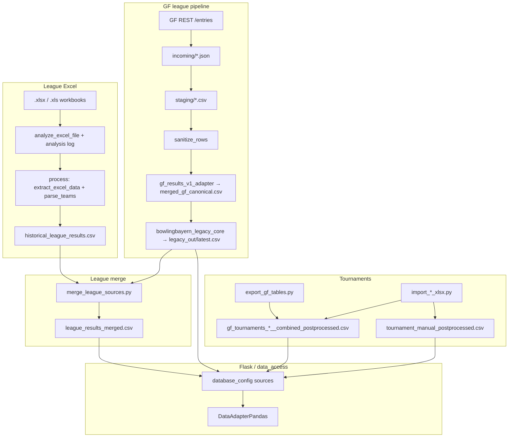

<!-- Generated by SpecStory, Markdown v2.1.0 -->

# 2026-05-20 14:35:52Z

<!-- Cursor IDE Session 78e4797a-fb8f-4bb5-b976-50d090009b9f (2026-05-20 14:35:52Z) -->

_**User**_

Explore the bowlyzer_deploy repository at c:\Users\cfell\repositories\bowlyzer_deploy to document how Excel import and the data pipeline work.

Focus on:
1. Excel importers - where they live, entry points, supported formats
2. Pipeline stages: analyze, parse, normalize, merge - file paths, classes, flow between stages
3. How data flows from raw Excel to database/CSV used by the Flask app
4. Configuration, CLI entry points, tests that document behavior

Search in: pipeline/, data_access/, database/, scripts/, tests/, any docs (DEPLOY.md, README, etc.)

Return a structured summary for the parent agent:
- High-level flow diagram (text/mermaid)
- Key modules and responsibilities (table)
- Main entry commands (uv run ...)
- Extension points for a new importer kind
- Any conventions (naming, schemas, Columns)

Be thorough but concise. Read actual code, don't guess.

---

_**Agent (default)**_

<think><details><summary>Thought Process</summary>
The user seeks a detailed examination of Excel import functionality and the data pipeline within the bowlyzer_deploy repository.
</details></think>

_**Agent (default)**_

Exploring the repository's Excel import and data pipeline structure.


_**Agent (default)**_

<tool-use data-tool-type="unknown" data-tool-name="update_current_step"><details>
<summary>Tool use: **update_current_step**</summary>
An unknown error occurred
</details></tool-use>

_**Agent (default)**_

<tool-use data-tool-type="search" data-tool-name="glob_file_search"><details>
<summary>Tool use: **glob_file_search** • Searched codebase "" • **9** results in **1** directory</summary>

Directory: **`c:\Users\cfell\repositories\bowlyzer_deploy\pipeline`** (9 files)

| File |
|------|
| `../pipeline\__init__.py` |
| `../pipeline\state_store.py` |
| `../pipeline\staging.py` |
| `../pipeline\sanitize.py` |
| `../pipeline\runner.py` |
| `../pipeline\gf_client.py` |
| `../pipeline\bowling_bayern_gf_forms.py` |
| `../pipeline\config.py` |
| `../pipeline\paths.py` |
</details></tool-use>

_**Agent (default)**_

<tool-use data-tool-type="search" data-tool-name="glob_file_search"><details>
<summary>Tool use: **glob_file_search** • Searched codebase "" • **22** results in **1** directory</summary>

Directory: **`c:\Users\cfell\repositories\bowlyzer_deploy\data_access`** (22 files)

| File |
|------|
| `../data_access\adapters\data_adapter_pandas.py` |
| `../data_access\text_norm.py` |
| `../data_access\validate_data.py` |
| `../data_access\series_data.py` |
| `../data_access\build_relational_csv.py` |
| `../data_access\create_test_data_with_errors.py` |
| `../data_access\compare_csv_files.py` |
| `../data_access\read.py` |
| `../data_access\check_input_data_issues.py` |
| `../data_access\schema_validator.py` |
| `../data_access\investigate_issues.py` |
| `../data_access\models\league_models.py` |
| `../data_access\pd_dataframes.py` |
| `../data_access\reconstruct_flat_csv.py` |
| `../data_access\schema.py` |
| `../data_access\models\raw_data_models.py` |
| `../data_access\adapters\data_adapter.py` |
| `../data_access\score_utils.py` |
| `../data_access\dtype_normalization.py` |
| `../data_access\adapters\data_adapter_factory.py` |
| `../data_access\adapters\data_adapter_mysql.py` |
| `../data_access\adapters\data_adapter_sqlite.py` |
</details></tool-use>

_**Agent (default)**_

<tool-use data-tool-type="search" data-tool-name="glob_file_search"><details>
<summary>Tool use: **glob_file_search** • Searched codebase "" • **115** results in **1** directory</summary>

Directory: **`c:\Users\cfell\repositories\bowlyzer_deploy\database`** (115 files)

| File |
|------|
| `../database\data\player_stats_merged_plus_tournaments.csv` |
| `../database\input\import_clubmeisterschaft_donaubowler_xlsx.py` |
| `../database\input\gf_tables_export\gf_tournaments_2026__combined_postprocessed.csv` |
| `../database\data\tournament_bayerische_meisterschaft_2026_postprocessed.csv` |
| `../database\input\import_bayerische_meisterschaft_xlsx.py` |
| `../database\schema.json` |
| `../database\relational_csv\league_mapping.csv` |
| `../database\relational_csv\league_season.csv` |
| `../database\relational_csv\player.csv` |
| `../database\sources\__init__.py` |
| `../database\relational_csv\scoring_system.csv` |
| `../database\relational_csv\new\game_result_new.csv` |
| `../database\sources\gf_results_v1_adapter.py` |
| `../database\relational_csv\new\league_new.csv` |
| `../database\relational_csv\venue.csv` |
| `../database\relational_csv\new\player_new.csv` |
| `../database\sources\gf_form_registry.py` |
| `../database\relational_csv\new\player_skipped_report.txt` |
| `../database\relational_csv\team_season.csv` |
| `../database\sources\bowlingbayern_liga_csv.py` |
| `../database\relational_csv\new\team_new.csv` |
| `../database\relational_csv\new\unmatched_event_locations.csv` |
| `../database\relational_csv\club.csv` |
| `../database\relational_csv\event.csv` |
| `../database\relational_csv\README.md` |
| `../database\input\liga_bayl-m_ergebnisse-2026-04-03.csv` |
| `../database\input\liga_bzol-n2_ergebnisse-2026-04-03.csv` |
| `../database\pipeline\bowling_bayern\legacy_out\latest.csv` |
| `../database\input\liga_bzol-n1_ergebnisse-2026-04-03.csv` |
| `../database\input\liga_ll-s-m_ergebnisse-2026-04-03.csv` |
| `../database\input\liga_ll-s-f_ergebnisse-2026-04-03.csv` |
| `../database\input\postprocess_tournament_results.py` |
| `../database\input\liga_krl-s1_ergebnisse-2026-04-03.csv` |
| `../database\pipeline\bowling_bayern\canonical\merged_gf_canonical.csv` |
| `../database\input\liga_krl-n2_ergebnisse-2026-04-03.csv` |
| `../database\input\gf_tournament_stage_definitions.json` |
| `../database\input\gf_tables_export\gf_player_stats__league_plus_tournaments.csv` |
| `../database\input\gf_tables_export\gf_table_124__sbm_suedbayerische_meisterschaft_2026__canonical_clean.csv` |
| `../database\input\gf_tables_export\gf_table_124__sbm_suedbayerische_meisterschaft_2026.csv` |
| `../database\input\gf_tables_export\gf_table_124__sbm_suedbayerische_meisterschaft_2026__labeled.csv` |
| `../database\input\gf_tables_export\gf_table_124__sbm_suedbayerische_meisterschaft_2026__field_map.csv` |
| `../database\input\gf_tables_export\gf_table_124__sbm_suedbayerische_meisterschaft_2026__column_rename_map.csv` |
| `../database\input\gf_tables_export\gf_table_125__nbm_nordbayerische_meisterschaft_2026__column_rename_map.csv` |
| `../database\input\gf_tables_export\gf_table_125__nbm_nordbayerische_meisterschaft_2026__canonical_clean.csv` |
| `../database\input\gf_tables_export\gf_tournaments_2026__combined_stage_meta.csv` |
| `../database\input\gf_tables_export\gf_table_125__nbm_nordbayerische_meisterschaft_2026.csv` |
| `../database\input\gf_tables_export\gf_table_124__sbm_suedbayerische_meisterschaft_2026__stage_meta.csv` |
| `../database\input\gf_tables_export\gf_table_125__nbm_nordbayerische_meisterschaft_2026__postprocessed.csv` |
| `../database\input\gf_tables_export\gf_table_124__sbm_suedbayerische_meisterschaft_2026__postprocessed.csv` |
| `../database\input\gf_tables_export\gf_table_125__nbm_nordbayerische_meisterschaft_2026__field_map.csv` |
| `../database\input\gf_tables_export\gf_table_125__nbm_nordbayerische_meisterschaft_2026__labeled.csv` |
| `../database\input\gf_tables_export\gf_table_125__nbm_nordbayerische_meisterschaft_2026__stage_meta.csv` |
| `../database\input\gf_tables_export\gf_tournaments_2026__combined_canonical_clean.csv` |
| `../database\input\convert_bowlingbayern_to_legacy.py` |
| `../database\input\generate_geek_tournament_data.py` |
| `../database\input\generate_tournament_clean_results.py` |
| `../database\input\gf_table_tournament_map.json` |
| `../database\input\INPUT_TO_LEGACY_CSV_MAPPING.md` |
| `../database\input\bayerische_meisterschaft_xlsx\.gitkeep` |
| `../database\generator\player.py` |
| `../database\generator\seed.py` |
| `../database\generator\teams.py` |
| `../database\generator\league.py` |
| `../database\data\tournament_geek_classic_2024_2026_clean.csv` |
| `../database\data\tournament_geek_classic_2024_2026_postprocessed.csv` |
| `../database\data\tournament_geek_classic_2024_2026_roster.csv` |
| `../database\data\tournament_geek_classic_2026_clean.csv` |
| `../database\data\tournament_geek_classic_2026_postprocessed.csv` |
| `../database\data\tournament_geek_classic_2026_roster.csv` |
| `../database\data\tournament_ko_config.json` |
| `../database\data\tournament_ko_config.example.json` |
| `../database\data\tournament_manual_postprocessed.csv` |
| `../database\data\tournament_mythic_legends_2024_2026_clean.csv` |
| `../database\data\tournament_mythic_legends_2024_2026_roster.csv` |
| `../database\data\tournament_mythic_legends_2024_2026_postprocessed.csv` |
| `../database\data\tournament_nordbayerische_2026_clean.csv` |
| `../database\data\tournament_nordbayerische_2026_clean_via_script.csv` |
| `../database\data\tournament_nordbayerische_2026_postprocessed.csv` |
| `../database\data\tournament_nordbayerische_2026_postprocessed_via_both_scripts.csv` |
| `../database\data\tournament_nordbayerische_2026_postprocessed_via_script.csv` |
| `../database\data\tournament_sbm_2026_stage_meta.csv` |
| `../database\data\tournament_sbm_2026_clean_from_gf.csv` |
| `../database\data\tournament_clash_imaginary_entities_2024_2026_clean.csv` |
| `../database\data\tournament_clash_imaginary_entities_2024_2026_postprocessed.csv` |
| `../database\data\tournament_clubmeisterschaft_donaubowler_2026_postprocessed.csv` |
| `../database\data\tournament_combined_2024_2026_postprocessed.csv` |
| `../database\data\tmp\bowling_ergebnisse_real_bak.csv` |
| `../database\data\tmp\bowling_ergebnisse_real_backup.csv` |
| `../database\data\tmp\bowling_ergebnisse_real_fixed.csv` |
| `../database\data\tmp\bowling_ergebnisse_real_lowerleagues.csv` |
| `../database\data\tmp\bowling_ergebnisse_real_prior_to_manual_bayl.csv` |
| `../database\data\tmp\bowling_ergebnisse_real_sorted.csv` |
| `../database\data\tmp\bowling_ergebnisse_real_with_fake_bayl_2024.csv` |
| `../database\data\tmp\bowling_ergebnisse_real_2025_fixed.csv` |
| `../database\data\tmp\bowling_ergebnisse_real_2025.csv` |
| `../database\data\league_results_merged.csv` |
| `../database\data\ko_bracket_overrides.example.json` |
| `../database\data\ko_bracket_overrides.json` |
| `../database\data\historical_league_results.csv` |
| `../database\data\bowling_ergebnisse_reconstructed.csv` |
| `../database\data\bowling_ergebnisse_test_with_errors.csv` |
| `../database\data\bowling_ergebnisse_real_from_bowlingbayern.csv` |
| `../database\data\bowling_ergebnisse_ohne_punkte.csv` |
| `../database\data\bowling_ergebnisse_real.csv` |
| `../database\data\bowling_ergebnisse_test_errors.csv` |
| `../database\data\bowling_ergebnisse_reconstructed_clean.csv` |
| `../database\data\bowling_ergebnisse.csv` |
| `../database\config\extract_excel_overrides.csv` |
| `../database\config.py` |
| `../database\conversion\__init__.py` |
| `../database\config\team_name_normalization.json` |
| `../database\config\team_number_overrides.csv` |
| `../database\conversion\bowlingbayern_legacy_core.py` |
| `../database\__init__.py` |
| `../database\data\TEST_ERRORS_SUMMARY.md` |
</details></tool-use>

_**Agent (default)**_

<tool-use data-tool-type="unknown" data-tool-name="ripgrep_raw_search"><details>
<summary>Tool use: **ripgrep_raw_search**</summary>

Parameters:

```json
{
  "caseInsensitive": true,
  "glob": "*.{py,md,sh}",
  "path": "c:\\Users\\cfell\\repositories\\bowlyzer_deploy",
  "pattern": "excel|xlsx|import"
}
```
Additional data:

```json
{
  "isPruned": true,
  "outputMode": "content",
  "path": "c:\\Users\\cfell\\repositories\\bowlyzer_deploy",
  "pattern": "excel|xlsx|import",
  "topFiles": [
    {
      "matchCount": 80,
      "uri": ".\\.specstory\\history\\2026-05-19_07-58-26Z-exposing-web-service-on-local-network.md"
    }
  ],
  "totalFiles": 1,
  "totalMatches": 4154
}
```
Status: **completed**

</details></tool-use>

_**Agent (default)**_

<tool-use data-tool-type="unknown" data-tool-name="ripgrep_raw_search"><details>
<summary>Tool use: **ripgrep_raw_search**</summary>

Parameters:

```json
{
  "caseInsensitive": false,
  "glob": "*.py",
  "path": "c:\\Users\\cfell\\repositories\\bowlyzer_deploy\\pipeline",
  "pattern": "analyze|parse|normalize|merge"
}
```
Additional data:

```json
{
  "isPruned": true,
  "outputMode": "content",
  "path": "c:\\Users\\cfell\\repositories\\bowlyzer_deploy\\pipeline",
  "pattern": "analyze|parse|normalize|merge",
  "topFiles": [
    {
      "matchCount": 3,
      "uri": "pipeline\\gf_client.py"
    },
    {
      "matchCount": 23,
      "uri": "pipeline\\runner.py"
    }
  ],
  "totalFiles": 2,
  "totalMatches": 26
}
```
Status: **completed**

</details></tool-use>

_**Agent (default)**_

<think><details><summary>Thought Process</summary>
I need to examine the pipeline files, Excel importers, scripts, tests, and documentation in detail.
</details></think>

_**Agent (default)**_

<tool-use data-tool-type="unknown" data-tool-name="ripgrep_raw_search"><details>
<summary>Tool use: **ripgrep_raw_search**</summary>

Parameters:

```json
{
  "caseInsensitive": false,
  "glob": "*.py",
  "path": "c:\\Users\\cfell\\repositories\\bowlyzer_deploy\\database",
  "pattern": "analyze|parse|normalize|merge"
}
```
Additional data:

```json
{
  "isPruned": true,
  "outputMode": "content",
  "path": "c:\\Users\\cfell\\repositories\\bowlyzer_deploy\\database",
  "pattern": "analyze|parse|normalize|merge",
  "topFiles": [
    {
      "matchCount": 32,
      "uri": "database\\input\\import_clubmeisterschaft_donaubowler_xlsx.py"
    },
    {
      "matchCount": 31,
      "uri": "database\\input\\import_bayerische_meisterschaft_xlsx.py"
    },
    {
      "matchCount": 2,
      "uri": "database\\sources\\gf_form_registry.py"
    },
    {
      "matchCount": 11,
      "uri": "database\\input\\postprocess_tournament_results.py"
    },
    {
      "matchCount": 4,
      "uri": "database\\input\\generate_tournament_clean_results.py"
    }
  ],
  "totalFiles": 5,
  "totalMatches": 109
}
```
Status: **completed**

</details></tool-use>

_**Agent (default)**_

<tool-use data-tool-type="search" data-tool-name="glob_file_search"><details>
<summary>Tool use: **glob_file_search** • Searched codebase "" • **4** results in **1** directory</summary>

Directory: **`c:\Users\cfell\repositories\bowlyzer_deploy`** (4 files)

| File |
|------|
| `../.\database\input\import_clubmeisterschaft_donaubowler_xlsx.py` |
| `../.\tests\database\test_import_bayerische_meisterschaft_xlsx.py` |
| `../.\database\input\import_bayerische_meisterschaft_xlsx.py` |
| `../.\tests\data_access\test_data_adapter_pandas_imported_data.py` |
</details></tool-use>

_**Agent (default)**_

<tool-use data-tool-type="search" data-tool-name="glob_file_search"><details>
<summary>Tool use: **glob_file_search** • Searched codebase "" • **3** results in **1** directory</summary>

Directory: **`c:\Users\cfell\repositories\bowlyzer_deploy`** (3 files)

| File |
|------|
| `../.\database\input\import_clubmeisterschaft_donaubowler_xlsx.py` |
| `../.\tests\database\test_import_bayerische_meisterschaft_xlsx.py` |
| `../.\database\input\import_bayerische_meisterschaft_xlsx.py` |
</details></tool-use>

_**Agent (default)**_

<tool-use data-tool-type="unknown" data-tool-name="ripgrep_raw_search"><details>
<summary>Tool use: **ripgrep_raw_search**</summary>

Parameters:

```json
{
  "caseInsensitive": true,
  "path": "c:\\Users\\cfell\\repositories\\bowlyzer_deploy\\tests",
  "pattern": "pipeline|import.*xlsx|excel"
}
```
Additional data:

```json
{
  "isPruned": true,
  "outputMode": "content",
  "path": "c:\\Users\\cfell\\repositories\\bowlyzer_deploy\\tests",
  "pattern": "pipeline|import.*xlsx|excel",
  "topFiles": [
    {
      "matchCount": 2,
      "uri": "tests\\database\\test_import_bayerische_meisterschaft_xlsx.py"
    },
    {
      "matchCount": 1,
      "uri": "tests\\README.md"
    }
  ],
  "totalFiles": 2,
  "totalMatches": 3
}
```
Status: **completed**

</details></tool-use>

_**Agent (default)**_

<tool-use data-tool-type="unknown" data-tool-name="ripgrep_raw_search"><details>
<summary>Tool use: **ripgrep_raw_search**</summary>

Parameters:

```json
{
  "caseInsensitive": true,
  "glob": "DEPLOY.md",
  "path": "c:\\Users\\cfell\\repositories\\bowlyzer_deploy",
  "pattern": "pipeline|excel|xlsx|import"
}
```
Additional data:

```json
{
  "isPruned": true,
  "outputMode": "content",
  "path": "c:\\Users\\cfell\\repositories\\bowlyzer_deploy",
  "pattern": "pipeline|excel|xlsx|import",
  "topFiles": [],
  "totalFiles": 0,
  "totalMatches": 0
}
```
Status: **completed**

</details></tool-use>

_**Agent (default)**_

<tool-use data-tool-type="unknown" data-tool-name="ripgrep_raw_search"><details>
<summary>Tool use: **ripgrep_raw_search**</summary>

Parameters:

```json
{
  "caseInsensitive": true,
  "glob": "README*",
  "path": "c:\\Users\\cfell\\repositories\\bowlyzer_deploy",
  "pattern": "pipeline|excel|xlsx|import"
}
```
Additional data:

```json
{
  "isPruned": true,
  "outputMode": "content",
  "path": "c:\\Users\\cfell\\repositories\\bowlyzer_deploy",
  "pattern": "pipeline|excel|xlsx|import",
  "topFiles": [
    {
      "matchCount": 6,
      "uri": ".\\deploy\\README.md"
    },
    {
      "matchCount": 3,
      "uri": ".\\tests\\README.md"
    },
    {
      "matchCount": 4,
      "uri": ".\\frontend\\README.md"
    },
    {
      "matchCount": 3,
      "uri": ".\\docs\\README.md"
    }
  ],
  "totalFiles": 4,
  "totalMatches": 16
}
```
Status: **completed**

</details></tool-use>

_**Agent (default)**_

<tool-use data-tool-type="search" data-tool-name="glob_file_search"><details>
<summary>Tool use: **glob_file_search** • Searched codebase "" • **12** results in **1** directory</summary>

Directory: **`c:\Users\cfell\repositories\bowlyzer_deploy\scripts`** (12 files)

| File |
|------|
| `../scripts\clubmeisterschaft_auto_import.sh` |
| `../scripts\install_clubmeisterschaft_auto_import.sh` |
| `../scripts\benchmark_tournament_section.py` |
| `../scripts\export_gf_tables.py` |
| `../scripts\merge_league_sources.py` |
| `../scripts\rebuild_league_caches.py` |
| `../scripts\reimport_bayerische_meisterschaft.ps1` |
| `../scripts\run_gf_pipeline.py` |
| `../scripts\transform_gf_tournament_to_canonical.py` |
| `../scripts\warm_league_cache.py` |
| `../scripts\analyze_missing_league_weeks.py` |
| `../scripts\dump_staging_row.py` |
</details></tool-use>

_**Agent (default)**_

<tool-use data-tool-type="search" data-tool-name="glob_file_search"><details>
<summary>Tool use: **glob_file_search** • Searched codebase "" • **2** results in **1** directory</summary>

Directory: **`c:\Users\cfell\repositories\bowlyzer_deploy\docs`** (2 files)

| File |
|------|
| `../docs\GF_PIPELINE_SPRINT1_RUNBOOK.md` |
| `../docs\GF_DATA_PIPELINE_IMPLEMENTATION_PLAN.md` |
</details></tool-use>

_**Agent (default)**_

<tool-use data-tool-type="unknown" data-tool-name="ripgrep_raw_search"><details>
<summary>Tool use: **ripgrep_raw_search**</summary>

Parameters:

```json
{
  "caseInsensitive": false,
  "glob": "*.py",
  "path": "c:\\Users\\cfell\\repositories\\bowlyzer_deploy",
  "pattern": "analyze|canonical|staging|sanitize"
}
```
Additional data:

```json
{
  "isPruned": true,
  "outputMode": "content",
  "path": "c:\\Users\\cfell\\repositories\\bowlyzer_deploy",
  "pattern": "analyze|canonical|staging|sanitize",
  "topFiles": [
    {
      "matchCount": 3,
      "uri": ".\\app\\cache\\league_response_cache.py"
    },
    {
      "matchCount": 1,
      "uri": ".\\scripts\\warm_league_cache.py"
    },
    {
      "matchCount": 8,
      "uri": ".\\scripts\\transform_gf_tournament_to_canonical.py"
    },
    {
      "matchCount": 1,
      "uri": ".\\scripts\\run_gf_pipeline.py"
    },
    {
      "matchCount": 1,
      "uri": ".\\scripts\\rebuild_league_caches.py"
    },
    {
      "matchCount": 23,
      "uri": ".\\scripts\\export_gf_tables.py"
    },
    {
      "matchCount": 9,
      "uri": ".\\pipeline\\paths.py"
    },
    {
      "matchCount": 1,
      "uri": ".\\pipeline\\bowling_bayern_gf_forms.py"
    },
    {
      "matchCount": 33,
      "uri": ".\\pipeline\\runner.py"
    }
  ],
  "totalFiles": 9,
  "totalMatches": 185
}
```
Status: **completed**

</details></tool-use>

_**Agent (default)**_

<tool-use data-tool-type="read" data-tool-name="read_file_v2"><details>
<summary>Tool use: **read_file_v2** • Read file: c:\Users\cfell\repositories\bowlyzer_deploy\pipeline\runner.py</summary>

</details></tool-use>

_**Agent (default)**_

<tool-use data-tool-type="read" data-tool-name="read_file_v2"><details>
<summary>Tool use: **read_file_v2** • Read file: c:\Users\cfell\repositories\bowlyzer_deploy\pipeline\config.py</summary>

</details></tool-use>

_**Agent (default)**_

<tool-use data-tool-type="read" data-tool-name="read_file_v2"><details>
<summary>Tool use: **read_file_v2** • Read file: c:\Users\cfell\repositories\bowlyzer_deploy\pipeline\paths.py</summary>

</details></tool-use>

_**Agent (default)**_

<think><details><summary>Thought Process</summary>
Now I need to read and sanitize the file pipeline/staging.py.
</details></think>

_**Agent (default)**_

<tool-use data-tool-type="read" data-tool-name="read_file_v2"><details>
<summary>Tool use: **read_file_v2** • Read file: c:\Users\cfell\repositories\bowlyzer_deploy\pipeline\staging.py</summary>

</details></tool-use>

_**Agent (default)**_

<tool-use data-tool-type="read" data-tool-name="read_file_v2"><details>
<summary>Tool use: **read_file_v2** • Read file: c:\Users\cfell\repositories\bowlyzer_deploy\pipeline\sanitize.py</summary>

</details></tool-use>

_**Agent (default)**_

<tool-use data-tool-type="read" data-tool-name="read_file_v2"><details>
<summary>Tool use: **read_file_v2** • Read file: c:\Users\cfell\repositories\bowlyzer_deploy\database\sources\gf_form_registry.py</summary>

</details></tool-use>

_**Agent (default)**_

<tool-use data-tool-type="read" data-tool-name="read_file_v2"><details>
<summary>Tool use: **read_file_v2** • Read file: c:\Users\cfell\repositories\bowlyzer_deploy\database\sources\gf_results_v1_adapter.py</summary>

</details></tool-use>

_**Agent (default)**_

<tool-use data-tool-type="read" data-tool-name="read_file_v2"><details>
<summary>Tool use: **read_file_v2** • Read file: c:\Users\cfell\repositories\bowlyzer_deploy\scripts\run_gf_pipeline.py</summary>

</details></tool-use>

_**Agent (default)**_

<tool-use data-tool-type="read" data-tool-name="read_file_v2"><details>
<summary>Tool use: **read_file_v2** • Read file: c:\Users\cfell\repositories\bowlyzer_deploy\docs\GF_PIPELINE_SPRINT1_RUNBOOK.md</summary>

</details></tool-use>

_**Agent (default)**_

<tool-use data-tool-type="read" data-tool-name="read_file_v2"><details>
<summary>Tool use: **read_file_v2** • Read file: c:\Users\cfell\repositories\bowlyzer_deploy\database\input\import_bayerische_meisterschaft_xlsx.py</summary>

</details></tool-use>

_**Agent (default)**_

<tool-use data-tool-type="read" data-tool-name="read_file_v2"><details>
<summary>Tool use: **read_file_v2** • Read file: c:\Users\cfell\repositories\bowlyzer_deploy\database\input\import_clubmeisterschaft_donaubowler_xlsx.py</summary>

</details></tool-use>

_**Agent (default)**_

<tool-use data-tool-type="read" data-tool-name="read_file_v2"><details>
<summary>Tool use: **read_file_v2** • Read file: c:\Users\cfell\repositories\bowlyzer_deploy\tests\database\test_import_bayerische_meisterschaft_xlsx.py</summary>

</details></tool-use>

_**Agent (default)**_

<tool-use data-tool-type="read" data-tool-name="read_file_v2"><details>
<summary>Tool use: **read_file_v2** • Read file: c:\Users\cfell\repositories\bowlyzer_deploy\database\input\INPUT_TO_LEGACY_CSV_MAPPING.md</summary>

</details></tool-use>

_**Agent (default)**_

<tool-use data-tool-type="unknown" data-tool-name="ripgrep_raw_search"><details>
<summary>Tool use: **ripgrep_raw_search**</summary>

Parameters:

```json
{
  "caseInsensitive": false,
  "glob": "*.py",
  "path": "c:\\Users\\cfell\\repositories\\bowlyzer_deploy\\scripts",
  "pattern": "analyze|parse|normalize"
}
```
Additional data:

```json
{
  "isPruned": true,
  "outputMode": "content",
  "path": "c:\\Users\\cfell\\repositories\\bowlyzer_deploy\\scripts",
  "pattern": "analyze|parse|normalize",
  "topFiles": [
    {
      "matchCount": 11,
      "uri": "scripts\\benchmark_tournament_section.py"
    },
    {
      "matchCount": 11,
      "uri": "scripts\\warm_league_cache.py"
    },
    {
      "matchCount": 8,
      "uri": "scripts\\transform_gf_tournament_to_canonical.py"
    },
    {
      "matchCount": 13,
      "uri": "scripts\\run_gf_pipeline.py"
    },
    {
      "matchCount": 26,
      "uri": "scripts\\merge_league_sources.py"
    },
    {
      "matchCount": 17,
      "uri": "scripts\\export_gf_tables.py"
    },
    {
      "matchCount": 7,
      "uri": "scripts\\rebuild_league_caches.py"
    },
    {
      "matchCount": 7,
      "uri": "scripts\\analyze_missing_league_weeks.py"
    }
  ],
  "totalFiles": 8,
  "totalMatches": 100
}
```
Status: **completed**

</details></tool-use>

_**Agent (default)**_

<tool-use data-tool-type="unknown" data-tool-name="ripgrep_raw_search"><details>
<summary>Tool use: **ripgrep_raw_search**</summary>

Parameters:

```json
{
  "caseInsensitive": false,
  "glob": "*.py",
  "path": "c:\\Users\\cfell\\repositories\\bowlyzer_deploy\\database\\input",
  "pattern": "analyze|parse|normalize"
}
```
Additional data:

```json
{
  "isPruned": true,
  "outputMode": "content",
  "path": "c:\\Users\\cfell\\repositories\\bowlyzer_deploy\\database\\input",
  "pattern": "analyze|parse|normalize",
  "topFiles": [
    {
      "matchCount": 6,
      "uri": "database\\input\\import_clubmeisterschaft_donaubowler_xlsx.py"
    },
    {
      "matchCount": 20,
      "uri": "database\\input\\import_bayerische_meisterschaft_xlsx.py"
    },
    {
      "matchCount": 11,
      "uri": "database\\input\\postprocess_tournament_results.py"
    },
    {
      "matchCount": 18,
      "uri": "database\\input\\generate_tournament_clean_results.py"
    },
    {
      "matchCount": 2,
      "uri": "database\\input\\convert_bowlingbayern_to_legacy.py"
    }
  ],
  "totalFiles": 5,
  "totalMatches": 57
}
```
Status: **completed**

</details></tool-use>

_**Agent (default)**_

<think><details><summary>Thought Process</summary>
The user inquired about four pipeline stages: analyze, parse, normalize, and merge.
</details></think>

_**Agent (default)**_

<tool-use data-tool-type="read" data-tool-name="read_file_v2"><details>
<summary>Tool use: **read_file_v2** • Read file: c:\Users\cfell\repositories\bowlyzer_deploy\scripts\export_gf_tables.py</summary>

</details></tool-use>

_**Agent (default)**_

<tool-use data-tool-type="read" data-tool-name="read_file_v2"><details>
<summary>Tool use: **read_file_v2** • Read file: c:\Users\cfell\repositories\bowlyzer_deploy\scripts\export_gf_tables.py</summary>

</details></tool-use>

_**Agent (default)**_

<tool-use data-tool-type="unknown" data-tool-name="ripgrep_raw_search"><details>
<summary>Tool use: **ripgrep_raw_search**</summary>

Parameters:

```json
{
  "caseInsensitive": false,
  "glob": "*.py",
  "path": "c:\\Users\\cfell\\repositories\\bowlyzer_deploy\\app\\config",
  "pattern": "database_config|DATA_SOURCES|legacy_out|player_stats"
}
```
Additional data:

```json
{
  "isPruned": true,
  "outputMode": "content",
  "path": "c:\\Users\\cfell\\repositories\\bowlyzer_deploy\\app\\config",
  "pattern": "database_config|DATA_SOURCES|legacy_out|player_stats",
  "topFiles": [
    {
      "matchCount": 7,
      "uri": "app\\config\\database_config.py"
    }
  ],
  "totalFiles": 1,
  "totalMatches": 7
}
```
Status: **completed**

</details></tool-use>

_**Agent (default)**_

<tool-use data-tool-type="read" data-tool-name="read_file_v2"><details>
<summary>Tool use: **read_file_v2** • Read file: c:\Users\cfell\repositories\bowlyzer_deploy\data_access\schema.py</summary>

</details></tool-use>

_**Agent (default)**_

<tool-use data-tool-type="read" data-tool-name="read_file_v2"><details>
<summary>Tool use: **read_file_v2** • Read file: c:\Users\cfell\repositories\bowlyzer_deploy\data_access\read.py</summary>

</details></tool-use>

_**Agent (default)**_

<tool-use data-tool-type="search" data-tool-name="glob_file_search"><details>
<summary>Tool use: **glob_file_search** • Searched codebase "" • **2** results in **1** directory</summary>

Directory: **`c:\Users\cfell\repositories\bowlyzer_deploy\database\conversion`** (2 files)

| File |
|------|
| `../database\conversion\__init__.py` |
| `../database\conversion\bowlingbayern_legacy_core.py` |
</details></tool-use>

_**Agent (default)**_

<tool-use data-tool-type="read" data-tool-name="read_file_v2"><details>
<summary>Tool use: **read_file_v2** • Read file: c:\Users\cfell\repositories\bowlyzer_deploy\app\config\database_config.py</summary>

</details></tool-use>

_**Agent (default)**_

<tool-use data-tool-type="read" data-tool-name="read_file_v2"><details>
<summary>Tool use: **read_file_v2** • Read file: c:\Users\cfell\repositories\bowlyzer_deploy\database\conversion\bowlingbayern_legacy_core.py</summary>

</details></tool-use>

_**Agent (default)**_

<tool-use data-tool-type="read" data-tool-name="read_file_v2"><details>
<summary>Tool use: **read_file_v2** • Read file: c:\Users\cfell\repositories\bowlyzer_deploy\scripts\merge_league_sources.py</summary>

</details></tool-use>

_**Agent (default)**_

<tool-use data-tool-type="read" data-tool-name="read_file_v2"><details>
<summary>Tool use: **read_file_v2** • Read file: c:\Users\cfell\repositories\bowlyzer_deploy\database\input\convert_bowlingbayern_to_legacy.py</summary>

</details></tool-use>

_**Agent (default)**_

<tool-use data-tool-type="unknown" data-tool-name="ripgrep_raw_search"><details>
<summary>Tool use: **ripgrep_raw_search**</summary>

Parameters:

```json
{
  "caseInsensitive": false,
  "glob": "*.py",
  "path": "c:\\Users\\cfell\\repositories\\bowlyzer_deploy\\tests",
  "pattern": "test_.*pipeline|test_.*gf|test_.*import|test_.*merge|test_.*legacy|test_.*convert"
}
```
Additional data:

```json
{
  "isPruned": true,
  "outputMode": "content",
  "path": "c:\\Users\\cfell\\repositories\\bowlyzer_deploy\\tests",
  "pattern": "test_.*pipeline|test_.*gf|test_.*import|test_.*merge|test_.*legacy|test_.*convert",
  "topFiles": [
    {
      "matchCount": 1,
      "uri": "tests\\app\\test_field_progress_incremental.py"
    },
    {
      "matchCount": 2,
      "uri": "tests\\application\\test_query_validators.py"
    }
  ],
  "totalFiles": 2,
  "totalMatches": 3
}
```
Status: **completed**

</details></tool-use>

_**Agent (default)**_

<tool-use data-tool-type="unknown" data-tool-name="ripgrep_raw_search"><details>
<summary>Tool use: **ripgrep_raw_search**</summary>

Parameters:

```json
{
  "caseInsensitive": false,
  "glob": "*.md",
  "path": "c:\\Users\\cfell\\repositories\\bowlyzer_deploy\\docs",
  "pattern": "analyze|parse|normalize|merge"
}
```
Additional data:

```json
{
  "isPruned": true,
  "outputMode": "content",
  "path": "c:\\Users\\cfell\\repositories\\bowlyzer_deploy\\docs",
  "pattern": "analyze|parse|normalize|merge",
  "topFiles": [
    {
      "matchCount": 1,
      "uri": "docs\\planning\\DOCKER_MIGRATION_PLAN.md"
    },
    {
      "matchCount": 5,
      "uri": "docs\\DATA_TYPE_NORMALIZATION_ASSESSMENT.md"
    },
    {
      "matchCount": 12,
      "uri": "docs\\GF_PIPELINE_SPRINT1_RUNBOOK.md"
    },
    {
      "matchCount": 8,
      "uri": "docs\\GF_DATA_PIPELINE_IMPLEMENTATION_PLAN.md"
    },
    {
      "matchCount": 1,
      "uri": "docs\\CENTRALIZED_BUTTON_SYSTEM.md"
    },
    {
      "matchCount": 2,
      "uri": "docs\\BUTTON_SYSTEM_FIXES.md"
    },
    {
      "matchCount": 1,
      "uri": "docs\\DATABASE_SWITCHING_FIX.md"
    },
    {
      "matchCount": 1,
      "uri": "docs\\CONVERSATION_SUMMARY.md"
    }
  ],
  "totalFiles": 8,
  "totalMatches": 31
}
```
Status: **completed**

</details></tool-use>

_**Agent (default)**_

<tool-use data-tool-type="search" data-tool-name="glob_file_search"><details>
<summary>Tool use: **glob_file_search** • Searched codebase "" • **2** results in **1** directory</summary>

Directory: **`c:\Users\cfell\repositories\bowlyzer_deploy`** (2 files)

| File |
|------|
| `../.\extract_excel_data.py` |
| `../.\database\config\extract_excel_overrides.csv` |
</details></tool-use>

_**Agent (default)**_

<tool-use data-tool-type="unknown" data-tool-name="ripgrep_raw_search"><details>
<summary>Tool use: **ripgrep_raw_search**</summary>

Parameters:

```json
{
  "caseInsensitive": false,
  "glob": "*.py",
  "path": "c:\\Users\\cfell\\repositories\\bowlyzer_deploy",
  "pattern": "extract_excel|openpyxl|xlsx"
}
```
Additional data:

```json
{
  "isPruned": true,
  "outputMode": "content",
  "path": "c:\\Users\\cfell\\repositories\\bowlyzer_deploy",
  "pattern": "extract_excel|openpyxl|xlsx",
  "topFiles": [
    {
      "matchCount": 15,
      "uri": ".\\database\\input\\import_clubmeisterschaft_donaubowler_xlsx.py"
    },
    {
      "matchCount": 3,
      "uri": ".\\tests\\database\\test_import_bayerische_meisterschaft_xlsx.py"
    },
    {
      "matchCount": 7,
      "uri": ".\\database\\input\\import_bayerische_meisterschaft_xlsx.py"
    },
    {
      "matchCount": 2,
      "uri": ".\\scripts\\merge_league_sources.py"
    },
    {
      "matchCount": 1,
      "uri": ".\\scripts\\analyze_missing_league_weeks.py"
    },
    {
      "matchCount": 18,
      "uri": ".\\extract_excel_data.py"
    }
  ],
  "totalFiles": 6,
  "totalMatches": 46
}
```
Status: **completed**

</details></tool-use>

_**Agent (default)**_

<tool-use data-tool-type="read" data-tool-name="read_file_v2"><details>
<summary>Tool use: **read_file_v2** • Read file: c:\Users\cfell\repositories\bowlyzer_deploy\docs\GF_DATA_PIPELINE_IMPLEMENTATION_PLAN.md</summary>

</details></tool-use>

_**Agent (default)**_

<tool-use data-tool-type="read" data-tool-name="read_file_v2"><details>
<summary>Tool use: **read_file_v2** • Read file: c:\Users\cfell\repositories\bowlyzer_deploy\app\config\database_config.py</summary>

</details></tool-use>

_**Agent (default)**_

<tool-use data-tool-type="unknown" data-tool-name="ripgrep_raw_search"><details>
<summary>Tool use: **ripgrep_raw_search**</summary>

Parameters:

```json
{
  "caseInsensitive": false,
  "path": "c:\\Users\\cfell\\repositories\\bowlyzer_deploy\\pyproject.toml",
  "pattern": "\\[project\\.scripts\\]|scripts"
}
```
Additional data:

```json
{
  "isPruned": true,
  "outputMode": "content",
  "path": "c:\\Users\\cfell\\repositories\\bowlyzer_deploy\\pyproject.toml",
  "pattern": "\\[project\\.scripts\\]|scripts",
  "topFiles": [],
  "totalFiles": 0,
  "totalMatches": 0
}
```
Status: **completed**

</details></tool-use>

_**Agent (default)**_

<tool-use data-tool-type="read" data-tool-name="read_file_v2"><details>
<summary>Tool use: **read_file_v2** • Read file: c:\Users\cfell\repositories\bowlyzer_deploy\extract_excel_data.py</summary>

</details></tool-use>

_**Agent (default)**_

<tool-use data-tool-type="unknown" data-tool-name="ripgrep_raw_search"><details>
<summary>Tool use: **ripgrep_raw_search**</summary>

Parameters:

```json
{
  "caseInsensitive": false,
  "path": "c:\\Users\\cfell\\repositories\\bowlyzer_deploy\\extract_excel_data.py",
  "pattern": "def (analyze|parse|normalize|merge|extract)"
}
```
Additional data:

```json
{
  "isPruned": true,
  "outputMode": "content",
  "path": "c:\\Users\\cfell\\repositories\\bowlyzer_deploy\\extract_excel_data.py",
  "pattern": "def (analyze|parse|normalize|merge|extract)",
  "topFiles": [
    {
      "matchCount": 20,
      "uri": "extract_excel_data.py"
    }
  ],
  "totalFiles": 1,
  "totalMatches": 20
}
```
Status: **completed**

</details></tool-use>

_**Agent (default)**_

<tool-use data-tool-type="read" data-tool-name="read_file_v2"><details>
<summary>Tool use: **read_file_v2** • Read file: c:\Users\cfell\repositories\bowlyzer_deploy\data_access\adapters\data_adapter_factory.py</summary>

</details></tool-use>

_**Agent (default)**_

<tool-use data-tool-type="search" data-tool-name="glob_file_search"><details>
<summary>Tool use: **glob_file_search** • Searched codebase "" • **0** results in **1** directory</summary>

Directory: **`c:\Users\cfell\repositories\bowlyzer_deploy`** (0 files)
</details></tool-use>

_**Agent (default)**_

<tool-use data-tool-type="read" data-tool-name="read_file_v2"><details>
<summary>Tool use: **read_file_v2** • Read file: c:\Users\cfell\repositories\bowlyzer_deploy\database\relational_csv\README.md</summary>

</details></tool-use>

_**Agent (default)**_

<tool-use data-tool-type="unknown" data-tool-name="ripgrep_raw_search"><details>
<summary>Tool use: **ripgrep_raw_search**</summary>

Parameters:

```json
{
  "caseInsensitive": false,
  "glob": "*.md",
  "path": "c:\\Users\\cfell\\repositories\\bowlyzer_deploy",
  "pattern": "uv run|extract_excel|merge_league|run_gf|import_"
}
```
Additional data:

```json
{
  "isPruned": true,
  "outputMode": "content",
  "path": "c:\\Users\\cfell\\repositories\\bowlyzer_deploy",
  "pattern": "uv run|extract_excel|merge_league|run_gf|import_",
  "topFiles": [
    {
      "matchCount": 40,
      "uri": ".\\.specstory\\history\\2026-05-19_07-58-26Z-exposing-web-service-on-local-network.md"
    }
  ],
  "totalFiles": 1,
  "totalMatches": 1278
}
```
Status: **completed**

</details></tool-use>

_**Agent (default)**_

<think><details><summary>Thought Process</summary>
Let me examine the extract_excel_data.py file, focusing on analyze_excel_file and main CLI, merge_league_sources CLI arguments, import scripts CLI, data_access tests, and DEPLOY.
</details></think>

_**Agent (default)**_

<tool-use data-tool-type="read" data-tool-name="read_file_v2"><details>
<summary>Tool use: **read_file_v2** • Read file: c:\Users\cfell\repositories\bowlyzer_deploy\extract_excel_data.py</summary>

</details></tool-use>

_**Agent (default)**_

<tool-use data-tool-type="read" data-tool-name="read_file_v2"><details>
<summary>Tool use: **read_file_v2** • Read file: c:\Users\cfell\repositories\bowlyzer_deploy\extract_excel_data.py</summary>

</details></tool-use>

_**Agent (default)**_

<tool-use data-tool-type="read" data-tool-name="read_file_v2"><details>
<summary>Tool use: **read_file_v2** • Read file: c:\Users\cfell\repositories\bowlyzer_deploy\extract_excel_data.py</summary>

</details></tool-use>

_**Agent (default)**_

<tool-use data-tool-type="read" data-tool-name="read_file_v2"><details>
<summary>Tool use: **read_file_v2** • Read file: c:\Users\cfell\repositories\bowlyzer_deploy\scripts\merge_league_sources.py</summary>

</details></tool-use>

_**Agent (default)**_

<tool-use data-tool-type="read" data-tool-name="read_file_v2"><details>
<summary>Tool use: **read_file_v2** • Read file: c:\Users\cfell\repositories\bowlyzer_deploy\database\input\import_bayerische_meisterschaft_xlsx.py</summary>

</details></tool-use>

_**Agent (default)**_

<tool-use data-tool-type="read" data-tool-name="read_file_v2"><details>
<summary>Tool use: **read_file_v2** • Read file: c:\Users\cfell\repositories\bowlyzer_deploy\database\input\import_clubmeisterschaft_donaubowler_xlsx.py</summary>

</details></tool-use>

_**Agent (default)**_

<think><details><summary>Thought Process</summary>
I need to gather more information about tests for extract_excel, gf pipeline, and data_access validate.
</details></think>

_**Agent (default)**_

<tool-use data-tool-type="unknown" data-tool-name="ripgrep_raw_search"><details>
<summary>Tool use: **ripgrep_raw_search**</summary>

Parameters:

```json
{
  "caseInsensitive": false,
  "glob": "*.py",
  "path": "c:\\Users\\cfell\\repositories\\bowlyzer_deploy\\tests",
  "pattern": "extract_excel|bowlingbayern|gf_pipeline|merge_league|export_gf"
}
```
Additional data:

```json
{
  "isPruned": true,
  "outputMode": "content",
  "path": "c:\\Users\\cfell\\repositories\\bowlyzer_deploy\\tests",
  "pattern": "extract_excel|bowlingbayern|gf_pipeline|merge_league|export_gf",
  "topFiles": [],
  "totalFiles": 0,
  "totalMatches": 0
}
```
Status: **completed**

</details></tool-use>

_**Agent (default)**_

<tool-use data-tool-type="read" data-tool-name="read_file_v2"><details>
<summary>Tool use: **read_file_v2** • Read file: c:\Users\cfell\repositories\bowlyzer_deploy\docs\GF_DATA_PIPELINE_IMPLEMENTATION_PLAN.md</summary>

</details></tool-use>

_**Agent (default)**_

<tool-use data-tool-type="read" data-tool-name="read_file_v2"><details>
<summary>Tool use: **read_file_v2** • Read file: c:\Users\cfell\repositories\bowlyzer_deploy\database\sources\bowlingbayern_liga_csv.py</summary>

</details></tool-use>

_**Agent (default)**_

<tool-use data-tool-type="read" data-tool-name="read_file_v2"><details>
<summary>Tool use: **read_file_v2** • Read file: c:\Users\cfell\repositories\bowlyzer_deploy\scripts\transform_gf_tournament_to_canonical.py</summary>

</details></tool-use>

_**Agent (default)**_

<tool-use data-tool-type="search" data-tool-name="glob_file_search"><details>
<summary>Tool use: **glob_file_search** • Searched codebase "" • **1** result in **1** directory</summary>

Directory: **`c:\Users\cfell\repositories\bowlyzer_deploy\docs`** (1 file)

| File |
|------|
| `../docs\CLUBMEISTERSCHAFT_AUTO_IMPORT.md` |
</details></tool-use>

_**Agent (default)**_

<tool-use data-tool-type="unknown" data-tool-name="ripgrep_raw_search"><details>
<summary>Tool use: **ripgrep_raw_search**</summary>

Parameters:

```json
{
  "caseInsensitive": false,
  "glob": "DEPLOY.md",
  "path": "c:\\Users\\cfell\\repositories\\bowlyzer_deploy",
  "pattern": "extract_excel|merge_league|run_gf|import_"
}
```
Additional data:

```json
{
  "isPruned": true,
  "outputMode": "content",
  "path": "c:\\Users\\cfell\\repositories\\bowlyzer_deploy",
  "pattern": "extract_excel|merge_league|run_gf|import_",
  "topFiles": [],
  "totalFiles": 0,
  "totalMatches": 0
}
```
Status: **completed**

</details></tool-use>

_**Agent (default)**_

<tool-use data-tool-type="unknown" data-tool-name="ripgrep_raw_search"><details>
<summary>Tool use: **ripgrep_raw_search**</summary>

Parameters:

```json
{
  "caseInsensitive": false,
  "glob": "*.py",
  "path": "c:\\Users\\cfell\\repositories\\bowlyzer_deploy\\tests",
  "pattern": "bowlingbayern|dedupe|gf_results|staging"
}
```
Additional data:

```json
{
  "isPruned": true,
  "outputMode": "content",
  "path": "c:\\Users\\cfell\\repositories\\bowlyzer_deploy\\tests",
  "pattern": "bowlingbayern|dedupe|gf_results|staging",
  "topFiles": [],
  "totalFiles": 0,
  "totalMatches": 0
}
```
Status: **completed**

</details></tool-use>

_**Agent (default)**_

<tool-use data-tool-type="read" data-tool-name="read_file_v2"><details>
<summary>Tool use: **read_file_v2** • Read file: c:\Users\cfell\repositories\bowlyzer_deploy\docs\CLUBMEISTERSCHAFT_AUTO_IMPORT.md</summary>

</details></tool-use>

_**Agent (default)**_

<tool-use data-tool-type="read" data-tool-name="read_file_v2"><details>
<summary>Tool use: **read_file_v2** • Read file: c:\Users\cfell\repositories\bowlyzer_deploy\scripts\clubmeisterschaft_auto_import.sh</summary>

</details></tool-use>

_**Agent (default)**_

<tool-use data-tool-type="read" data-tool-name="read_file_v2"><details>
<summary>Tool use: **read_file_v2** • Read file: c:\Users\cfell\repositories\bowlyzer_deploy\pipeline\bowling_bayern_gf_forms.py</summary>

</details></tool-use>

_**Agent (default)**_

<tool-use data-tool-type="read" data-tool-name="read_file_v2"><details>
<summary>Tool use: **read_file_v2** • Read file: c:\Users\cfell\repositories\bowlyzer_deploy\database\input\postprocess_tournament_results.py</summary>

</details></tool-use>

_**Agent (default)**_

<tool-use data-tool-type="unknown" data-tool-name="ripgrep_raw_search"><details>
<summary>Tool use: **ripgrep_raw_search**</summary>

Parameters:

```json
{
  "caseInsensitive": false,
  "glob": "*.md",
  "path": "c:\\Users\\cfell\\repositories\\bowlyzer_deploy",
  "pattern": "historical_league|league_results_merged|merge"
}
```
Additional data:

```json
{
  "isPruned": true,
  "outputMode": "content",
  "path": "c:\\Users\\cfell\\repositories\\bowlyzer_deploy",
  "pattern": "historical_league|league_results_merged|merge",
  "topFiles": [
    {
      "matchCount": 25,
      "uri": ".\\.specstory\\history\\2026-05-19_07-58-26Z-exposing-web-service-on-local-network.md"
    }
  ],
  "totalFiles": 1,
  "totalMatches": 1494
}
```
Status: **completed**

</details></tool-use>

_**Agent (default)**_

<tool-use data-tool-type="search" data-tool-name="glob_file_search"><details>
<summary>Tool use: **glob_file_search** • Searched codebase "" • **0** results in **1** directory</summary>

Directory: **`c:\Users\cfell\repositories\bowlyzer_deploy`** (0 files)
</details></tool-use>

_**Agent (default)**_

<tool-use data-tool-type="read" data-tool-name="read_file_v2"><details>
<summary>Tool use: **read_file_v2** • Read file: c:\Users\cfell\repositories\bowlyzer_deploy\tests\data_access\test_data_adapter_pandas_imported_data.py</summary>

</details></tool-use>

_**Agent (default)**_

<tool-use data-tool-type="unknown" data-tool-name="ripgrep_raw_search"><details>
<summary>Tool use: **ripgrep_raw_search**</summary>

Parameters:

```json
{
  "caseInsensitive": false,
  "path": "c:\\Users\\cfell\\repositories\\bowlyzer_deploy\\extract_excel_data.py",
  "pattern": "OUTPUT_HEADERS|Season;Week"
}
```
Additional data:

```json
{
  "isPruned": true,
  "outputMode": "content",
  "path": "c:\\Users\\cfell\\repositories\\bowlyzer_deploy\\extract_excel_data.py",
  "pattern": "OUTPUT_HEADERS|Season;Week",
  "topFiles": [],
  "totalFiles": 0,
  "totalMatches": 0
}
```
Status: **completed**

</details></tool-use>

_**Agent (default)**_

<tool-use data-tool-type="read" data-tool-name="read_file_v2"><details>
<summary>Tool use: **read_file_v2** • Read file: c:\Users\cfell\repositories\bowlyzer_deploy\extract_excel_data.py</summary>

</details></tool-use>

_**Agent (default)**_

<tool-use data-tool-type="read" data-tool-name="read_file_v2"><details>
<summary>Tool use: **read_file_v2** • Read file: c:\Users\cfell\repositories\bowlyzer_deploy\pipeline\gf_client.py</summary>

</details></tool-use>

_**Agent (default)**_

<tool-use data-tool-type="read" data-tool-name="read_file_v2"><details>
<summary>Tool use: **read_file_v2** • Read file: c:\Users\cfell\repositories\bowlyzer_deploy\pipeline\state_store.py</summary>

</details></tool-use>

_**Agent (default)**_

<tool-use data-tool-type="read" data-tool-name="read_file_v2"><details>
<summary>Tool use: **read_file_v2** • Read file: c:\Users\cfell\repositories\bowlyzer_deploy\extract_excel_data.py</summary>

</details></tool-use>

_**Agent (default)**_

<tool-use data-tool-type="read" data-tool-name="read_file_v2"><details>
<summary>Tool use: **read_file_v2** • Read file: c:\Users\cfell\repositories\bowlyzer_deploy\extract_excel_data.py</summary>

</details></tool-use>

_**Agent (default)**_

<tool-use data-tool-type="unknown" data-tool-name="ripgrep_raw_search"><details>
<summary>Tool use: **ripgrep_raw_search**</summary>

Parameters:

```json
{
  "caseInsensitive": false,
  "glob": "*.{sh,ps1,yml,md}",
  "path": "c:\\Users\\cfell\\repositories\\bowlyzer_deploy",
  "pattern": "merge_league|historical_league|run_gf_pipeline|extract_excel"
}
```
Additional data:

```json
{
  "isPruned": true,
  "outputMode": "content",
  "path": "c:\\Users\\cfell\\repositories\\bowlyzer_deploy",
  "pattern": "merge_league|historical_league|run_gf_pipeline|extract_excel",
  "topFiles": [
    {
      "matchCount": 6,
      "uri": ".\\.specstory\\history\\2026-05-19_07-58-26Z-exposing-web-service-on-local-network.md"
    },
    {
      "matchCount": 5,
      "uri": ".\\.specstory\\history\\2026-05-18_12-35-26Z-docker-container-build-issues-on-windows-11.md"
    },
    {
      "matchCount": 1,
      "uri": ".\\docs\\DATA_TYPE_NORMALIZATION_ASSESSMENT.md"
    },
    {
      "matchCount": 1,
      "uri": ".\\docs\\GF_DATA_PIPELINE_IMPLEMENTATION_PLAN.md"
    },
    {
      "matchCount": 2,
      "uri": ".\\docs\\GF_PIPELINE_SPRINT1_RUNBOOK.md"
    },
    {
      "matchCount": 2,
      "uri": ".\\.specstory\\history\\2026-05-18_06-11-54Z-react-application-refactoring-and-deployment.md"
    },
    {
      "matchCount": 13,
      "uri": ".\\.specstory\\history\\2026-05-07_21-35-17Z-data-source-cleanup-and-consolidation.md"
    }
  ],
  "totalFiles": 7,
  "totalMatches": 789
}
```
Status: **completed**

</details></tool-use>

_**Agent (default)**_

<tool-use data-tool-type="read" data-tool-name="read_file_v2"><details>
<summary>Tool use: **read_file_v2** • Read file: c:\Users\cfell\repositories\bowlyzer_deploy\data_access\validate_data.py</summary>

</details></tool-use>

_**Agent (default)**_

<tool-use data-tool-type="read" data-tool-name="read_file_v2"><details>
<summary>Tool use: **read_file_v2** • Read file: c:\Users\cfell\repositories\bowlyzer_deploy\database\config\extract_excel_overrides.csv</summary>

</details></tool-use>

_**Agent (default)**_

<think><details><summary>Thought Process</summary>
Let me verify the columns output by extract_team_players to ensure they match the legacy format.
</details></think>

_**Agent (default)**_

<tool-use data-tool-type="unknown" data-tool-name="ripgrep_raw_search"><details>
<summary>Tool use: **ripgrep_raw_search**</summary>

Parameters:

```json
{
  "caseInsensitive": false,
  "glob": "*.{py,sh,ps1}",
  "path": "c:\\Users\\cfell\\repositories\\bowlyzer_deploy",
  "pattern": "merge_league_sources|historical_league_results"
}
```
Additional data:

```json
{
  "isPruned": true,
  "outputMode": "content",
  "path": "c:\\Users\\cfell\\repositories\\bowlyzer_deploy",
  "pattern": "merge_league_sources|historical_league_results",
  "topFiles": [
    {
      "matchCount": 4,
      "uri": ".\\extract_excel_data.py"
    },
    {
      "matchCount": 2,
      "uri": ".\\app\\config\\database_config.py"
    }
  ],
  "totalFiles": 2,
  "totalMatches": 6
}
```
Status: **completed**

</details></tool-use>

_**Agent (default)**_

<tool-use data-tool-type="read" data-tool-name="read_file_v2"><details>
<summary>Tool use: **read_file_v2** • Read file: c:\Users\cfell\repositories\bowlyzer_deploy\extract_excel_data.py</summary>

</details></tool-use>

_**Agent (default)**_

<tool-use data-tool-type="read" data-tool-name="read_file_v2"><details>
<summary>Tool use: **read_file_v2** • Read file: c:\Users\cfell\repositories\bowlyzer_deploy\database\input\import_bayerische_meisterschaft_xlsx.py</summary>

</details></tool-use>

_**Agent (default)**_

<tool-use data-tool-type="read" data-tool-name="read_file_v2"><details>
<summary>Tool use: **read_file_v2** • Read file: c:\Users\cfell\repositories\bowlyzer_deploy\scripts\reimport_bayerische_meisterschaft.ps1</summary>

</details></tool-use>

_**Agent (default)**_

<think><details><summary>Thought Process</summary>
I have sufficient information to structure the summary.

There are two parallel pipelines for processing league data. The League Excel pipeline (extract_excel_data.py) includes modes for analyzing, processing, normalizing data, and converting legacy XLS files. It analyzes Excel files and caches the results, processes data by week, parses team information, formats legacy rows, and generates per-combo CSVs that merge into a historical league results file. It supports multiple formats and file types including .xlsx, .xlsm, and .xls through conversion. The second pipeline handles different aspects of data processing and storage.

The GF REST pipeline processes incoming JSON data through staging, sanitization, canonical formatting, and merging into legacy outputs. The Liga CSV path converts specific CSV files into canonical and legacy formats. Tournament pipelines include exporting GF tables and importing Excel files.

The `postprocess_tournament_results.py` script handles tasks like cutting lines. The merge layer uses `scripts/merge_league_sources.py` to combine historical and pipeline GF data into `league_results_merged.csv`, while `database_config` creates `player_stats_merged_plus_tournaments.csv`. Flask consumption is managed by `database_config.py`, which defines data sources and file paths, and `data_adapter_factory` loads CSV files using semicolon separators. Tests include `tests/database/test_import_bayerische_meisterschaft_xlsx.py` and `tests/data_access/test_data_adapter_pandas_imported_data.py`. Extension points allow for new GF forms via `bowling_bayern_gf_forms.py` and potential new adapter versions.
</details></think>

_**Agent (default)**_

<tool-use data-tool-type="unknown" data-tool-name="update_current_step"><details>
<summary>Tool use: **update_current_step**</summary>
An unknown error occurred
</details></tool-use>

_**Agent (default)**_

## Excel import & data pipeline — structured summary

The repo has **three ingestion families** that converge on **semicolon-separated legacy/tournament CSVs** under `database/`, consumed by Flask via `app/config/database_config.py` and `data_access/adapters/data_adapter_factory.py` (`pd.read_csv(..., sep=";", dtype=str)`).

---

### High-level flow (text)

```
┌─────────────────────────────────────────────────────────────────────────────┐
│ LEAGUE DATA                                                                 │
├─────────────────────────────────────────────────────────────────────────────┤
│ A) Historic Excel (extract_excel_data.py)                                 │
│    .xlsx/.xls → analyze → process(parse) → combo CSVs → historical_league   │
│    → merge_league_sources.py (+ optional team-name normalize)               │
│                                                                             │
│ B) GF REST league forms (pipeline/ + scripts/run_gf_pipeline.py)           │
│    GF API → incoming JSON → staging CSV → sanitize → canonical merge        │
│    → bowlingbayern_legacy_core → legacy_out/latest.csv                      │
│                                                                             │
│ C) File export liga_*_ergebnisse-*.csv (database/input/)                    │
│    → bowlingbayern_liga_csv → bowlingbayern_legacy_core → bowling CSV       │
│                                                                             │
│ MERGE: scripts/merge_league_sources.py                                      │
│    historical_league_results.csv + legacy_out/latest.csv                    │
│    → database/data/league_results_merged.csv  (default Flask source)        │
└─────────────────────────────────────────────────────────────────────────────┘

┌─────────────────────────────────────────────────────────────────────────────┐
│ TOURNAMENT DATA                                                             │
├─────────────────────────────────────────────────────────────────────────────┤
│ D) GF tournament tables export (scripts/export_gf_tables.py, forms 124/125)│
│    GF → raw/labeled → transform_gf_tournament_to_canonical → postprocess      │
│    → gf_tournaments_2026__combined_postprocessed.csv                        │
│                                                                             │
│ E) Excel tournament importers (database/input/import_*_xlsx.py)           │
│    Bayerische → merged into GF combined postprocessed                       │
│    Clubmeisterschaft → tournament_manual_postprocessed.csv                  │
│                                                                             │
│ HYBRID: _build_player_merged_hybrid_csv() in database_config.py             │
│    league_results_merged + regional GF combined + manual tournaments        │
│    → player_stats_merged_plus_tournaments.csv                               │
└─────────────────────────────────────────────────────────────────────────────┘
```



---

### 1. Excel importers — location, entry points, formats

| Importer | Path | Entry | Input format | Output |
|----------|------|-------|--------------|--------|
| **Historic league Excel** | `c:\Users\cfell\repositories\bowlyzer_deploy\extract_excel_data.py` | CLI `--mode analyze\|process\|normalize_data\|convert_legacy_xls` | Post-2022: sheets `Erfassung{N}` + `Schiedsrichterinfos`; pre-2022: `Ligabericht`, `Tabelle`, `Tagesschnittliste` (sheet-count heuristic). `.xlsx`, `.xlsm`, `.xls` (LibreOffice convert mode). | Per league/season combo under `C:/tmp/csvs/`, rolled into `database/data/historical_league_results.csv` |
| **Bayerische Meisterschaft** | `database/input/import_bayerische_meisterschaft_xlsx.py` | `--xlsx-dir`, `--include-ko-finale` | Workbook: `Optionen` (B3–B7, B12), `Vorrunde`/`Zwischenlauf` (+ optional KO). `openpyxl`. | `database/data/tournament_bayerische_meisterschaft_2026_postprocessed.csv` + append to `database/input/gf_tables_export/gf_tournaments_2026__combined_postprocessed.csv` |
| **Clubmeisterschaft Donaubowler** | `database/input/import_clubmeisterschaft_donaubowler_xlsx.py` | `--xlsx` or `--input-dir` | Single-sheet grid: name col B, 6×(4 scratch + hcp + total) blocks, ref cols AO/AP. Reuses Bayerische `_postprocess`. | `database/data/tournament_clubmeisterschaft_donaubowler_2026_postprocessed.csv` + `tournament_manual_postprocessed.csv` (strips event from GF combined if present) |
| **Liga CSV (not Excel)** | `database/input/convert_bowlingbayern_to_legacy.py` | `main()` | `database/input/liga_*_ergebnisse-*.csv` | `database/data/bowling_ergebnisse_real_from_bowlingbayern.csv` |

**Wrapper scripts:** `scripts/reimport_bayerische_meisterschaft.ps1`, `scripts/clubmeisterschaft_auto_import.sh` (VPS: rclone → docker `uv run python database/input/import_clubmeisterschaft_donaubowler_xlsx.py`).

**Config for Excel analysis:** `database/config/extract_excel_overrides.csv`, `database/data/extract_excel_analysis_log.json`, `database/config/team_name_normalization.json`, `team_number_overrides.csv`.

---

### 2. Pipeline stages — paths, classes, flow

The user’s **analyze / parse / normalize / merge** labels map to **different pipelines**:

#### A) Historic league Excel (`extract_excel_data.py`)

| Stage | Function / module | Artifact |
|-------|-------------------|----------|
| **Analyze** | `analyze_excel_file()`; cached in `load_analysis_log()` / `database/data/extract_excel_analysis_log.json` | Metadata: league, season, weeks, format (`data_format_post_2022` vs `pre_2022`), `eligible_for_processing` |
| **Parse / extract** | `extract_excel_data()` → `parse_teams()` → `extract_team_players()` | Rows with legacy columns (`Season`, `Week`, `Team`, `Player`, `Score`, `Input Data`, …) |
| **Normalize (batch)** | `normalize_data` mode; `normalize_extracted_dataframe()`, `normalize_team_numbering_dataframe()` | Rebuilds `historical_league_results.csv` from cached per-combo outputs |
| **Merge (league sources)** | `scripts/merge_league_sources.py` → `merge_sources()` | `database/data/league_results_merged.csv` (priority: later inputs win on dedupe keys) |

Versions tracked in code: `ANALYZER_VERSION`, `EXTRACTOR_VERSION`, `PROCESSOR_VERSION`.

#### B) GF league pipeline (`pipeline/`)

| Stage | Module | Artifact under `database/pipeline/bowling_bayern/` |
|-------|--------|-----------------------------------------------------|
| **Extract** | `pipeline/gf_client.py` (`GfClient`), `pipeline/runner.py` (`run_ingest`) | `incoming/form_{id}__{run_id}__*.json` |
| **Normalize → staging** | `pipeline/staging.py` (`rows_from_entries`, `write_csv`) | `staging/form_{id}__{run_id}__staging.csv` |
| **Sanitize** | `pipeline/sanitize.py` (`sanitize_rows`) | `sanitized/form_{id}__{run_id}__sanitized.csv` |
| **Canonical + merge** | `database/sources/gf_results_v1_adapter.py` via `gf_form_registry.py`; `dedupe_source_rows` in `database/conversion/bowlingbayern_legacy_core.py` | `canonical/merged_gf_canonical.csv` |
| **Legacy convert** | `bowlingbayern_legacy_core.convert_source_rows_to_legacy` | `legacy_out/latest.csv`, `legacy_out/bowling_legacy__{run_id}.csv` |
| **State** | `pipeline/state_store.py` | `state/form_{id}.json` watermarks |
| **Config** | `pipeline/config.py` (`GfConfig.from_env()`), `pipeline/paths.py`, `pipeline/bowling_bayern_gf_forms.py` | Env: `GF_SITE_BASE_URL`, `GF_CONSUMER_KEY`, `GF_CONSUMER_SECRET`, `GF_FORMS`, `GF_ENTRIES_SORT` |

Default GF form IDs: **21, 92, 95, 100, 102, 105, 113, 115, 117**.

#### C) GF tournament export (one-off / manual, not the incremental runner)

`scripts/export_gf_tables.py`: fetch → `rows_from_entries` → label columns → `transform_gf_tournament_to_canonical.py` → `_build_postprocessed_rows` → combined CSVs in `database/input/gf_tables_export/`.

#### D) Tournament postprocess

`database/input/postprocess_tournament_results.py` — cumulative score, stage rank, cut line on clean per-game CSV.

**Doc note:** `docs/GF_PIPELINE_SPRINT1_RUNBOOK.md` references `rebuild_form92_legacy_from_staging.py`; that script is **not present** in this repo (runbook only).

---

### 3. Raw input → database/CSV → Flask

1. **Ingest** produces CSVs (paths above).
2. **`app/config/database_config.py`** registers sources with `file_path` (and optional `merge_file_paths` for concatenation).
3. **`DataAdapterFactory._pandas_from_source_config()`** loads primary + merge paths, `sep=";"`, all `dtype=str`.
4. **Services** use `data_access/schema.py` `Columns` for column names (league + tournament extensions).
5. **Relational model** (optional): `python -m data_access.build_relational_csv` from `database/data/bowling_ergebnisse_real.csv` per `database/relational_csv/README.md`.

**Key Flask source IDs:**

| Source ID | File(s) |
|-----------|---------|
| `db_real_merged` (default) | `database/data/league_results_merged.csv` |
| `db_real_pipeline_gf` | `database/pipeline/bowling_bayern/legacy_out/latest.csv` |
| `db_real_historical_league` | `database/data/historical_league_results.csv` |
| `db_tournament_regions_2026_gf` | `gf_tournaments_2026__combined_postprocessed.csv` + merge `tournament_manual_postprocessed.csv` |
| `db_player_merged_hybrid` | `player_stats_merged_plus_tournaments.csv` (built at startup from league + tournaments) |

Delimiter convention: **`;`** everywhere in pipeline/legacy/tournament CSVs.

---

### 4. Configuration, CLI, tests

#### Main commands (`uv run` from repo root)

```bash
# Historic league Excel
uv run python extract_excel_data.py --mode analyze --folder <path> [-r]
uv run python extract_excel_data.py --mode process --folder <path> [--force_reanalyze]
uv run python extract_excel_data.py --mode normalize_data

# GF league pipeline
uv run python scripts/run_gf_pipeline.py --mode incremental --site URL --ck KEY --cs SECRET
uv run python scripts/run_gf_pipeline.py --mode full --forms 92,95 --skip-legacy

# Merge league CSVs (typical: historical + pipeline GF)
uv run python scripts/merge_league_sources.py --inputs database/data/historical_league_results.csv database/pipeline/bowling_bayern/legacy_out/latest.csv --out database/data/league_results_merged.csv

# Liga file export → legacy
uv run python database/input/convert_bowlingbayern_to_legacy.py

# GF tournament tables export
uv run python scripts/export_gf_tables.py --site URL --ck KEY --cs SECRET

# Tournament Excel
uv run python database/input/import_bayerische_meisterschaft_xlsx.py --xlsx-dir database/input/bayerische_meisterschaft_xlsx --include-ko-finale
uv run python database/input/import_clubmeisterschaft_donaubowler_xlsx.py --input-dir database/input/clubmeisterschaft_donaubowler

# Tournament postprocess
uv run python database/input/postprocess_tournament_results.py --input ... --output ... --cut 1:8
```

Env for GF: `GF_SITE_BASE_URL`, `GF_CONSUMER_KEY`, `GF_CONSUMER_SECRET`, `GF_FORMS`, `GF_SSL_VERIFY`, `GF_PAGE_SIZE`, `GF_ENTRIES_SORT` (`id` | `date_updated`).

#### Docs

- `docs/GF_PIPELINE_SPRINT1_RUNBOOK.md` — operator runbook (Sprint 1–2 done)
- `docs/GF_DATA_PIPELINE_IMPLEMENTATION_PLAN.md` — phases, directory layout, stage definitions
- `database/input/INPUT_TO_LEGACY_CSV_MAPPING.md` — canonical → legacy column mapping
- `docs/CLUBMEISTERSCHAFT_AUTO_IMPORT.md` — VPS auto-import

#### Tests (behavior documentation)

| Test | What it covers |
|------|----------------|
| `tests/database/test_import_bayerische_meisterschaft_xlsx.py` | Blank game cells skipped; KO parser ignores 0/`:``/scratch totals |
| `tests/data_access/test_data_adapter_pandas_imported_data.py` | Pandas adapter + `Columns` against fixture CSV |

No dedicated tests for `pipeline/runner.py`, `extract_excel_data.py`, or `merge_league_sources.py` in `tests/`.

#### `data_access/` role

- **`schema.py`** — `Columns` / `ColumnsExtra` (German headers matching CSVs).
- **`read.py`** — filter/extract from DataFrames.
- **`validate_data.py`**, **`schema_validator.py`** — validation against relational CSVs / real data (offline checks, not ingest).
- **`dtype_normalization.py`** — runtime dtype cleanup (assessment in `docs/DATA_TYPE_NORMALIZATION_ASSESSMENT.md`).
- **Adapters** — `data_adapter_pandas.py` is what Flask uses for CSV sources.

---

### 5. Key modules (table)

| Module | Responsibility |
|--------|----------------|
| `extract_excel_data.py` | League Excel analyze/process/normalize; legacy row shape |
| `pipeline/runner.py` | GF ingest orchestration, benchmark manifests in `logs/` |
| `pipeline/staging.py` | GF entry → wide staging rows |
| `pipeline/sanitize.py` | Trim + dedupe by (Game-ID, Teamname, source_entry_id) |
| `database/sources/gf_results_v1_adapter.py` | GF numeric field IDs → canonical German columns |
| `database/conversion/bowlingbayern_legacy_core.py` | Canonical → legacy flat CSV + points + dedupe |
| `database/sources/bowlingbayern_liga_csv.py` | Load `liga_*_ergebnisse-*.csv` |
| `database/sources/gf_form_registry.py` | Thin adapter dispatch (all forms → v1) |
| `scripts/merge_league_sources.py` | Priority merge + duplicate reports |
| `scripts/export_gf_tables.py` | GF tournament table export pipeline |
| `scripts/transform_gf_tournament_to_canonical.py` | Stage-aware tournament canonical rows |
| `app/config/database_config.py` | Source registry, stubs, hybrid CSV build |
| `data_access/adapters/data_adapter_factory.py` | Path → `DataAdapterPandas` |

---

### 6. Extension points

| New kind | Approach |
|----------|----------|
| **New GF league results form** | Add form ID to `pipeline/bowling_bayern_gf_forms.py` / `GF_FORMS`. If field layout differs from v1, add `gf_results_v2_adapter.py` and point `gf_form_registry.py` at it (per runbook). |
| **New historic league Excel layout** | Extend `analyze_excel_file` / `extract_excel_data`; add row to `database/config/extract_excel_overrides.csv`. |
| **New tournament Excel** | New `database/input/import_<name>_xlsx.py` emitting `POSTPROCESSED_HEADERS` (see Bayerische importer); wire into `tournament_manual_postprocessed.csv` or GF combined; call `_build_player_merged_hybrid_csv()`. |
| **New liga CSV export** | Drop `liga_*_ergebnisse-*.csv` in `database/input/`; run `convert_bowlingbayern_to_legacy.py` or let GF pipeline map via v1 adapter. |
| **New Flask source** | Add `DataSourceConfig` in `database_config.py` with `file_path` / `merge_file_paths`. |

---

### 7. Conventions (naming, schemas, `Columns`)

- **CSV delimiter:** `;` (semicolon).
- **Legacy league headers** (`bowlingbayern_legacy_core.OUTPUT_HEADERS`):  
  `Season;Week;Date;League;Players per Team;Location;Round Number;Match Number;Team;Position;Player;Player ID;Opponent;Score;Points;Input Data;Computed Data`
- **GF canonical headers** (`gf_results_v1_adapter.CANONICAL_HEADERS`): German Bowling Bayern export names (`Spiel-ID`, `Game-ID`, `Teamname`, `Spieler 1..4`, `Pins*`, timestamps).
- **Tournament postprocessed** (importers + GF export): `Season`, `Date`, `Event Type`, `Event Name`, `Round Number`, `Player`, `Score`, `Handicap`, cumulative/rank/cut columns — aligned with `data_access/schema.py` `Columns` tournament fields.
- **App column access:** use `Columns` dataclass fields, not raw strings, in Python services.
- **League codes:** `LEAGUE_CODE_MAP` in `bowlingbayern_legacy_core.py` (e.g. `BAYL-M` → `BayL`).
- **Dedupe:** GF canonical uses `dedupe_source_rows`; league merge uses keys `league, season, week, round number, match number, team, position, player` (`merge_league_sources.DEFAULT_KEYS`).
- **Player rows vs team totals:** legacy convention `Input Data=True` / `Computed Data=False` for players; inverted for team-total rows.
- **Pipeline artifact root:** `database/pipeline/bowling_bayern/` (not top-level `pipeline/` package dir alone).

---

### Clarification on “analyze / parse / normalize / merge”

These names are **not one unified class pipeline**; they are split:

- **Excel league:** explicit CLI modes `analyze` → `process` (parse inside) → optional `normalize_data` → external `merge_league_sources`.
- **GF league:** documented as Extract → Normalize (staging) → Sanitize → Legacy (merge happens at canonical CSV layer).
- **Tournament GF export:** fetch → label/rename → transform to canonical → postprocess → combine (no `pipeline/runner.py` unless you wire it).

For the parent agent: treat **`league_results_merged.csv`** as the primary league truth for the app default source, and **`player_stats_merged_plus_tournaments.csv`** as the cross-event player view rebuilt whenever tournament imports or `database_config` initializes.
