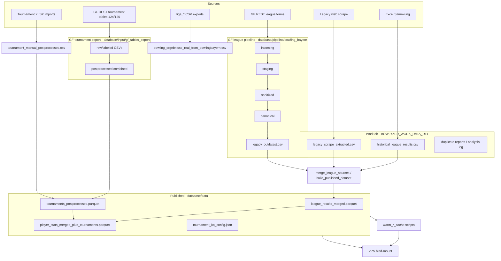

<!-- Generated by SpecStory, Markdown v2.1.0 -->

# 2026-06-08 19:38:54Z

<!-- Cursor IDE Session 283058e2-95f2-4195-973a-898a2100ce21 (2026-06-08 19:38:54Z) -->

_**User**_

Explore the bowlyzer_deploy repo at c:\Users\cfell\repositories\bowlyzer_deploy to document the CURRENT data pipeline architecture. Focus on:

1. All data sources (league, tournament, GF/google sheets, legacy bowling bayern, Excel, manual CSV, etc.) - where input files live, how they're identified
2. All processing scripts/pipelines - merge, build_published_dataset, extract, postprocess, normalization, cache warming
3. Resulting data artifacts (CSV, parquet, JSON configs) and their paths
4. Stage naming if any exists already (raw, merged, published, etc.)
5. database/paths.py, database/README.md, scripts/, pipeline/, deploy/

Return a structured summary with file paths and brief descriptions of each flow. Be thorough but concise. Note gaps/inconsistencies you see.

---

_**Agent (default)**_

I'll map the data pipeline by reading core path/config docs and scanning scripts, pipeline, and deploy directories.


_**Agent (default)**_

<tool-use data-tool-type="unknown" data-tool-name="update_current_step"><details>
<summary>Tool use: **update_current_step**</summary>
An unknown error occurred
</details></tool-use>

_**Agent (default)**_

<tool-use data-tool-type="read" data-tool-name="read_file_v2"><details>
<summary>Tool use: **read_file_v2** • Read file: c:\Users\cfell\repositories\bowlyzer_deploy\database\paths.py</summary>

</details></tool-use>

_**Agent (default)**_

<tool-use data-tool-type="read" data-tool-name="read_file_v2"><details>
<summary>Tool use: **read_file_v2** • Read file: c:\Users\cfell\repositories\bowlyzer_deploy\database\README.md</summary>

</details></tool-use>

_**Agent (default)**_

<tool-use data-tool-type="search" data-tool-name="glob_file_search"><details>
<summary>Tool use: **glob_file_search** • Searched codebase "" • **9** results in **1** directory</summary>

Directory: **`c:\Users\cfell\repositories\bowlyzer_deploy\pipeline`** (9 files)

| File |
|------|
| `../pipeline/sanitize.py` |
| `../pipeline/gf_client.py` |
| `../pipeline/staging.py` |
| `../pipeline/state_store.py` |
| `../pipeline/config.py` |
| `../pipeline/bowling_bayern_gf_forms.py` |
| `../pipeline/__init__.py` |
| `../pipeline/runner.py` |
| `../pipeline/paths.py` |
</details></tool-use>

_**Agent (default)**_

<tool-use data-tool-type="search" data-tool-name="glob_file_search"><details>
<summary>Tool use: **glob_file_search** • Searched codebase "" • **26** results in **1** directory</summary>

Directory: **`c:\Users\cfell\repositories\bowlyzer_deploy\scripts`** (26 files)

| File |
|------|
| `../scripts/export_gf_tables.py` |
| `../scripts/build_team_name_normalization.py` |
| `../scripts/scrape_legacy_liga.py` |
| `../scripts/install_clubmeisterschaft_auto_import.sh` |
| `../scripts/benchmark_tournament_section.py` |
| `../scripts/dump_staging_row.py` |
| `../scripts/reimport_bayerische_meisterschaft.ps1` |
| `../scripts/warm_essential_caches.py` |
| `../scripts/warm_league_cache.py` |
| `../scripts/merge_league_sources.py` |
| `../scripts/audit_player_id_names.py` |
| `../scripts/import_player_id_normalization_from_audit.py` |
| `../scripts/warm_league_cache_shard.py` |
| `../scripts/audit_female_league_split.py` |
| `../scripts/warm_tournament_cache.py` |
| `../scripts/clubmeisterschaft_auto_import.sh` |
| `../scripts/build_published_dataset.py` |
| `../scripts/analyze_missing_league_weeks.py` |
| `../scripts/migrate_work_data.ps1` |
| `../scripts/import_player_name_normalization_from_audit.py` |
| `../scripts/sweep_team_name_normalization.py` |
| `../scripts/transform_gf_tournament_to_canonical.py` |
| `../scripts/analyze_legacy_scrape_csv.py` |
| `../scripts/rebuild_league_caches.py` |
| `../scripts/bench_page_apis.py` |
| `../scripts/run_gf_pipeline.py` |
</details></tool-use>

_**Agent (default)**_

<tool-use data-tool-type="search" data-tool-name="glob_file_search"><details>
<summary>Tool use: **glob_file_search** • Searched codebase "" • **16** results in **1** directory</summary>

Directory: **`c:\Users\cfell\repositories\bowlyzer_deploy\deploy`** (16 files)

| File |
|------|
| `../deploy/install_clubmeisterschaft_auto_import.ps1` |
| `../deploy/vps/clubmeisterschaft-import.env.example` |
| `../deploy/deploy.config.example.ps1` |
| `../deploy/README.md` |
| `../deploy/push-vps-maintenance.ps1` |
| `../deploy/deploy.ps1` |
| `../deploy/vps/clubmeisterschaft-import.timer` |
| `../deploy/docker-compose.prod.yml` |
| `../deploy/stop-remote.ps1` |
| `../deploy/vps/setup-bowlyzer-user.sh` |
| `../deploy/vps/docker-disk-report.sh` |
| `../deploy/gunicorn.conf.py` |
| `../deploy/vps/clubmeisterschaft-import.service` |
| `../deploy/vps/cleanup-disk.sh` |
| `../deploy/deploy-data.ps1` |
| `../deploy/vps/nginx-season-query.md` |
</details></tool-use>

_**Agent (default)**_

<tool-use data-tool-type="read" data-tool-name="read_file_v2"><details>
<summary>Tool use: **read_file_v2** • Read file: c:\Users\cfell\repositories\bowlyzer_deploy\pipeline\paths.py</summary>

</details></tool-use>

_**Agent (default)**_

<tool-use data-tool-type="read" data-tool-name="read_file_v2"><details>
<summary>Tool use: **read_file_v2** • Read file: c:\Users\cfell\repositories\bowlyzer_deploy\pipeline\runner.py</summary>

</details></tool-use>

_**Agent (default)**_

<tool-use data-tool-type="read" data-tool-name="read_file_v2"><details>
<summary>Tool use: **read_file_v2** • Read file: c:\Users\cfell\repositories\bowlyzer_deploy\pipeline\staging.py</summary>

</details></tool-use>

_**Agent (default)**_

<tool-use data-tool-type="read" data-tool-name="read_file_v2"><details>
<summary>Tool use: **read_file_v2** • Read file: c:\Users\cfell\repositories\bowlyzer_deploy\pipeline\config.py</summary>

</details></tool-use>

_**Agent (default)**_

<tool-use data-tool-type="read" data-tool-name="read_file_v2"><details>
<summary>Tool use: **read_file_v2** • Read file: c:\Users\cfell\repositories\bowlyzer_deploy\scripts\build_published_dataset.py</summary>

</details></tool-use>

_**Agent (default)**_

<tool-use data-tool-type="search" data-tool-name="glob_file_search"><details>
<summary>Tool use: **glob_file_search** • Searched codebase "" • **94** results in **1** directory</summary>

Directory: **`c:\Users\cfell\repositories\bowlyzer_deploy\database`** (94 files)

| File |
|------|
| `../database/relational_csv/new/player_new.csv` |
| `../database/data/league_results_merged.parquet` |
| `../database/relational_csv/player.csv` |
| `../database/generator/teams.py` |
| `../database/input/gf_table_tournament_map.json` |
| `../database/relational_csv/new/team_new.csv` |
| `../database/schema.json` |
| `../database/input/postprocess_tournament_results.py` |
| `../database/data/league_results_merged.csv` |
| `../database/input/liga_bzol-n1_ergebnisse-2026-04-03.csv` |
| `../database/data/ko_bracket_overrides.example.json` |
| `../database/input/liga_ll-s-m_ergebnisse-2026-04-03.csv` |
| `../database/generator/player.py` |
| `../database/input/gf_tables_export/gf_table_125__nbm_nordbayerische_meisterschaft_2026.csv` |
| `../database/data/tournaments_postprocessed.parquet` |
| `../database/data/tournament_nordbayerische_2026_clean_via_script.csv` |
| `../database/conversion/bowlingbayern_legacy_core.py` |
| `../database/data/tournament_ko_config.json` |
| `../database/input/gf_tables_export/gf_table_125__nbm_nordbayerische_meisterschaft_2026__stage_meta.csv` |
| `../database/input/clubmeisterschaft_donaubowler/Clubpokal DB 2026.xlsx` |
| `../database/relational_csv/new/game_result_new.csv` |
| `../database/input/gf_tables_export/gf_tournaments_2026__combined_canonical_clean.csv` |
| `../database/relational_csv/scoring_system.csv` |
| `../database/relational_csv/new/unmatched_event_locations.csv` |
| `../database/pipeline/bowling_bayern/legacy_out/latest.csv` |
| `../database/input/liga_bayl-m_ergebnisse-2026-04-03.csv` |
| `../database/config/player_name_normalization.json` |
| `../database/input/gf_tables_export/gf_table_124__sbm_suedbayerische_meisterschaft_2026__postprocessed.csv` |
| `../database/data/README.md` |
| `../database/conversion/__init__.py` |
| `../database/input/generate_geek_tournament_data.py` |
| `../database/relational_csv/new/league_new.csv` |
| `../database/generator/league.py` |
| `../database/input/gf_tables_export/gf_player_stats__league_plus_tournaments.csv` |
| `../database/input/gf_tournament_stage_definitions.json` |
| `../database/input/gf_tables_export/gf_tournaments_2026__combined_postprocessed.csv` |
| `../database/config.py` |
| `../database/input/liga_bzol-n2_ergebnisse-2026-04-03.csv` |
| `../database/input/generate_tournament_clean_results.py` |
| `../database/relational_csv/league_mapping.csv` |
| `../database/data/tournament_sbm_2026_clean_from_gf.csv` |
| `../database/README.md` |
| `../database/paths.py` |
| `../database/input/gf_tables_export/gf_table_124__sbm_suedbayerische_meisterschaft_2026__column_rename_map.csv` |
| `../database/input/gf_tables_export/gf_table_124__sbm_suedbayerische_meisterschaft_2026.csv` |
| `../database/data/tournament_manual_postprocessed.csv` |
| `../database/sources/bowlingbayern_liga_csv.py` |
| `../database/config/team_name_normalization.json` |
| `../database/data/tournament_nordbayerische_2026_postprocessed_via_script.csv` |
| `../database/relational_csv/new/player_skipped_report.txt` |
| `../database/relational_csv/league_season.csv` |
| `../database/input/gf_tables_export/gf_table_125__nbm_nordbayerische_meisterschaft_2026__postprocessed.csv` |
| `../database/data/player_stats_merged_plus_tournaments.parquet` |
| `../database/input/convert_bowlingbayern_to_legacy.py` |
| `../database/data/tournament_combined_2024_2026_postprocessed.csv` |
| `../database/config/extract_excel_overrides.csv` |
| `../database/input/gf_tables_export/gf_table_125__nbm_nordbayerische_meisterschaft_2026__column_rename_map.csv` |
| `../database/sources/__init__.py` |
| `../database/input/gf_tables_export/gf_tournaments_2026__combined_stage_meta.csv` |
| `../database/input/import_bayerische_meisterschaft_xlsx.py` |
| `../database/pipeline/bowling_bayern/canonical/merged_gf_canonical.csv` |
| `../database/data/player_stats_merged_plus_tournaments.csv` |
| `../database/data/tournament_nordbayerische_2026_postprocessed.csv` |
| `../database/data/tournament_ko_config.example.json` |
| `../database/input/gf_tables_export/gf_table_124__sbm_suedbayerische_meisterschaft_2026__field_map.csv` |
| `../database/data/tournament_sbm_2026_stage_meta.csv` |
| `../database/data/tournaments_postprocessed.csv` |
| `../database/data/tournament_clubmeisterschaft_donaubowler_2026_postprocessed.csv` |
| `../database/input/liga_krl-n2_ergebnisse-2026-04-03.csv` |
| `../database/relational_csv/club.csv` |
| `../database/data/tournament_bayerische_meisterschaft_2026_postprocessed.csv` |
| `../database/input/INPUT_TO_LEGACY_CSV_MAPPING.md` |
| `../database/data/TEST_ERRORS_SUMMARY.md` |
| `../database/data/tournament_nordbayerische_2026_postprocessed_via_both_scripts.csv` |
| `../database/generator/seed.py` |
| `../database/input/liga_krl-s1_ergebnisse-2026-04-03.csv` |
| `../database/relational_csv/event.csv` |
| `../database/input/gf_tables_export/gf_table_124__sbm_suedbayerische_meisterschaft_2026__labeled.csv` |
| `../database/input/gf_tables_export/gf_table_125__nbm_nordbayerische_meisterschaft_2026__labeled.csv` |
| `../database/input/gf_tables_export/gf_table_125__nbm_nordbayerische_meisterschaft_2026__canonical_clean.csv` |
| `../database/config/player_id_name_normalization.json` |
| `../database/input/gf_tables_export/gf_table_125__nbm_nordbayerische_meisterschaft_2026__field_map.csv` |
| `../database/__init__.py` |
| `../database/relational_csv/README.md` |
| `../database/input/gf_tables_export/gf_table_124__sbm_suedbayerische_meisterschaft_2026__stage_meta.csv` |
| `../database/data/tournament_nordbayerische_2026_clean.csv` |
| `../database/input/liga_ll-s-f_ergebnisse-2026-04-03.csv` |
| `../database/relational_csv/team_season.csv` |
| `../database/sources/gf_form_registry.py` |
| `../database/config/team_number_overrides.csv` |
| `../database/input/gf_tables_export/gf_table_124__sbm_suedbayerische_meisterschaft_2026__canonical_clean.csv` |
| `../database/input/import_clubmeisterschaft_donaubowler_xlsx.py` |
| `../database/sources/gf_results_v1_adapter.py` |
| `../database/relational_csv/venue.csv` |
</details></tool-use>

_**Agent (default)**_

<tool-use data-tool-type="read" data-tool-name="read_file_v2"><details>
<summary>Tool use: **read_file_v2** • Read file: c:\Users\cfell\repositories\bowlyzer_deploy\database\data\README.md</summary>

</details></tool-use>

_**Agent (default)**_

<tool-use data-tool-type="read" data-tool-name="read_file_v2"><details>
<summary>Tool use: **read_file_v2** • Read file: c:\Users\cfell\repositories\bowlyzer_deploy\deploy\README.md</summary>

</details></tool-use>

_**Agent (default)**_

<tool-use data-tool-type="read" data-tool-name="read_file_v2"><details>
<summary>Tool use: **read_file_v2** • Read file: c:\Users\cfell\repositories\bowlyzer_deploy\deploy\deploy-data.ps1</summary>

</details></tool-use>

_**Agent (default)**_

<tool-use data-tool-type="read" data-tool-name="read_file_v2"><details>
<summary>Tool use: **read_file_v2** • Read file: c:\Users\cfell\repositories\bowlyzer_deploy\scripts\merge_league_sources.py</summary>

</details></tool-use>

_**Agent (default)**_

<tool-use data-tool-type="read" data-tool-name="read_file_v2"><details>
<summary>Tool use: **read_file_v2** • Read file: c:\Users\cfell\repositories\bowlyzer_deploy\scripts\run_gf_pipeline.py</summary>

</details></tool-use>

_**Agent (default)**_

<tool-use data-tool-type="read" data-tool-name="read_file_v2"><details>
<summary>Tool use: **read_file_v2** • Read file: c:\Users\cfell\repositories\bowlyzer_deploy\database\input\INPUT_TO_LEGACY_CSV_MAPPING.md</summary>

</details></tool-use>

_**Agent (default)**_

<tool-use data-tool-type="unknown" data-tool-name="ripgrep_raw_search"><details>
<summary>Tool use: **ripgrep_raw_search**</summary>

Parameters:

```json
{
  "caseInsensitive": false,
  "glob": "*.{py,md,json}",
  "pattern": "historical_league|extract_excel|bowling_ergebnisse"
}
```
Additional data:

```json
{
  "isPruned": true,
  "outputMode": "content",
  "pattern": "historical_league|extract_excel|bowling_ergebnisse",
  "topFiles": [
    {
      "matchCount": 1,
      "uri": "database/config.py"
    },
    {
      "matchCount": 31,
      "uri": "docs/Excel_Extraction.md"
    },
    {
      "matchCount": 3,
      "uri": "data_access/reconstruct_flat_csv.py"
    },
    {
      "matchCount": 1,
      "uri": "tests/test_old_format_date_season.py"
    },
    {
      "matchCount": 5,
      "uri": "database/paths.py"
    },
    {
      "matchCount": 2,
      "uri": "database/data/TEST_ERRORS_SUMMARY.md"
    },
    {
      "matchCount": 7,
      "uri": "app/config/database_config.py"
    },
    {
      "matchCount": 10,
      "uri": ".specstory/history/2026-05-19_07-58-26Z-exposing-web-service-on-local-network.md"
    }
  ],
  "totalFiles": 8,
  "totalMatches": 490
}
```
Status: **completed**

</details></tool-use>

_**Agent (default)**_

<tool-use data-tool-type="read" data-tool-name="read_file_v2"><details>
<summary>Tool use: **read_file_v2** • Read file: c:\Users\cfell\repositories\bowlyzer_deploy\scripts\export_gf_tables.py</summary>

</details></tool-use>

_**Agent (default)**_

<tool-use data-tool-type="read" data-tool-name="read_file_v2"><details>
<summary>Tool use: **read_file_v2** • Read file: c:\Users\cfell\repositories\bowlyzer_deploy\scripts\scrape_legacy_liga.py</summary>

</details></tool-use>

_**Agent (default)**_

<tool-use data-tool-type="read" data-tool-name="read_file_v2"><details>
<summary>Tool use: **read_file_v2** • Read file: c:\Users\cfell\repositories\bowlyzer_deploy\scripts\build_published_dataset.py</summary>

</details></tool-use>

_**Agent (default)**_

<tool-use data-tool-type="search" data-tool-name="glob_file_search"><details>
<summary>Tool use: **glob_file_search** • Searched codebase "" • **3** results in **1** directory</summary>

Directory: **``** (3 files)

| File |
|------|
| `tests/extract_excel_data/test_normalize_progress.py` |
| `database/config/extract_excel_overrides.csv` |
| `extract_excel_data.py` |
</details></tool-use>

_**Agent (default)**_

<tool-use data-tool-type="unknown" data-tool-name="ripgrep_raw_search"><details>
<summary>Tool use: **ripgrep_raw_search**</summary>

Parameters:

```json
{
  "caseInsensitive": false,
  "glob": "*.py",
  "pattern": "db_real|db_tournament|database.*source"
}
```
Additional data:

```json
{
  "isPruned": true,
  "outputMode": "content",
  "pattern": "db_real|db_tournament|database.*source",
  "topFiles": [
    {
      "matchCount": 3,
      "uri": "tests/app/test_tournament_database_source.py"
    },
    {
      "matchCount": 2,
      "uri": "data_access/adapters/data_adapter_pandas.py"
    },
    {
      "matchCount": 13,
      "uri": "app/routes/tournament_routes.py"
    },
    {
      "matchCount": 4,
      "uri": "scripts/warm_league_cache_shard.py"
    },
    {
      "matchCount": 1,
      "uri": "app/cache/league_data_revision.py"
    },
    {
      "matchCount": 12,
      "uri": "scripts/warm_league_cache.py"
    },
    {
      "matchCount": 2,
      "uri": "database/input/convert_bowlingbayern_to_legacy.py"
    },
    {
      "matchCount": 3,
      "uri": "app/cache/league_response_cache.py"
    }
  ],
  "totalFiles": 8,
  "totalMatches": 143
}
```
Status: **completed**

</details></tool-use>

_**Agent (default)**_

<think><details><summary>Thought Process</summary>
Next I will read docs/Excel_Extraction.md, app/config/database_config.py, database/input/postprocess_tournament_results.py, and the remaining export_gf_tables outputs.
</details></think>

_**Agent (default)**_

<tool-use data-tool-type="read" data-tool-name="read_file_v2"><details>
<summary>Tool use: **read_file_v2** • Read file: c:\Users\cfell\repositories\bowlyzer_deploy\docs\Excel_Extraction.md</summary>

</details></tool-use>

_**Agent (default)**_

<tool-use data-tool-type="read" data-tool-name="read_file_v2"><details>
<summary>Tool use: **read_file_v2** • Read file: c:\Users\cfell\repositories\bowlyzer_deploy\app\config\database_config.py</summary>

</details></tool-use>

_**Agent (default)**_

<tool-use data-tool-type="read" data-tool-name="read_file_v2"><details>
<summary>Tool use: **read_file_v2** • Read file: c:\Users\cfell\repositories\bowlyzer_deploy\database\config.py</summary>

</details></tool-use>

_**Agent (default)**_

<tool-use data-tool-type="read" data-tool-name="read_file_v2"><details>
<summary>Tool use: **read_file_v2** • Read file: c:\Users\cfell\repositories\bowlyzer_deploy\scripts\transform_gf_tournament_to_canonical.py</summary>

</details></tool-use>

_**Agent (default)**_

<tool-use data-tool-type="read" data-tool-name="read_file_v2"><details>
<summary>Tool use: **read_file_v2** • Read file: c:\Users\cfell\repositories\bowlyzer_deploy\database\input\postprocess_tournament_results.py</summary>

</details></tool-use>

_**Agent (default)**_

<tool-use data-tool-type="read" data-tool-name="read_file_v2"><details>
<summary>Tool use: **read_file_v2** • Read file: c:\Users\cfell\repositories\bowlyzer_deploy\scripts\rebuild_league_caches.py</summary>

</details></tool-use>

_**Agent (default)**_

<tool-use data-tool-type="read" data-tool-name="read_file_v2"><details>
<summary>Tool use: **read_file_v2** • Read file: c:\Users\cfell\repositories\bowlyzer_deploy\docs\Excel_Extraction.md</summary>

</details></tool-use>

_**Agent (default)**_

<tool-use data-tool-type="read" data-tool-name="read_file_v2"><details>
<summary>Tool use: **read_file_v2** • Read file: c:\Users\cfell\repositories\bowlyzer_deploy\scripts\export_gf_tables.py</summary>

</details></tool-use>

_**Agent (default)**_

<tool-use data-tool-type="read" data-tool-name="read_file_v2"><details>
<summary>Tool use: **read_file_v2** • Read file: c:\Users\cfell\repositories\bowlyzer_deploy\deploy\docker-compose.prod.yml</summary>

</details></tool-use>

_**Agent (default)**_

<tool-use data-tool-type="read" data-tool-name="read_file_v2"><details>
<summary>Tool use: **read_file_v2** • Read file: c:\Users\cfell\repositories\bowlyzer_deploy\pipeline\bowling_bayern_gf_forms.py</summary>

</details></tool-use>

_**Agent (default)**_

<tool-use data-tool-type="unknown" data-tool-name="ripgrep_raw_search"><details>
<summary>Tool use: **ripgrep_raw_search**</summary>

Parameters:

```json
{
  "caseInsensitive": false,
  "glob": "database/input/import*.py",
  "pattern": "def main|argparse|OUTPUT|output"
}
```
Additional data:

```json
{
  "isPruned": true,
  "outputMode": "content",
  "pattern": "def main|argparse|OUTPUT|output",
  "topFiles": [
    {
      "matchCount": 13,
      "uri": ".\\database\\input\\import_clubmeisterschaft_donaubowler_xlsx.py"
    },
    {
      "matchCount": 10,
      "uri": ".\\database\\input\\import_bayerische_meisterschaft_xlsx.py"
    }
  ],
  "totalFiles": 2,
  "totalMatches": 23
}
```
Status: **completed**

</details></tool-use>

_**Agent (default)**_

<tool-use data-tool-type="search" data-tool-name="glob_file_search"><details>
<summary>Tool use: **glob_file_search** • Searched codebase "" • **2** results in **1** directory</summary>

Directory: **``** (2 files)

| File |
|------|
| `.\database\pipeline\bowling_bayern\canonical\merged_gf_canonical.csv` |
| `.\database\pipeline\bowling_bayern\legacy_out\latest.csv` |
</details></tool-use>

_**Agent (default)**_

<tool-use data-tool-type="read" data-tool-name="read_file_v2"><details>
<summary>Tool use: **read_file_v2** • Read file: c:\Users\cfell\repositories\bowlyzer_deploy\app\config\database_config.py</summary>

</details></tool-use>

_**Agent (default)**_

<tool-use data-tool-type="read" data-tool-name="read_file_v2"><details>
<summary>Tool use: **read_file_v2** • Read file: c:\Users\cfell\repositories\bowlyzer_deploy\scripts\warm_essential_caches.py</summary>

</details></tool-use>

_**Agent (default)**_

<tool-use data-tool-type="read" data-tool-name="read_file_v2"><details>
<summary>Tool use: **read_file_v2** • Read file: c:\Users\cfell\repositories\bowlyzer_deploy\scripts\warm_tournament_cache.py</summary>

</details></tool-use>

_**Agent (default)**_

<tool-use data-tool-type="unknown" data-tool-name="ripgrep_raw_search"><details>
<summary>Tool use: **ripgrep_raw_search**</summary>

Parameters:

```json
{
  "caseInsensitive": false,
  "path": "c:\\Users\\cfell\\repositories\\bowlyzer_deploy\\deploy\\deploy.ps1",
  "pattern": "SyncDatabase|SyncCache|relational_csv|\\.parquet"
}
```
Additional data:

```json
{
  "isPruned": true,
  "outputMode": "content",
  "path": "c:\\Users\\cfell\\repositories\\bowlyzer_deploy\\deploy\\deploy.ps1",
  "pattern": "SyncDatabase|SyncCache|relational_csv|\\.parquet",
  "topFiles": [
    {
      "matchCount": 29,
      "uri": "deploy\\deploy.ps1"
    }
  ],
  "totalFiles": 1,
  "totalMatches": 29
}
```
Status: **completed**

</details></tool-use>

_**Agent (default)**_

<tool-use data-tool-type="search" data-tool-name="glob_file_search"><details>
<summary>Tool use: **glob_file_search** • Searched codebase "" • **4** results in **1** directory</summary>

Directory: **``** (4 files)

| File |
|------|
| `database/sources/gf_form_registry.py` |
| `database/sources/bowlingbayern_liga_csv.py` |
| `database/sources/gf_results_v1_adapter.py` |
| `database/sources/__init__.py` |
</details></tool-use>

_**Agent (default)**_

<tool-use data-tool-type="search" data-tool-name="glob_file_search"><details>
<summary>Tool use: **glob_file_search** • Searched codebase "" • **5** results in **1** directory</summary>

Directory: **``** (5 files)

| File |
|------|
| `database/config/extract_excel_overrides.csv` |
| `database/config/team_name_normalization.json` |
| `database/config/team_number_overrides.csv` |
| `database/config/player_name_normalization.json` |
| `database/config/player_id_name_normalization.json` |
</details></tool-use>

_**Agent (default)**_

<tool-use data-tool-type="read" data-tool-name="read_file_v2"><details>
<summary>Tool use: **read_file_v2** • Read file: c:\Users\cfell\repositories\bowlyzer_deploy\scripts\export_gf_tables.py</summary>

</details></tool-use>

_**Agent (default)**_

<tool-use data-tool-type="unknown" data-tool-name="ripgrep_raw_search"><details>
<summary>Tool use: **ripgrep_raw_search**</summary>

Parameters:

```json
{
  "caseInsensitive": false,
  "glob": "scripts/merge_league_sources.py",
  "pattern": "def merge_sources|publish_dataframe|work_dir|get_work"
}
```
Additional data:

```json
{
  "isPruned": true,
  "outputMode": "content",
  "pattern": "def merge_sources|publish_dataframe|work_dir|get_work",
  "topFiles": [
    {
      "matchCount": 3,
      "uri": "scripts/merge_league_sources.py"
    }
  ],
  "totalFiles": 1,
  "totalMatches": 3
}
```
Status: **completed**

</details></tool-use>

_**Agent (default)**_

<tool-use data-tool-type="read" data-tool-name="read_file_v2"><details>
<summary>Tool use: **read_file_v2** • Read file: c:\Users\cfell\repositories\bowlyzer_deploy\scripts\build_team_name_normalization.py</summary>

</details></tool-use>

_**Agent (default)**_

<tool-use data-tool-type="read" data-tool-name="read_file_v2"><details>
<summary>Tool use: **read_file_v2** • Read file: c:\Users\cfell\repositories\bowlyzer_deploy\scripts\audit_player_id_names.py</summary>

</details></tool-use>

_**Agent (default)**_

<tool-use data-tool-type="unknown" data-tool-name="ripgrep_raw_search"><details>
<summary>Tool use: **ripgrep_raw_search**</summary>

Parameters:

```json
{
  "caseInsensitive": false,
  "pattern": "tournament_ko_config|ko_bracket"
}
```
Additional data:

```json
{
  "isPruned": true,
  "outputMode": "content",
  "pattern": "tournament_ko_config|ko_bracket",
  "topFiles": [
    {
      "matchCount": 10,
      "uri": ".specstory/history/2026-05-19_07-58-26Z-exposing-web-service-on-local-network.md"
    },
    {
      "matchCount": 20,
      "uri": "app/services/tournament_service.py"
    }
  ],
  "totalFiles": 2,
  "totalMatches": 364
}
```
Status: **completed**

</details></tool-use>

_**Agent (default)**_

<tool-use data-tool-type="read" data-tool-name="read_file_v2"><details>
<summary>Tool use: **read_file_v2** • Read file: c:\Users\cfell\repositories\bowlyzer_deploy\database\input\gf_table_tournament_map.json</summary>

</details></tool-use>

_**Agent (default)**_

<tool-use data-tool-type="read" data-tool-name="read_file_v2"><details>
<summary>Tool use: **read_file_v2** • Read file: c:\Users\cfell\repositories\bowlyzer_deploy\scripts\merge_league_sources.py</summary>

</details></tool-use>

_**Agent (default)**_

<tool-use data-tool-type="unknown" data-tool-name="ripgrep_raw_search"><details>
<summary>Tool use: **ripgrep_raw_search**</summary>

Parameters:

```json
{
  "caseInsensitive": false,
  "glob": "app/config/database_config.py",
  "pattern": "db_tournament|db_sim|db_real"
}
```
Additional data:

```json
{
  "isPruned": true,
  "outputMode": "content",
  "pattern": "db_tournament|db_sim|db_real",
  "topFiles": [
    {
      "matchCount": 9,
      "uri": "app/config/database_config.py"
    }
  ],
  "totalFiles": 1,
  "totalMatches": 9
}
```
Status: **completed**

</details></tool-use>

_**Agent (default)**_

<tool-use data-tool-type="read" data-tool-name="read_file_v2"><details>
<summary>Tool use: **read_file_v2** • Read file: c:\Users\cfell\repositories\bowlyzer_deploy\data_access\parquet_sidecar.py</summary>

</details></tool-use>

_**Agent (default)**_

<tool-use data-tool-type="read" data-tool-name="read_file_v2"><details>
<summary>Tool use: **read_file_v2** • Read file: c:\Users\cfell\repositories\bowlyzer_deploy\scripts\migrate_work_data.ps1</summary>

</details></tool-use>

_**Agent (default)**_

<think><details><summary>Thought Process</summary>
The full architecture picture is now clear. I am doing a final sweep of database/conversion, database/generator, and the clubmeisterschaft manual tournament merge flow to ensure completeness.
</details></think>

_**Agent (default)**_

<tool-use data-tool-type="read" data-tool-name="read_file_v2"><details>
<summary>Tool use: **read_file_v2** • Read file: c:\Users\cfell\repositories\bowlyzer_deploy\database\input\convert_bowlingbayern_to_legacy.py</summary>

</details></tool-use>

_**Agent (default)**_

<tool-use data-tool-type="unknown" data-tool-name="ripgrep_raw_search"><details>
<summary>Tool use: **ripgrep_raw_search**</summary>

Parameters:

```json
{
  "caseInsensitive": false,
  "glob": "database/input/import_clubmeisterschaft*.py",
  "pattern": "tournament_manual|manual_postprocessed"
}
```
Additional data:

```json
{
  "isPruned": true,
  "outputMode": "content",
  "pattern": "tournament_manual|manual_postprocessed",
  "topFiles": [
    {
      "matchCount": 5,
      "uri": "database/input/import_clubmeisterschaft_donaubowler_xlsx.py"
    }
  ],
  "totalFiles": 1,
  "totalMatches": 5
}
```
Status: **completed**

</details></tool-use>

_**Agent (default)**_

<tool-use data-tool-type="read" data-tool-name="read_file_v2"><details>
<summary>Tool use: **read_file_v2** • Read file: c:\Users\cfell\repositories\bowlyzer_deploy\database\generator\seed.py</summary>

</details></tool-use>

_**Agent (default)**_

<tool-use data-tool-type="read" data-tool-name="read_file_v2"><details>
<summary>Tool use: **read_file_v2** • Read file: c:\Users\cfell\repositories\bowlyzer_deploy\database\sources\bowlingbayern_liga_csv.py</summary>

</details></tool-use>

_**Agent (default)**_

<tool-use data-tool-type="unknown" data-tool-name="update_current_step"><details>
<summary>Tool use: **update_current_step**</summary>
An unknown error occurred
</details></tool-use>

_**Agent (default)**_

# Bowl-A-Lyzer Data Pipeline Architecture (Current State)

## Path model (foundation)

Two env vars split **published/runtime** from **build intermediates** (`c:\Users\cfell\repositories\bowlyzer_deploy\database\paths.py`):

| Role | Default (Windows) | Default (Linux) | Override |
|------|-------------------|-----------------|----------|
| **Published / app runtime** | `database/data/` | same | `BOWLYZER_DATA_DIR` |
| **Work / pipeline intermediates** | `C:\tmp\bowlyzer\data` | `database/data/` | `BOWLYZER_WORK_DATA_DIR` |

Resolution helpers: `get_data_dir()`, `get_work_data_dir()`, `work_or_published_file()`, `_resolve_work_first()` (work dir first, repo fallback with stderr note).

**VPS** (`database/README.md`, `deploy/docker-compose.prod.yml`): only three host bind-mounts — `database/data/`, `database/relational_csv/`, `database/config/`. Pipeline code and GF dev trees stay in the Docker image.

---

## Stage naming (existing vocabulary)

The repo uses several overlapping stage names:

| Stage family | Location / meaning |
|--------------|-------------------|
| **Raw / incoming** | GF REST JSON pages → `database/pipeline/bowling_bayern/incoming/` |
| **Staging** | Flat GF entry rows → `…/staging/` |
| **Sanitized** | Cleaned staging → `…/sanitized/` |
| **Canonical** | Unified GF schema → `…/canonical/` (`merged_gf_canonical.csv`) |
| **Legacy out** | Legacy flat league CSV → `…/legacy_out/latest.csv` |
| **Historical extract** | Excel → `historical_league_results.csv` (work dir) |
| **Legacy scrape** | Downloaded `.xls` tree + `legacy_scrape_extracted.csv` (work dir) |
| **Merged** | Multi-source league dedupe → `league_results_merged.*` (published) |
| **Postprocessed** | Tournament aggregation (cuts, ranks) → `*_postprocessed.csv` |
| **Published** | Parquet-first artifacts in `database/data/` consumed by app |

GF pipeline stage dirs are defined in `pipeline/paths.py` → `database/pipeline/bowling_bayern/{incoming,staging,sanitized,canonical,legacy_out,state,logs,failed}`.

---

## 1. Data sources

### A. Historical Liga Excel (local archive)

| Item | Detail |
|------|--------|
| **Input location** | External tree, conventionally `C:\tmp\Sammlung-Ligaergebnisse\` (not in repo) |
| **Identification** | `.xls` / `.xlsx` workbooks; sheets `Erfassung*`, `Schiedsrichterinfos`, week sheets |
| **Tool** | `extract_excel_data.py` (repo root) |
| **Config** | `database/config/extract_excel_overrides.csv`, `team_name_normalization.json`, `team_number_overrides.csv`, `relational_csv/league_mapping.csv` |
| **Outputs (work dir)** | `historical_league_results.csv`, `historical_league_results_combos/`, `extract_excel_analysis_log.json` |
| **Modes** | `analyze`, `process`, `normalize_data`, `convert_legacy_xls` |

Doc hub: `docs/Excel_Extraction.md`.

### B. Legacy web scrape (Bowling Bayern `.xls`)

| Item | Detail |
|------|--------|
| **Source** | HTTP from `sektion-bowling.bowling-bayern.de` |
| **Tool** | `scripts/scrape_legacy_liga.py` → downloads `LB_*.xls` |
| **Storage** | `legacy_scrape/` under work dir (`database/paths.py:legacy_scrape_dir()`) |
| **Follow-up** | `extract_excel_data.py --mode process` on scrape folder → `legacy_scrape_extracted.csv` |
| **Quality** | `scripts/analyze_legacy_scrape_csv.py` (LOW_WEEKS / LOW_TEAMS / HIGH_TEAMS) |

Multiple candidate paths for extracted CSV; prefers copy with richest female-league coverage (`BayL (D)` rows).

### C. Gravity Forms — league results (live API)

| Item | Detail |
|------|--------|
| **Source** | WordPress GF REST API (`bowlingbayern.de`) |
| **Credentials** | `GF_SITE_BASE_URL`, `GF_CONSUMER_KEY`, `GF_CONSUMER_SECRET`, optional `GF_FORMS` |
| **Default form IDs** | 21, 92, 95, 100, 102, 105, 113, 115, 117 (`pipeline/bowling_bayern_gf_forms.py`) |
| **Entry script** | `scripts/run_gf_pipeline.py` → `pipeline/runner.py:run_ingest()` |
| **Pipeline flow** | incoming JSON → staging CSV → sanitized CSV → canonical merge → `legacy_out/latest.csv` |
| **Published merge input** | `database/pipeline/bowling_bayern/legacy_out/latest.csv` (`pipeline_gf_league_csv()`) |

### D. Gravity Forms — tournament tables (API export, dev path)

| Item | Detail |
|------|--------|
| **Source** | GF tables/forms 124 (SBM), 125 (NBM) by default |
| **Tool** | `scripts/export_gf_tables.py` |
| **Config** | `database/input/gf_tournament_stage_definitions.json`, `database/input/gf_table_tournament_map.json` |
| **Output dir** | `database/input/gf_tables_export/` (image-only on VPS; not synced) |
| **Per-table artifacts** | `gf_table_{id}__{label}.csv`, `__labeled.csv`, `__field_map.csv`, `__column_rename_map.csv`, `__canonical_clean.csv`, `__stage_meta.csv`, `__postprocessed.csv` |
| **Combined** | `gf_tournaments_2026__combined_{canonical_clean,stage_meta,postprocessed}.csv` |
| **Player sidecar** | `gf_player_stats__league_plus_tournaments.csv` (league `latest.csv` + tournament rows) |

Transform helper: `scripts/transform_gf_tournament_to_canonical.py`; postprocess: `database/input/postprocess_tournament_results.py`.

### E. Bowling Bayern CSV file exports (static, repo)

| Item | Detail |
|------|--------|
| **Input** | `database/input/liga_*_ergebnisse-*.csv` (glob in `bowlingbayern_liga_csv.py`) |
| **Tool** | `database/input/convert_bowlingbayern_to_legacy.py` |
| **Output** | `database/data/bowling_ergebnisse_real_from_bowlingbayern.csv` |
| **App source** | `db_real` → `bowling_ergebnisse_real.csv` (legacy 2024/25 snapshot; optional) |

### F. Tournament Excel (manual club/regional imports)

| Import | Input dir | Output |
|--------|-----------|--------|
| **Bayerische Meisterschaft** | `database/input/bayerische_meisterschaft_xlsx/` | `database/data/tournament_bayerische_meisterschaft_2026_postprocessed.csv` |
| **Clubmeisterschaft Donaubowler** | `database/input/clubmeisterschaft_donaubowler/*.xlsx` | per-event CSV + merge into `database/data/tournament_manual_postprocessed.csv` |

Scripts: `database/input/import_bayerische_meisterschaft_xlsx.py`, `import_clubmeisterschaft_donaubowler_xlsx.py`. VPS auto-import: `scripts/clubmeisterschaft_auto_import.sh` + `deploy/vps/clubmeisterschaft-import.*`.

### G. Synthetic / test data

| Tool | Output |
|------|--------|
| `database/input/generate_tournament_clean_results.py` | ad-hoc clean tournament CSVs |
| `database/input/generate_geek_tournament_data.py` | fantasy tournament CSVs under `database/data/` |
| `database/generator/` | simulated league data (legacy) |

### H. Reference / normalization configs (not row data)

| Path | Purpose |
|------|---------|
| `database/relational_csv/` | Dimension tables: `club.csv`, `league_mapping.csv`, `league_season.csv`, etc. |
| `database/config/team_name_normalization.json` | Regex team-name cleanup (merge + extract) |
| `database/config/player_name_normalization.json` | Player name remapping (new) |
| `database/config/player_id_name_normalization.json` | Player ID remapping (new) |

---

## 2. Processing scripts / pipelines

### Core publish path (production)

```
[historical CSV] ──┐
[legacy scrape]  ──┼── merge_league_sources.py ──► league_results_merged.parquet
[extra league]   ──┤         (via build_published_dataset.py)
[GF latest.csv]  ──┘

[GF combined postprocessed] ──┐
[manual postprocessed]      ──┼── build_published_dataset.py ──► tournaments_postprocessed.parquet
                              │
                              └── (optional) player_stats_merged_plus_tournaments.parquet
```

**`scripts/build_published_dataset.py`** — orchestrator:
- League priority (low→high): historical → optional legacy scrape → `--extra-league` → GF pipeline
- Tournaments: concat GF combined + manual
- Default: Parquet only; `--write-csv` for debug
- Audits: female league split, player ID/name conflicts → work dir reports

**`scripts/merge_league_sources.py`** — dedupe merge:
- Keys: league, season, week, round number, match number, team, position, player
- Applies team + player normalization from config JSON
- Duplicate reports → work dir: `{stem}_duplicates.csv`, `{stem}_duplicates_non_exact.csv`
- Writes Parquet via `data_access/parquet_sidecar.publish_dataframe()`

### GF league ingest

**`scripts/run_gf_pipeline.py`** → **`pipeline/runner.py`**
- Incremental (default) or full sync
- State in `database/pipeline/bowling_bayern/state/`
- Run logs in `…/logs/run_{run_id}.json`

### GF tournament export (separate from league pipeline)

**`scripts/export_gf_tables.py`** — one-shot API pull + canonical/postprocess chain into `gf_tables_export/`.

### Excel / scrape chain

1. `scrape_legacy_liga.py` (optional)
2. `extract_excel_data.py` (analyze / process / convert)
3. `scripts/analyze_missing_league_weeks.py` (from analysis log)
4. `scripts/analyze_legacy_scrape_csv.py`

### Normalization maintenance (offline)

| Script | Role |
|--------|------|
| `scripts/build_team_name_normalization.py` | Build `team_name_normalization.json` from annotated clusters |
| `scripts/sweep_team_name_normalization.py` | Sweep/validate team rules |
| `scripts/audit_player_id_names.py` | Report ID/name conflicts |
| `scripts/import_player_id_normalization_from_audit.py` | Import ID rules from audit CSV |
| `scripts/import_player_name_normalization_from_audit.py` | Import name rules from audit CSV |
| `scripts/audit_female_league_split.py` | Detect collapsed Damen leagues |

### Validation

| Script | Role |
|--------|------|
| `data_access/validate_data.py` | Structural validation vs relational CSVs |
| `data_access/check_input_data_issues.py` | Ad-hoc team-total / opponent checks |

### Cache warming (post-publish, pre-deploy)

| Script | Targets |
|--------|---------|
| `scripts/warm_league_cache.py` | League API JSON → `.cache/league/` |
| `scripts/warm_league_cache_shard.py` | Multi-process variant |
| `scripts/rebuild_league_caches.py` | Full rebuild; `--all-published` adds player + tournament |
| `scripts/warm_tournament_cache.py` | `db_tournament_regions_2026_gf` |
| `scripts/warm_essential_caches.py` | Standings + player search subset |

Cache layout: `.cache/league/` (shipped ro) + `.cache/league-runtime/` (VPS rw overlay).

### Work-dir migration

**`scripts/migrate_work_data.ps1`** — moves legacy scrape, analysis log, historical CSV, duplicate reports, old `bowling_ergebnisse*.csv` from `database/data/` → work dir.

---

## 3. Resulting artifacts

### Published (`database/data/` — synced to VPS)

| File | Required? | Used by |
|------|-----------|---------|
| `league_results_merged.parquet` | **Yes** | `db_real_merged` (default Liga) |
| `tournaments_postprocessed.parquet` | Recommended | `db_tournament_regions_2026_gf` |
| `tournament_manual_postprocessed.csv` | If club imports | Merged into tournaments + hybrid |
| `player_stats_merged_plus_tournaments.parquet` | For Spieler | `db_player_merged_hybrid` |
| `tournament_ko_config.json` | KO tournaments | Bracket UI |
| `ko_bracket_overrides.json` | Optional | Manual bracket tweaks |

Logical names stay `*.csv`; runtime prefers `*.parquet` (`data_access/parquet_sidecar.py`).

### Work dir intermediates (build machine only)

- `historical_league_results.csv`, `historical_league_results_combos/`
- `extract_excel_analysis_log.json`
- `legacy_scrape/` + `legacy_scrape_extracted.csv`
- `league_results_merged_duplicates*.csv`
- `player_id_name_conflicts.csv`
- `unique_team_names_after_merge.csv`
- Missing-week matrices from `analyze_missing_league_weeks.py`

### GF pipeline tree (`database/pipeline/bowling_bayern/`)

- Per-run: `incoming/`, `staging/`, `sanitized/`, `logs/`
- Accumulated: `canonical/merged_gf_canonical.csv`, `legacy_out/latest.csv`, `state/`

### GF tournament dev tree (`database/input/gf_tables_export/`)

Full export artifact set; **`gf_tournaments_2026__combined_postprocessed.csv`** is the input to `build_published_dataset.py`.

### Config synced to VPS

- `database/config/*.json`, `extract_excel_overrides.csv`
- `database/relational_csv/*.csv`

---

## 4. App data source registry

Defined in `app/config/database_config.py`:

| Source ID | File path | Default? | UI visible? |
|-----------|-----------|----------|-------------|
| `db_real_merged` | `database/data/league_results_merged.*` | **Yes** | Yes (only selector entry) |
| `db_real` | `bowling_ergebnisse_real.csv` | No | No |
| `db_real_pipeline_gf` | `pipeline/…/legacy_out/latest.csv` | No | No |
| `db_real_historical_league` | work-resolved `historical_league_results.csv` | No | No |
| `db_tournament_regions_2026_gf` | `tournaments_postprocessed.*` | No | Tournament pages |
| `db_tournament_sbm_2026_gf` / `nbm` | per-table canonical in `gf_tables_export/` | Disabled | No |
| `db_player_merged_hybrid` | `player_stats_merged_plus_tournaments.*` | No | Spieler |
| `db_player_combined_gf` | `gf_player_stats__league_plus_tournaments.csv` | No | No |

Production compose sets `BOWLYZER_SKIP_HYBRID_BUILD=1`; hybrid must be built offline.

---

## 5. Deploy flow (`deploy/`)

| Script | Role |
|--------|------|
| `deploy.ps1` | Build image locally → `docker save` → scp → VPS load + compose up |
| `deploy-data.ps1` | Thin wrapper: data-only restart (no image) |
| `docker-compose.prod.yml` | Binds `data/`, `relational_csv/`, `config/`, cache dirs |

**`-SyncDatabase`**: uploads `relational_csv/`, `config/`, `database/data/*.parquet`, `*.json`, and `tournament_manual_postprocessed.csv`.  
**`-SyncDatabaseCsv`**: also large `*.csv`.  
**`-SyncCache`**: packs `.cache/league/` → VPS.

Typical release:
1. `build_published_dataset.py [--with-legacy-scrape] [--with-player-hybrid]`
2. `rebuild_league_caches.py --all-published`
3. `deploy.ps1 -SyncDatabase -SyncCache` or `deploy-data.ps1 -SyncDatabase -SyncCache`

---

## End-to-end flow diagram



---

## Gaps and inconsistencies

1. **Two path modules**: `database/paths.py` (app + publish) vs `pipeline/paths.py` (GF stage dirs only). Easy to confuse.

2. **Legacy `database/config.py`**: still points at `database/data/bowling_ergebnisse.csv`; superseded by `database/paths.py` for real pipeline work.

3. **Split GF paths**: League live ingest (`run_gf_pipeline.py`) and tournament export (`export_gf_tables.py`) are independent; tournament dev artifacts live under `database/input/`, not the league pipeline tree.

4. **Hybrid build at app startup** (`database_config._build_player_merged_hybrid_csv`): reads tournaments from `gf_tables_export/` combined CSV + manual CSV, **not** from published `tournaments_postprocessed.*`. Production disables this (`BOWLYZER_SKIP_HYBRID_BUILD=1`), but dev without that flag can diverge from `build_published_dataset.py`.

5. **Disabled per-tournament sources** (`db_tournament_sbm_2026_gf`, `db_tournament_nbm_2026_gf`) still point at dev `gf_tables_export/` canonical files; production uses merged `db_tournament_regions_2026_gf` only.

6. **Doc drift**: `INPUT_TO_LEGACY_CSV_MAPPING.md` references `league_analyzer_v1/` paths; `scrape_legacy_liga.py` doc mentions `database/input/legacy_scrape/` but code uses `legacy_scrape_dir()` (work dir first).

7. **Parquet vs CSV naming**: Config and paths always use `.csv` stems; Parquet is a sidecar. Tools/docs sometimes say “CSV” when they mean logical dataset.

8. **mem_limit mismatch**: `deploy/README.md` mentions 650m; `docker-compose.prod.yml` currently sets `mem_limit: 3000m`.

9. **Player normalization** (new, largely untracked in git): wired into `merge_league_sources.py` and `build_published_dataset.py` hybrid step; audit/import scripts exist but are not yet part of the documented publish checklist in `database/data/README.md`.

10. **Repo clutter**: Many test/ad-hoc tournament CSVs and audit reports (`report_names*.csv`, etc.) sit in repo root or `database/data/` alongside published artifacts — not part of the formal pipeline but can confuse “what ships to VPS.”

11. **Selector UX**: Only `db_real_merged` appears in the UI source selector (`get_sources_info`), though backend still registers multiple sources for routes/tests.

---

## Quick reference: key file paths

| Path | Description |
|------|-------------|
| `c:\Users\cfell\repositories\bowlyzer_deploy\database\paths.py` | Canonical path resolution for app + scripts |
| `c:\Users\cfell\repositories\bowlyzer_deploy\database\README.md` | VPS vs build machine layout |
| `c:\Users\cfell\repositories\bowlyzer_deploy\database\data\README.md` | Publish + cache + deploy commands |
| `c:\Users\cfell\repositories\bowlyzer_deploy\docs\Excel_Extraction.md` | Full Excel/scrape/tournament CLI reference |
| `c:\Users\cfell\repositories\bowlyzer_deploy\pipeline\` | GF REST ingest package |
| `c:\Users\cfell\repositories\bowlyzer_deploy\scripts\build_published_dataset.py` | Main publish orchestrator |
| `c:\Users\cfell\repositories\bowlyzer_deploy\deploy\` | Image + data + cache deploy to VPS |
