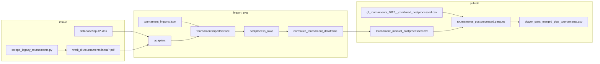

<!-- Generated by SpecStory, Markdown v2.1.0 -->

# 2026-07-07 07:48:20Z

<!-- Cursor IDE Session 95810940-e5ef-45e7-90eb-ad75ab929ddc (2026-07-07 07:48:20Z) -->

_**User**_

Explore the bowlyzer_deploy repo at c:\Users\cfell\repositories\bowlyzer_deploy to understand the tournament import pipeline architecture. Find:

1. The tournament_import package structure (schema, io, postprocess, config, registry, service, adapters)
2. tournament_imports.json config and what tournaments are already configured
3. Existing adapters (bm_xlsx, club_xlsx, legacy_pdf_erg_2016, etc.) - how they work
4. scripts/import_tournaments.py CLI
5. What input files exist under database/input/ for tournaments (especially older/different formats)
6. Any planning docs about tournament import batches
7. Output shape/schema that adapters must produce
8. Tests for tournament import

Return a detailed summary with file paths, what's already implemented, what input files exist for unimported tournaments, and recommendations for the "next batch" based on available files and conversation context about legacy PDF/scrape formats.

---

_**Agent (default)**_

<think><details><summary>Thought Process</summary>
Beginning a comprehensive review of the tournament import pipeline architecture in the bowlyzer_deploy repository.
</details></think>

_**Agent (default)**_

Exploring the tournament import pipeline across the repo structure, config, adapters, and docs.


_**Agent (default)**_

<tool-use data-tool-type="unknown" data-tool-name="update_current_step"><details>
<summary>Tool use: **update_current_step**</summary>
An unknown error occurred
</details></tool-use>

_**Agent (default)**_

<tool-use data-tool-type="search" data-tool-name="glob_file_search"><details>
<summary>Tool use: **glob_file_search** • Searched codebase "" • **14** results in **1** directory</summary>

Directory: **`c:\Users\cfell\repositories\bowlyzer_deploy`** (14 files)

| File |
|------|
| `../database/tournament_import/legacy_pdf_targets.py` |
| `../database/tournament_import/adapters/bm_xlsx_optionen.py` |
| `../database/tournament_import/adapters/base.py` |
| `../database/tournament_import/postprocess.py` |
| `../database/tournament_import/publish.py` |
| `../database/tournament_import/adapters/club_donaubowler_xlsx.py` |
| `../database/tournament_import/schema.py` |
| `../database/tournament_import/service.py` |
| `../database/tournament_import/io.py` |
| `../database/tournament_import/registry.py` |
| `../database/tournament_import/config.py` |
| `../database/tournament_import/__init__.py` |
| `../database/tournament_import/adapters/legacy_pdf_erg_2016.py` |
| `../database/tournament_import/adapters/__init__.py` |
</details></tool-use>

_**Agent (default)**_

<tool-use data-tool-type="search" data-tool-name="glob_file_search"><details>
<summary>Tool use: **glob_file_search** • Searched codebase "" • **1** result in **1** directory</summary>

Directory: **`c:\Users\cfell\repositories\bowlyzer_deploy`** (1 file)

| File |
|------|
| `../scripts/import_tournaments.py` |
</details></tool-use>

_**Agent (default)**_

<tool-use data-tool-type="search" data-tool-name="glob_file_search"><details>
<summary>Tool use: **glob_file_search** • Searched codebase "" • **1** result in **1** directory</summary>

Directory: **`c:\Users\cfell\repositories\bowlyzer_deploy`** (1 file)

| File |
|------|
| `../database/config/tournament_imports.json` |
</details></tool-use>

_**Agent (default)**_

<tool-use data-tool-type="search" data-tool-name="glob_file_search"><details>
<summary>Tool use: **glob_file_search** • Searched codebase "" • **35** results in **1** directory</summary>

Directory: **`c:\Users\cfell\repositories\bowlyzer_deploy`** (35 files)

| File |
|------|
| `../database/input/gf_table_tournament_map.json` |
| `../database/input/liga_bzol-n1_ergebnisse-2026-04-03.csv` |
| `../database/input/gf_tables_export/gf_tournaments_2026__combined_postprocessed.csv` |
| `../database/input/liga_krl-n2_ergebnisse-2026-04-03.csv` |
| `../database/input/gf_tables_export/gf_table_124__sbm_suedbayerische_meisterschaft_2026__stage_meta.csv` |
| `../database/input/gf_tables_export/gf_table_124__sbm_suedbayerische_meisterschaft_2026__canonical_clean.csv` |
| `../database/input/postprocess_tournament_results.py` |
| `../database/input/INPUT_TO_LEGACY_CSV_MAPPING.md` |
| `../database/input/gf_tables_export/gf_table_125__nbm_nordbayerische_meisterschaft_2026__field_map.csv` |
| `../database/input/gf_tables_export/gf_table_124__sbm_suedbayerische_meisterschaft_2026__column_rename_map.csv` |
| `../database/input/gf_tables_export/gf_player_stats__league_plus_tournaments.csv` |
| `../database/input/generate_geek_tournament_data.py` |
| `../database/input/gf_tournament_stage_definitions.json` |
| `../database/input/liga_bzol-n2_ergebnisse-2026-04-03.csv` |
| `../database/input/gf_tables_export/gf_table_125__nbm_nordbayerische_meisterschaft_2026.csv` |
| `../database/input/clubmeisterschaft_donaubowler/Clubpokal DB 2026.xlsx` |
| `../database/input/gf_tables_export/gf_table_124__sbm_suedbayerische_meisterschaft_2026__field_map.csv` |
| `../database/input/gf_tables_export/gf_table_124__sbm_suedbayerische_meisterschaft_2026__labeled.csv` |
| `../database/input/gf_tables_export/gf_table_125__nbm_nordbayerische_meisterschaft_2026__canonical_clean.csv` |
| `../database/input/gf_tables_export/gf_tournaments_2026__combined_stage_meta.csv` |
| `../database/input/gf_tables_export/gf_table_124__sbm_suedbayerische_meisterschaft_2026.csv` |
| `../database/input/liga_bayl-m_ergebnisse-2026-04-03.csv` |
| `../database/input/gf_tables_export/gf_table_125__nbm_nordbayerische_meisterschaft_2026__postprocessed.csv` |
| `../database/input/gf_tables_export/gf_table_125__nbm_nordbayerische_meisterschaft_2026__column_rename_map.csv` |
| `../database/input/gf_tables_export/gf_table_125__nbm_nordbayerische_meisterschaft_2026__labeled.csv` |
| `../database/input/liga_krl-s1_ergebnisse-2026-04-03.csv` |
| `../database/input/import_clubmeisterschaft_donaubowler_xlsx.py` |
| `../database/input/gf_tables_export/gf_table_125__nbm_nordbayerische_meisterschaft_2026__stage_meta.csv` |
| `../database/input/gf_tables_export/gf_table_124__sbm_suedbayerische_meisterschaft_2026__postprocessed.csv` |
| `../database/input/liga_ll-s-f_ergebnisse-2026-04-03.csv` |
| `../database/input/gf_tables_export/gf_tournaments_2026__combined_canonical_clean.csv` |
| `../database/input/generate_tournament_clean_results.py` |
| `../database/input/import_bayerische_meisterschaft_xlsx.py` |
| `../database/input/liga_ll-s-m_ergebnisse-2026-04-03.csv` |
| `../database/input/convert_bowlingbayern_to_legacy.py` |
</details></tool-use>

_**Agent (default)**_

<tool-use data-tool-type="unknown" data-tool-name="ripgrep_raw_search"><details>
<summary>Tool use: **ripgrep_raw_search**</summary>

Parameters:

```json
{
  "caseInsensitive": false,
  "glob": "**/tests/**",
  "outputMode": "files_with_matches",
  "pattern": "tournament.?import|tournament_import"
}
```
Additional data:

```json
{
  "isPruned": true,
  "outputMode": "files_with_matches",
  "pattern": "tournament.?import|tournament_import",
  "topFiles": [
    {
      "matchCount": 1,
      "uri": "tests/app/test_player_data_cache.py"
    },
    {
      "matchCount": 1,
      "uri": "tests/database/test_legacy_pdf_targets.py"
    },
    {
      "matchCount": 1,
      "uri": "tests/database/test_legacy_pdf_erg_2016.py"
    },
    {
      "matchCount": 1,
      "uri": "tests/database/test_tournament_import_service.py"
    }
  ],
  "totalFiles": 4,
  "totalMatches": 4
}
```
Status: **completed**

</details></tool-use>

_**Agent (default)**_

<tool-use data-tool-type="unknown" data-tool-name="ripgrep_raw_search"><details>
<summary>Tool use: **ripgrep_raw_search**</summary>

Parameters:

```json
{
  "caseInsensitive": true,
  "glob": "**/docs/**",
  "outputMode": "files_with_matches",
  "pattern": "tournament import|tournament_import"
}
```
Additional data:

```json
{
  "isPruned": true,
  "outputMode": "files_with_matches",
  "pattern": "tournament import|tournament_import",
  "topFiles": [
    {
      "matchCount": 1,
      "uri": "docs\\planning\\BACKEND_REWRITE_RUST.md"
    },
    {
      "matchCount": 1,
      "uri": "docs/planning/BACKEND_REWRITE_RUST.md"
    }
  ],
  "totalFiles": 2,
  "totalMatches": 2
}
```
Status: **completed**

</details></tool-use>

_**Agent (default)**_

<tool-use data-tool-type="read" data-tool-name="read_file_v2"><details>
<summary>Tool use: **read_file_v2** • Read file: c:\Users\cfell\repositories\bowlyzer_deploy\database\config\tournament_imports.json</summary>

</details></tool-use>

_**Agent (default)**_

<tool-use data-tool-type="read" data-tool-name="read_file_v2"><details>
<summary>Tool use: **read_file_v2** • Read file: c:\Users\cfell\repositories\bowlyzer_deploy\database\tournament_import\schema.py</summary>

</details></tool-use>

_**Agent (default)**_

<tool-use data-tool-type="read" data-tool-name="read_file_v2"><details>
<summary>Tool use: **read_file_v2** • Read file: c:\Users\cfell\repositories\bowlyzer_deploy\database\tournament_import\config.py</summary>

</details></tool-use>

_**Agent (default)**_

<tool-use data-tool-type="read" data-tool-name="read_file_v2"><details>
<summary>Tool use: **read_file_v2** • Read file: c:\Users\cfell\repositories\bowlyzer_deploy\database\tournament_import\registry.py</summary>

</details></tool-use>

_**Agent (default)**_

<tool-use data-tool-type="read" data-tool-name="read_file_v2"><details>
<summary>Tool use: **read_file_v2** • Read file: c:\Users\cfell\repositories\bowlyzer_deploy\database\tournament_import\service.py</summary>

</details></tool-use>

_**Agent (default)**_

<tool-use data-tool-type="read" data-tool-name="read_file_v2"><details>
<summary>Tool use: **read_file_v2** • Read file: c:\Users\cfell\repositories\bowlyzer_deploy\scripts\import_tournaments.py</summary>

</details></tool-use>

_**Agent (default)**_

<tool-use data-tool-type="read" data-tool-name="read_file_v2"><details>
<summary>Tool use: **read_file_v2** • Read file: c:\Users\cfell\repositories\bowlyzer_deploy\database\input\INPUT_TO_LEGACY_CSV_MAPPING.md</summary>

</details></tool-use>

_**Agent (default)**_

<tool-use data-tool-type="unknown" data-tool-name="ripgrep_raw_search"><details>
<summary>Tool use: **ripgrep_raw_search**</summary>

Parameters:

```json
{
  "caseInsensitive": true,
  "glob": "**/docs/planning/**",
  "outputMode": "content",
  "pattern": "tournament|import|legacy|pdf|batch"
}
```
Additional data:

```json
{
  "isPruned": true,
  "outputMode": "content",
  "pattern": "tournament|import|legacy|pdf|batch",
  "topFiles": [
    {
      "matchCount": 28,
      "uri": "docs/planning/BACKEND_REWRITE_RUST.md"
    },
    {
      "matchCount": 8,
      "uri": "docs/planning/DOCKER_MIGRATION_PLAN.md"
    },
    {
      "matchCount": 44,
      "uri": "docs/planning/PIPELINE_STATE_OVERVIEW.md"
    }
  ],
  "totalFiles": 3,
  "totalMatches": 364
}
```
Status: **completed**

</details></tool-use>

_**Agent (default)**_

<tool-use data-tool-type="read" data-tool-name="read_file_v2"><details>
<summary>Tool use: **read_file_v2** • Read file: c:\Users\cfell\repositories\bowlyzer_deploy\database\tournament_import\adapters\base.py</summary>

</details></tool-use>

_**Agent (default)**_

<tool-use data-tool-type="read" data-tool-name="read_file_v2"><details>
<summary>Tool use: **read_file_v2** • Read file: c:\Users\cfell\repositories\bowlyzer_deploy\database\tournament_import\adapters\bm_xlsx_optionen.py</summary>

</details></tool-use>

_**Agent (default)**_

<tool-use data-tool-type="read" data-tool-name="read_file_v2"><details>
<summary>Tool use: **read_file_v2** • Read file: c:\Users\cfell\repositories\bowlyzer_deploy\database\tournament_import\adapters\club_donaubowler_xlsx.py</summary>

</details></tool-use>

_**Agent (default)**_

<tool-use data-tool-type="read" data-tool-name="read_file_v2"><details>
<summary>Tool use: **read_file_v2** • Read file: c:\Users\cfell\repositories\bowlyzer_deploy\database\tournament_import\adapters\legacy_pdf_erg_2016.py</summary>

</details></tool-use>

_**Agent (default)**_

<tool-use data-tool-type="read" data-tool-name="read_file_v2"><details>
<summary>Tool use: **read_file_v2** • Read file: c:\Users\cfell\repositories\bowlyzer_deploy\database\tournament_import\io.py</summary>

</details></tool-use>

_**Agent (default)**_

<tool-use data-tool-type="read" data-tool-name="read_file_v2"><details>
<summary>Tool use: **read_file_v2** • Read file: c:\Users\cfell\repositories\bowlyzer_deploy\database\tournament_import\postprocess.py</summary>

</details></tool-use>

_**Agent (default)**_

<tool-use data-tool-type="read" data-tool-name="read_file_v2"><details>
<summary>Tool use: **read_file_v2** • Read file: c:\Users\cfell\repositories\bowlyzer_deploy\database\tournament_import\legacy_pdf_targets.py</summary>

</details></tool-use>

_**Agent (default)**_

<tool-use data-tool-type="read" data-tool-name="read_file_v2"><details>
<summary>Tool use: **read_file_v2** • Read file: c:\Users\cfell\repositories\bowlyzer_deploy\database\tournament_import\publish.py</summary>

</details></tool-use>

_**Agent (default)**_

<tool-use data-tool-type="read" data-tool-name="read_file_v2"><details>
<summary>Tool use: **read_file_v2** • Read file: c:\Users\cfell\repositories\bowlyzer_deploy\tests\database\test_tournament_import_service.py</summary>

</details></tool-use>

_**Agent (default)**_

<tool-use data-tool-type="read" data-tool-name="read_file_v2"><details>
<summary>Tool use: **read_file_v2** • Read file: c:\Users\cfell\repositories\bowlyzer_deploy\tests\database\test_legacy_pdf_erg_2016.py</summary>

</details></tool-use>

_**Agent (default)**_

<tool-use data-tool-type="read" data-tool-name="read_file_v2"><details>
<summary>Tool use: **read_file_v2** • Read file: c:\Users\cfell\repositories\bowlyzer_deploy\tests\database\test_legacy_pdf_targets.py</summary>

</details></tool-use>

_**Agent (default)**_

<tool-use data-tool-type="read" data-tool-name="read_file_v2"><details>
<summary>Tool use: **read_file_v2** • Read file: c:\Users\cfell\repositories\bowlyzer_deploy\database\tournament_scrape\categories.py</summary>

</details></tool-use>

_**Agent (default)**_

<tool-use data-tool-type="read" data-tool-name="read_file_v2"><details>
<summary>Tool use: **read_file_v2** • Read file: c:\Users\cfell\repositories\bowlyzer_deploy\database\config\legacy_tournament_scrape.json</summary>

</details></tool-use>

_**Agent (default)**_

<tool-use data-tool-type="search" data-tool-name="glob_file_search"><details>
<summary>Tool use: **glob_file_search** • Searched codebase "" • **19** results in **1** directory</summary>

Directory: **`c:\Users\cfell\repositories\bowlyzer_deploy\database\data`** (19 files)

| File |
|------|
| `../database/data/tournament_nordbayerische_2026_postprocessed.csv` |
| `../database/data/tournament_legacy_pdf_bm_f_2017_postprocessed.csv` |
| `../database/data/tournament_legacy_pdf_sbm_2016_postprocessed.csv` |
| `../database/data/tournament_manual_postprocessed.csv` |
| `../database/data/tournament_legacy_pdf_sbm_2019_postprocessed.csv` |
| `../database/data/tournament_legacy_pdf_bm_f_2019_postprocessed.csv` |
| `../database/data/tournament_legacy_pdf_bm_f_2018_postprocessed.csv` |
| `../database/data/tournament_legacy_pdf_sbm_2017_postprocessed.csv` |
| `../database/data/tournament_combined_2024_2026_postprocessed.csv` |
| `../database/data/tournament_bayerische_meisterschaft_2026_postprocessed.csv` |
| `../database/data/tournament_legacy_pdf_bm_2018_frauen_postprocessed.csv` |
| `../database/data/tournament_legacy_pdf_bm_2017_postprocessed.csv` |
| `../database/data/tournament_legacy_pdf_sbm_2018_postprocessed.csv` |
| `../database/data/tournament_legacy_pdf_bm_2019_postprocessed.csv` |
| `../database/data/tournament_legacy_pdf_nbm_2017_postprocessed.csv` |
| `../database/data/tournament_legacy_pdf_nbm_2019_postprocessed.csv` |
| `../database/data/tournament_legacy_pdf_nbm_2018_postprocessed.csv` |
| `../database/data/tournament_legacy_pdf_bm_2016_postprocessed.csv` |
| `../database/data/tournament_clubmeisterschaft_donaubowler_2026_postprocessed.csv` |
</details></tool-use>

_**Agent (default)**_

<tool-use data-tool-type="unknown" data-tool-name="ripgrep_raw_search"><details>
<summary>Tool use: **ripgrep_raw_search**</summary>
Glob pattern "**/*" matches every file and is not allowed. Use a more specific glob or no glob.
</details></tool-use>

_**Agent (default)**_

<tool-use data-tool-type="search" data-tool-name="glob_file_search"><details>
<summary>Tool use: **glob_file_search** • Searched codebase "" • **0** results in **1** directory</summary>

Directory: **`c:\Users\cfell\repositories\bowlyzer_deploy`** (0 files)
</details></tool-use>

_**Agent (default)**_

<tool-use data-tool-type="unknown" data-tool-name="ripgrep_raw_search"><details>
<summary>Tool use: **ripgrep_raw_search**</summary>

Parameters:

```json
{
  "caseInsensitive": false,
  "path": "c:\\Users\\cfell\\repositories\\bowlyzer_deploy\\docs\\planning\\DATA_PIPELINE_PLAN.md",
  "pattern": "tournament|legacy|pdf|import"
}
```
Additional data:

```json
{
  "isPruned": true,
  "outputMode": "content",
  "path": "c:\\Users\\cfell\\repositories\\bowlyzer_deploy\\docs\\planning\\DATA_PIPELINE_PLAN.md",
  "pattern": "tournament|legacy|pdf|import",
  "topFiles": [
    {
      "matchCount": 80,
      "uri": "docs\\planning\\DATA_PIPELINE_PLAN.md"
    }
  ],
  "totalFiles": 1,
  "totalMatches": 97
}
```
Status: **completed**

</details></tool-use>

_**Agent (default)**_

<tool-use data-tool-type="read" data-tool-name="read_file_v2"><details>
<summary>Tool use: **read_file_v2** • Read file: c:\Users\cfell\repositories\bowlyzer_deploy\database\tournament_import\__init__.py</summary>

</details></tool-use>

_**Agent (default)**_

<tool-use data-tool-type="read" data-tool-name="read_file_v2"><details>
<summary>Tool use: **read_file_v2** • Read file: c:\Users\cfell\repositories\bowlyzer_deploy\database\tournament_import\adapters\legacy_pdf_erg_2016.py</summary>

</details></tool-use>

_**Agent (default)**_

<tool-use data-tool-type="search" data-tool-name="glob_file_search"><details>
<summary>Tool use: **glob_file_search** • Searched codebase "" • **1** result in **1** directory</summary>

Directory: **`c:\Users\cfell\repositories\bowlyzer_deploy`** (1 file)

| File |
|------|
| `../scripts/scrape_legacy_tournaments.py` |
</details></tool-use>

_**Agent (default)**_

<tool-use data-tool-type="unknown" data-tool-name="ripgrep_raw_search"><details>
<summary>Tool use: **ripgrep_raw_search**</summary>
Glob pattern "**/*" matches every file and is not allowed. Use a more specific glob or no glob.
</details></tool-use>

_**Agent (default)**_

<tool-use data-tool-type="read" data-tool-name="read_file_v2"><details>
<summary>Tool use: **read_file_v2** • Read file: c:\Users\cfell\repositories\bowlyzer_deploy\database\tournament_scrape\discover.py</summary>

</details></tool-use>

_**Agent (default)**_

<tool-use data-tool-type="unknown" data-tool-name="ripgrep_raw_search"><details>
<summary>Tool use: **ripgrep_raw_search**</summary>

Parameters:

```json
{
  "caseInsensitive": true,
  "glob": "**/.specstory/**",
  "pattern": "batch|legacy pdf|2017|2019|next"
}
```
Additional data:

```json
{
  "isPruned": true,
  "outputMode": "content",
  "pattern": "batch|legacy pdf|2017|2019|next",
  "topFiles": [
    {
      "matchCount": 30,
      "uri": ".specstory/history/2026-05-12_08-34-57Z-tournament-configuration-and-leaderboard-adjustments.md"
    },
    {
      "matchCount": 10,
      "uri": ".specstory/history/2026-06-03_17-17-54Z-data-caching-performance-and-worker-efficiency.md"
    }
  ],
  "totalFiles": 2,
  "totalMatches": 587
}
```
Status: **completed**

</details></tool-use>

_**Agent (default)**_

<tool-use data-tool-type="read" data-tool-name="read_file_v2"><details>
<summary>Tool use: **read_file_v2** • Read file: c:\Users\cfell\repositories\bowlyzer_deploy\scripts\scrape_legacy_tournaments.py</summary>

</details></tool-use>

_**Agent (default)**_

<tool-use data-tool-type="read" data-tool-name="read_file_v2"><details>
<summary>Tool use: **read_file_v2** • Read file: c:\Users\cfell\repositories\bowlyzer_deploy\database\tournament_import\adapters\legacy_pdf_erg_2016.py</summary>

</details></tool-use>

_**Agent (default)**_

<tool-use data-tool-type="read" data-tool-name="read_file_v2"><details>
<summary>Tool use: **read_file_v2** • Read file: c:\Users\cfell\repositories\bowlyzer_deploy\database\input\import_bayerische_meisterschaft_xlsx.py</summary>

</details></tool-use>

_**Agent (default)**_

<tool-use data-tool-type="read" data-tool-name="read_file_v2"><details>
<summary>Tool use: **read_file_v2** • Read file: c:\Users\cfell\repositories\bowlyzer_deploy\database\input\import_clubmeisterschaft_donaubowler_xlsx.py</summary>

</details></tool-use>

_**Agent (default)**_

<tool-use data-tool-type="unknown" data-tool-name="ripgrep_raw_search"><details>
<summary>Tool use: **ripgrep_raw_search**</summary>

Parameters:

```json
{
  "caseInsensitive": false,
  "path": "c:\\Users\\cfell\\repositories\\bowlyzer_deploy\\docs\\planning\\DATA_PIPELINE_PLAN.md",
  "pattern": "legacy.*tournament|tournament.*batch|2016|2017|2018|2019|pdf"
}
```
Additional data:

```json
{
  "isPruned": true,
  "outputMode": "content",
  "path": "c:\\Users\\cfell\\repositories\\bowlyzer_deploy\\docs\\planning\\DATA_PIPELINE_PLAN.md",
  "pattern": "legacy.*tournament|tournament.*batch|2016|2017|2018|2019|pdf",
  "topFiles": [
    {
      "matchCount": 10,
      "uri": "docs\\planning\\DATA_PIPELINE_PLAN.md"
    }
  ],
  "totalFiles": 1,
  "totalMatches": 10
}
```
Status: **completed**

</details></tool-use>

_**Agent (default)**_

<tool-use data-tool-type="unknown" data-tool-name="ripgrep_raw_search"><details>
<summary>Tool use: **ripgrep_raw_search**</summary>

Parameters:

```json
{
  "caseInsensitive": false,
  "path": "c:\\Users\\cfell\\repositories\\bowlyzer_deploy\\.specstory\\history\\2026-06-28_08-11-47Z-importing-tournament-results-analysis.md",
  "pattern": "batch|next|legacy|2017|2019|unimport"
}
```
Additional data:

```json
{
  "isPruned": true,
  "outputMode": "content",
  "path": "c:\\Users\\cfell\\repositories\\bowlyzer_deploy\\.specstory\\history\\2026-06-28_08-11-47Z-importing-tournament-results-analysis.md",
  "pattern": "batch|next|legacy|2017|2019|unimport",
  "topFiles": [
    {
      "matchCount": 40,
      "uri": ".specstory\\history\\2026-06-28_08-11-47Z-importing-tournament-results-analysis.md"
    }
  ],
  "totalFiles": 1,
  "totalMatches": 100
}
```
Status: **completed**

</details></tool-use>

_**Agent (default)**_

<tool-use data-tool-type="search" data-tool-name="glob_file_search"><details>
<summary>Tool use: **glob_file_search** • Searched codebase "" • **0** results in **1** directory</summary>

Directory: **`c:\Users\cfell\repositories\bowlyzer_deploy`** (0 files)
</details></tool-use>

_**Agent (default)**_

<tool-use data-tool-type="read" data-tool-name="read_file_v2"><details>
<summary>Tool use: **read_file_v2** • Read file: c:\Users\cfell\repositories\bowlyzer_deploy\database\paths.py</summary>

</details></tool-use>

_**Agent (default)**_

<think><details><summary>Thought Process</summary>
Comparing manually postprocessed tournament data against configured imports to identify gaps.
</details></think>

_**Agent (default)**_

<tool-use data-tool-type="unknown" data-tool-name="ripgrep_raw_search"><details>
<summary>Tool use: **ripgrep_raw_search**</summary>

Parameters:

```json
{
  "caseInsensitive": false,
  "path": "c:\\Users\\cfell\\repositories\\bowlyzer_deploy\\database\\data\\tournament_manual_postprocessed.csv",
  "pattern": "Event Name"
}
```
Additional data:

```json
{
  "isPruned": true,
  "outputMode": "content",
  "path": "c:\\Users\\cfell\\repositories\\bowlyzer_deploy\\database\\data\\tournament_manual_postprocessed.csv",
  "pattern": "Event Name",
  "topFiles": [
    {
      "matchCount": 1,
      "uri": "database\\data\\tournament_manual_postprocessed.csv"
    }
  ],
  "totalFiles": 1,
  "totalMatches": 1
}
```
Status: **completed**

</details></tool-use>

_**Agent (default)**_

<tool-use data-tool-type="shell" data-tool-name="run_terminal_command_v2"><details>
<summary>Tool use: **run_terminal_command_v2** • Run command: powershell -NoProfile -Command &#34;Get-Content &#39;c:\Users\cfell\repositories\bowlyzer_deploy\database\data\tournament_manual_postprocessed.csv&#39; | ForEach-Object { ($_ -split &#39;;&#39;)[4] } | Sort-Object -Unique&#34;</summary>
```bash
powershell -NoProfile -Command "Get-Content 'c:\Users\cfell\repositories\bowlyzer_deploy\database\data\tournament_manual_postprocessed.csv' | ForEach-Object { ($_ -split ';')[4] } | Sort-Object -Unique"
```
</details></tool-use>

_**Agent (default)**_

<tool-use data-tool-type="search" data-tool-name="glob_file_search"><details>
<summary>Tool use: **glob_file_search** • Searched codebase "" • **0** results in **1** directory</summary>

Directory: **`c:\Users\cfell\repositories\bowlyzer_deploy`** (0 files)
</details></tool-use>

_**Agent (default)**_

<tool-use data-tool-type="read" data-tool-name="read_file_v2"><details>
<summary>Tool use: **read_file_v2** • Read file: c:\Users\cfell\repositories\bowlyzer_deploy\.specstory\history\2026-06-28_08-11-47Z-importing-tournament-results-analysis.md</summary>

</details></tool-use>

_**Agent (default)**_

<tool-use data-tool-type="unknown" data-tool-name="ripgrep_raw_search"><details>
<summary>Tool use: **ripgrep_raw_search**</summary>

Parameters:

```json
{
  "caseInsensitive": false,
  "path": "c:\\Users\\cfell\\repositories\\bowlyzer_deploy\\docs\\planning\\PIPELINE_STATE_OVERVIEW.md",
  "pattern": "tournament|legacy|pdf|manual"
}
```
Additional data:

```json
{
  "isPruned": true,
  "outputMode": "content",
  "path": "c:\\Users\\cfell\\repositories\\bowlyzer_deploy\\docs\\planning\\PIPELINE_STATE_OVERVIEW.md",
  "pattern": "tournament|legacy|pdf|manual",
  "topFiles": [
    {
      "matchCount": 30,
      "uri": "docs\\planning\\PIPELINE_STATE_OVERVIEW.md"
    }
  ],
  "totalFiles": 1,
  "totalMatches": 40
}
```
Status: **completed**

</details></tool-use>

_**Agent (default)**_

<tool-use data-tool-type="read" data-tool-name="read_file_v2"><details>
<summary>Tool use: **read_file_v2** • Read file: c:\Users\cfell\repositories\bowlyzer_deploy\database\tournament_scrape\__init__.py</summary>

</details></tool-use>

_**Agent (default)**_

<think><details><summary>Thought Process</summary>
The shell command for unique event names returned empty. The CSV may contain only a header, or parsing failed.

The manual postprocessed CSV contains only a header row. Configured legacy PDF imports include sbm-2019-herren and sbm-2018-herren. The sbm-2018-herren entry maps to nbm_2018 output. sbm-2018-frauen maps to bm_2018_frauen. Disabled entries remain in the config.

sbm-2017-herren maps to sbm_2017. sbm-2016-herren maps to sbm_2016. bm-2016-herren maps to bm_2016.

Postprocessed CSVs exist for bm_f_2017, bm_f_2019, bm_2017, bm_2018, bm_2019, nbm_2017, and nbm_2019. These outputs exceed the current config entries.

A sbm_2018 postprocessed CSV exists even though the config maps sbm-2018-herren to nbm_2018. This suggests CLI range mode imported more than the config specifies.

Outputs exist for 2016 sbm and bm. For 2017 they cover sbm, nbm, bm, and bm_f. Missing files remain for 2018 and 2019.

Women 2016 and NBM 2016 are missing. All 2020+ years lack adapters entirely. The next batch should complete the 2016–2019 grid across all four tournament codes. If the 2020–2022 format matches, those years should be scraped and imported too.
</details></think>

_**Agent (default)**_

<tool-use data-tool-type="unknown" data-tool-name="ripgrep_raw_search"><details>
<summary>Tool use: **ripgrep_raw_search**</summary>

Parameters:

```json
{
  "caseInsensitive": false,
  "path": "c:\\Users\\cfell\\repositories\\bowlyzer_deploy\\database\\data\\tournament_manual_postprocessed.csv",
  "pattern": "^[^;]+;[^;]+;[^;]+;[^;]+;[^;]+;"
}
```
Additional data:

```json
{
  "isPruned": true,
  "outputMode": "content",
  "path": "c:\\Users\\cfell\\repositories\\bowlyzer_deploy\\database\\data\\tournament_manual_postprocessed.csv",
  "pattern": "^[^;]+;[^;]+;[^;]+;[^;]+;[^;]+;",
  "topFiles": [
    {
      "matchCount": 5,
      "uri": "database\\data\\tournament_manual_postprocessed.csv"
    }
  ],
  "totalFiles": 1,
  "totalMatches": 100
}
```
Status: **completed**

</details></tool-use>

_**Agent (default)**_

<tool-use data-tool-type="read" data-tool-name="read_file_v2"><details>
<summary>Tool use: **read_file_v2** • Read file: c:\Users\cfell\repositories\bowlyzer_deploy\database\data\tournament_manual_postprocessed.csv</summary>

</details></tool-use>

_**Agent (default)**_

<tool-use data-tool-type="unknown" data-tool-name="ripgrep_raw_search"><details>
<summary>Tool use: **ripgrep_raw_search**</summary>

Parameters:

```json
{
  "caseInsensitive": false,
  "outputMode": "files_with_matches",
  "path": "c:\\Users\\cfell\\repositories\\bowlyzer_deploy\\database\\data",
  "pattern": "tournament_legacy_pdf"
}
```
Additional data:

```json
{
  "isPruned": true,
  "outputMode": "files_with_matches",
  "path": "c:\\Users\\cfell\\repositories\\bowlyzer_deploy\\database\\data",
  "pattern": "tournament_legacy_pdf",
  "topFiles": [],
  "totalFiles": 0,
  "totalMatches": 0
}
```
Status: **completed**

</details></tool-use>

_**Agent (default)**_

<tool-use data-tool-type="read" data-tool-name="read_file_v2"><details>
<summary>Tool use: **read_file_v2** • Read file: c:\Users\cfell\repositories\bowlyzer_deploy\database\input\postprocess_tournament_results.py</summary>

</details></tool-use>

_**Agent (default)**_

<tool-use data-tool-type="unknown" data-tool-name="ripgrep_raw_search"><details>
<summary>Tool use: **ripgrep_raw_search**</summary>

Parameters:

```json
{
  "caseInsensitive": false,
  "path": "c:\\Users\\cfell\\repositories\\bowlyzer_deploy\\docs\\planning\\DATA_PIPELINE_PLAN.md",
  "pattern": "import_tournaments|scrape_legacy_tournament|tournament_import"
}
```
Additional data:

```json
{
  "isPruned": true,
  "outputMode": "content",
  "path": "c:\\Users\\cfell\\repositories\\bowlyzer_deploy\\docs\\planning\\DATA_PIPELINE_PLAN.md",
  "pattern": "import_tournaments|scrape_legacy_tournament|tournament_import",
  "topFiles": [],
  "totalFiles": 0,
  "totalMatches": 0
}
```
Status: **completed**

</details></tool-use>

_**Agent (default)**_

<tool-use data-tool-type="unknown" data-tool-name="ripgrep_raw_search"><details>
<summary>Tool use: **ripgrep_raw_search**</summary>

Parameters:

```json
{
  "caseInsensitive": false,
  "path": "c:\\Users\\cfell\\repositories\\bowlyzer_deploy\\database\\data\\tournament_manual_postprocessed.csv",
  "pattern": "^[^;]+;[^;]+;[^;]+;tournament;([^;]+);"
}
```
Additional data:

```json
{
  "isPruned": true,
  "outputMode": "content",
  "path": "c:\\Users\\cfell\\repositories\\bowlyzer_deploy\\database\\data\\tournament_manual_postprocessed.csv",
  "pattern": "^[^;]+;[^;]+;[^;]+;tournament;([^;]+);",
  "topFiles": [
    {
      "matchCount": 1,
      "uri": "database\\data\\tournament_manual_postprocessed.csv"
    }
  ],
  "totalFiles": 1,
  "totalMatches": 100
}
```
Status: **completed**

</details></tool-use>

_**Agent (default)**_

<tool-use data-tool-type="shell" data-tool-name="run_terminal_command_v2"><details>
<summary>Tool use: **run_terminal_command_v2** • Run command: powershell -NoProfile -Command &#34;(Import-Csv &#39;c:\Users\cfell\repositories\bowlyzer_deploy\database\data\tournament_manual_postprocessed.csv&#39; -Delimiter &#39;;&#39;).&#39;Event Name&#39; | Sort-Object -Unique&#34;</summary>
```bash
powershell -NoProfile -Command "(Import-Csv 'c:\Users\cfell\repositories\bowlyzer_deploy\database\data\tournament_manual_postprocessed.csv' -Delimiter ';').'Event Name' | Sort-Object -Unique"
```

```
Bayerische Meisterschaft Einzel 2016
Bayerische Meisterschaft Einzel 2017
Bayerische Meisterschaft Einzel 2018
Bayerische Meisterschaft Einzel 2019
Bayerische Meisterschaft Einzel Damen 2017
Bayerische Meisterschaft Einzel Damen 2018
Bayerische Meisterschaft Einzel Damen 2019
Clubmeisterschaft Donaubowler 2026
Nordbayrische Meisterschaft 2018
Nordbayrische Meisterschaft 2019
Nordbayrische Meisterschaft Einzel 2017
S�dbayerische Meisterschaft Einzel 2016
S�dbayerische Meisterschaft Einzel 2017
S�dbayerische Meisterschaft Einzel 2018
S�dbayerische Meisterschaft Einzel 2019

```
</details></tool-use>

_**Agent (default)**_

<tool-use data-tool-type="search" data-tool-name="glob_file_search"><details>
<summary>Tool use: **glob_file_search** • Searched codebase "" • **14** results in **1** directory</summary>

Directory: **`c:\Users\cfell\repositories\bowlyzer_deploy\database\data`** (14 files)

| File |
|------|
| `../database/data/tournament_legacy_pdf_bm_2017_postprocessed.csv` |
| `../database/data/tournament_legacy_pdf_bm_2018_frauen_postprocessed.csv` |
| `../database/data/tournament_legacy_pdf_bm_f_2017_postprocessed.csv` |
| `../database/data/tournament_legacy_pdf_bm_f_2019_postprocessed.csv` |
| `../database/data/tournament_legacy_pdf_nbm_2017_postprocessed.csv` |
| `../database/data/tournament_legacy_pdf_bm_2019_postprocessed.csv` |
| `../database/data/tournament_legacy_pdf_nbm_2019_postprocessed.csv` |
| `../database/data/tournament_legacy_pdf_sbm_2017_postprocessed.csv` |
| `../database/data/tournament_legacy_pdf_sbm_2016_postprocessed.csv` |
| `../database/data/tournament_legacy_pdf_sbm_2018_postprocessed.csv` |
| `../database/data/tournament_legacy_pdf_nbm_2018_postprocessed.csv` |
| `../database/data/tournament_legacy_pdf_sbm_2019_postprocessed.csv` |
| `../database/data/tournament_legacy_pdf_bm_2016_postprocessed.csv` |
| `../database/data/tournament_legacy_pdf_bm_f_2018_postprocessed.csv` |
</details></tool-use>

_**Agent (default)**_

<tool-use data-tool-type="read" data-tool-name="read_file_v2"><details>
<summary>Tool use: **read_file_v2** • Read file: c:\Users\cfell\repositories\bowlyzer_deploy\data_access\tournament_data_normalization.py</summary>

</details></tool-use>

_**Agent (default)**_

<tool-use data-tool-type="unknown" data-tool-name="ripgrep_raw_search"><details>
<summary>Tool use: **ripgrep_raw_search**</summary>

Parameters:

```json
{
  "caseInsensitive": false,
  "path": "c:\\Users\\cfell\\repositories\\bowlyzer_deploy\\database\\paths.py",
  "pattern": "tournaments_input"
}
```
Additional data:

```json
{
  "isPruned": true,
  "outputMode": "content",
  "path": "c:\\Users\\cfell\\repositories\\bowlyzer_deploy\\database\\paths.py",
  "pattern": "tournaments_input",
  "topFiles": [
    {
      "matchCount": 1,
      "uri": "database\\paths.py"
    }
  ],
  "totalFiles": 1,
  "totalMatches": 1
}
```
Status: **completed**

</details></tool-use>

_**Agent (default)**_

<think><details><summary>Thought Process</summary>
I now have a clear picture of the repository. I will inspect the database/input directory to catalog all tournament input files.
</details></think>

_**Agent (default)**_

<tool-use data-tool-type="read" data-tool-name="read_file_v2"><details>
<summary>Tool use: **read_file_v2** • Read file: c:\Users\cfell\repositories\bowlyzer_deploy\database\paths.py</summary>

</details></tool-use>

_**Agent (default)**_

<tool-use data-tool-type="unknown" data-tool-name="ripgrep_raw_search"><details>
<summary>Tool use: **ripgrep_raw_search**</summary>

Parameters:

```json
{
  "caseInsensitive": false,
  "path": "c:\\Users\\cfell\\repositories\\bowlyzer_deploy\\scripts",
  "pattern": "import_tournament|tournament_import"
}
```
Additional data:

```json
{
  "isPruned": true,
  "outputMode": "content",
  "path": "c:\\Users\\cfell\\repositories\\bowlyzer_deploy\\scripts",
  "pattern": "import_tournament|tournament_import",
  "topFiles": [
    {
      "matchCount": 1,
      "uri": "scripts/scrape_legacy_tournaments.py"
    },
    {
      "matchCount": 5,
      "uri": "scripts/import_tournaments.py"
    }
  ],
  "totalFiles": 2,
  "totalMatches": 6
}
```
Status: **completed**

</details></tool-use>

_**Agent (default)**_

<tool-use data-tool-type="read" data-tool-name="read_file_v2"><details>
<summary>Tool use: **read_file_v2** • Read file: c:\Users\cfell\repositories\bowlyzer_deploy\database\data\tournament_stage_definitions.json</summary>

</details></tool-use>

_**Agent (default)**_

<tool-use data-tool-type="read" data-tool-name="read_file_v2"><details>
<summary>Tool use: **read_file_v2** • Read file: c:\Users\cfell\repositories\bowlyzer_deploy\database\tournament_import\adapters\__init__.py</summary>

</details></tool-use>

_**Agent (default)**_

<think><details><summary>Thought Process</summary>
Enough information has been gathered to compile the detailed summary.
</details></think>

_**Agent (default)**_

<tool-use data-tool-type="unknown" data-tool-name="ripgrep_raw_search"><details>
<summary>Tool use: **ripgrep_raw_search**</summary>

Parameters:

```json
{
  "caseInsensitive": false,
  "path": "c:\\Users\\cfell\\repositories\\bowlyzer_deploy\\database\\input\\import_bayerische_meisterschaft_xlsx.py",
  "pattern": "\"Event Name\"|\"Round Number\"|rows\\.append"
}
```
Additional data:

```json
{
  "isPruned": true,
  "outputMode": "content",
  "path": "c:\\Users\\cfell\\repositories\\bowlyzer_deploy\\database\\input\\import_bayerische_meisterschaft_xlsx.py",
  "pattern": "\"Event Name\"|\"Round Number\"|rows\\.append",
  "topFiles": [
    {
      "matchCount": 25,
      "uri": "database\\input\\import_bayerische_meisterschaft_xlsx.py"
    }
  ],
  "totalFiles": 1,
  "totalMatches": 27
}
```
Status: **completed**

</details></tool-use>

_**Agent (default)**_

<tool-use data-tool-type="unknown" data-tool-name="ripgrep_raw_search"><details>
<summary>Tool use: **ripgrep_raw_search**</summary>

Parameters:

```json
{
  "caseInsensitive": false,
  "outputMode": "content",
  "path": "c:\\Users\\cfell\\repositories\\bowlyzer_deploy\\tests",
  "pattern": "tournament_import|legacy_pdf|bm_xlsx|club_donaubowler"
}
```
Additional data:

```json
{
  "isPruned": true,
  "outputMode": "content",
  "path": "c:\\Users\\cfell\\repositories\\bowlyzer_deploy\\tests",
  "pattern": "tournament_import|legacy_pdf|bm_xlsx|club_donaubowler",
  "topFiles": [
    {
      "matchCount": 13,
      "uri": "tests/database/test_legacy_pdf_erg_2016.py"
    },
    {
      "matchCount": 6,
      "uri": "tests/app/test_player_data_cache.py"
    },
    {
      "matchCount": 7,
      "uri": "tests/database/test_legacy_pdf_targets.py"
    },
    {
      "matchCount": 5,
      "uri": "tests/database/test_tournament_import_service.py"
    }
  ],
  "totalFiles": 4,
  "totalMatches": 31
}
```
Status: **completed**

</details></tool-use>

_**Agent (default)**_

<tool-use data-tool-type="read" data-tool-name="read_file_v2"><details>
<summary>Tool use: **read_file_v2** • Read file: c:\Users\cfell\repositories\bowlyzer_deploy\database\input\import_bayerische_meisterschaft_xlsx.py</summary>

</details></tool-use>

_**Agent (default)**_

<tool-use data-tool-type="unknown" data-tool-name="update_current_step"><details>
<summary>Tool use: **update_current_step**</summary>
An unknown error occurred
</details></tool-use>

_**Agent (default)**_

# Tournament Import Pipeline — Architecture Summary

## 1. Package structure (`database/tournament_import/`)

| Module | Path | Role |
|--------|------|------|
| **schema** | `c:\Users\cfell\repositories\bowlyzer_deploy\database\tournament_import\schema.py` | Canonical postprocessed CSV headers (`POSTPROCESSED_HEADERS`), season label helper, PDF round labels |
| **config** | `database\tournament_import\config.py` | Loads `tournament_imports.json`; resolves `{repo_root}`, `{data_dir}`, `{work_dir}` path templates |
| **registry** | `database\tournament_import\registry.py` | Maps format id → adapter instance |
| **service** | `database\tournament_import\service.py` | Orchestrator: select entries → parse → postprocess → normalize → write CSV → merge → publish parquet → rebuild player hybrid |
| **io** | `database\tournament_import\io.py` | Semicolon CSV read/write; merge-by-`Event Name` into manual or GF regional CSV |
| **postprocess** | `database\tournament_import\postprocess.py` | Adds cumulative score, stage rank, cut line/basis from `tournament_stage_definitions.json` |
| **publish** | `database\tournament_import\publish.py` | Merges GF combined + manual → `tournaments_postprocessed.parquet` |
| **legacy_pdf_targets** | `database\tournament_import\legacy_pdf_targets.py` | Bulk legacy mode: resolve PDFs by tournament code + year range |
| **adapters/** | `database\tournament_import\adapters\` | Format-specific parsers (see §3) |

Public API: `database\tournament_import\__init__.py` exports `TournamentImportService`, `load_config`, `POSTPROCESSED_HEADERS`.

**Companion scrape package:** `database\tournament_scrape\` (categories, discover, urls) + `database\config\legacy_tournament_scrape.json` — feeds PDF discovery/download, not parsing.

---

## 2. Config: `tournament_imports.json`

**Path:** `c:\Users\cfell\repositories\bowlyzer_deploy\database\config\tournament_imports.json`

### Registered formats (3)

| Format id | Adapter | Description |
|-----------|---------|-------------|
| `bm_xlsx_optionen` | `bm_xlsx_optionen` | Bayerische Meisterschaft XLSX (Optionen + Vorrunde + Zwischenlauf [+ KO]) |
| `club_donaubowler_xlsx` | `club_donaubowler_xlsx` | Clubmeisterschaft Donaubowler Clubpokal XLSX |
| `legacy_pdf_erg_2016` | `legacy_pdf_erg_2016` | BSKV Excel-export PDF, vertical block layout (2016+) |

### Configured imports (8)

| ID | Enabled | Format | Source | Merge target | Output |
|----|---------|--------|--------|--------------|--------|
| `clubmeisterschaft-donaubowler-2026` | **false** | club_xlsx | `{repo_root}/database/input/clubmeisterschaft_donaubowler` | manual | `tournament_clubmeisterschaft_donaubowler_2026_postprocessed.csv` |
| `bm-xlsx-2026` | **false** | bm_xlsx | `{repo_root}/database/input/bayerische_meisterschaft_xlsx` | gf_regional | `tournament_bayerische_meisterschaft_2026_postprocessed.csv` |
| `sbm-2019-herren` | true | legacy_pdf | `{work_dir}/tournaments/input/bm2019_akt_sb_he_erg.pdf` | manual | `tournament_legacy_pdf_sbm_2019_postprocessed.csv` |
| `sbm-2018-herren` | true | legacy_pdf | `bm2018_nb_he_erg.pdf` (NBM file) | manual | `tournament_legacy_pdf_nbm_2018_postprocessed.csv` |
| `sbm-2018-frauen` | true | legacy_pdf | `bm2018_akt_einz_f_erg.pdf` | manual | `tournament_legacy_pdf_bm_2018_frauen_postprocessed.csv` |
| `sbm-2017-herren` | true | legacy_pdf | `bm2017_sb_he_erg.pdf` | manual | `tournament_legacy_pdf_sbm_2017_postprocessed.csv` |
| `sbm-2016-herren` | true | legacy_pdf | `bm2016_sb_he_erg.pdf` (+ skip “Keine Teilnahme BM!”) | manual | `tournament_legacy_pdf_sbm_2016_postprocessed.csv` |
| `bm-2016-herren` | true | legacy_pdf | `bm2016_einz_he_erg.pdf` | manual | `tournament_legacy_pdf_bm_2016_postprocessed.csv` |

**Notes:**
- PDF sources use `{work_dir}` → default `C:\tmp\bowlyzer\data\tournaments\input` on Windows (`database\paths.py`).
- XLSX entries are disabled; `bayerische_meisterschaft_xlsx/` is **not present in the repo** (only referenced).
- Config is a **partial** subset of what has been imported via CLI range mode (see §5).

---

## 3. Adapters — how they work

All adapters implement `TournamentImportAdapter.parse(source, entry) -> List[Dict[str, str]]` (pre-postprocess rows).

### `bm_xlsx_optionen` (`adapters\bm_xlsx_optionen.py`)

- Thin wrapper around legacy script `database\input\import_bayerische_meisterschaft_xlsx.py` (dynamic import).
- Reads `Optionen` sheet for metadata; `Vorrunde` / `Zwischenlauf` sheets for 6-game blocks; optional KO via `include_ko_finale` option.
- Source: directory of `*.xlsx` or single file.
- Merge target in config: `gf_regional` (GF combined CSV).

### `club_donaubowler_xlsx` (`adapters\club_donaubowler_xlsx.py`)

- Wraps `database\input\import_clubmeisterschaft_donaubowler_xlsx.py`.
- Options: `year`, `date`, `location`, `sheet`, `first_data_row`, `league_csv`.
- Extracts scratch scores only; resolves player IDs from league CSV/registry.
- Input exists: `database\input\clubmeisterschaft_donaubowler\Clubpokal DB 2026.xlsx`.

### `legacy_pdf_erg_2016` (`adapters\legacy_pdf_erg_2016.py`)

- Uses **PyMuPDF** (`fitz`) for embedded text (not OCR).
- Parses vertical player blocks: rank+name → 6 Vorrunde scores → club line → Zwischenlauf → player ID → Finalrunde summary.
- Metadata from PDF header + filename; `disambiguate_bayerische_event_name()` splits Herren/Damen when titles collide.
- Options: `event_name`, `season`, `year`, `location`, `skip_line_patterns` (e.g. SBM dropout line).
- Round mapping: 1=Vorrunde/Vorlauf, 2=Zwischenlauf, 3=Finalrunde.

**Bulk import path:** CLI `--tournament sbm,nbm,bm,bm_f --first-year N --last-year M` uses `legacy_pdf_targets.resolve_legacy_pdf_targets()` + filename patterns from `legacy_tournament_scrape.json`.

---

## 4. CLI: `scripts/import_tournaments.py`

**Path:** `c:\Users\cfell\repositories\bowlyzer_deploy\scripts\import_tournaments.py`

Two modes (mutually exclusive):

**A. Config-driven (`--id IMPORT_ID`)**
```bash
uv run python scripts/import_tournaments.py --id sbm-2019-herren
```

**B. Legacy PDF range**
```bash
uv run python scripts/import_tournaments.py \
  --tournament sbm,nbm,bm,bm_f \
  --first-year 2016 --last-year 2018 \
  --input-dir C:\tmp\bowlyzer\data\tournaments\input
```

Flags: `--dry-run`, `--no-publish-parquet`, `--no-rebuild-player-hybrid`, `--config`.

**Pipeline after import (default on):**
1. `normalize_tournament_dataframe()` (clubs + player registry)
2. Write per-event CSV
3. Merge into `tournament_manual_postprocessed.csv` (or GF combined for `gf_regional`)
4. `publish_tournaments_parquet()` → `tournaments_postprocessed.parquet`
5. Rebuild `player_stats_merged_plus_tournaments.csv` + invalidate player caches

**Paired scraper:** `scripts\scrape_legacy_tournaments.py` — downloads PDFs from `sektion-bowling.bowling-bayern.de` into `{work_dir}/tournaments/input/`.

---

## 5. Input files under `database/input/`

### Tournament-relevant (in repo)

| Path | Format | Status |
|------|--------|--------|
| `database\input\clubmeisterschaft_donaubowler\Clubpokal DB 2026.xlsx` | Club XLSX | Present; imported into manual CSV |
| `database\input\gf_tables_export\` | GF REST export (SBM/NBM 2026, stage meta, etc.) | Present; feeds GF regional merge, not `tournament_import` directly |
| `database\input\import_bayerische_meisterschaft_xlsx.py` | Legacy standalone importer | Code only; **no XLSX input folder in repo** |
| `database\input\import_clubmeisterschaft_donaubowler_xlsx.py` | Legacy standalone importer | Code + XLSX |
| `database\input\postprocess_tournament_results.py` | Standalone postprocess CLI | Pre-dates unified service |
| `database\input\generate_tournament_clean_results.py`, `generate_geek_tournament_data.py` | Synthetic/dev | Not production import |
| `database\input\gf_tournament_stage_definitions.json`, `gf_table_tournament_map.json` | GF mapping | GF pipeline metadata |

### Legacy PDFs (not in repo)

Stored at **`{work_dir}/tournaments/input/`** (e.g. `C:\tmp\bowlyzer\data\tournaments\input`). Reference PDFs from prior analysis:

- **2016–2019 era (same adapter):** `bm2016_sb_he_erg.pdf`, `bm2016_einz_he_erg.pdf`, `bm2017_sb_he_erg.pdf`, `bm2018_nb_he_erg.pdf`, `bm2018_akt_einz_f_erg.pdf`, `bm2019_akt_sb_he_erg.pdf`
- **Older eras (no adapter yet):** `bm2012_sbm_h_erg.pdf`, `bm2009_sb_da_erg.pdf`

### Already-published outputs (`database/data/`)

**14 legacy PDF CSVs** (`tournament_legacy_pdf_*_postprocessed.csv`) covering 2016–2019 for most of SBM/NBM/BM/BM Damen.

**Events in `tournament_manual_postprocessed.csv` (merged):**
- Südbayerische Meisterschaft Einzel 2016–2019
- Nordbayrische Meisterschaft Einzel 2017; Nordbayrische Meisterschaft 2018–2019 (naming inconsistency)
- Bayerische Meisterschaft Einzel 2016–2019
- Bayerische Meisterschaft Einzel Damen 2017–2019
- Clubmeisterschaft Donaubowler 2026

**Also present:** `tournament_bayerische_meisterschaft_2026_postprocessed.csv`, `tournament_nordbayerische_2026_postprocessed.csv`, `tournament_clubmeisterschaft_donaubowler_2026_postprocessed.csv` (GF + manual paths).

### Gaps in 2016–2019 core quartet (sbm / nbm / bm / bm_f)

| Event | 2016 | 2017 | 2018 | 2019 |
|-------|------|------|------|------|
| SBM | ✓ | ✓ | ✓ | ✓ |
| NBM | **missing** | ✓ | ✓ | ✓ |
| BM Herren | ✓ | ✓ | ✓ | ✓ |
| BM Damen | **missing** | ✓ | ✓ | ✓ |

No 2020+ legacy imports yet.

---

## 6. Planning docs

| Doc | Tournament import content |
|-----|---------------------------|
| `docs\planning\DATA_PIPELINE_PLAN.md` | Source **F** (tournament Excel), **E** (GF tables); tournament merge job; canonical schema v2; `tournament_xlsx` source id; future `pdf_sheet` for league only |
| `docs\planning\PIPELINE_STATE_OVERVIEW.md` | `tournament_merge` → 4,338 rows; `gf_tournament` + `tournament_xlsx` streams; season slice direction |
| `docs\planning\BACKEND_REWRITE_RUST.md` | Deferred until legacy tournament publish is solid; Python ETL stays |
| `.specstory\history\2026-06-28_08-11-47Z-importing-tournament-results-analysis.md` | **Primary batch plan:** Phase 1 = 2016–2019 vertical-block PDFs; Phase 2 = 2012 wide-grid; Phase 3 = 2009 and earlier; scraper + parser two-stage architecture |

No dedicated `TOURNAMENT_IMPORT_BATCH.md`; rollout lives in the Specstory analysis doc.

---

## 7. Output shape adapters must produce

### Pre-postprocess (adapter output)

Minimum fields all three adapters emit:

```
Season, Date, Location, Event Type, Event Name,
Round Number, Round Name, Player, Player ID, Club,
Game Number, Score, Handicap
```

(`Handicap` typically `"0"` for scratch PDF/XLSX imports.)

### Post-postprocess (full `POSTPROCESSED_HEADERS`)

```5:26:c:\Users\cfell\repositories\bowlyzer_deploy\database\tournament_import\schema.py
POSTPROCESSED_HEADERS: list[str] = [
    "Season",
    "Date",
    "Location",
    "Event Type",
    "Event Name",
    "Round Number",
    "Round Name",
    "Player",
    "Player ID",
    "Club",
    "Game Number",
    "Score",
    "Handicap",
    "A Priori Average",
    "Handicap Reference",
    "Cumulative Score",
    "Stage Rank",
    "Cut Line",
    "Cut Basis",
    "Overall Cumulative Score",
]
```

`postprocess_rows()` fills cumulative/rank/cut columns using `database\data\tournament_stage_definitions.json`.

Service then runs `data_access\tournament_data_normalization.normalize_tournament_dataframe()` (club registry, player ID remap, players registry).

**Publish path:** GF combined + manual → `tournaments_postprocessed.parquet` (semicolon CSV mirror optional).

---

## 8. Tests

| File | Coverage |
|------|----------|
| `tests\database\test_tournament_import_service.py` | Config load; dry-run single PDF entry (skipped unless `C:\tmp\bowlyzer\data\tournaments\input\bm2019_akt_sb_he_erg.pdf` exists) |
| `tests\database\test_legacy_pdf_erg_2016.py` | Parser unit tests (block parsing, dropout, club lines, disambiguation); integration tests on 2016/2019 PDFs (same path skip) |
| `tests\database\test_legacy_pdf_targets.py` | Year range, PDF resolution scoring, `import_entry_for_target` |
| `tests\app\test_player_data_cache.py` | Cache invalidation after publish |

**Gaps:** No tests for `bm_xlsx_optionen` or `club_donaubowler_xlsx` adapters; no in-repo fixture PDFs (tests depend on local work dir).

---

## What's implemented vs. remaining

### Implemented
- Config-driven import service with 3 adapters
- Legacy PDF parser for 2016+ vertical-block layout
- Scraper + discovery for BSKV Meisterschaften PDFs (10 categories in scrape config, 4 with CLI shorthand)
- Bulk CLI for year-range imports
- Merge → manual CSV → parquet publish → player hybrid rebuild
- Stage definitions for imported 2016–2019 events
- ~15 events in manual merge; 14 per-event legacy CSV snapshots

### Not yet implemented
- Adapters for pre-2016 PDF layouts (2012 wide-grid, 2009+ name format)
- Adapters for doppel / mixed / senioren / versehrte (patterns in scrape config, no `TOURNAMENT_CODES` shorthand)
- `bayerische_meisterschaft_xlsx/` input directory (2026 BM import disabled in config)
- Normalized NBM event naming (“Nordbayrische Meisterschaft” vs “…Einzel”)
- In-repo PDF test fixtures

---

## Recommended “next batch”

Based on available files, existing outputs, and the June 2026 analysis conversation:

### Batch A — Complete 2016–2019 core grid (highest ROI)
1. **Scrape** missing PDFs:
   ```bash
   uv run python scripts/scrape_legacy_tournaments.py \
     --first-year 2015 --last-year 2018 \
     --tournament sbm,nbm,bm,bm_f
   ```
2. **Import** range:
   ```bash
   uv run python scripts/import_tournaments.py \
     --tournament sbm,nbm,bm,bm_f \
     --first-year 2015 --last-year 2018
   ```
   Targets: **NBM 2016**, **BM Damen 2016**, any missing 2018 SBM (config currently maps one 2018 entry to NBM PDF with confusing id).

3. Add/fix `tournament_stage_definitions.json` entries for new events.
4. Normalize NBM event names to a single convention.

### Batch B — Extend 2020–2022 (same adapter, if PDFs exist on legacy site)
- Probe first: `scrape_legacy_tournaments.py --probe --first-year 2019 --last-year 2022`
- Import with same `legacy_pdf_erg_2016` adapter if layout matches.

### Batch C — Enable 2026 XLSX imports
- Add `database/input/bayerische_meisterschaft_xlsx/` workbooks → enable `bm-xlsx-2026` in config (or `--id bm-xlsx-2026`).
- Re-enable `clubmeisterschaft-donaubowler-2026` if re-import needed (already in manual CSV).

### Batch D — Pre-2016 eras (new adapter work)
- **2012:** `bm2012_sbm_h_erg.pdf` — new adapter (`legacy_pdf_erg_2012` or extend parser with era detection).
- **2009:** `bm2009_sb_da_erg.pdf` — separate layout branch.
- Scrape categories already defined for doppel/mixed/senioren — defer until Einzel eras are complete unless product needs them.

### Batch E — Operational hygiene
- Expand `tournament_imports.json` to list all imported legacy events (not just 7 PDFs).
- Add small PDF fixtures under `tests/fixtures/` so CI doesn't depend on `C:\tmp\bowlyzer`.
- Run full publish: `import_tournaments.py` (default) or `build_published_dataset.py --job tournament`.

---

## End-to-end flow (mermaid)



**Key paths:**
- Config: `c:\Users\cfell\repositories\bowlyzer_deploy\database\config\tournament_imports.json`
- Scrape config: `c:\Users\cfell\repositories\bowlyzer_deploy\database\config\legacy_tournament_scrape.json`
- CLI import: `c:\Users\cfell\repositories\bowlyzer_deploy\scripts\import_tournaments.py`
- CLI scrape: `c:\Users\cfell\repositories\bowlyzer_deploy\scripts\scrape_legacy_tournaments.py`
