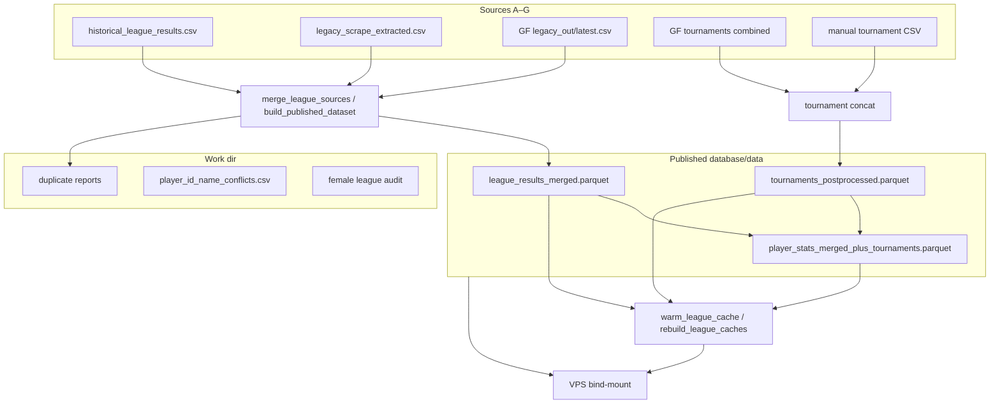

# Unified data pipeline plan

**Status date:** 2026-06-03 (revised with product decisions)  
**Companion docs:** [`database/README.md`](../../database/README.md), [`database/data/README.md`](../../database/data/README.md), [`docs/Excel_Extraction.md`](../Excel_Extraction.md), [`docs/GF_DATA_PIPELINE_IMPLEMENTATION_PLAN.md`](../GF_DATA_PIPELINE_IMPLEMENTATION_PLAN.md)  
**Scope:** Coherent ingest → publish workflow for all league/tournament/player data; operator UI starting in the React **Diagnose** tab.

### Locked decisions (2026-06-03)

| Topic | Decision |
|-------|----------|
| **Artifact manifest** | **Required** — every publish run must document exactly what is in each Parquet (schema, row counts, inputs, era). |
| **League vs tournament Parquets** | **Strict separation** — league job and tournament job each publish their own Parquet; no mixed “do everything” artifact except an explicit optional player view. |
| **Publish on audit failure** | **Strict by default** — unresolved ID/name audits block publish; **`--force-publish`** override for operator emergencies. |
| **PDF intake** | **Super low priority** — completionist / archaeologist feature for specific gaps or pre-2009; not on the critical path. |

---

## Goals

1. **One mental model** — every source follows the same stage ladder, even when the first step differs (GF API, Excel, PDF OCR, manual CSV).
2. **Predictable publish** — a single orchestrator runs **separate jobs** (league merge, tournament merge, optional player hybrid) and writes **one manifest** describing every Parquet artifact.
3. **Future-proof** — room for more historical sheets, PDF recovery of lost originals, and leagues migrating to GF / Google Sheets without re-inventing merge logic.
4. **Operator visibility** — Diagnose UI shows *what we have*, *what stage each source is in*, and *what still blocks publish*.

### Non-goals (for now)

- Replacing Tabulator or app data-access internals.
- Bidirectional sync back to GF / Google Sheets.
- Full relational UUID-native model (future relaunch).
- Running heavy pipeline jobs inside the 1 GB VPS container (build stays on dev machine / CI).

---

## 1. Current data flows (as-is)

### 1.1 Path model

| Role | Default (Windows) | Override env |
|------|-------------------|--------------|
| **Published / runtime** | `database/data/` | `BOWLYZER_DATA_DIR` |
| **Work / intermediates** | `C:\tmp\bowlyzer\data` | `BOWLYZER_WORK_DATA_DIR` |

Resolution: `database/paths.py`. GF stage dirs use a second module: `pipeline/paths.py` → `database/pipeline/bowling_bayern/{incoming,staging,sanitized,canonical,legacy_out,state,logs}`.

**VPS** bind-mounts only `database/data/`, `database/relational_csv/`, `database/config/` — not the full pipeline tree.

### 1.2 Source inventory

| ID | Kind | Input location | Producer | Stage vocabulary today |
|----|------|----------------|----------|------------------------|
| **A — Historical Excel** | League archive (≈2019–2025) | External `Sammlung-Ligaergebnisse/` tree | `extract_excel_data.py` | analyze → process → `historical_league_results.csv` (work) |
| **B — Legacy web scrape** | League `.xls` (≈2008–2018) | `legacy_scrape/` (work) | `scrape_legacy_liga.py` + extract | scrape → extract → `legacy_scrape_extracted.csv` |
| **C — GF league forms** | Live REST | GF API → `pipeline/…/incoming/` | `run_gf_pipeline.py` | incoming → staging → sanitized → canonical → `legacy_out/latest.csv` |
| **D — Static BB CSV** | Legacy export | `database/input/liga_*_ergebnisse-*.csv` | `convert_bowlingbayern_to_legacy.py` | one-shot → `bowling_ergebnisse_real_from_bowlingbayern.csv` |
| **E — GF tournament tables** | REST export | GF forms 124/125 | `export_gf_tables.py` | raw/labeled → canonical_clean → postprocessed → `gf_tournaments_2026__combined_postprocessed.csv` |
| **F — Tournament Excel** | Manual club/regional | `database/input/clubmeisterschaft_*`, `bayerische_meisterschaft_xlsx/` | import scripts | xlsx → per-event CSV → `tournament_manual_postprocessed.csv` |
| **G — Synthetic / test** | Dev only | generators under `database/input/`, `database/generator/` | various | ad hoc |

**Reference data (not row pipelines):** `database/relational_csv/`, `database/config/*.json` (team/player name & ID normalization).

### 1.3 Processing graph (production)



**Orchestrator:** `scripts/build_published_dataset.py`

- League merge priority (low → high): historical → optional legacy scrape / `--extra-league` → GF pipeline (wins on duplicate keys).
- Dedupe keys: league, season, week, round number, match number, team, position, player.
- Normalization during merge: `team_name_normalization.json`, `player_id_name_normalization.json`, `player_name_normalization.json`.
- Post-merge audits: female league split, player ID/name conflicts → work dir CSVs.
- Tournaments: concat GF combined + manual imports.
- Optional `--with-player-hybrid`: league + tournaments → player hybrid parquet.

**GF league ingest (separate cadence):** `scripts/run_gf_pipeline.py` → `pipeline/runner.py` (incremental, state in `state/`, logs in `logs/`).

**GF tournament export (batch):** `scripts/export_gf_tables.py` → `database/input/gf_tables_export/` (dev tree; not on VPS).

### 1.4 App-facing artifacts

| Logical dataset | Published file | App source id | Required on VPS? |
|-----------------|----------------|---------------|------------------|
| Merged league | `league_results_merged.parquet` | `db_real_merged` (default) | **Yes** |
| Tournaments | `tournaments_postprocessed.parquet` | `db_tournament_regions_2026_gf` | Recommended |
| Player hybrid | `player_stats_merged_plus_tournaments.parquet` | `db_player_merged_hybrid` | For Spieler |
| Manual tournaments | `tournament_manual_postprocessed.csv` | merged into above | If club imports |
| KO config | `tournament_ko_config.json` | bracket UI | Per event |

Runtime prefers Parquet when present (`data_access/parquet_sidecar.py`); config paths keep historical `.csv` names.

### 1.5 Diagnosis today (content quality, not pipeline ops)

React **Diagnose** pages (`/diagnose/*`) check **published** merged data:

| Page | API | What it shows |
|------|-----|---------------|
| Liga-Wochen | `GET /league/get_week_matrix` | Missing matchdays per league×season |
| Anomalien | `GET /league/get_data_oddities` | Row-level issues |
| Club-Matrix | `GET /league/get_club_matrix` | Team×season matrix, unnumbered filter |

`DatabaseSelector` exposes `db_real_merged` via `GET /get-data-sources-info`. **No UI** for pipeline stage, last build, or source freshness.

### 1.6 Known gaps

| Gap | Impact |
|-----|--------|
| **Two path modules** (`database/paths.py` vs `pipeline/paths.py`) | Easy to mis-wire inputs |
| **GF league vs GF tournament** are separate trees | Tournament dev artifacts under `database/input/`, league under `database/pipeline/` |
| **Hybrid build divergence** | App startup hybrid path can read `gf_tables_export/` instead of published tournaments unless `BOWLYZER_SKIP_HYBRID_BUILD=1` |
| **Overlapping stage names** | GF uses incoming/staging/sanitized; Excel uses analyze/process; no global registry |
| **No PDF ingest** | Lost originals not yet in workflow |
| **No Google Sheets adapter** | Expected future format; no placeholder stage |
| **Operator runbooks scattered** | Excel doc, GF plan, data README — no single pipeline dashboard |
| **Repo clutter** | Audit CSVs (`report_names*.csv`) beside published files |

---

## 2. Target architecture — unified stages

### 2.1 Stage ladder (all sources)

Every source is tracked through the same **logical** stages. Physical folders may differ per adapter, but the registry uses one vocabulary:

| Stage | Code | Meaning |
|-------|------|---------|
| **Intake** | `intake` | Raw bytes as received (API JSON page, `.xls`, `.xlsx`, `.pdf`, `.csv`, sheet export) |
| **Raw** | `raw` | Parsed tabular rows, minimal typing, source metadata attached |
| **Sanitized** | `sanitized` | Schema-safe rows: trimmed strings, bool flags, dropped garbage rows |
| **Canonical** | `canonical` | Unified column set (`Columns` / legacy flat schema), league/tournament typing |
| **Merged** | `merged` | Multi-source dedupe output (league or tournament stream) |
| **Published** | `published` | Parquet (+ optional CSV) under `database/data/`, audits passed |
| **Cached** | `cached` | API JSON warmed under `.cache/league/` |

```text
intake → raw → sanitized → canonical → merged → published → cached
```

**Side paths (do not block publish):**

- `audit/` — conflict reports, female split, duplicate groups (work dir).
- `config/` — human-reviewed normalization JSON imported from audit CSVs.

### 2.2 Source registry (target)

Each source gets a stable **source id** and **stream** (`league` | `tournament` | `player`):

| Source id | Stream | Adapter (current → target) | Intake format |
|-----------|--------|----------------------------|---------------|
| `historical_excel` | league | `extract_excel_data.py` | `.xls` / `.xlsx` |
| `legacy_scrape` | league | `scrape_legacy_liga.py` + extract | HTTP `.xls` |
| `gf_league` | league | `run_gf_pipeline.py` | GF REST JSON |
| `gf_tournament` | tournament | `export_gf_tables.py` | GF REST tables |
| `bowlingbayern_csv` | league | `convert_bowlingbayern_to_legacy.py` | static CSV |
| `tournament_xlsx` | tournament | club/bayerische import scripts | `.xlsx` |
| `pdf_sheet` | league | **planned** | `.pdf` (score sheets) |
| `google_sheets` | league | **planned** | Sheets export / API |

**Future PDF workflow (sketch):**

1. `intake/pdf/{season}/{league}/` — scanned or born-digital sheets.
2. `scripts/extract_pdf_sheet.py` (new) — OCR / table detection → `raw` CSV with confidence scores.
3. Human review queue in Diagnose UI (low-confidence cells flagged).
4. On approval → `sanitized` → same canonical adapter as Excel extract.
5. Merge via `--extra-league` until GF covers that season.

**Future Google Sheets workflow (sketch):**

1. Treat export CSV or API pull as `intake`.
2. Reuse GF sanitization patterns where column layout matches; otherwise new thin adapter → `canonical`.
3. Register in source registry; merge priority configurable per league.

### 2.3 Directory layout (target, build machine)

```text
{BOWLYZER_WORK_DATA_DIR}/
  sources/
    historical_excel/     # copies or symlinks to Sammlung tree (optional)
    legacy_scrape/
    gf_league/            # mirror or pointer to pipeline/bowling_bayern
    gf_tournament/
    pdf_sheet/            # future
  stages/
    {source_id}/
      intake/
      raw/
      sanitized/
      canonical/
  merge/
    league/
      duplicates.csv
      league_results_merged.parquet   # copy or write-through to published
    tournament/
      tournaments_postprocessed.parquet
  audit/
    player_id_name_conflicts.csv
    player_name_conflicts.csv
    female_league_split.json
  runs/
    {run_id}.json         # orchestrator log

database/data/            # published only (synced to VPS)
  league_results_merged.parquet
  tournaments_postprocessed.parquet
  player_stats_merged_plus_tournaments.parquet
  *.json configs
```

**Migration strategy:** keep existing paths working; add `sources/` + `runs/` incrementally; `build_published_dataset.py` writes a `runs/latest.json` manifest.

### 2.4 Orchestrator (target)

Single CLI entry (evolve current script):

```bash
uv run python scripts/build_published_dataset.py \
  --sources historical_excel,gf_league \
  --with-legacy-scrape \
  --with-player-hybrid \
  --audit all \
  --write-manifest
```

Phases inside one run:

1. **Preflight** — resolve paths, fingerprint configs, list missing inputs.
2. **Ingest** (optional flags) — run GF incremental, export tournaments, etc.
3. **Canonicalize** — per-source adapters → canonical CSV/parquet in work dir.
4. **Merge** — league + tournament streams with documented priority.
5. **Normalize** — team + player ID + player name JSON rules.
6. **Audit** — female split, ID/name conflicts; fail or warn based on flags.
7. **Publish** — write Parquet to `database/data/`, emit `runs/{run_id}.json`.
8. **Cache** (optional `--warm-cache`) — invoke warm scripts.

### 2.5 Config & human-in-the-loop

| Config | Import script | Applied at |
|--------|---------------|------------|
| `team_name_normalization.json` | `build_team_name_normalization.py` | merge |
| `player_id_name_normalization.json` | `import_player_id_normalization_from_audit.py` | merge + audit |
| `player_name_normalization.json` | `import_player_name_normalization_from_audit.py` | merge + audit |

Workflow: audit CSV → annotate (`manual_rule`, `assigned name` / `assigned_id`) → import → rebuild publish.

---

## 3. UI design — Diagnose “Datenpipeline”

### 3.1 Placement

New page: **`/diagnose/datenpipeline`** (sidebar: **Datenpipeline**, icon `Workflow` or `Database`).

Keeps separation:

- **Content health** (existing): Liga-Wochen, Anomalien, Club-Matrix.
- **Operational health** (new): sources, stages, publish artifacts, last run.

### 3.2 Information architecture

```text
┌─────────────────────────────────────────────────────────────┐
│ Diagnose › Datenpipeline                                     │
│ Active database: db_real_merged  [selector unchanged]        │
├─────────────────────────────────────────────────────────────┤
│ KPI strip (4 tiles)                                          │
│  Published league │ Tournaments │ Player hybrid │ Last build   │
├─────────────────────────────────────────────────────────────┤
│ Sources table                                                │
│  source id │ stream │ stage │ rows │ mtime │ status │ action │
├─────────────────────────────────────────────────────────────┤
│ Publish artifacts                                            │
│  file │ format │ size │ mtime │ row_count │ app source id    │
├─────────────────────────────────────────────────────────────┤
│ Audits (work dir, if readable)                               │
│  report │ rows │ link to re-import docs                      │
├─────────────────────────────────────────────────────────────┤
│ Runbook links → Excel_Extraction.md, build commands          │
└─────────────────────────────────────────────────────────────┘
```

### 3.3 API (phased)

| Phase | Endpoint | Payload |
|-------|----------|---------|
| **1a** (starter) | `GET /pipeline/status` | Published artifact metadata (path, mtime, size, exists, row_count optional), work/published dir paths, config fingerprints |
| **1b** | same | Per-source stage from `runs/latest.json` manifest |
| **2** | `GET /pipeline/sources` | Full source registry + GF last run from `pipeline/…/logs/` |
| **3** | `POST /pipeline/trigger` | Dev-only: shell out to ingest (guard with env flag) |

**Status semantics:**

- `ok` — published file exists, mtime &lt; 30d (configurable).
- `warn` — file exists but stale or audit reports open issues.
- `missing` — required artifact absent.
- `unknown` — VPS cannot see work dir (expected in prod for intermediates).

### 3.4 Frontend conventions

Follow existing Diagnose pages:

- Layout: `max-w-[1280px]`, eyebrow `Diagnose`, `DiagnosisToolbar` for filters if needed.
- Tokens: `bg-surface`, `border-border`, `text-muted`, status colors from `rainbowPastel` / design tokens.
- Hook: `usePipelineStatus()` with `DIAGNOSIS_LIST_STALE_MS` (10 min).
- i18n keys: `ui.diagnosis.pipeline.*`.

### 3.5 When to split standalone

Move to a separate admin app if:

- PDF review queue needs side-by-side sheet image + table editor.
- Pipeline triggers and credential management (GF keys) exceed Diagnose scope.
- Multiple operators need role-based access.

Until then, Diagnose tab is sufficient.

---

## 4. Implementation phases

### Phase 0 — Documentation & manifests (this doc)

- [x] Inventory current flows (section 1).
- [x] Define stage vocabulary + target layout (section 2).
- [x] UI spec (section 3).
- [ ] Add `runs/latest.json` emission to `build_published_dataset.py` (small JSON: inputs, outputs, timestamps, audit counts).

### Phase 1 — Read-only operator UI (started 2026-06-03)

- [x] `GET /pipeline/status` — published files + paths + fingerprints (`app/services/pipeline_status_service.py`).
- [x] React page `/diagnose/datenpipeline` — KPI strip + artifacts + sources tables.
- [x] Audit report row count when `player_id_name_conflicts.csv` is readable from work dir.
- [ ] Copy-friendly build commands in-page (buttons / code block).
- [ ] `runs/latest.json` manifest from `build_published_dataset.py`.

### Phase 2 — Source registry

- [ ] `database/config/data_sources.json` — static registry of source ids, adapters, merge priority.
- [ ] Extend `/pipeline/status` with per-source stage from manifest + GF logs.
- [ ] Unify hybrid build to always use published tournament parquet (remove `gf_tables_export` divergence).

### Phase 3 — Work dir layout migration

- [ ] Introduce `work_dir/sources/` + `work_dir/runs/` without breaking existing paths.
- [ ] `build_published_dataset.py --write-manifest` default on.

### Phase 4 — PDF intake (when needed)

- [ ] `intake/pdf/` convention + extraction script stub.
- [ ] Diagnose “review queue” for low-confidence OCR rows.

### Phase 5 — Google Sheets adapter

- [ ] Intake adapter when first league migrates off Excel.

### Phase 6 — Optional triggers

- [ ] Dev-only `POST /pipeline/trigger` behind `BOWLYZER_ALLOW_PIPELINE_TRIGGER=1`.
- [ ] GF incremental button in UI (calls existing `run_gf_pipeline.py`).

---

## 5. Open decisions

| # | Question | Recommendation |
|---|----------|----------------|
| 1 | Single `data_sources.json` vs code-defined registry? | Start JSON registry; adapters stay Python modules. |
| 2 | Store historical Excel path in config or env only? | Env `BOWLYZER_EXCEL_ARCHIVE_DIR`; document in runbook. |
| 3 | Fail publish on audit conflicts? | Default **warn**; `--strict-audit` for CI. |
| 4 | Expose work dir on VPS? | **No** — status endpoint returns published + manifest only; full detail on build machine. |
| 5 | PDF OCR tool choice? | Defer; prototype with `pdfplumber` / Tesseract on one sheet first. |

---

## 6. Operator quick reference (unchanged commands)

```powershell
# Full publish (build machine)
$env:BOWLYZER_WORK_DATA_DIR = "C:\tmp\bowlyzer\data"
uv run python scripts/build_published_dataset.py --with-player-hybrid
uv run python scripts/rebuild_league_caches.py --all-published --workers 8

# GF league incremental
uv run python scripts/run_gf_pipeline.py

# GF tournament export (when forms update)
uv run python scripts/export_gf_tables.py

# Deploy
.\deploy\deploy.ps1 -SyncDatabase -SyncCache
```

---

## Related files

| Area | Path |
|------|------|
| Path resolution | `database/paths.py`, `pipeline/paths.py` |
| Publish orchestrator | `scripts/build_published_dataset.py` |
| League merge | `scripts/merge_league_sources.py` |
| GF ingest | `scripts/run_gf_pipeline.py`, `pipeline/runner.py` |
| GF tournaments | `scripts/export_gf_tables.py` |
| Excel / scrape | `extract_excel_data.py`, `scripts/scrape_legacy_liga.py` |
| App sources | `app/config/database_config.py` |
| Diagnose UI | `frontend/src/pages/diagnosis/` |
| Pipeline status (new) | `app/services/pipeline_status_service.py`, `GET /pipeline/status` |
