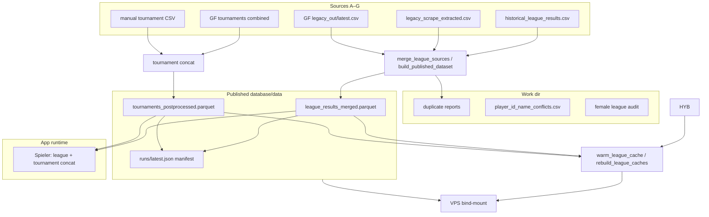
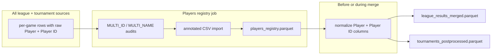

# Unified data pipeline plan

**Status date:** 2026-06-03 (revised with product decisions)  
**Companion docs:** [`PIPELINE_STATE_OVERVIEW.md`](PIPELINE_STATE_OVERVIEW.md) (current snapshot + traceability), [`database/README.md`](../../database/README.md), [`database/data/README.md`](../../database/data/README.md), [`docs/Excel_Extraction.md`](../Excel_Extraction.md), [`docs/GF_DATA_PIPELINE_IMPLEMENTATION_PLAN.md`](../GF_DATA_PIPELINE_IMPLEMENTATION_PLAN.md)  
**Scope:** Coherent ingest → publish workflow for all league/tournament/player data; operator UI starting in the React **Diagnose** tab.

### Locked decisions (2026-06-03)

| Topic | Decision |
|-------|----------|
| **Artifact manifest** | **Required** — every publish run must document exactly what is in each Parquet (schema, row counts, inputs, era). |
| **League vs tournament Parquets** | **Strict separation** — league job and tournament job each publish their own Parquet; no mixed “do everything” artifact except an explicit optional player view. |
| **Publish on audit failure** | **Strict by default** — female-league split and future audits block publish; **player ID/name deferred** until Phase 2b (`players_registry`); **`--force-publish`** for other emergencies. |
| **PDF intake** | **Super low priority** — completionist / archaeologist feature for specific gaps or pre-2009; not on the critical path. |

### Locked decisions (2026-06-03 — incremental pipeline)

| Topic | Decision |
|-------|----------|
| **Season keys (storage)** | Hyphen-normalized `25-26` on disk, in manifests, slice paths, and pipeline APIs. Slash `25/26` is **presentation only** (UI / legacy column until migrated). |
| **Source × era guardrails** | Plausibility checks: pre-2022 adapters, post-2022 adapters, and GF-live each bound to allowed season ranges; violations audited and block or warn. |
| **Downstream work** | **Impact-only** — re-merge, re-publish, and re-warm only artifacts whose dependency dimensions intersect changed seasons (not full blob). |
| **Registry blast radius** | Player registry changes re-resolve names only in seasons where affected `player_id` rows exist. |
| **Tournament slices** | Season-level partitions when canonical schema is generalized; avoid event-level slices unless volume forces sub-partitioning. |
| **Diagnose UI** | **Executive summary** (KPIs, blockers, last delta) + **source×stage×season grid** below; extends `/diagnose/datenpipeline`. |

See [`PIPELINE_STATE_OVERVIEW.md`](PIPELINE_STATE_OVERVIEW.md) §10–15 for detail.

---

## Goals

1. **One mental model** — every source follows the same stage ladder, even when the first step differs (GF API, Excel, PDF OCR, manual CSV).
2. **Predictable publish** — a single orchestrator runs **separate jobs** (league merge, tournament merge, optional player hybrid) and writes **one manifest** describing every Parquet artifact.
3. **Future-proof** — room for more historical sheets, PDF recovery of lost originals, and leagues migrating to GF / Google Sheets without re-inventing merge logic.
4. **Operator visibility** — Diagnose UI shows *what we have*, *what stage each source is in*, and *what still blocks publish*.

### Non-goals (for now)

- Replacing Tabulator or app data-access internals.
- Bidirectional sync back to GF / Google Sheets.
- Full relational UUID-native model (future relaunch).
- Running heavy pipeline jobs inside the 1 GB VPS container (build stays on dev machine / CI).

---

## 1. Current data flows (as-is)

### 1.1 Path model

| Role | Default (Windows) | Override env |
|------|-------------------|--------------|
| **Published / runtime** | `database/data/` | `BOWLYZER_DATA_DIR` |
| **Work / intermediates** | `C:\tmp\bowlyzer\data` | `BOWLYZER_WORK_DATA_DIR` |

Resolution: `database/paths.py`. GF stage dirs use a second module: `pipeline/paths.py` → `database/pipeline/bowling_bayern/{incoming,staging,sanitized,canonical,legacy_out,state,logs}`.

**VPS** bind-mounts only `database/data/`, `database/relational_csv/`, `database/config/` — not the full pipeline tree.

### 1.2 Source inventory

| ID | Kind | Input location | Producer | Stage vocabulary today |
|----|------|----------------|----------|------------------------|
| **A — Historical Excel** | League archive (≈2019–2025) | External `Sammlung-Ligaergebnisse/` tree | `extract_excel_data.py` | analyze → process → `historical_league_results.csv` (work) |
| **B — Legacy web scrape** | League `.xls` (≈2008–2018) | `legacy_scrape/` (work) | `scrape_legacy_liga.py` + extract | scrape → extract → `legacy_scrape_extracted.csv` |
| **C — GF league forms** | Live REST | GF API → `pipeline/…/incoming/` | `run_gf_pipeline.py` | incoming → staging → sanitized → canonical → `legacy_out/latest.csv` |
| **D — Static BB CSV** | Legacy export | `database/input/liga_*_ergebnisse-*.csv` | `convert_bowlingbayern_to_legacy.py` | one-shot → `bowling_ergebnisse_real_from_bowlingbayern.csv` |
| **E — GF tournament tables** | REST export | GF forms 124/125 | `export_gf_tables.py` | raw/labeled → canonical_clean → postprocessed → `gf_tournaments_2026__combined_postprocessed.csv` |
| **F — Tournament Excel** | Manual club/regional | `database/input/clubmeisterschaft_*`, `bayerische_meisterschaft_xlsx/` | import scripts | xlsx → per-event CSV → `tournament_manual_postprocessed.csv` |
| **G — Synthetic / test** | Dev only | generators under `database/input/`, `database/generator/` | various | ad hoc |

**Reference data (not row pipelines):** `database/relational_csv/`, `database/config/*.json` (team/player name & ID normalization).

#### Legacy league sources A & B — same treatment, different provenance

Sources **A** (Excel archive) and **B** (web-scraped `.xls`) are **different provenance** (who collected, which years dominate) but **identical pipeline treatment** once intake completes:

- Same stage ladder: intake → raw → sanitized → canonical → league merge.
- Same flat legacy schema (`Columns` / per-game rows).
- Same merge keys and normalization hooks (team + player ID/name JSON).

**Do not model them as separate pipeline families.** Register both under one logical family, e.g. `legacy_league_workbook`, with a `provenance` tag (`excel_archive` | `web_scrape`) on each run manifest row.

The **meaningful split is format era**, not A vs B:

| Era | Approx. seasons | Workbook / sheet shape | Adapter branch |
|-----|-----------------|------------------------|----------------|
| **Pre-2022** | through 21/22 | Older Excel / `.xls` layout (pre-GF-style columns) | `legacy_format_pre2022` |
| **Post-2022** | 22/23 onward | Newer layout (closer to current GF flat export) | `legacy_format_post2022` |

GF pipeline (C) is effectively **post-2022 live** data; historical Excel may span both eras in one tree. Adapters should tag each canonical row with `format_era` (`pre2022` | `post2022`) for debugging and for audits — not for separate publish artifacts.

```text
provenance (excel | scrape | gf)  ×  format_era (pre2022 | post2022)  →  same canonical league schema
```

### 1.3 Processing graph (production)



**Orchestrator:** `scripts/build_published_dataset.py`

- League merge priority (low → high): historical → optional legacy scrape / `--extra-league` → GF pipeline (wins on duplicate keys).
- Dedupe keys: league, season, week, round number, match number, team, position, player.
- Normalization during merge: `team_name_normalization.json`, `player_id_name_normalization.json`, `player_name_normalization.json`.
- Post-merge audits: female league split, player ID/name conflicts → work dir CSVs.
- Tournaments: concat GF combined + manual imports.
- Optional `--with-player-hybrid`: league + tournaments → player hybrid parquet.

**GF league ingest (separate cadence):** `scripts/run_gf_pipeline.py` → `pipeline/runner.py` (incremental, state in `state/`, logs in `logs/`).

**GF tournament export (batch):** `scripts/export_gf_tables.py` → `database/input/gf_tables_export/` (dev tree; not on VPS).

### 1.4 Published Parquet artifacts (target contract)

**Principle:** one **job** → one **primary Parquet**. League and tournament pipelines never share a published file. The player hybrid is a **derived** artifact (optional third job), not a substitute for keeping league and tournament separate.

| Job | Published Parquet | Logical name (config) | App source id | Stream | Required on VPS? |
|-----|-------------------|----------------------|---------------|--------|------------------|
| **League merge** | `league_results_merged.parquet` | `league_results_merged.csv` | `db_real_merged` (default Liga) | `league` | **Yes** |
| **Tournament merge** | `tournaments_postprocessed.parquet` | `tournaments_postprocessed.csv` | `db_tournament_regions_2026_gf` | `tournament` | Recommended |
| ~~Player hybrid~~ **deprecated** | ~~`player_stats_merged_plus_tournaments.parquet`~~ | — | Spieler uses league + tournament via `merge_file_paths` | — | **Drop** after schema v2 |

**What each Parquet contains (must be in manifest):**

| Artifact | Row grain | Includes | Excludes |
|----------|-----------|----------|----------|
| `league_results_merged` | Per game, league match | All merged league sources (A+B+C+extras); `Event Type` = league; Input rows only after normalization | Tournament rows, computed team totals as player rows |
| `tournaments_postprocessed` | Per game, tournament event | GF regional + manual club imports; cuts/ranks postprocessed | League match rows |
| `player_stats_merged_plus_tournaments` | Per game | Copy of league input rows + tournament input rows (denormalized for Spieler search) | Must be rebuilt from the two Parquets above, never from dev `gf_tables_export/` |

**Sidecar files (not Parquet):**

| File | Role |
|------|------|
| `tournament_manual_postprocessed.csv` | Input to tournament merge job (may remain CSV until manual import path moves to Parquet) |
| `tournament_ko_config.json` | KO bracket UI |
| `players_registry.parquet` | **Planned** — central id + canonical name (see §2.6) |

Runtime prefers Parquet when present (`data_access/parquet_sidecar.py`); config paths keep historical `.csv` stems.

**Manifest:** `runs/latest.json` lists every artifact with `job`, `path`, `row_count`, `columns_hash`, `input_sources[]`, `format_era_breakdown` (league only), `audit_status`, `published_at`.

### 1.5 Diagnosis today (content quality, not pipeline ops)

React **Diagnose** pages (`/diagnose/*`) check **published** merged data:

| Page | API | What it shows |
|------|-----|---------------|
| Liga-Wochen | `GET /league/get_week_matrix` | Missing matchdays per league×season |
| Anomalien | `GET /league/get_data_oddities` | Row-level issues |
| Club-Matrix | `GET /league/get_club_matrix` | Team×season matrix, unnumbered filter |

`DatabaseSelector` exposes `db_real_merged` via `GET /get-data-sources-info`. **No UI** for pipeline stage, last build, or source freshness.

### 1.6 Known gaps

| Gap | Impact |
|-----|--------|
| **Two path modules** (`database/paths.py` vs `pipeline/paths.py`) | Easy to mis-wire inputs |
| **GF league vs GF tournament** are separate trees | Tournament dev artifacts under `database/input/`, league under `database/pipeline/` |
| **Hybrid build divergence** | App startup hybrid path can read `gf_tables_export/` instead of published tournaments unless `BOWLYZER_SKIP_HYBRID_BUILD=1` |
| **Overlapping stage names** | GF uses incoming/staging/sanitized; Excel uses analyze/process; no global registry |
| **No PDF ingest** | Lost originals not yet in workflow |
| **No Google Sheets adapter** | Expected future format; no placeholder stage |
| **Operator runbooks scattered** | Excel doc, GF plan, data README — no single pipeline dashboard |
| **Repo clutter** | Audit CSVs (`report_names*.csv`) beside published files |

---

## 2. Target architecture — unified stages

### 2.1 Stage ladder (all sources)

Every source is tracked through the same **logical** stages. Physical folders may differ per adapter, but the registry uses one vocabulary:

| Stage | Code | Meaning |
|-------|------|---------|
| **Intake** | `intake` | Raw bytes as received (API JSON page, `.xls`, `.xlsx`, `.pdf`, `.csv`, sheet export) |
| **Raw** | `raw` | Parsed tabular rows, minimal typing, source metadata attached |
| **Sanitized** | `sanitized` | Schema-safe rows: trimmed strings, bool flags, dropped garbage rows |
| **Canonical** | `canonical` | Unified column set (`Columns` / legacy flat schema), league/tournament typing |
| **Merged** | `merged` | Multi-source dedupe output (league or tournament stream) |
| **Published** | `published` | Parquet (+ optional CSV) under `database/data/`, audits passed |
| **Cached** | `cached` | API JSON warmed under `.cache/league/` |

```text
intake → raw → sanitized → canonical → merged → published → cached
```

**Side paths (do not block publish):**

- `audit/` — conflict reports, female split, duplicate groups (work dir).
- `config/` — human-reviewed normalization JSON imported from audit CSVs.

### 2.2 Source registry (target)

Each source gets a stable **source id**, **stream** (`league` | `tournament` | `player`), and **provenance** (for league legacy only).

| Source id | Stream | Provenance | Adapter | Intake format |
|-----------|--------|------------|---------|---------------|
| `legacy_league_excel` | league | `excel_archive` | `extract_excel_data.py` | `.xls` / `.xlsx` |
| `legacy_league_scrape` | league | `web_scrape` | `scrape_legacy_liga.py` + extract | HTTP `.xls` |
| `gf_league` | league | `gf_api` | `run_gf_pipeline.py` | GF REST JSON |
| `gf_tournament` | tournament | `export_gf_tables.py` | GF REST tables |
| `bowlingbayern_csv` | league | `convert_bowlingbayern_to_legacy.py` | static CSV |
| `tournament_xlsx` | tournament | club/bayerische import scripts | `.xlsx` |
| `pdf_sheet` | league | `pdf_archive` | **planned, low priority** | `.pdf` (score sheets) |
| `google_sheets` | league | `google_sheets` | **planned** | Sheets export / API |

**Format-era adapters** (orthogonal to source id): `legacy_format_pre2022`, `legacy_format_post2022` — selected by sheet inspection, not by whether the file came from A or B.

**PDF workflow (archaeologist / completionist — not critical path):**

Priority: **super low**. Use only to close specific gaps or explore pre-2009 where no workbook exists.

1. `intake/pdf/{season}/{league}/` — scanned or born-digital sheets.
2. `scripts/extract_pdf_sheet.py` (new) — OCR / table detection → `raw` CSV with confidence scores.
3. Human review queue in Diagnose UI (low-confidence cells flagged).
4. On approval → `sanitized` → same canonical adapter as legacy workbook (era-appropriate branch).
5. Merge via `--extra-league` until GF or Excel covers that season.

**Future Google Sheets workflow (sketch):**

1. Treat export CSV or API pull as `intake`.
2. Reuse GF sanitization patterns where column layout matches; otherwise new thin adapter → `canonical`.
3. Register in source registry; merge priority configurable per league.

### 2.3 Directory layout (target, build machine)

```text
{BOWLYZER_WORK_DATA_DIR}/
  sources/
    historical_excel/     # copies or symlinks to Sammlung tree (optional)
    legacy_scrape/
    gf_league/            # mirror or pointer to pipeline/bowling_bayern
    gf_tournament/
    pdf_sheet/            # future
  stages/
    {source_id}/
      {season_key}/          # hyphen, e.g. 25-26
        intake/
        raw/
        sanitized/
        canonical/             # slice fingerprint per season
  merge/
    league/
      by_season/               # optional materialized partitions
        {season_key}.parquet
      duplicates.csv
      league_results_merged.parquet   # stitched view or monolith during migration
    tournament/
      by_season/
        {season_key}.parquet
      tournaments_postprocessed.parquet
  audit/
    player_id_name_conflicts.csv
    player_name_conflicts.csv
    female_league_split.json
  runs/
    {run_id}.json         # orchestrator log

database/data/            # published only (synced to VPS)
  league_results_merged.parquet      # job: league_merge
  tournaments_postprocessed.parquet  # job: tournament_merge
  player_stats_merged_plus_tournaments.parquet  # job: player_hybrid (optional)
  players_registry.parquet           # job: players_registry (planned)
  runs/latest.json                   # manifest for all artifacts
  *.json configs
```

**Migration strategy:** keep existing paths working; add `sources/` + `runs/` + **season-keyed slices** incrementally; enforce **job-separated** publishes (already mostly true — formalize in manifest and CLI flags).

### 2.3.1 Season keys

- **Pipeline canonical:** `YY-YY` hyphen (`25-26`). All slice paths, manifest `season_index`, and registry JSON use this form.
- **Presentation:** UI and German labels render `25/26` via formatter; URL may use hyphen (`?season=25-26`) per nginx guidance.
- **Parquet column `Season`:** legacy values may remain slash until a publish migration; read paths accept both; new partition writers emit hyphen.

Shared helper (target): `data_access.season_key.normalize_season_key()` — not the app-layer `season_query` module (slash for legacy DF lookups).

### 2.3.2 Source × era guardrails

Each entry in `data_sources.json` references bounds in `source_era_bounds.json`:

| Adapter class | `format_era` | Typical season range |
|---------------|--------------|----------------------|
| Legacy Excel / scrape | `pre2022` | `08-09` … `21-22` |
| Legacy Excel (newer sheets) | `post2022` | `22-23` … |
| GF league | `gf_live` | `22-23` … (configurable floor) |

Validate at canonical write and before merge stitch. Output: `audit/source_era_violations.csv`; **error** severity blocks slice publish.

GF rows in pre-2022 seasons or pre2022 adapter output in GF-only seasons are never silently merged.

### 2.3.3 Impact-only downstream invalidation

Manifest records `changed_seasons` and projects **impact**:

- **Partitions:** rewrite `merge/league/by_season/{season_key}.parquet` only for changed keys.
- **Revision index:** bump season / league / club entries in the intersection set.
- **Cache warm:** `warm_league_cache*` with `--seasons` / targeted leagues — no full `--rebuild` when impact is narrow.
- **Registry:** if `players_registry` changes, re-run name resolution only for seasons containing touched `player_id` values.

`manifest.impact` block (target shape): `{ changed_seasons, leagues, clubs, player_ids, endpoints[] }`.

### 2.4 Orchestrator (target)

Single CLI entry (evolve current script):

```bash
uv run python scripts/build_published_dataset.py \
  --job league,tournament \
  --with-legacy-scrape \
  --with-player-hybrid \
  --audit all \
  --write-manifest
# strict default — blocked if audits fail:
uv run python scripts/build_published_dataset.py --job league
# operator override (logs reason):
uv run python scripts/build_published_dataset.py --job league --force-publish
```

**Jobs** (each writes exactly one primary Parquet unless skipped):

| `--job` flag | Output | Depends on |
|--------------|--------|------------|
| `league` | `league_results_merged.parquet` | historical + optional scrape + GF |
| `tournament` | `tournaments_postprocessed.parquet` | GF combined + manual |
| ~~`player_hybrid`~~ | *removed* — Spieler loads league + tournament Parquets at runtime |
| `players_registry` | `players_registry.parquet` | all league + tournament rows (planned) |

Phases inside one orchestrator run:

1. **Preflight** — resolve paths, fingerprint configs, list missing inputs.
2. **Ingest** (optional flags) — run GF incremental, export tournaments, etc.
3. **Canonicalize** — per-source adapters → canonical CSV/parquet in work dir (`format_era` tagged).
4. **Merge (per job)** — league job and tournament job are independent; no shared output file.
5. **Normalize** — team + player ID + player name JSON rules (league job; registry job when added).
6. **Audit** — female split, ID/name conflicts; **block publish by default**.
7. **Publish** — write job Parquet(s) to `database/data/`, emit `runs/{run_id}.json` + `runs/latest.json`.
8. **Cache** (optional `--warm-cache`) — invoke warm scripts for affected app sources only.

**Publish gate:**

```text
if audit_has_blocking_issues and not --force-publish:
    exit 1  # no Parquet write
```

`--force-publish` records `manifest.forced = true` and lists skipped audit ids — visible in Diagnose Datenpipeline.

### 2.5 Config & human-in-the-loop

| Config | Import script | Applied at |
|--------|---------------|------------|
| `team_name_normalization.json` | `build_team_name_normalization.py` | merge |
| `player_id_name_normalization.json` | `import_player_id_normalization_from_audit.py` | merge + audit |
| `player_name_normalization.json` | `import_player_name_normalization_from_audit.py` | merge + audit |

Workflow: audit CSV → annotate (`manual_rule`, `assigned name` / `assigned_id`) → import → rebuild publish.

### 2.6 Unified competition schema (flat row v2)

**Principle:** every published per-game row carries the same **core** columns. No derived labels at read time (no “fill Event from League in the hybrid”). League and tournament Parquets share the core; each stream adds **extension** columns that may be empty on the other stream.

**Row grain:** one row = one player, one game (input row), within a competition context.

#### Core columns (all competitions)

Present on **every** row in `league_results_merged` and `tournaments_postprocessed`:

| Column | Type / values | Role |
|--------|---------------|------|
| **Event Type** | `league` \| `tournament` | Stream discriminator |
| **Event** | string | Competition identifier — league id (`BayL`, `LL S`, …) or tournament title (`Südbayerische Meisterschaft`, …) |
| **Season** | string | Season label — storage/manifest use `25-26`; UI may show `25/26` |
| **Date** | string (ISO or legacy) | Match / playing day |
| **Player** | string | Display name on the sheet (normalized via registry + rules) |
| **Player ID** | string | EDV id |
| **Score** | numeric string | Pins for this game |
| **Location** | string | Venue (empty allowed) |
| **Input Data** | bool string | Player input row (`True` / `False`) |
| **Computed Data** | bool string | Aggregated / team-total row (`False` for player games) |

**Rename (league publish job):**

- `League` → **`Event`** (same values, e.g. `BayL`, `BayL (D)`).
- Add **`Event Type`** = `league` on every league row at **canonical** stage (not at hybrid concat).

**Rename (tournament publish job):**

- `Event Name` → **`Event`** (one column name across streams).
- **`Event Type`** = `tournament` (already present).

**Why these core fields:** they are the minimum to place a score in time and competition without inference. Everything else is scheduling, matchup, or scoring rules.

**Optional core (recommend including):**

| Column | Notes |
|--------|--------|
| **Club** | Player’s club label. League: derive from `Team` base name at publish (strip trailing team number) **once**, store explicitly. Tournament: already on sheet. Avoids Spieler/UI guessing from `Team`. |
| **Round Number** | Shared column name; **semantics differ** by Event Type (see extensions). Keep in core only if both streams populate it; otherwise treat as extension with documented meaning per type. |

**Not core** (stay stream-specific): `Week`, `Match Number`, `Opponent`, `Points`, `Team`, `Position`, handicap/cut/stage columns, etc.

#### League extensions (`Event Type` = `league`)

Columns present on league Parquet; empty or absent on tournament rows:

| Column | Role |
|--------|------|
| Week | League matchday |
| Match Number | Match within week |
| Team | Mannschaft (club + number, e.g. `Donaubowler Regensburg 2`) |
| Position | Lineup position (1–4) |
| Opponent | Opposing team name |
| Points | League points for the game |
| Bonus Points | Bonus pins / Sonderpunkte |
| Players per Team | Roster size context for the match |

Dedupe keys for league merge (unchanged logic, renamed field in keys): `Event`, Season, Week, Round Number, Match Number, Team, Position, Player.

#### Tournament extensions (`Event Type` = `tournament`)

Columns present on tournament Parquet; empty or absent on league rows:

| Column | Role |
|--------|------|
| Round Name | Stage (`Vorlauf`, `Zwischenlauf`, `Finale`, …) |
| Game Number | Game index within stage / series |
| Handicap | Per-game handicap |
| A Priori Average | Sheet handicap basis |
| Handicap Reference | Reference score for handicap formula |
| Stage Rank | Rank within stage after game |
| Cumulative Score | Running total in stage |
| Cut Line | Cut threshold |
| Overall Cumulative Score | Event-wide running total (when used) |

#### Schema evolution rules

1. **Add core column** only if both streams can populate it from source data (no inference).
2. **Add extension column** on one stream only; other stream omits column or leaves null — Parquet union is fine.
3. **`Columns` dataclass** (`data_access/schema.py`): add `event: str = 'Event'`, deprecate `league_name` / duplicate `event_name` after migration.
4. **Readers** use `Event Type` + `Event` for filters; never read legacy `League` after cutover.
5. **Players registry** applies to `Player` / `Player ID` before publish; core row is already canonical.

#### Current vs target (gap)

| Today | Target |
|-------|--------|
| League: `League`, no `Event Type` | `Event`, `Event Type` = `league` |
| Tournament: `Event Name`, `Event Type` | `Event` (renamed), `Event Type` = `tournament` |
| Hybrid fills Event/Club for league at concat | **No hybrid**; league publish writes complete core |
| Spieler merges two files + guesses columns | Runtime `merge_file_paths` OR two queries; same core either way |

**Implementation order:** (1) canonical writers emit v2 core on league + tournament jobs, (2) migrate `Columns` + services (`league_name` → `event`), (3) drop hybrid artifact, (4) manifest documents `schema_version: 2` per Parquet.

### 2.7 Central players registry (recommended)

**Problem:** Player name / EDV-ID resolution is scattered across merge-time JSON rules, audit CSVs, and runtime heuristics (`player_service._canonical_name_for_player_id`). Every new source re-opens the same conflicts.

**Recommendation:** introduce a small **central players registry** — not a full CRM, just authoritative identity:

| Column | Meaning |
|--------|---------|
| `player_id` | EDV number (string, normalized) |
| `canonical_name` | Official `Family, Given` form |
| `source` | `dbu` \| `majority` \| `manual` \| `same_person_alias` |
| `updated_at` | Last registry change |

**Optional columns (later):** `aliases[]` (valid alternate display names for `same_person`), `notes`, `merged_from_ids[]`.

**Published artifact:** `database/data/players_registry.parquet` (or `.csv` sidecar during transition).

**How it fits the pipeline:**



**Why this helps:**

1. **Single source of truth** for “what do we call player 16002?” — replaces growing sprawl of pairwise remap rules where possible.
2. **Audits become registry diffs** — MULTI_NAME/MULTI_ID suggest rows; approved rows update the registry, not a thousand `(name, id)` entries.
3. **Same person / marriage** — `aliases` on one `player_id` instead of exempting whole conflict groups in audit only.
4. **App reads registry** for Spieler dropdown canonical labels (thin join on `player_id`), not per-page heuristics.

**What stays in JSON configs (for now):**

- `player_id_name_normalization.json` — import path from audits until registry import exists; gradually shrink to “registry export”.
- `player_name_normalization.json` — same; remaps that are really alias → canonical_name moves to registry.

**Name resolution (Phase 2b):** merge applies **registry only** for display names — exact match, format reassembly, or close typo (same given name). No majority / autoresolve name rules at publish time. Unresolved rows stay in the audit CSV. **ID remaps** remain transitional JSON until registry grows an id-alias layer.

**Migration:** Phase 2b — build registry from existing configs + annotated CSVs; import audit rows into registry; flip `blocks_publish` when coverage is sufficient.

**Not in scope:** biographical data, club affiliation history, photos, BV API sync automation (manual `dbu_id` annotations remain the source for official corrections).

---

## 3. UI design — Diagnose “Datenpipeline”

### 3.1 Placement

New page: **`/diagnose/datenpipeline`** (sidebar: **Datenpipeline**, icon `Workflow` or `Database`).

Keeps separation:

- **Content health** (existing): Liga-Wochen, Anomalien, Club-Matrix.
- **Operational health** (new): sources, stages, publish artifacts, last run.

### 3.2 Information architecture — two tiers

**Tier 1 — Executive** (current KPI strip + delta/blockers):

```text
┌─────────────────────────────────────────────────────────────┐
│ Diagnose › Datenpipeline                                     │
├─────────────────────────────────────────────────────────────┤
│ EXECUTIVE                                                    │
│  [Publish ok/warn] [Δ seasons: 25-26] [Audits] [Last run]   │
│  KPI tiles: league rows │ tournaments │ registry │ staleness │
│  Blockers list (era violations, missing artifacts, forced)   │
├─────────────────────────────────────────────────────────────┤
```

**Tier 2 — Grid** (Phase 2c — source × stage, expandable to season):

```text
│ GRID  stream [league ▼]  [only changed]                      │
│        intake   raw   sanitized   canonical   merged   pub   │
│ gf_league   ·     ·       ·          ok         ok      ok    │
│   └ 25-26   ·     ·       ·          ok+fpr    —       —     │
│   └ 24-25   ·     ·       ·          ok        ok      ok    │
│ legacy_excel  ·   ·       ·          ok        ok      ok    │
│ legacy_scrape ·   ·       ·          ok        ok      ok    │
├─────────────────────────────────────────────────────────────┤
│ Publish artifacts │ Audits │ Runbook links                  │
└─────────────────────────────────────────────────────────────┘
```

Cell semantics: `empty` | `stale` | `ok` | `warn` | `error` | `blocked`. Season sub-rows show fingerprint, row count, `format_era`, guardrail status.

**Legacy detail tables** (Phase 1 — keep below grid): sources table, publish artifacts, audits, build commands.

### 3.2.1 Information architecture (Phase 1 baseline)

Shipped 2026-06 — tables below the fold until grid lands:

```text
┌─────────────────────────────────────────────────────────────┐
│ KPI strip │ Sources table │ Publish artifacts │ Audits      │
│ Runbook / build commands                                     │
└─────────────────────────────────────────────────────────────┘
```

### 3.3 API (phased)

| Phase | Endpoint | Payload |
|-------|----------|---------|
| **1a** (starter) | `GET /pipeline/status` | Published artifact metadata (mtime, size, exists, row_count), manifest summary, audits; **absolute paths only when** `BOWLYZER_PIPELINE_EXPOSE_PATHS=1` or non-`/app/` data dir (hidden in prod container by default) |
| **1b** | same | Per-source stage from `runs/latest.json` manifest |
| **2** | `GET /pipeline/sources` | Full source registry + GF last run from `pipeline/…/logs/` |
| **2c** | `GET /pipeline/status` | `season_index`, `manifest_diff`, `impact_summary` |
| **2c** | `GET /pipeline/guardrails` | Era violation report from last validate pass |
| **3** | `POST /pipeline/trigger` | Dev-only: shell out to ingest (guard with env flag) |

**Status semantics:**

- `ok` — published file exists, mtime &lt; 30d (configurable).
- `warn` — file exists but stale or audit reports open issues.
- `missing` — required artifact absent.
- `unknown` — VPS cannot see work dir (expected in prod for intermediates).

### 3.4 Frontend conventions

Follow existing Diagnose pages:

- Layout: `max-w-[1280px]`, eyebrow `Diagnose`, `DiagnosisToolbar` for filters if needed.
- Tokens: `bg-surface`, `border-border`, `text-muted`, status colors from `rainbowPastel` / design tokens.
- Hook: `usePipelineStatus()` with `DIAGNOSIS_LIST_STALE_MS` (10 min).
- i18n keys: `ui.diagnosis.pipeline.*`.

### 3.5 When to split standalone

Move to a separate admin app if:

- PDF review queue needs side-by-side sheet image + table editor.
- Pipeline triggers and credential management (GF keys) exceed Diagnose scope.
- Multiple operators need role-based access.

Until then, Diagnose tab is sufficient.

---

## 4. Implementation phases

### Phase 0 — Documentation & manifests (done 2026-06)

- [x] Inventory current flows (section 1).
- [x] Define stage vocabulary + target layout (section 2).
- [x] UI spec (section 3).
- [x] Lock decisions: separated Parquets, strict publish + `--force-publish`, PDF low priority, A/B unified + format era.
- [x] **`runs/latest.json`** — per-artifact contract (job, inputs, row_count, columns, era breakdown, audit_status).
- [x] **`database/data/ARTIFACTS.md`** — human-readable mirror of Parquet contracts (linked from Datenpipeline UI).

### Phase 1 — Read-only operator UI (done 2026-06)

- [x] `GET /pipeline/status` — published files + paths + fingerprints (`app/services/pipeline_status_service.py`).
- [x] React page `/diagnose/datenpipeline` — KPI strip + artifacts + sources tables.
- [x] Audit report row count when `player_id_name_conflicts.csv` is readable from work dir.
- [x] Copy-friendly build commands in-page (code block).
- [x] `runs/latest.json` manifest from `build_published_dataset.py`.
- [x] Manifest summary in `/pipeline/status` + Datenpipeline “Letzter Publish-Lauf”.

### Phase 2 — Source registry & separated jobs (mostly done 2026-06)

- [x] `database/config/data_sources.json` — source ids, provenance, `format_era` adapter mapping, deferred audit policy.
- [x] CLI `--job league,tournament[,player_hybrid]` (replaces `--league-only` / `--tournaments-only`).
- [x] **`--strict-audit` default on**; `--force-publish` with manifest flag; player ID/name **deferred** until Phase 2b.
- [x] Extend `/pipeline/status` with manifest contents (per-job artifacts, deferred audits).
- [x] Spieler runtime merge from published Parquets; app startup hybrid rebuild removed (`gf_tables_export` divergence gone).
- [ ] Canonical-stage schema v2 in GF/Excel writers (publish-only today).

### Phase 2b — Players registry (in progress 2026-06)

- [x] `players_registry.parquet` schema + incremental merge from normalization JSON (not full rebuild on league publish).
- [x] Apply registry during league merge (names only; closest canonical or alias).
- [x] Drop legacy name remap apply (`majority`, `name_reassembly`, `player_name_normalization.json` at merge).
- [x] Spieler catalog reads registry for canonical display name (`player_service`).
- [ ] Import annotated audit CSV rows into registry (not only JSON configs).
- [ ] Re-enable **blocking** publish on player ID/name when registry is live (`data_sources.json` → `blocks_publish: true`).

### Phase 2c — Season slices, guardrails, impact (planned)

- [ ] `data_access/season_key.py` — `normalize_season_key()` (`25/26` → `25-26`)
- [ ] `database/config/source_era_bounds.json` + validate in merge/canonical writers
- [ ] `scripts/build_season_index.py` — per-season fingerprints in manifest
- [ ] Manifest `changed_seasons` + `impact` block (diff vs previous `runs/*.json`)
- [ ] `merge_league_sources --only-seasons 25-26` prototype
- [ ] Targeted cache warm from `manifest.impact`
- [ ] Diagnose: executive delta row + source×stage×season grid (`DataPipeline.tsx`)
- [ ] Tournament: season partitions after canonical schema generalization (`tournament_format_era`)

### Phase 3 — Work dir layout migration

- [ ] Introduce `work_dir/sources/` + `work_dir/stages/{source_id}/{season_key}/` without breaking existing paths.
- [ ] `build_published_dataset.py --write-manifest` default on.

### Phase 4 — PDF intake (archaeologist — defer)

Low priority; only when a specific season/league gap is identified.

- [ ] `intake/pdf/` convention + extraction script stub.
- [ ] Diagnose “review queue” for low-confidence OCR rows.

### Phase 5 — Google Sheets adapter

- [ ] Intake adapter when first league migrates off Excel.

### Phase 6 — Optional triggers

- [ ] Dev-only `POST /pipeline/trigger` behind `BOWLYZER_ALLOW_PIPELINE_TRIGGER=1`.
- [ ] GF incremental button in UI (calls existing `run_gf_pipeline.py`).

---

## 5. Decisions log

| # | Question | Decision |
|---|----------|----------|
| 1 | Artifact manifest required? | **Yes** — non-negotiable; Datenpipeline and `runs/latest.json` are the operator source of truth. |
| 2 | League vs tournament Parquets? | **Separated jobs** — never mix streams in one published file (hybrid is explicit derived job). |
| 3 | Legacy A vs B? | **Same pipeline**; tag `provenance`; split adapters on **pre/post 2022 format era**, not on scrape vs Excel. |
| 4 | Central players DB? | **Yes (minimal registry)** — `player_id` + `canonical_name` + provenance; see §2.6. |
| 5 | Fail publish on audit conflicts? | **Strict default**; **`--force-publish`** override logged in manifest. |
| 6 | PDF intake priority? | **Super low** — completionist / gap-fill only. |
| 7 | `data_sources.json` vs code registry? | JSON registry for metadata; adapters stay Python. |
| 8 | Historical Excel path? | Env `BOWLYZER_EXCEL_ARCHIVE_DIR`. |
| 9 | Expose work dir on VPS? | **No** — manifest + published artifacts only. |
| 10 | Season key on disk? | **Hyphen** `25-26`; slash is presentation only. |
| 11 | Era guardrails? | **Yes** — pre2022 / post2022 / GF-live bound to season ranges; violations audited. |
| 12 | Downstream on change? | **Impact-only** re-merge, publish partition, cache warm. |
| 13 | Tournament partition grain? | **Season** default; event sub-slices only if volume threshold exceeded. |
| 14 | Pipeline UI shape? | **Executive + grid** on Datenpipeline page. |

---

## 6. Operator quick reference (unchanged commands)

```powershell
# Full publish (build machine)
$env:BOWLYZER_WORK_DATA_DIR = "C:\tmp\bowlyzer\data"
uv run python scripts/build_published_dataset.py
uv run python scripts/rebuild_league_caches.py --all-published --workers 8

# GF league incremental
uv run python scripts/run_gf_pipeline.py

# GF tournament export (when forms update)
uv run python scripts/export_gf_tables.py

# Deploy
.\deploy\deploy.ps1 -SyncDatabase -SyncCache
```

---

## Related files

| Area | Path |
|------|------|
| Path resolution | `database/paths.py`, `pipeline/paths.py` |
| Publish orchestrator | `scripts/build_published_dataset.py` |
| League merge | `scripts/merge_league_sources.py` |
| GF ingest | `scripts/run_gf_pipeline.py`, `pipeline/runner.py` |
| GF tournaments | `scripts/export_gf_tables.py` |
| Excel / scrape | `extract_excel_data.py`, `scripts/scrape_legacy_liga.py` |
| App sources | `app/config/database_config.py` |
| Diagnose UI | `frontend/src/pages/diagnosis/` |
| Pipeline status (new) | `app/services/pipeline_status_service.py`, `GET /pipeline/status` |
| Backend rewrite (deferred) | [`BACKEND_REWRITE_RUST.md`](BACKEND_REWRITE_RUST.md) |
