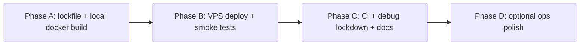

# Docker migration plan — remaining work

**Status date:** 2026-05-18  
**Companion runbook:** [`DEPLOY.md`](../../DEPLOY.md) (build, run, firewall, reverse proxy)  
**Scope:** Move Bowl-A-Lyzer to a single-container production deployment on a 1 GB / 1-core VPS. UI migration to React is effectively complete; this document tracks **what is left for Docker and go-live**, not feature parity with the old Jinja app.

---

## Current repo state (verified)

| Area | State |
|------|--------|
| **UI** | React SPA (`frontend/`) — Home `/`, Liga, Turnier, Mannschaft, Spieler, Diagnose (club-matrix, liga-wochen, daten-anomalien), Impressum |
| **API** | Flask JSON only — no `render_template`, no `app/templates/`, no `app/static/js/` |
| **Legacy URLs** | 301 redirects in `app/spa.py` (e.g. `/league/stats` → `/liga`) |
| **SPA in prod** | `app/spa.py` serves `frontend/dist`; Gunicorn entry via `wsgi.py` + `deploy/gunicorn.conf.py` |
| **Database UX** | `DatabaseSelector` + `useDatabase.ts` → `/get-data-sources-info`, `?database=` preserved in `api.ts` |
| **Docker** | `Dockerfile` (multi-stage), `docker-compose.yml`, `.dockerignore` |
| **Dev** | `start.sh` — Flask `:5000` + Vite `:5173` with API proxy |
| **Explicitly out of scope** | **Funsies** (`/league/funsies`) — not ported, not planned |

---

## Completed (removed from the backlog)

These items were on the earlier migration checklist and are **done** — no further action unless regressions appear.

- [x] Remove legacy Jinja templates and vanilla JS (`app/templates/`, `app/static/`)
- [x] Remove HTML page routes; keep JSON API blueprints
- [x] Remove `league_routes_legacy` blueprint
- [x] Wire production SPA (same-origin API + static build)
- [x] Legacy deep-link redirects for main stat/diagnosis pages
- [x] React **Home** landing (`/`, `/home/stats` API)
- [x] React **database selector** (sidebar / toolbar)
- [x] React **Impressum** (`/impressum`, `SITE_CONTACT` in `frontend/src/lib/siteContact.ts`)
- [x] Docker image definition + compose stack tuned for 1 worker / 2 threads / 900 MB limit
- [x] Deployment runbook (`DEPLOY.md`)
- [x] `wsgi.py` path cleanup (no `league_analyzer_v1` hack)
- [x] Skip **funsies** (product decision)

---

## Remaining work

Grouped by phase. **Priority:** P0 = blocks first production deploy, P1 = should do soon after deploy, P2 = nice-to-have.

### Phase A — Pre-deploy hardening (P0)

| # | Task | Notes |
|---|------|--------|
| A1 | **Regenerate `uv.lock`** | `gunicorn` is in `pyproject.toml` but not yet in `uv.lock`. Run `uv lock` + `uv sync` so local and CI match the Docker `uv sync --frozen` step. |
| A2 | **Verify Docker build end-to-end** | On a machine with Docker: `docker compose build && docker compose up -d`, then hit `/`, `/liga`, `/impressum`, and one API-heavy page with `?database=`. Fix any build/runtime errors before pushing to the VPS. |
| A3 | **Production secrets** | Set `FLASK_SECRET_KEY` on the host (not the compose default). Add `.env.example` documenting required vars (`FLASK_SECRET_KEY`, optional `BOWLYZER_HOST_PORT`). |
| A4 | **Impressum / legal** | Content uses `SITE_CONTACT` — have a human confirm it meets TMG requirements before public DNS points at the box. |

### Phase B — First VPS deploy (P0)

| # | Task | Notes |
|---|------|--------|
| B1 | **Server prerequisites** | Docker + Compose; optional 2–4 GB swap if building on the VPS (see `DEPLOY.md`). |
| B2 | **Build strategy** | Prefer **build image on dev/CI and pull on VPS** to avoid OOM during `pnpm run build` on 1 GB RAM. |
| B3 | **Deploy compose stack** | `docker compose up -d`; confirm healthcheck (`GET /liga`) passes. |
| B4 | **Smoke test checklist** | Home stats load; database switch updates `?database=`; Liga + one other section load charts/tables; legacy URL redirect works; Impressum reachable. |
| B5 | **Expose service** | Map host port (default `8080`) or put **Caddy/nginx** in front for TLS (see `DEPLOY.md` § Expose to the public internet). |

### Phase C — Production hygiene (P1)

| # | Task | Notes |
|---|------|--------|
| C1 | **CI: build & push image** | No `.github/workflows` today. Add workflow: `docker build`, push to GHCR (or registry of choice), VPS pulls tagged image instead of building on-server. |
| C2 | **Lock down debug routes** | `main.py` still exposes `/debug-session`, `/test-database-param`, `/test-filter-endpoints`. Disable behind env flag or remove before long-term public hosting. |
| C3 | **Delete dead code** | `app/services/league_service_legacy.py` — no imports remain; safe to remove. |
| C4 | **Memory check on 1 GB** | After real traffic: `docker stats`, watch OOM; adjust `GUNICORN_THREADS` or CSV mount size if needed. |
| C5 | **Update `CLAUDE.md`** | Still describes “Flask + Jinja monolith” and `app/templates/`; align with API + React layout so agents don’t reintroduce legacy patterns. |

### Phase D — Optional / later (P2)

| # | Task | Notes |
|---|------|--------|
| D1 | **nginx inside container** | Only if profiling shows Flask static/asset serving is a bottleneck; current single-process setup is simpler. |
| D2 | **Automated deploy** | Webhook or SSH pull on image tag; not required for first manual deploy. |
| D3 | **Backup / data refresh playbook** | Document how to rsync or pipeline-update `database/` on the VPS without downtime (compose volume is already `ro` mount). |
| D4 | **Stale docs under `docs/`** | Many files refer to Jinja/content-blocks; archive or mark historical to reduce confusion (no runtime impact). |

---

## Suggested order of execution

1. **A1 → A2 → A3** on a dev machine  
2. **B1 → B5** on the VPS (use pre-built image if possible)  
3. **C1–C5** within the first week of production  
4. **D*** as needed  

---

## Risk register (1 GB VPS)

| Risk | Mitigation |
|------|------------|
| OOM during **image build** on server | Build off-box; use swap only as fallback |
| OOM at **runtime** | 1 Gunicorn worker; `mem_limit: 900m`; avoid extra sidecars |
| Large `database/` in image | Bind-mount `./database` (already in compose); keep image CSV set minimal if size matters |
| Session/filesystem sessions | Single worker avoids multi-process session drift; set strong `FLASK_SECRET_KEY` |

---

## Definition of done (Docker migration)

The migration is **complete** when all of the following are true:

- [ ] Image builds reproducibly (locally or in CI) and runs via `docker compose up`
- [ ] Public URL serves React UI and JSON API on one origin
- [ ] `FLASK_SECRET_KEY` set; debug/test routes gated or removed
- [ ] TLS termination in place (reverse proxy) for production domain
- [ ] Smoke tests in Phase B4 passed on the VPS
- [ ] No dependency on legacy Jinja/JS assets in production

---

## Document history

| Date | Change |
|------|--------|
| 2026-05-18 | Initial plan after React cutover + Docker scaffold; funsies explicitly excluded |
